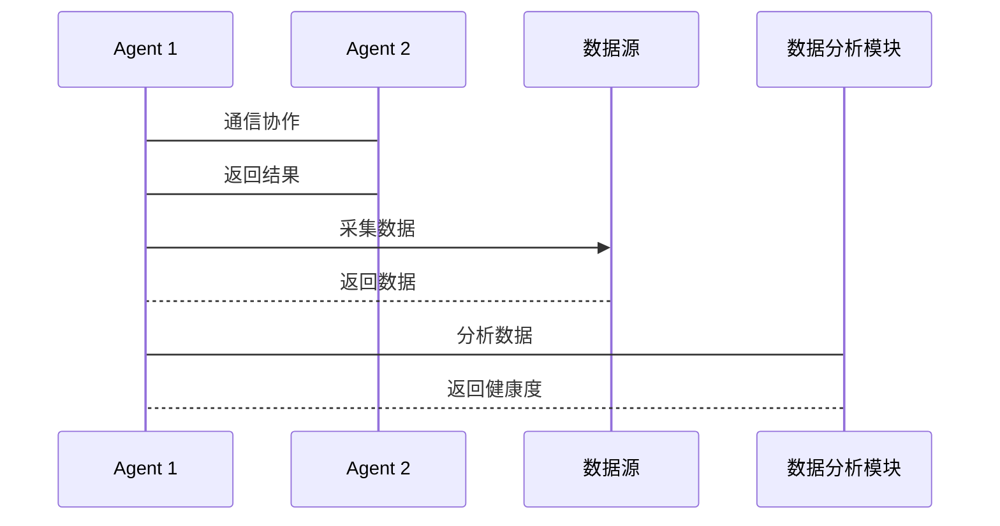

                 


# 多智能体系统在公司创新生态系统健康度评估中的应用

> **关键词**：多智能体系统、创新生态系统、健康度评估、协作算法、系统架构  
> **摘要**：随着企业创新的复杂化和多维化，传统的单智能体评估方法已难以满足需求。多智能体系统凭借其分布式协作、自主决策和动态适应的优势，为创新生态系统健康度评估提供了新的解决方案。本文从多智能体系统的基本概念出发，分析其在创新生态系统健康度评估中的应用背景、核心原理、系统架构，并通过实际案例展示其在企业创新管理中的价值。通过本文的阐述，读者将深入理解多智能体系统在创新生态系统健康度评估中的应用，掌握其核心算法与系统设计方法。

---

## 第一部分: 多智能体系统与创新生态系统概述

### 第1章: 多智能体系统与创新生态系统概述

#### 1.1 多智能体系统的基本概念
##### 1.1.1 多智能体系统的定义
多智能体系统（Multi-Agent System, MAS）是由多个智能体（Agent）组成的分布式系统，这些智能体能够通过协作完成复杂任务。智能体是具有感知、决策、执行能力的实体，可以是软件程序或物理设备。

##### 1.1.2 多智能体系统的特性
- **自主性**：智能体能够自主决策。
- **反应性**：智能体能够根据环境变化动态调整行为。
- **协作性**：智能体之间通过通信协作完成任务。
- **分布性**：智能体分布在网络中，不存在中心控制节点。

##### 1.1.3 多智能体系统与传统单智能体系统的区别
| 属性 | 单智能体系统 | 多智能体系统 |
|------|------------|-------------|
| 控制方式 | 中央控制 | 分布式协作 |
| 资源共享 | 串行处理 | 并行协作 |
| 应用场景 | 简单任务 | 复杂任务 |

#### 1.2 创新生态系统的基本概念
##### 1.2.1 创新生态系统的定义
创新生态系统是指由企业、研究机构、创业者、投资者等多方主体共同构成的复杂系统，旨在推动创新活动的高效进行。

##### 1.2.2 创新生态系统的组成要素
- **创新主体**：企业、研究机构、个人。
- **创新资源**：资金、技术、人才。
- **创新环境**：政策、市场、文化。

##### 1.2.3 创新生态系统的特点
- **多样性**：参与者类型多样。
- **动态性**：创新活动不断变化。
- **网络化**：各主体之间相互关联。

#### 1.3 多智能体系统与创新生态系统的联系
##### 1.3.1 多智能体系统在创新生态系统中的作用
- **数据采集**：智能体实时收集创新生态系统的数据。
- **协作分析**：多个智能体协作分析数据，提供决策支持。
- **动态适应**：智能体根据环境变化调整行为。

##### 1.3.2 多智能体系统与创新生态系统的关系
通过多智能体系统的分布式协作能力，可以实现对创新生态系统中各主体行为的实时监控和分析，从而评估其健康度。

##### 1.3.3 多智能体系统在创新生态系统健康度评估中的应用前景
随着企业创新的复杂化，多智能体系统在创新生态系统健康度评估中的应用将越来越广泛。

---

### 第2章: 公司创新生态系统健康度评估的背景与问题

#### 2.1 创新生态系统健康度评估的背景
##### 2.1.1 当前企业创新面临的挑战
- **创新资源分散**：企业难以整合内外部资源。
- **创新效率低下**：创新过程复杂，效率不足。
- **创新风险高**：创新失败率高，难以控制风险。

##### 2.1.2 创新生态系统健康度评估的重要性
通过评估创新生态系统的健康度，企业可以识别问题，优化创新流程，降低创新风险。

##### 2.1.3 多智能体系统在创新生态系统健康度评估中的优势
- **分布式协作**：多智能体系统能够实时采集和分析数据。
- **动态适应**：多智能体系统能够根据环境变化调整评估策略。

#### 2.2 公司创新生态系统健康度评估的问题描述
##### 2.2.1 创新生态系统健康度评估的核心问题
- 如何实时采集和分析创新生态系统中的数据。
- 如何建立健康度评估模型。

##### 2.2.2 创新生态系统健康度评估的难点
- 创新生态系统复杂，涉及多方主体。
- 创新数据分散，难以整合。

##### 2.2.3 多智能体系统在解决这些问题中的作用
通过多智能体系统的分布式协作能力，可以实现对创新生态系统中各主体行为的实时监控和分析。

#### 2.3 多智能体系统在创新生态系统健康度评估中的应用
##### 2.3.1 多智能体系统如何帮助评估创新生态系统健康度
- 多智能体系统可以实时采集创新生态系统中的数据。
- 多智能体系统可以协作分析数据，提供健康度评估结果。

##### 2.3.2 多智能体系统在创新生态系统健康度评估中的具体应用
- 多智能体系统可以用于创新资源的优化配置。
- 多智能体系统可以用于创新风险的预警和控制。

##### 2.3.3 多智能体系统在创新生态系统健康度评估中的边界与外延
多智能体系统主要应用于创新生态系统中的数据采集、分析和协作，其边界在于不直接参与创新过程的决策。

---

### 第3章: 多智能体系统的核心概念与联系

#### 3.1 多智能体系统的核心概念
##### 3.1.1 多智能体系统的组成要素
- 智能体：具有感知、决策、执行能力的实体。
- 通信协议：智能体之间的通信规则。
- 协作机制：智能体之间的协作方式。

##### 3.1.2 多智能体系统的协作机制
- 分布式计算：智能体协作完成任务。
- 协作协议：智能体之间的通信规则。

##### 3.1.3 多智能体系统的通信协议
- 消息传递：智能体之间通过消息传递信息。
- 通信模型：基于 publish-subscribe 模型。

#### 3.2 创新生态系统的核心概念
##### 3.2.1 创新生态系统的组成结构
- 创新主体：企业、研究机构、个人。
- 创新资源：资金、技术、人才。
- 创新环境：政策、市场、文化。

##### 3.2.2 创新生态系统的运行机制
- 创新主体的协作：企业、研究机构、个人之间的协作。
- 创新资源的流动：资金、技术、人才在生态系统中的流动。

##### 3.2.3 创新生态系统的评价指标
- 创新效率：创新过程的效率。
- 创新成果：创新的成果数量和质量。
- 创新风险：创新过程中的风险。

#### 3.3 多智能体系统与创新生态系统的关系
##### 3.3.1 多智能体系统在创新生态系统中的角色
- 数据采集者：智能体实时采集创新生态系统中的数据。
- 分析者：智能体协作分析数据，提供健康度评估结果。
- 决策支持者：智能体提供决策支持，优化创新过程。

##### 3.3.2 多智能体系统与创新生态系统的核心联系
通过多智能体系统的分布式协作能力，可以实现对创新生态系统中各主体行为的实时监控和分析。

##### 3.3.3 多智能体系统对创新生态系统健康度的影响
- 提高创新效率：通过协作优化创新过程。
- 降低创新风险：通过预警机制控制创新风险。

---

### 第4章: 多智能体系统在创新生态系统健康度评估中的算法原理

#### 4.1 多智能体协作算法
##### 4.1.1 分布式计算与协作机制
- 分布式计算：智能体协作完成任务。
- 协作机制：智能体之间的协作规则。

##### 4.1.2 多智能体系统中的通信与协调
- 消息传递：智能体之间通过消息传递信息。
- 协调机制：智能体之间的协调规则。

##### 4.1.3 多智能体系统中的任务分配与资源分配
- 任务分配：智能体根据能力和资源分配任务。
- 资源分配：智能体协作分配资源，确保任务完成。

#### 4.2 创新生态系统健康度评估的数学模型
##### 4.2.1 健康度评估的指标体系
- 创新效率：创新过程的效率。
- 创新成果：创新的成果数量和质量。
- 创新风险：创新过程中的风险。

##### 4.2.2 健康度评估的数学模型
健康度 H 可以表示为创新效率 E、创新成果 F 和创新风险 R 的函数：
$$ H = f(E, F, R) $$

##### 4.2.3 多智能体系统中的健康度评估算法
健康度评估算法的核心步骤如下：
1. 数据采集：智能体采集创新生态系统中的数据。
2. 数据分析：智能体协作分析数据，计算创新效率、成果和风险。
3. 健康度计算：根据公式计算健康度 H。
4. 结果输出：智能体输出健康度评估结果。

---

### 第5章: 系统分析与架构设计方案

#### 5.1 问题场景介绍
创新生态系统健康度评估需要实时采集和分析创新生态系统中的数据，涉及多个智能体的协作。

#### 5.2 系统功能设计
- 数据采集模块：实时采集创新生态系统中的数据。
- 数据分析模块：协作分析数据，计算健康度。
- 结果输出模块：输出健康度评估结果。

#### 5.3 系统架构设计


#### 5.4 系统接口设计
- 智能体接口：智能体之间的通信接口。
- 数据采集接口：智能体与数据源的接口。
- 数据分析接口：智能体与数据分析模块的接口。

#### 5.5 系统交互设计


---

### 第6章: 项目实战

#### 6.1 环境安装
- 安装 Python 和必要的库（如 Flask、Django）。
- 配置多智能体系统环境。

#### 6.2 核心代码实现
##### 6.2.1 智能体通信代码
```python
class Agent:
    def __init__(self, name):
        self.name = name
        self.data = {}

    def send_message(self, receiver, message):
        # 消息传递逻辑
        pass

    def receive_message(self, sender, message):
        # 接收消息逻辑
        pass
```

##### 6.2.2 健康度评估算法代码
```python
def calculate_health(innovation_efficiency, innovation_results, innovation_risk):
    return innovation_efficiency * 0.3 + innovation_results * 0.4 + innovation_risk * 0.3
```

#### 6.3 案例分析
##### 6.3.1 案例背景
某公司创新生态系统中，创新效率为 80%，创新成果为 70%，创新风险为 20%。

##### 6.3.2 案例分析
健康度计算：
$$ H = 0.3 \times 0.8 + 0.4 \times 0.7 + 0.3 \times 0.2 = 0.24 + 0.28 + 0.06 = 0.58 $$

##### 6.3.3 结果解读
健康度为 58%，说明该公司的创新生态系统健康度一般，需要优化创新效率和创新成果。

---

### 第7章: 最佳实践

#### 7.1 小结
多智能体系统在创新生态系统健康度评估中的应用前景广阔，能够通过分布式协作和实时分析提高评估效率。

#### 7.2 注意事项
- 数据采集的准确性。
- 智能体协作的效率。
- 系统的安全性和稳定性。

#### 7.3 拓展阅读
建议进一步学习多智能体系统的协作算法和创新生态系统的研究。

---

通过以上内容，我们可以看到多智能体系统在公司创新生态系统健康度评估中的应用具有重要的意义。它不仅能够提高评估效率，还能够通过实时分析和协作优化创新过程，降低创新风险。希望本文能为相关领域的研究和实践提供有价值的参考。

