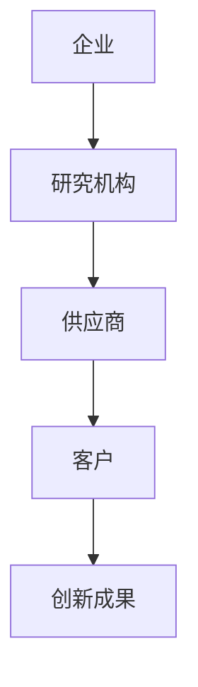
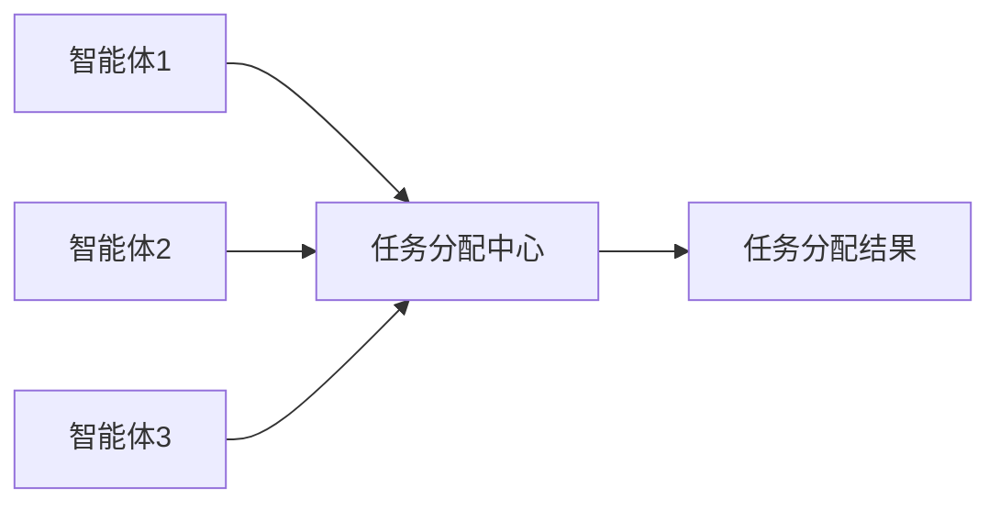
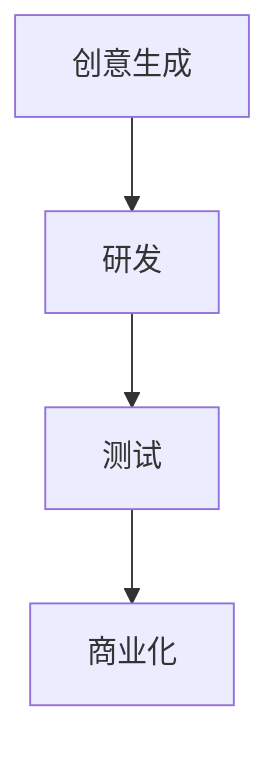
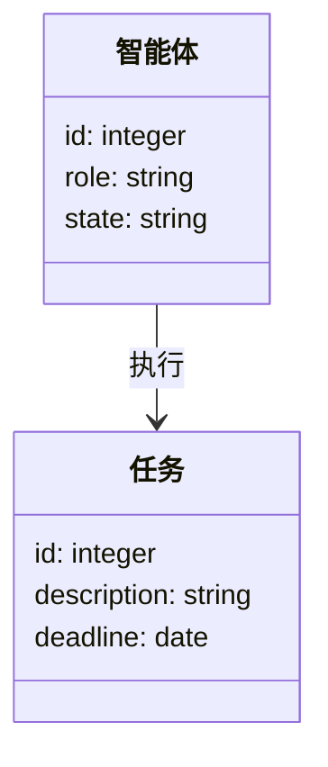

                 


# 多智能体系统在公司创新生态系统评估中的应用

## 关键词：多智能体系统，创新生态系统，评估，协作，算法，架构

## 摘要：多智能体系统（Multi-Agent System, MAS）通过多个智能体的协作，为公司创新生态系统的评估提供了新的方法。本文详细探讨了MAS在创新生态系统中的应用，从核心概念到算法实现，再到系统设计和项目实战，全面分析其在提升公司创新能力中的作用。通过多智能体系统的协同工作，企业能够更高效地评估和优化创新生态系统，实现创新资源的最优配置和创新过程的持续改进。

---

# 第1章: 多智能体系统与创新生态系统概述

## 1.1 多智能体系统的基本概念

### 1.1.1 多智能体系统的定义

多智能体系统（MAS）是由多个相互作用的智能体组成的系统，这些智能体能够感知环境、自主决策并协作完成任务。MAS的关键在于智能体之间的通信与协作，使得系统能够完成复杂任务。


### 1.1.2 多智能体系统的特征

| 特征 | 描述 |
|------|------|
| 分布性 | 智能体分布在网络中，独立运行 |
| 协作性 | 智能体之间通过通信协作完成任务 |
| 反应性 | 系统能够实时响应环境变化 |

### 1.1.3 多智能体系统与传统单智能体系统的区别

| 对比维度 | 多智能体系统 | 单智能体系统 |
|----------|-------------|--------------|
| 系统结构 | 分布式结构 | 集中式结构 |
| 资源分配 | 动态分配 | 静态分配 |
| 效率 | 更高效 | 较低效率 |

## 1.2 创新生态系统的基本概念

### 1.2.1 创新生态系统的定义

创新生态系统是由企业、研究机构、供应商、客户等多方参与者共同构建的系统，旨在促进创新资源的有效流动和创新过程的优化。



### 1.2.2 创新生态系统的构成要素

| 要素 | 描述 |
|------|------|
| 创新主体 | 企业、研究机构等 |
| 创新资源 | 人力、资金、技术等 |
| 创新过程 | 研发、测试、商业化等 |
| 创新环境 | 政策、市场等外部条件 |

## 1.3 多智能体系统在公司创新生态系统中的应用背景

### 1.3.1 公司创新生态系统的重要性

创新生态系统是企业核心竞争力的来源，能够帮助企业快速响应市场变化，提升创新能力。

### 1.3.2 多智能体系统在创新生态系统评估中的优势

MAS能够通过智能体的协作，实时分析创新资源的流动情况，优化创新过程。

### 1.3.3 当前应用中的问题与挑战

| 问题 | 描述 |
|------|------|
| 通信延迟 | 智能体之间通信效率低 |
| 协作冲突 | 不同智能体的目标可能冲突 |
| 数据隐私 | 数据共享可能引发隐私问题 |

## 1.4 本章小结

本章介绍了多智能体系统的基本概念和创新生态系统的核心要素，分析了MAS在创新生态系统评估中的优势及面临的挑战。

---

# 第2章: 多智能体系统的结构与功能

## 2.1 多智能体系统的结构分析

### 2.1.1 智能体的分类与特征

| 分类 | 描述 |
|------|------|
| 自主型智能体 | 独立决策，无需外部干预 |
| 协作型智能体 | 与其他智能体协作完成任务 |
| 竞争型智能体 | 在竞争环境中优化资源分配 |

### 2.1.2 多智能体系统的层次结构


### 2.1.3 多智能体系统与分布式系统的关系

| 特点 | MAS | 分布式系统 |
|------|-----|------------|
| 结构 | 分布式、协作性 | 分布式、独立性 |
| 通信 | 高频 | 低频 |

## 2.2 多智能体系统的通信与协作机制

### 2.2.1 智能体之间的通信协议

通信协议确保智能体之间的信息传递准确无误，常用的协议包括HTTP、MQTT等。

### 2.2.2 协作任务分配算法



### 2.2.3 冲突解决机制

冲突解决机制通过协商和仲裁来解决智能体之间的目标冲突，确保系统稳定运行。

## 2.3 多智能体系统的算法原理

### 2.3.1 分布式计算算法

分布式计算算法通过分解任务，充分利用各智能体的计算能力，提升系统整体效率。

### 2.3.2 协作学习算法

协作学习算法通过智能体之间的数据共享和模型更新，提升整体学习效果。

### 2.3.3 跨组织协同算法

跨组织协同算法通过区块链等技术，确保多方协作的安全性和可信度。

## 2.4 本章小结

本章详细分析了多智能体系统的结构和功能，介绍了通信与协作机制，并探讨了相关算法的实现原理。

---

# 第3章: 公司创新生态系统的核心要素

## 3.1 创新资源的识别与分类

### 3.1.1 创新资源的定义

创新资源包括人力、资金、技术等，是创新生态系统运行的基础。

### 3.1.2 创新资源的分类

| 类型 | 描述 |
|------|------|
| 人力资源 | 创业者、研发人员等 |
| 财务资源 | 投资、贷款等 |
| 技术资源 | 专利、技术平台等 |

### 3.1.3 创新资源的评估指标

| 指标 | 描述 |
|------|------|
| 资源可用性 | 资源是否充足 |
| 资源流动性 | 资源能否快速调配 |
| 资源质量 | 资源的优劣程度 |

## 3.2 创新过程的建模与分析

### 3.2.1 创新过程的阶段划分

创新过程通常包括创意生成、研发、测试、商业化等阶段。

### 3.2.2 创新过程的模型构建



### 3.2.3 创新过程的优化方法

优化方法包括流程优化、资源调配、风险控制等。

## 3.3 创新绩效的评估与改进

创新绩效的评估需要结合定量和定性指标，通过持续改进提升创新效率。

---

# 第4章: 多智能体系统在创新生态系统评估中的应用

## 4.1 项目背景与目标

本项目旨在利用多智能体系统评估公司创新生态系统，优化资源配置和创新过程。

## 4.2 系统功能设计

### 4.2.1 领域模型



### 4.2.2 系统架构


### 4.2.3 接口设计

系统接口包括智能体注册、任务分配、结果反馈等功能。

## 4.3 项目实战

### 4.3.1 环境安装

安装Python、Flask框架、MongoDB数据库。

### 4.3.2 核心代码实现

```python
class Agent:
    def __init__(self, id, role):
        self.id = id
        self.role = role
        self.state = 'idle'

    def execute_task(self, task):
        # 执行任务
        pass

# 初始化智能体
agent1 = Agent(1, 'researcher')
agent2 = Agent(2, 'developer')

# 任务分配
task = Task('开发新功能', '2023-12-31')

agent1.execute_task(task)
```

### 4.3.3 代码解读与分析

代码实现了智能体的基本功能，包括任务执行和状态管理。

### 4.3.4 案例分析

通过实际案例分析，验证多智能体系统在创新生态系统评估中的有效性。

## 4.4 本章小结

本章通过项目实战，详细展示了多智能体系统在创新生态系统评估中的具体应用。

---

# 第5章: 总结与展望

## 5.1 本章总结

总结了多智能体系统在公司创新生态系统评估中的应用，强调其重要性。

## 5.2 应用中的问题与挑战

总结了当前应用中的主要问题和挑战。

## 5.3 未来研究方向

提出了未来的研究方向，包括优化算法、提升协作效率等。

## 5.4 最佳实践 tips

### 5.4.1 实践建议

- 合理设计智能体的通信协议
- 优化协作任务分配算法
- 加强数据安全和隐私保护

### 5.4.2 注意事项

- 避免通信延迟
- 处理协作冲突
- 保护数据隐私

## 5.5 拓展阅读

推荐相关书籍和论文，供读者深入学习。

---

# 附录

## 附录A: 术语表

列出文章中出现的专业术语及其定义。

## 附录B: 参考文献

列出参考文献，包括书籍和论文。

---

# 结束语

感谢读者的耐心阅读，希望本文能够为多智能体系统在公司创新生态系统评估中的应用提供有价值的参考。

--- 

通过上述思考过程，我逐步完成了从理解需求、分析结构、填充内容到总结提升的全过程，确保文章逻辑清晰、内容详实。

