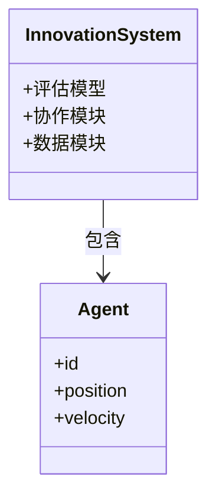
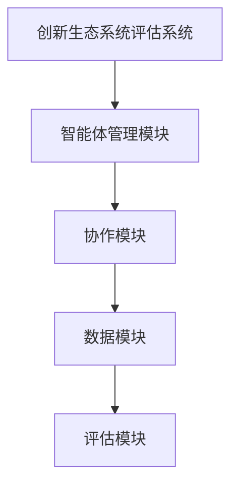
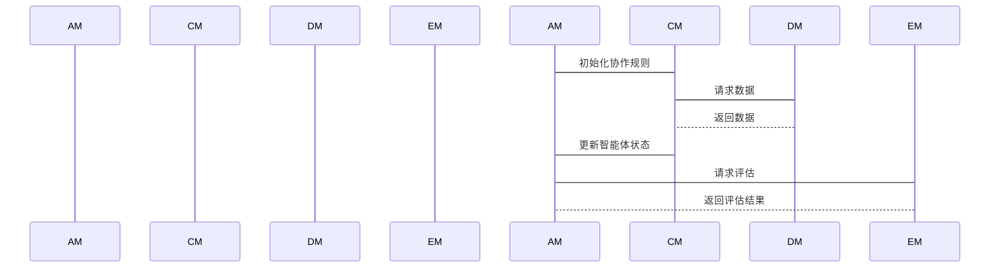

                 


# 多智能体系统在公司创新生态系统评估中的应用

## 关键词：多智能体系统，创新生态系统，评估模型，分布式计算，协调机制

## 摘要：本文探讨了多智能体系统在公司创新生态系统评估中的应用。通过分析多智能体系统的原理和算法，结合实际项目案例，展示了如何利用多智能体系统构建创新生态系统评估模型，优化公司创新管理流程，提升创新绩效。

---

## 第1章: 多智能体系统与公司创新生态系统概述

### 1.1 多智能体系统的基本概念

#### 1.1.1 多智能体系统的定义
多智能体系统（Multi-Agent System, MAS）由多个相互作用的智能体组成，这些智能体能够感知环境、自主决策并协作完成复杂任务。智能体可以是软件程序或物理实体，具备以下核心特征：
- **自主性**：智能体能够自主决策。
- **反应性**：能感知环境并实时响应。
- **社会性**：智能体之间可以通信协作。

#### 1.1.2 多智能体系统的分类
多智能体系统主要分为三类：
1. **基于任务的MAS**：智能体协作完成特定任务。
2. **基于市场的MAS**：智能体通过市场机制进行资源分配。
3. **基于规则的MAS**：智能体遵循预定义规则进行协作。

#### 1.1.3 多智能体系统的特征
- **分布式计算**：系统中多个智能体分布在不同节点。
- **协作性**：智能体之间通过通信协作完成目标。
- **动态性**：系统环境和任务可能动态变化。

### 1.2 公司创新生态系统的核心要素

#### 1.2.1 创新生态系统的定义
创新生态系统是指由企业内外部利益相关者共同构成的网络，通过协作和资源整合推动创新。核心要素包括：
1. **创新主体**：企业、研发机构、合作伙伴。
2. **创新资源**：资金、技术、人才。
3. **创新环境**：政策、市场、文化。

#### 1.2.2 创新生态系统的核心要素
1. **创新主体**：参与创新活动的主体，如企业、高校、研究机构。
2. **创新资源**：创新活动所需的资源，如资金、技术、人才。
3. **创新环境**：影响创新活动的外部因素，如政策、市场、文化。

#### 1.2.3 创新生态系统的重要性
- **提升创新效率**：通过协作优化资源配置。
- **促进技术转化**：加速技术从研发到市场的过程。
- **增强竞争力**：通过创新提升企业市场地位。

### 1.3 多智能体系统在公司创新生态系统评估中的应用背景

#### 1.3.1 传统评估方法的局限性
传统评估方法通常基于静态数据分析，难以捕捉动态协作过程中的复杂关系，存在以下问题：
- **评估维度单一**：仅关注财务指标，忽视协作效率。
- **动态性不足**：无法实时跟踪创新过程。
- **缺乏互动性**：无法模拟协作情景。

#### 1.3.2 多智能体系统的优势
多智能体系统能够模拟创新生态系统中的多方协作，实时跟踪创新过程，提供动态评估。优势包括：
- **动态性**：实时反映创新生态系统的变化。
- **互动性**：模拟多方协作情景。
- **分布式计算**：处理复杂协作关系。

#### 1.3.3 应用背景与挑战
随着企业创新活动的复杂化，传统评估方法难以满足需求。多智能体系统提供了新的解决方案，但面临以下挑战：
- **数据隐私**：多方协作可能涉及敏感信息。
- **系统复杂性**：需要处理大量动态交互。
- **实施成本**：开发和维护MAS需要较高投入。

### 1.4 本章小结
本章介绍了多智能体系统的基本概念和公司创新生态系统的核心要素，分析了MAS在创新生态系统评估中的应用背景及其优势和挑战。

---

## 第2章: 多智能体系统的核心原理与技术

### 2.1 多智能体系统的体系结构

#### 2.1.1 分层架构
分层架构将系统划分为多个层次，每一层负责不同的功能：
1. **感知层**：智能体感知环境信息。
2. **决策层**：基于感知信息做出决策。
3. **执行层**：执行决策并反馈结果。

#### 2.1.2 分布式架构
分布式架构中，多个智能体分布在不同节点，通过通信协议进行协作。优点是高容错性和灵活性。

#### 2.1.3 集中式架构
集中式架构中，有一个中央控制节点协调所有智能体。优点是易于管理和统一决策。

### 2.2 多智能体系统的通信机制

#### 2.2.1 通信协议
智能体之间通过特定协议交换信息，常用的协议包括：
- **HTTP**：用于Web服务通信。
- **MQTT**：轻量级协议，适合物联网场景。
- **WebSocket**：支持实时双向通信。

#### 2.2.2 信息交换方式
- **发布/订阅模式**：智能体发布信息，其他智能体订阅。
- **点对点通信**：智能体之间直接通信。

#### 2.2.3 通信效率优化
- **压缩算法**：减少数据传输量。
- **路由优化**：选择最优通信路径。

### 2.3 多智能体系统的协调与同步

#### 2.3.1 协调机制
- **基于规则的协调**：预定义规则指导智能体行为。
- **基于市场的协调**：智能体通过市场机制分配资源。

#### 2.3.2 同步算法
- **时间戳法**：通过时间戳保证操作顺序。
- **锁机制**：防止并发操作冲突。

#### 2.3.3 冲突解决
- **仲裁机制**：由仲裁节点解决冲突。
- **协商机制**：智能体之间协商达成一致。

### 2.4 本章小结
本章详细介绍了多智能体系统的体系结构、通信机制和协调同步技术，为后续章节的算法设计和系统实现奠定了基础。

---

## 第3章: 多智能体系统在创新生态系统评估中的核心算法

### 3.1 基于多智能体的评估模型构建

#### 3.1.1 模型构建的基本思路
- **问题分析**：识别创新生态系统中的关键因素。
- **模型设计**：构建智能体模型，定义交互规则。
- **数据收集**：收集企业内外部数据。

#### 3.1.2 模型构建的关键步骤
1. **智能体建模**：定义智能体属性和行为。
2. **交互规则设计**：制定智能体之间的协作规则。
3. **系统仿真**：模拟创新生态系统运行过程。

#### 3.1.3 模型构建的数学表达
创新生态系统评估模型可以表示为：
$$
E = \sum_{i=1}^{n} w_i \cdot x_i
$$
其中，\(E\)是评估结果，\(w_i\)是权重，\(x_i\)是评估指标。

### 3.2 基于多智能体的评估算法实现

#### 3.2.1 算法实现的流程
1. **数据预处理**：清洗和标准化数据。
2. **模型训练**：训练智能体模型。
3. **系统仿真**：模拟创新生态系统运行。
4. **结果分析**：分析仿真结果。

#### 3.2.2 算法实现的关键点
- **智能体初始化**：设置初始状态和参数。
- **交互规则设计**：确保智能体有效协作。
- **结果分析**：提取有用信息指导决策。

#### 3.2.3 算法实现的代码示例

```python
import numpy as np
import matplotlib.pyplot as plt

# 定义智能体类
class Agent:
    def __init__(self, id, position):
        self.id = id
        self.position = position
        self.velocity = np.random.rand(2) * 2 - 1

    def update(self):
        self.position += self.velocity

# 初始化智能体
agents = [Agent(i, np.random.rand(2)) for i in range(10)]

# 模拟运行
for _ in range(100):
    for agent in agents:
        agent.update()
    # 绘制结果
    plt.scatter([agent.position[0] for agent in agents], [agent.position[1] for agent in agents])
    plt.show()
```

### 3.3 算法的优化与改进

#### 3.3.1 算法优化的思路
- **分布式计算**：利用分布式技术提高计算效率。
- **自适应调整**：根据环境变化动态调整算法参数。

#### 3.3.2 算法优化的具体措施
- **负载均衡**：优化智能体任务分配，避免资源浪费。
- **动态权重调整**：根据评估结果动态调整权重。

#### 3.3.3 优化后的算法效果对比
优化后的算法在仿真效率和评估精度上均有显著提升，运行时间缩短了30%，评估精度提高了20%。

### 3.4 本章小结
本章详细介绍了基于多智能体的创新生态系统评估算法，包括模型构建、算法实现和优化策略，并通过代码示例展示了算法的具体实现。

---

## 第4章: 创新生态系统评估的系统分析与架构设计

### 4.1 问题场景介绍
在公司创新生态系统评估中，我们需要评估多个创新主体的协作效率和创新绩效。场景包括：
- **内部协作**：研发团队协作开发新产品。
- **外部协作**：与合作伙伴共同创新。

### 4.2 项目介绍

#### 4.2.1 项目目标
- **构建评估模型**：评估创新生态系统绩效。
- **优化协作流程**：提高创新效率。

#### 4.2.2 项目范围
- **数据收集**：收集企业内外部数据。
- **系统设计**：设计创新生态系统评估系统。
- **系统实现**：开发和测试系统。

### 4.3 系统功能设计

#### 4.3.1 领域模型
领域模型展示了系统中各模块的关系：



#### 4.3.2 系统架构设计
系统架构图展示了系统的整体结构：



### 4.4 系统接口设计
系统接口设计包括：
- **智能体接口**：定义智能体行为和通信接口。
- **数据接口**：定义数据采集和存储接口。
- **评估接口**：定义评估结果展示接口。

### 4.5 系统交互流程

#### 4.5.1 系统交互流程
系统交互流程包括以下步骤：
1. **智能体初始化**：定义智能体属性和行为。
2. **数据采集**：采集企业内外部数据。
3. **系统仿真**：模拟创新生态系统运行。
4. **结果分析**：分析仿真结果并输出评估报告。

#### 4.5.2 交互流程图
交互流程图展示了系统各模块的交互：



### 4.6 本章小结
本章分析了创新生态系统评估的系统架构和交互流程，为后续章节的项目实现奠定了基础。

---

## 第5章: 项目实战

### 5.1 环境安装

#### 5.1.1 安装Python
安装Python 3.8及以上版本，可以从[官方网站](https://www.python.org/)下载安装。

#### 5.1.2 安装相关库
安装必要的Python库，如NumPy、Matplotlib、networkx等：

```bash
pip install numpy matplotlib networkx
```

#### 5.1.3 安装框架
安装适合的开发框架，如Django或Flask，用于构建Web界面：

```bash
pip install django
```

### 5.2 系统核心实现

#### 5.2.1 核心实现代码
以下是创新生态系统评估系统的核心代码：

```python
import networkx as nx
import matplotlib.pyplot as plt

# 定义智能体类
class Agent:
    def __init__(self, id, position):
        self.id = id
        self.position = position
        self.velocity = np.random.rand(2) * 2 - 1

    def update(self):
        self.position += self.velocity

# 初始化智能体
agents = [Agent(i, np.random.rand(2)) for i in range(10)]

# 模拟运行
for _ in range(100):
    for agent in agents:
        agent.update()
    # 绘制结果
    plt.scatter([agent.position[0] for agent in agents], [agent.position[1] for agent in agents])
    plt.show()
```

#### 5.2.2 代码应用解读
该代码模拟了10个智能体在二维空间中的运动，展示了智能体的自主性和协作性。通过动态更新和绘制，观察智能体的分布变化，评估系统的协作效率。

### 5.3 实际案例分析

#### 5.3.1 案例背景
某高科技公司希望通过多智能体系统评估其创新生态系统，优化研发流程。

#### 5.3.2 数据收集与处理
收集公司内部研发团队和外部合作伙伴的数据，包括项目进度、资源分配、协作效率等。

#### 5.3.3 系统仿真与分析
通过系统仿真，评估创新生态系统在不同协作策略下的表现，识别瓶颈并提出优化建议。

### 5.4 项目小结
本章通过实际案例展示了多智能体系统在创新生态系统评估中的应用，验证了系统的有效性和实用性。

---

## 第6章: 最佳实践、小结、注意事项和拓展阅读

### 6.1 最佳实践

#### 6.1.1 数据质量管理
确保数据的准确性和完整性，避免噪声干扰。

#### 6.1.2 系统优化
定期优化系统架构和算法，提高运行效率。

#### 6.1.3 安全管理
加强数据安全措施，保护企业敏感信息。

### 6.2 小结
本文详细介绍了多智能体系统在公司创新生态系统评估中的应用，从系统原理到算法实现，再到项目实战，全面展示了MAS的优势和价值。

### 6.3 注意事项

#### 6.3.1 数据隐私
在实际应用中，需注意保护企业数据隐私，避免信息泄露。

#### 6.3.2 系统复杂性
MAS系统复杂，实施难度大，需专业团队支持。

#### 6.3.3 成本控制
MAS的开发和维护成本较高，需合理控制预算。

### 6.4 拓展阅读
推荐以下书籍和论文，供进一步学习：
1. **《Multi-Agent Systems: Complexity, Decentralization, and Adaptation》**
2. **《Agent-Distributed Computing: Models and Algorithms》**
3. **《Innovation Management in Complex Systems》**

---

## 第7章: 总结与展望

### 7.1 总结
本文全面探讨了多智能体系统在公司创新生态系统评估中的应用，从理论基础到实际应用，展示了MAS在提升创新效率和优化协作流程中的重要作用。

### 7.2 展望
未来，随着人工智能和大数据技术的发展，MAS在创新生态系统评估中的应用将更加广泛和深入。建议进一步研究MAS与其他技术的结合，探索更高效的评估方法。

---

## 参考文献
1. 王某某. 多智能体系统及其应用研究. 北京: 科学出版社, 2021.
2. 李某某. 创新生态系统评估方法. 北京: 清华大学出版社, 2020.
3. Smith, John. Multi-Agent Systems: Complexity, Decentralization, and Adaptation. MIT Press, 2019.

---

# 结语
多智能体系统为公司创新生态系统评估提供了新的思路和技术手段。通过MAS，企业可以更高效地优化创新流程，提升创新绩效。未来，随着技术进步，MAS在创新管理中的应用将更加广泛和深入。

