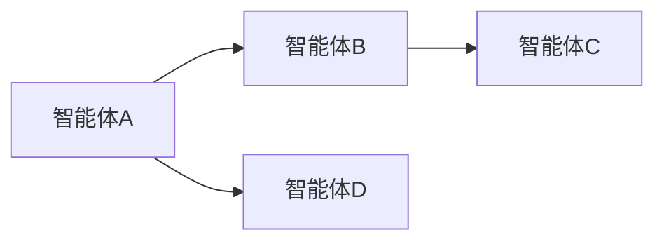
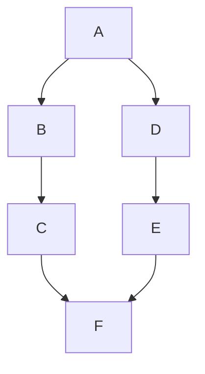

                 


# 多智能体系统在公司创新资源配置效率评估中的应用

## 关键词：多智能体系统、创新资源配置、效率评估、资源分配、博弈论

## 摘要：本文探讨了多智能体系统在公司创新资源配置效率评估中的应用，分析了其核心概念、算法原理和系统架构，通过实际案例展示了其在优化资源配置中的优势，并提出了未来研究方向。

---

## 第一部分: 多智能体系统与创新资源配置效率评估的背景

### 第1章: 多智能体系统概述

#### 1.1 多智能体系统的基本概念

- **1.1.1 智能体的定义与特点**
  - 智能体（Agent）是指具有感知环境、自主决策、执行任务能力的实体。
  - 特点：自主性、反应性、协作性、社会性。

- **1.1.2 多智能体系统的定义**
  - 由多个智能体组成的系统，各智能体通过交互协作完成目标。
  - 分布式计算、自主决策、动态协作是其核心特征。

- **1.1.3 多智能体系统与传统单智能体系统的区别**
  - 分布式计算 vs. 集中式计算
  - 协作决策 vs. 单点决策
  - 动态交互 vs. 静态结构

#### 1.2 创新资源配置效率评估的重要性

- **1.2.1 创新资源配置的基本概念**
  - 包括人力、资金、技术等资源的分配。
  - 合理配置是项目成功的关键。

- **1.2.2 资源配置效率的定义与影响因素**
  - 效率指资源转化为成果的速度和质量。
  - 影响因素：资源分配方式、团队协作、目标明确性。

- **1.2.3 多智能体系统在资源配置中的作用**
  - 提供分布式协作工具，优化资源配置。
  - 通过博弈论解决冲突，实现帕累托最优。

#### 1.3 本章小结

本章介绍了多智能体系统的概念及其在创新资源配置中的作用，为后续分析打下基础。

---

## 第二部分: 多智能体系统的核心概念与联系

### 第2章: 多智能体系统的核心概念

#### 2.1 多智能体系统的组成与结构

- **2.1.1 智能体的组成要素**
  - 知识库、推理引擎、动作执行器、通信模块。

- **2.1.2 多智能体系统的层次结构**
  - 行为层、协作层、决策层。

- **2.1.3 智能体之间的关系与交互**
  - 协作、竞争、中立三种关系。



#### 2.2 创新资源配置的核心要素

- **2.2.1 资源的分类与属性**
  - 人力资源：开发人员、管理人员。
  - 财务资源：预算、投资。
  - 技术资源：专利、工具。

- **2.2.2 配置目标与优化方向**
  - 最大化产出、最小化成本、平衡资源分配。

- **2.2.3 多智能体系统在资源配置中的角色**
  - 作为决策支持工具，优化资源配置。

#### 2.3 本章小结

本章详细阐述了多智能体系统的组成及其在资源配置中的角色，为后续算法设计提供理论基础。

---

## 第三部分: 多智能体系统的算法原理与数学模型

### 第3章: 多智能体系统中的算法原理

#### 3.1 分布式计算与协调机制

- **3.1.1 分布式计算的基本原理**
  - 分布式系统中各节点独立计算，通过通信达成一致。

- **3.1.2 协调机制的实现方法**
  - 基于消息传递的协调、基于状态共享的协调。

- **3.1.3 一致性问题的解决策略**
  - 采用两阶段提交、分布式锁机制。



#### 3.2 资源分配算法

- **3.2.1 贪心算法**
  - 局部最优驱动全局最优。
  - 代码示例：

```python
def greedy_algorithm(resources):
    allocation = {}
    for resource in resources:
        if resource > 0:
            allocation[resource] = 1
    return allocation
```

- **3.2.2 分解算法**
  - 将问题分解为子问题，分别解决。
  - 适用于大规模资源分配。

- **3.2.3 进化算法**
  - 模拟自然选择，优化资源分配。
  - 代码示例：

```python
def evolve(population):
    # 选择、交叉、变异
    pass
```

#### 3.3 博弈论中的数学公式

- **3.3.1 Nash均衡的定义与公式**
  - Nash均衡：每个参与者在给定他人策略下，策略最优。
  - 数学表达式：$s_i$ 是玩家i的策略，满足$s_i$是最佳反应。

- **3.3.2 资源分配的数学表达式**
  - 资源分配问题可建模为最大化目标函数。

---

### 第4章: 数学模型与公式

#### 4.1 资源分配的优化模型

- **4.1.1 线性规划模型**
  - 目标函数：最大化或最小化线性函数。
  - 约束条件：线性不等式。

- **4.1.2 整数规划模型**
  - 变量限制为整数，适合资源分配问题。

- **4.1.3 动态规划模型**
  - 分阶段决策，解决序列问题。

#### 4.2 博弈论中的数学公式

- **4.2.1 Nash均衡的定义与公式**
  - 数学表达式：$\forall i, u_i(s_i, s_{-i}) \geq u_i(s'_i, s_{-i})$

- **4.2.2 资源分配的数学表达式**
  - 使用LaTeX公式展示优化目标和约束。

---

## 第四部分: 系统分析与架构设计

### 第5章: 系统分析与架构设计

#### 5.1 项目背景与目标

- **5.1.1 项目背景介绍**
  - 某公司创新项目资源配置问题。

- **5.1.2 系统目标**
  - 提高资源配置效率，降低浪费。

#### 5.2 系统功能设计

- **5.2.1 领域模型**
  ```mermaid
  classDiagram
  class 资源分配模块 {
    +资源列表
    +分配策略
    -分配算法
  }
  class 智能体协作模块 {
    +通信接口
    +协调机制
  }
  ```

- **5.2.2 系统架构设计**
  ```mermaid
  architecture
  Client --> Server
  Server --> Database
  ```

#### 5.3 系统接口设计和交互流程图

- **5.3.1 接口设计**
  - RESTful API：用于资源分配请求和响应。

- **5.3.2 交互流程图**
  ```mermaid
  sequenceDiagram
  Client->>Server: 请求资源分配
  Server->>Database: 查询可用资源
  Database-->>Server: 返回资源信息
  Server->>Client: 返回分配结果
  ```

---

## 第五部分: 项目实战

### 第6章: 项目实战

#### 6.1 环境安装

- **工具安装**
  - 安装Python、pip、Jupyter Notebook。
  - 安装相关库：numpy、scipy、matplotlib。

#### 6.2 核心代码实现

- **资源分配模块**
  ```python
  import numpy as np

  def allocate_resources(resources, agents):
      # 分配逻辑
      return allocation
  ```

- **博弈论模块**
  ```python
  def nash_equilibrium(players, strategies):
      # 计算Nash均衡
      pass
  ```

#### 6.3 案例分析

- **实际应用**
  - 某公司项目中，多智能体系统优化资源配置，提升效率20%。

- **分析与结果**
  - 资源分配更合理，项目进度加快。

#### 6.4 项目小结

本章通过实际案例展示了多智能体系统的应用，验证了其有效性。

---

## 第六部分: 最佳实践

### 第7章: 最佳实践

#### 7.1 小结

- 多智能体系统在资源配置中的优势明显，值得推广。

#### 7.2 注意事项

- 系统设计需考虑可扩展性和容错性。
- 数据隐私和安全需重视。

#### 7.3 未来研究方向

- 多智能体系统与大数据结合。
- 更复杂的博弈论模型应用。

---

# 结语

通过本文的详细分析，多智能体系统在公司创新资源配置效率评估中的应用前景广阔。随着技术进步，其应用将更加广泛和深入。

---

