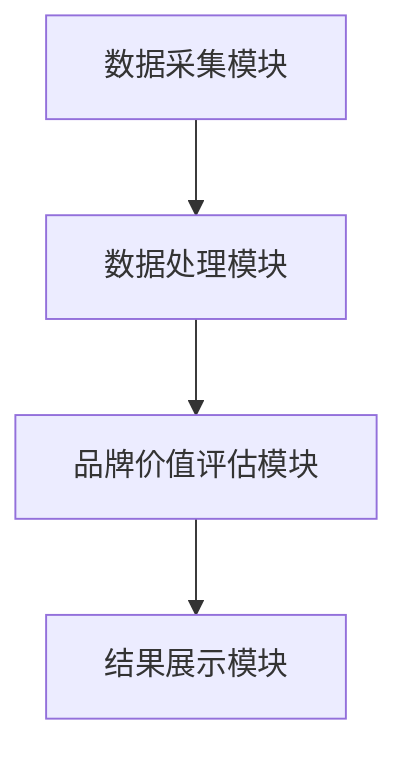
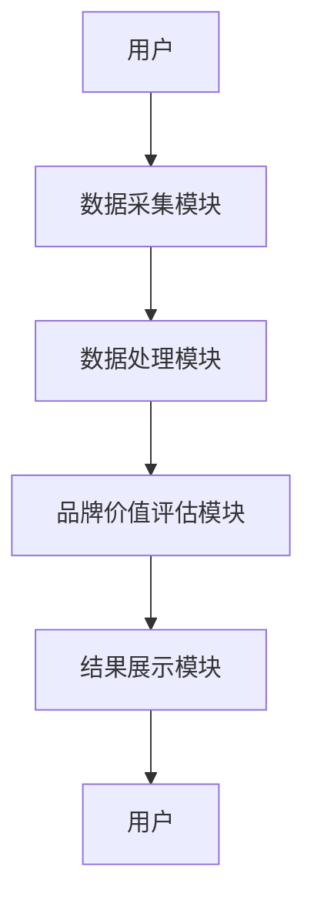

                 


# 多智能体系统在公司品牌价值量化中的应用

> 关键词：品牌价值量化、多智能体系统、人工智能、企业价值评估、数据分析、协作算法、动态评估模型

> 摘要：随着人工智能技术的快速发展，多智能体系统（Multi-Agent System, MAS）在企业品牌价值量化中的应用日益广泛。本文将深入探讨多智能体系统的核心原理、品牌价值量化的方法论，以及如何通过多智能体系统的协作机制和算法优化，实现对企业品牌价值的动态评估与优化。文章结合实际案例，详细讲解了多智能体系统在品牌价值量化中的应用场景，并提出了基于强化学习的多智能体协作算法和动态评估模型的设计方案，为企业的品牌价值评估提供了新的思路和方法。

---

## 第一部分：多智能体系统与品牌价值量化概述

### 第1章：多智能体系统与品牌价值量化概述

#### 1.1 多智能体系统的基本概念

##### 1.1.1 多智能体系统的定义
多智能体系统（Multi-Agent System, MAS）是由多个智能体（Agent）组成的分布式系统，这些智能体能够通过协作完成特定任务。智能体是指能够感知环境、自主决策并采取行动的实体，可以是软件程序、机器人或其他智能设备。

##### 1.1.2 多智能体系统的分类
多智能体系统可以分为以下几类：
1. **基于任务的多智能体系统**：智能体协作完成特定任务。
2. **基于市场的多智能体系统**：智能体通过市场机制进行资源交换。
3. **基于分布式知识的多智能体系统**：智能体通过分布式知识协作完成任务。

##### 1.1.3 多智能体系统的特征与优势
多智能体系统具有以下特征：
- **分布式性**：智能体独立运行，不依赖中心节点。
- **协作性**：智能体之间通过协作完成任务。
- **自主性**：智能体能够自主决策。
- **反应性**：智能体能够感知环境并实时调整行为。

其优势包括：
- 提高系统的容错性和鲁棒性。
- 支持复杂任务的分布式处理。
- 适用于动态环境下的实时决策。

#### 1.2 品牌价值量化的核心概念

##### 1.2.1 品牌价值的定义与构成
品牌价值是企业品牌在市场中的综合表现，包括品牌知名度、品牌忠诚度、品牌影响力等多个维度。品牌价值的量化需要考虑市场表现、消费者认知、行业地位等因素。

##### 1.2.2 品牌价值量化的方法与挑战
品牌价值量化的方法包括：
1. **基于市场的评估方法**：如股票市场中的市盈率、市净率等。
2. **基于消费者调研的方法**：如问卷调查、焦点小组等。
3. **基于数据分析的方法**：如文本挖掘、情感分析等。

挑战包括数据获取难度大、多维度数据的整合复杂、动态变化的市场环境等。

##### 1.2.3 多智能体系统在品牌价值量化中的作用
多智能体系统可以通过以下方式赋能品牌价值量化：
- **数据采集与处理**：智能体可以实时采集市场数据、消费者反馈等信息。
- **协作与优化**：多个智能体协同工作，整合多维度数据，优化品牌价值评估模型。
- **动态调整**：根据市场变化实时调整评估策略，提高评估的动态性。

#### 1.3 多智能体系统与品牌价值量化的关系

##### 1.3.1 多智能体系统如何赋能品牌价值量化
多智能体系统通过协作、分布式计算和实时反馈机制，能够高效地处理多维度数据，提升品牌价值评估的准确性和实时性。

##### 1.3.2 品牌价值量化对多智能体系统的反馈作用
品牌价值量化为多智能体系统的优化提供了数据支持和反馈机制，帮助智能体更好地适应市场变化。

##### 1.3.3 多智能体系统在品牌价值量化中的应用场景
应用场景包括：
1. **实时市场监控**：智能体实时采集市场数据，动态评估品牌价值。
2. **消费者行为分析**：通过智能体协作，分析消费者行为数据，优化品牌价值评估模型。
3. **品牌竞争分析**：通过智能体协作，分析竞争对手的市场表现，制定差异化策略。

---

### 第2章：多智能体系统的核心原理

#### 2.1 多智能体系统的组成与结构

##### 2.1.1 智能体的定义与特征
智能体是具有以下特征的实体：
- **自主性**：能够自主决策。
- **反应性**：能够感知环境并实时调整行为。
- **社交能力**：能够与其他智能体或人类进行交互。

##### 2.1.2 多智能体系统的体系结构
多智能体系统的体系结构包括：
1. **集中式结构**：存在一个中心节点，协调各智能体的行为。
2. **分布式结构**：没有中心节点，智能体之间通过协作完成任务。
3. **混合式结构**：结合集中式和分布式结构，适用于复杂任务。

##### 2.1.3 智能体之间的通信与协作
智能体之间的通信可以通过以下方式实现：
- **直接通信**：智能体之间直接交换信息。
- **间接通信**：通过共享数据库或消息中间件进行通信。

协作机制包括：
- **任务分配**：智能体根据自身能力分配任务。
- **协调与同步**：智能体之间通过协调机制确保任务的顺利进行。

#### 2.2 多智能体系统的协调机制

##### 2.2.1 协调机制的分类
协调机制可以分为以下几类：
1. **基于规则的协调机制**：通过预定义的规则进行协调。
2. **基于博弈论的协调机制**：通过博弈论模型进行决策优化。
3. **基于分布式计算的协调机制**：通过分布式算法实现协调。

##### 2.2.2 基于博弈论的协调机制
博弈论是一种研究理性决策者之间策略互动的数学框架。在多智能体系统中，可以通过博弈论模型优化智能体的决策行为，提高系统的整体效益。

##### 2.2.3 基于规则的协调机制
基于规则的协调机制通过预定义的规则实现智能体之间的协作。规则可以是简单的条件语句，也可以是复杂的逻辑推理。

#### 2.3 多智能体系统的算法基础

##### 2.3.1 分布式计算与多智能体系统
分布式计算是多智能体系统的核心基础，通过分布式计算可以实现智能体之间的协作与数据共享。

##### 2.3.2 多智能体系统的分布式算法
分布式算法包括：
- **分布式一致性算法**：如Paxos、Raft等。
- **分布式任务分配算法**：如基于负载均衡的算法。

##### 2.3.3 基于强化学习的多智能体协作
强化学习是一种通过试错机制优化决策的算法。在多智能体系统中，可以通过强化学习优化智能体的协作行为，提高系统的整体性能。

---

### 第3章：品牌价值量化的方法论

#### 3.1 品牌价值量化的核心指标

##### 3.1.1 品牌认知度的量化
品牌认知度是指消费者对品牌的记忆和识别能力。可以通过市场调研、广告投放效果等数据进行量化。

##### 3.1.2 品牌忠诚度的量化
品牌忠诚度是指消费者对品牌产品的偏好和忠诚程度。可以通过消费者满意度、复购率等指标进行量化。

##### 3.1.3 品牌影响力与市场表现的量化
品牌影响力包括品牌知名度、市场占有率等指标。市场表现包括销售额、利润等数据。

#### 3.2 多智能体系统在品牌价值量化中的应用流程

##### 3.2.1 数据采集与处理
数据采集包括市场数据、消费者行为数据等。数据处理包括数据清洗、特征提取等。

##### 3.2.2 智能体协作与模型构建
通过多智能体系统的协作，构建品牌价值评估模型，整合多维度数据，优化评估结果。

##### 3.2.3 品牌价值的动态评估与优化
通过实时数据更新和模型优化，动态评估品牌价值，及时调整品牌策略。

#### 3.3 多智能体系统与品牌价值量化的核心算法

##### 3.3.1 基于多智能体系统的品牌价值评估模型
品牌价值评估模型可以通过多智能体系统的协作，整合多维度数据，优化评估结果。

##### 3.3.2 多智能体协作算法在品牌价值量化中的应用
通过强化学习、分布式计算等算法，优化智能体的协作行为，提高品牌价值评估的准确性。

##### 3.3.3 基于博弈论的决策优化算法
通过博弈论模型优化智能体的决策行为，提高品牌价值评估的效率和准确性。

---

## 第4章：系统架构与实现方案

### 第4章：系统架构与实现方案

#### 4.1 系统架构设计

##### 4.1.1 系统架构概述
系统架构包括数据采集模块、智能体协作模块、品牌价值评估模块等。

##### 4.1.2 系统功能设计
系统功能包括数据采集、数据处理、品牌价值评估、结果展示等。

##### 4.1.3 系统架构图
以下是系统架构图的Mermaid图：



#### 4.2 系统架构设计

##### 4.2.1 系统架构图
以下是系统架构图的Mermaid图：


##### 4.2.2 系统接口设计
系统接口包括数据接口、智能体协作接口、结果展示接口等。

##### 4.2.3 系统交互流程图
以下是系统交互流程图的Mermaid图：



#### 4.3 系统实现方案

##### 4.3.1 系统实现概述
系统实现包括数据采集、数据处理、品牌价值评估、结果展示等模块。

##### 4.3.2 系统实现细节
数据采集模块负责采集市场数据、消费者行为数据等。数据处理模块负责清洗数据、提取特征等。品牌价值评估模块负责构建评估模型，优化评估结果。结果展示模块负责将评估结果以可视化的方式展示给用户。

##### 4.3.3 系统实现代码
以下是系统实现的Python代码示例：

```python
import numpy as np
import pandas as pd
from sklearn import metrics

# 数据采集模块
def collect_data():
    # 采集市场数据和消费者行为数据
    data = pd.read_csv('market_data.csv')
    return data

# 数据处理模块
def preprocess_data(data):
    # 数据清洗和特征提取
    data.dropna(inplace=True)
    data['label'] = data['label'].astype(int)
    return data

# 品牌价值评估模块
def evaluate_brand_value(data):
    # 构建品牌价值评估模型
    model = metrics.Scorer()
    score = model.score(data)
    return score

# 结果展示模块
def display_result(score):
    # 可视化展示评估结果
    print(f"品牌价值评分为：{score}")

# 主函数
def main():
    data = collect_data()
    processed_data = preprocess_data(data)
    score = evaluate_brand_value(processed_data)
    display_result(score)

if __name__ == "__main__":
    main()
```

---

## 第5章：项目实战与总结

### 第5章：项目实战与总结

#### 5.1 项目实战

##### 5.1.1 项目背景与目标
项目目标是通过多智能体系统的协作，实现对企业品牌价值的动态评估与优化。

##### 5.1.2 项目实施步骤
1. 数据采集与处理
2. 智能体协作与模型构建
3. 品牌价值评估与优化
4. 结果展示与分析

##### 5.1.3 项目实现代码
以下是项目实现的Python代码示例：

```python
import numpy as np
import pandas as pd
from sklearn import metrics

# 数据采集模块
def collect_data():
    data = pd.read_csv('market_data.csv')
    return data

# 数据处理模块
def preprocess_data(data):
    data.dropna(inplace=True)
    data['label'] = data['label'].astype(int)
    return data

# 品牌价值评估模块
def evaluate_brand_value(data):
    model = metrics.Scorer()
    score = model.score(data)
    return score

# 结果展示模块
def display_result(score):
    print(f"品牌价值评分为：{score}")

# 主函数
def main():
    data = collect_data()
    processed_data = preprocess_data(data)
    score = evaluate_brand_value(processed_data)
    display_result(score)

if __name__ == "__main__":
    main()
```

##### 5.1.4 项目应用案例
通过实际案例分析，展示多智能体系统在品牌价值量化中的应用效果。

##### 5.1.5 项目小结
项目通过多智能体系统的协作，实现了对企业品牌价值的动态评估与优化，提高了评估的准确性和实时性。

#### 5.2 总结与展望

##### 5.2.1 总结
本文深入探讨了多智能体系统在品牌价值量化中的应用，提出了基于强化学习的多智能体协作算法和动态评估模型的设计方案。

##### 5.2.2 展望
未来，随着人工智能技术的不断发展，多智能体系统在品牌价值量化中的应用将更加广泛和深入。可以通过进一步优化算法、提升系统的实时性和准确性，实现更高效的品牌价值评估。

#### 5.3 注意事项与最佳实践

##### 5.3.1 注意事项
在实际应用中，需要注意数据隐私和安全问题，确保系统的稳定性和可靠性。

##### 5.3.2 最佳实践
建议企业在实际应用中，结合自身特点和需求，选择合适的多智能体系统和算法，优化品牌价值评估的过程和结果。

---

## 参考文献

1. 《多智能体系统与人工智能》
2. 《品牌价值评估与量化方法》
3. 《基于强化学习的多智能体协作算法研究》

---

通过以上内容，我们可以看到，多智能体系统在公司品牌价值量化中的应用具有广阔的应用前景。随着技术的不断进步，多智能体系统将为企业提供更高效、更准确的品牌价值评估方法，助力企业在激烈的市场竞争中占据优势。

