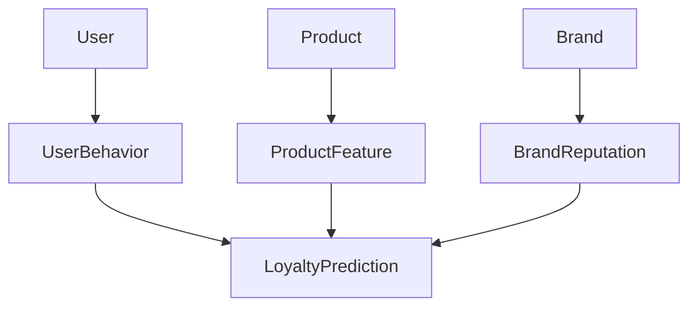
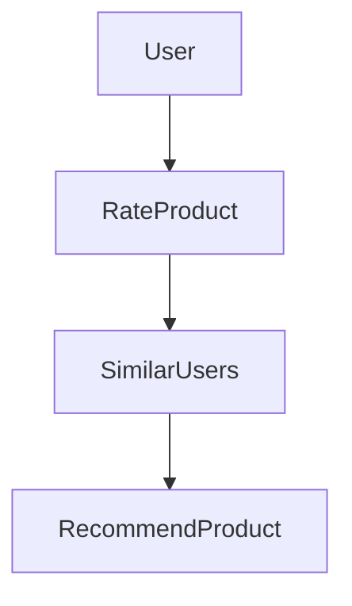
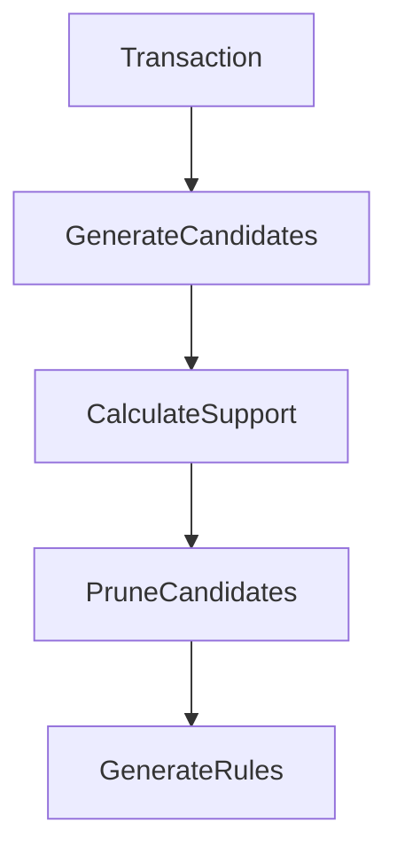
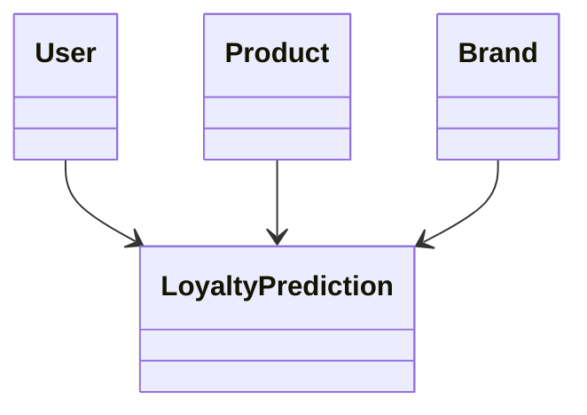

                 


# 多智能体系统在公司品牌忠诚度分析中的应用

## 关键词：
多智能体系统, 品牌忠诚度, 协同过滤, 关联规则挖掘, 机器学习, 数据分析

## 摘要：
本文探讨了多智能体系统在公司品牌忠诚度分析中的应用，详细介绍了多智能体系统的概念、核心算法及其在品牌忠诚度分析中的具体应用。文章通过背景介绍、核心概念分析、算法原理、系统架构设计、项目实战和最佳实践等多个方面，全面解析了多智能体系统在品牌忠诚度分析中的优势和实现过程。通过协同过滤和关联规则挖掘算法的详细讲解，以及实际项目的实施，展示了多智能体系统在提升品牌忠诚度分析效率和准确性中的巨大潜力。

---

## 第一部分：背景介绍

### 第1章：多智能体系统概述

#### 1.1 多智能体系统的定义与特点
- **1.1.1 多智能体系统的定义**
  多智能体系统（Multi-Agent System, MAS）是由多个智能体（Agent）组成的分布式系统，每个智能体能够感知环境、自主决策并与其他智能体协作完成任务。智能体可以是软件程序、算法或物理设备，它们通过通信和协调实现复杂问题的解决。

- **1.1.2 多智能体系统的特性**
  - **自主性**：智能体能够自主决策，无需外部干预。
  - **反应性**：智能体能够实时感知环境并做出反应。
  - **协作性**：多个智能体能够协同工作，共同完成复杂任务。
  - **分布式性**：智能体分布在不同的节点或系统中，通过通信网络进行交互。

- **1.1.3 多智能体系统的应用场景**
  - **分布式计算**：适用于需要分布式处理的场景，如云计算、边缘计算。
  - **任务协作**：适用于需要多个组件协作完成任务的场景，如机器人协作、自动驾驶。
  - **数据分析**：适用于需要多维度数据分析的场景，如品牌忠诚度分析、用户行为分析。

#### 1.2 品牌忠诚度分析的基本概念
- **1.2.1 品牌忠诚度的定义**
  品牌忠诚度是指消费者对某个品牌长期的偏好和购买行为。忠诚的消费者不仅会重复购买该品牌的产品，还会在面对竞争对手时表现出更强的偏好。

- **1.2.2 品牌忠诚度的影响因素**
  - **产品质量**：产品是否满足消费者的需求和期望。
  - **品牌知名度**：品牌在市场上的认知度和影响力。
  - **客户体验**：消费者在购买和使用产品过程中的体验。
  - **价格敏感性**：消费者对价格变化的敏感程度。

- **1.2.3 品牌忠诚度分析的重要性**
  - **优化市场策略**：通过分析忠诚度，企业可以制定更精准的市场推广策略。
  - **提升客户 retention**：通过了解客户忠诚度，企业可以采取措施提高客户保留率。
  - **识别高潜力客户**：通过分析忠诚度，企业可以识别高潜力客户，提供个性化服务。

### 第2章：多智能体系统与品牌忠诚度分析的结合

#### 2.1 多智能体系统在品牌忠诚度分析中的优势
- **2.1.1 分布式计算的优势**
  多智能体系统能够将品牌忠诚度分析的任务分解为多个子任务，分别由不同的智能体完成，从而提高计算效率和处理能力。

- **2.1.2 多智能体协作的高效性**
  多个智能体可以同时处理不同类型的数据，如用户行为数据、市场数据、产品数据等，通过协作实现全面的品牌忠诚度分析。

#### 2.2 品牌忠诚度分析的挑战与解决方案
- **2.2.1 数据多样性带来的挑战**
  品牌忠诚度分析涉及大量的异构数据，如文本数据、数值数据、图像数据等，如何有效整合和分析这些数据是一个挑战。

- **2.2.2 多智能体协作的解决方案**
  通过设计高效的通信协议和协作机制，多个智能体可以协同工作，共同完成复杂的数据分析任务。

---

## 第二部分：核心概念与联系

### 第3章：多智能体系统的核心原理

#### 3.1 多智能体系统的核心原理
- **3.1.1 智能体的定义与属性**
  智能体是多智能体系统的基本组成单元，具有以下属性：
  - **目标**：智能体需要完成的任务或目标。
  - **知识**：智能体拥有的数据、规则和模型。
  - **能力**：智能体完成任务所需的行为和技能。
  - **环境**：智能体所处的外部环境。

- **3.1.2 智能体之间的通信机制**
  智能体之间的通信可以通过以下方式实现：
  - **直接通信**：智能体之间通过共享内存或消息传递进行直接通信。
  - **间接通信**：智能体通过中间代理或消息队列进行间接通信。

#### 3.2 品牌忠诚度分析的核心模型
- **3.2.1 基于多智能体的分析模型**
  - **用户行为分析智能体**：负责分析用户的购买行为、浏览行为等数据。
  - **市场趋势分析智能体**：负责分析市场趋势、竞争对手的动态。
  - **忠诚度预测智能体**：基于分析结果预测用户的忠诚度。

- **3.2.2 模型的输入与输出**
  - **输入**：用户数据、产品数据、市场数据。
  - **输出**：品牌忠诚度评分、忠诚度分析报告。

### 第4章：多智能体系统与品牌忠诚度分析的实体关系

#### 4.1 实体关系分析
- **4.1.1 用户、产品、品牌的实体关系**
  - 用户：消费者，具有购买行为、偏好等属性。
  - 产品：品牌下的产品或服务，具有质量、价格、功能等属性。
  - 品牌：企业的品牌，具有知名度、声誉等属性。

- **4.1.2 智能体与数据源的实体关系**
  - 智能体：负责数据的收集、分析和处理。
  - 数据源：包括用户数据、市场数据、产品数据等。

#### 4.2 Mermaid 实体关系图


---

## 第三部分：算法原理

### 第5章：协同过滤算法

#### 5.1 协同过滤算法的原理
- **5.1.1 基于用户的协同过滤**
  - 基于用户的历史购买行为和偏好，找到相似的用户群体，推荐相似的产品。
  - 例如，用户A购买了产品X，用户B购买了产品Y，且用户A和用户B的购买行为相似，那么推荐用户B购买产品X。

- **5.1.2 基于物品的协同过滤**
  - 基于产品的属性和特征，找到与目标产品相似的产品，推荐给目标用户。
  - 例如，产品X和产品Y的属性相似，购买了产品X的用户可能也会购买产品Y。

#### 5.2 协同过滤算法的实现
- **5.2.1 Mermaid 流程图**


- **5.2.2 Python 代码实现**
```python
import numpy as np

def user_based_collaborative_filtering(ratings, user_id):
    # 计算用户之间的相似度
    user_similarity = np.corrcoef(ratings.T)
    
    # 获取目标用户的相似用户
    similar_users = np.argsort(user_similarity[user_id, :])[::-1]
    
    # 推荐相似用户购买的产品
    recommendations = ratings.iloc[similar_users[1:], :].T.sum().sort_values(ascending=False)
    return recommendations
```

- **5.2.3 协同过滤算法的数学公式**
  $$相似度 = \frac{\sum_{i}(x_i - \bar{x})(y_i - \bar{y})}{\sqrt{\sum_{i}(x_i - \bar{x})^2} \sqrt{\sum_{i}(y_i - \bar{y})^2}}$$

---

### 第6章：关联规则挖掘算法

#### 6.1 关联规则挖掘算法的原理
- **6.1.1 关联规则的定义**
  关联规则是指在数据集中，两个或多个项之间存在显著关联的规则。
  - 例如，购买产品X的用户通常也会购买产品Y。

- **6.1.2 Apriori 算法的工作原理**
  - Apriori算法是一种经典的关联规则挖掘算法，通过递归地生成候选项集，计算支持度，过滤掉不满足最小支持度的项集。

#### 6.2 关联规则挖掘算法的实现
- **6.2.1 Mermaid 流程图**


- **6.2.2 Python 代码实现**
```python
from mlxtend.frequent_itemsets import apriori

def association_rule_mining(transactions, min_support):
    # 计算频繁项集
    frequent_itemsets = apriori(transactions, min_support=min_support)
    
    # 生成关联规则
    rules = apriori(frequent_itemsets, min_support=min_support)
    return rules
```

---

## 第四部分：系统分析与架构设计

### 第7章：系统分析

#### 7.1 项目介绍
- **项目背景**
  本文旨在设计一个多智能体系统，用于分析公司的品牌忠诚度。系统将整合多个数据源，利用协同过滤和关联规则挖掘算法，为公司提供准确的品牌忠诚度分析报告。

#### 7.2 系统功能设计
- **领域模型 Mermaid 类图**


---

## 第五部分：项目实战

### 第8章：项目实战

#### 8.1 环境安装
- **Python 3.8 或以上版本**
- **必要的库**：numpy, pandas, mlxtend
  ```bash
  pip install numpy pandas mlxtend
  ```

#### 8.2 核心代码实现
- **协同过滤算法实现**
```python
import numpy as np
import pandas as pd
from mlxtend.frequent_itemsets import apriori

# 示例数据集
transactions = pd.DataFrame({
    'user_id': [1, 2, 3, 4],
    'product_id': [101, 101, 102, 102],
    'purchase_date': ['2023-01-01', '2023-01-02', '2023-01-03', '2023-01-04']
})

# 协同过滤实现
def user_based_recommendation(transactions, user_id):
    ratings = transactions.pivot_table(index='user_id', columns='product_id', fill_value=0)
    ratings = ratings.T
    correlations = ratings.corr(method='pearson')
    similar_users = correlations[user_id]
    recommendations = similar_users.sort_values(ascending=False)
    return recommendations

# 关联规则挖掘实现
def association_rules(transactions, min_support=0.2):
    frequent_itemsets = apriori(transactions, min_support=min_support)
    rules = apriori(frequent_itemsets, min_support=min_support)
    return rules
```

#### 8.3 案例分析
- **案例1：用户行为分析**
  分析用户的购买历史，找出高忠诚度用户的特征。
- **案例2：产品关联分析**
  分析购买产品的关联性，找出常一起购买的产品组合。

---

## 第六部分：最佳实践

### 第9章：最佳实践

#### 9.1 小结
- 多智能体系统在品牌忠诚度分析中的应用具有显著的优势，能够提高分析效率和准确性。
- 协同过滤和关联规则挖掘算法是实现品牌忠诚度分析的重要工具。

#### 9.2 注意事项
- 数据隐私和安全问题需要高度重视。
- 系统设计时需要考虑可扩展性和可维护性。
- 算法的选择和参数调优需要根据具体场景进行调整。

#### 9.3 拓展阅读
- 《多智能体系统的分布式计算》
- 《机器学习在品牌忠诚度分析中的应用》
- 《数据挖掘与关联规则挖掘》

---

## 结语
本文详细探讨了多智能体系统在品牌忠诚度分析中的应用，从背景介绍、核心概念、算法原理到系统设计和项目实战，全面解析了多智能体系统在提升品牌忠诚度分析效率和准确性中的巨大潜力。通过协同过滤和关联规则挖掘算法的详细讲解和实际案例分析，展示了多智能体系统在品牌忠诚度分析中的实际应用价值。

---

**感谢您的阅读！**

