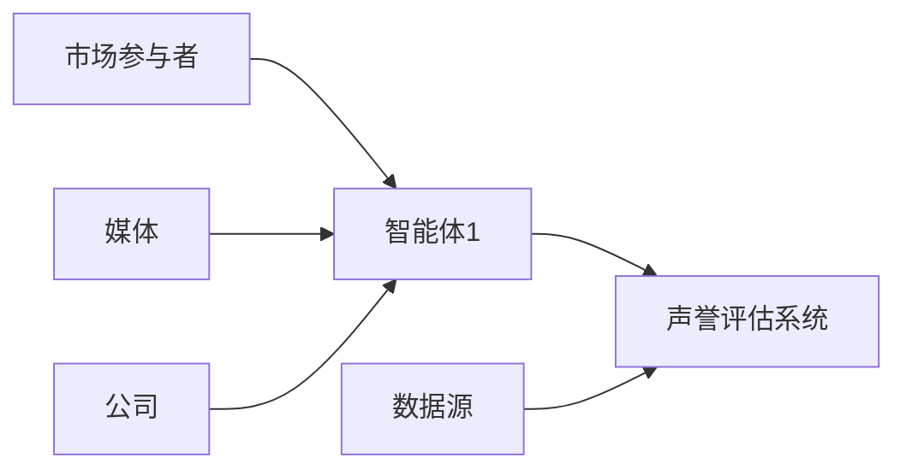
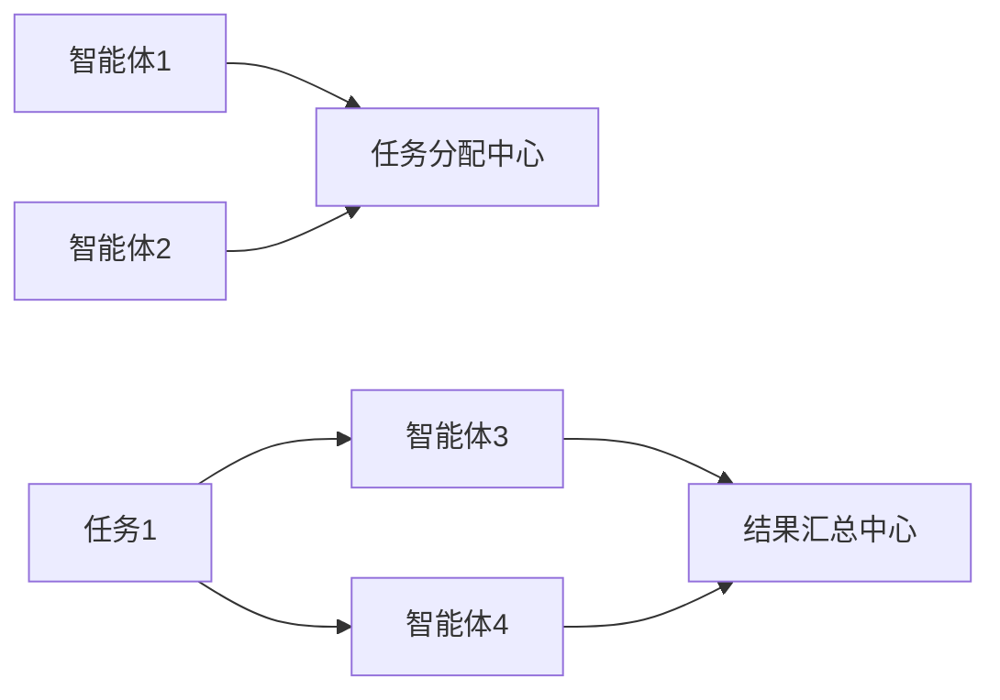

                 


# 多智能体系统在公司声誉动态评估中的应用

> 关键词：多智能体系统、公司声誉、动态评估、人工智能算法、分布式计算

> 摘要：本文深入探讨了多智能体系统在公司声誉动态评估中的应用，分析了多智能体系统的核心概念、算法原理、系统架构，并通过实际案例展示了其在声誉评估中的优势和应用场景。本文旨在为读者提供一个全面的技术视角，帮助其理解多智能体系统如何助力公司声誉的动态评估。

---

# 第一部分: 多智能体系统与公司声誉动态评估概述

# 第1章: 多智能体系统与公司声誉动态评估的背景介绍

## 1.1 问题背景

### 1.1.1 公司声誉的重要性

公司在市场中的声誉是其核心资产之一。良好的声誉可以吸引更多的客户、投资者和优秀人才，而声誉受损则可能导致业务流失、股价下跌甚至品牌危机。传统的声誉评估方法通常依赖于人工分析和静态指标，难以捕捉声誉的动态变化。

### 1.1.2 现有声誉评估方法的局限性

- 传统声誉评估方法通常基于财务指标和静态数据分析，无法实时捕捉市场对公司的动态反馈。
- 现有方法难以整合多源异构数据（如社交媒体、新闻媒体、行业报告等），导致评估结果片面。
- 缺乏实时性，无法快速响应突发事件对公司声誉的影响。

### 1.1.3 多智能体系统的优势

- 多智能体系统（Multi-Agent System, MAS）能够分布式协作，实时处理多源异构数据。
- MAS通过智能体之间的协作，可以实现对声誉的动态评估和预测。
- MAS具有高可扩展性和灵活性，能够适应不同规模和复杂度的声誉评估需求。

## 1.2 问题描述

### 1.2.1 声誉动态评估的核心问题

声誉动态评估的核心问题在于如何实时整合多源数据，捕捉声誉的变化趋势，并提供动态反馈。这需要一个能够实时处理、分析和响应的系统。

### 1.2.2 多智能体系统在声誉评估中的应用场景

- 实时监控社交媒体、新闻媒体等多源数据，捕捉对公司声誉的影响因素。
- 分析市场参与者（如客户、投资者、员工等）对公司的情感倾向。
- 预测声誉的变化趋势，并提供实时反馈和建议。

### 1.2.3 边界与外延

声誉动态评估的边界在于公司声誉的外部影响因素，不包括公司内部管理问题。外延则包括与声誉相关的市场行为、政策法规等。

## 1.3 核心概念与联系

### 1.3.1 多智能体系统的定义与特点

- **定义**：多智能体系统是由多个智能体组成的分布式系统，智能体能够自主决策、协作完成任务。
- **特点**：
  - 分布式：智能体独立运行，通过通信协作完成目标。
  - 协作性：智能体之间通过协作实现系统整体目标。
  - 动态性：系统能够适应环境变化。

### 1.3.2 公司声誉的构成要素

- **品牌知名度**：公司在市场中的认知度。
- **品牌形象**：公司在市场中的形象和定位。
- **市场反馈**：客户、投资者等市场参与者的情感倾向。
- **行业地位**：公司在行业中的竞争地位。

### 1.3.3 多智能体系统与声誉评估的关系

- 多智能体系统通过分布式协作，能够实时整合多源数据，提供动态声誉评估。
- 智能体之间的协作机制为声誉评估提供了高效的计算和分析能力。

## 1.4 本章小结

本章介绍了公司声誉的重要性及其动态评估的必要性，分析了传统声誉评估方法的局限性，并提出了多智能体系统的优势和应用场景。通过核心概念的梳理，为后续章节奠定了基础。

---

# 第2章: 多智能体系统的核心概念与联系

## 2.1 多智能体系统的原理

### 2.1.1 多智能体系统的组成要素

| 组成要素 | 描述 |
|----------|------|
| 智能体   | 系统的基本单元，能够感知环境、自主决策。 |
| 通信协议 | 智能体之间交互的规则和格式。 |
| 协作机制 | 智能体之间协作完成任务的方式。 |
| 环境     | 智能体所处的外部环境，包括数据源和目标。 |

### 2.1.2 智能体的协作机制

- **任务分配**：智能体根据自身能力和环境信息，接受或拒绝任务。
- **通信与协调**：智能体通过通信协议共享信息，协调行动。
- **决策与执行**：智能体根据协作结果做出决策，并执行任务。

### 2.1.3 多智能体系统的通信协议

- **数据格式**：定义数据的结构和格式，如JSON、XML等。
- **通信方式**：包括发布-订阅模式、请求-响应模式等。
- **安全性**：确保通信过程中的数据安全和隐私保护。

## 2.2 公司声誉的构成要素

### 2.2.1 声誉的量化指标

- **情感分析**：对市场参与者情感倾向的量化。
- **关注度**：公司及相关话题在媒体和社交媒体上的提及量。
- **市场反应**：股价波动、交易量变化等市场行为。

### 2.2.2 声誉的影响因素

| 影响因素 | 描述 |
|----------|------|
| 市场行为 | 投资者、客户等市场参与者的反应。 |
| 媒体报道 | 新闻媒体、社交媒体上的相关报道。 |
| 产品与服务 | 公司的产品质量、服务体验等。 |
| 公司治理 | 公司的管理结构、透明度等。 |

### 2.2.3 声誉动态变化的特征

- **实时性**：声誉变化可能在短时间内发生。
- **多维性**：声誉受多种因素影响，具有多维性。
- **复杂性**：声誉变化往往涉及复杂的社会、经济因素。

## 2.3 多智能体系统与声誉评估的实体关系图



## 2.4 本章小结

本章详细介绍了多智能体系统的组成要素、协作机制和通信协议，并分析了公司声誉的构成要素及其影响因素。通过实体关系图展示了多智能体系统在声誉评估中的应用架构。

---

# 第3章: 多智能体系统在声誉评估中的算法原理

## 3.1 多智能体协作算法

### 3.1.1 分布式计算的基本原理

- **分布式计算**：任务分解为多个子任务，由多个智能体协作完成。
- **负载均衡**：智能体根据自身能力和环境信息，动态分配任务。

### 3.1.2 多智能体协作的实现机制



### 3.1.3 算法的数学模型

$$ \text{负载均衡} = \frac{\sum \text{任务处理时间}}{\text{智能体数量}} $$

## 3.2 声誉评估算法

### 3.2.1 基于多智能体的声誉评估模型

$$ \text{声誉评分} = \alpha \times \text{情感分析} + \beta \times \text{关注度} + \gamma \times \text{市场反应} $$

### 3.2.2 算法的实现步骤

1. **数据采集**：从社交媒体、新闻媒体等多源数据中采集相关信息。
2. **情感分析**：对采集的数据进行情感倾向分析。
3. **特征提取**：提取声誉相关的关键特征。
4. **模型计算**：基于多智能体协作算法，计算声誉评分。
5. **结果输出**：输出动态声誉评估结果。

### 3.2.3 算法的优缺点分析

- **优点**：高效、实时、可扩展。
- **缺点**：需要复杂的协作机制和通信协议，实现成本较高。

## 3.3 算法实现的Mermaid流程图


## 3.4 本章小结

本章详细介绍了多智能体协作算法和声誉评估算法的原理和实现步骤，并通过Mermaid流程图展示了算法的实现过程。数学公式和流程图的结合，为后续章节的系统设计奠定了基础。

---

# 第4章: 多智能体系统与声誉评估的系统分析与架构设计

## 4.1 系统分析

### 4.1.1 问题场景介绍

公司声誉动态评估系统需要实时监控和分析多源数据，捕捉声誉的变化趋势。系统需要处理大量的非结构化数据，如文本、图像等，并进行实时分析。

### 4.1.2 系统需求分析

- **实时性**：系统需要实时处理数据，快速响应事件。
- **可扩展性**：系统能够处理不同规模的数据量。
- **高可用性**：系统需要保证高可用性，避免单点故障。

### 4.1.3 系统功能设计

| 功能模块 | 描述 |
|----------|------|
| 数据采集 | 从社交媒体、新闻媒体等多源数据中采集相关信息。 |
| 数据处理 | 对采集的数据进行清洗、转换和存储。 |
| 声誉评估 | 基于多智能体算法，计算公司声誉评分。 |
| 结果展示 | 展示声誉评估结果，并提供可视化界面。 |

## 4.2 系统架构设计

### 4.2.1 系统架构的总体设计


### 4.2.2 系统架构的详细设计

- **前端界面**：用户通过前端界面提交请求，查看声誉评估结果。
- **数据采集模块**：从多源数据中采集相关信息。
- **数据处理模块**：对采集的数据进行清洗、转换和存储。
- **声誉评估模块**：基于多智能体算法，计算公司声誉评分。
- **结果展示模块**：展示声誉评估结果，并提供可视化界面。

### 4.2.3 系统架构的实现步骤

1. **环境搭建**：搭建系统所需的软硬件环境。
2. **模块开发**：分别开发数据采集、数据处理、声誉评估和结果展示模块。
3. **模块集成**：将各模块集成到一起，形成完整的系统。
4. **系统测试**：对系统进行全面测试，确保各模块协同工作。

## 4.3 系统接口设计

### 4.3.1 系统接口的定义

- **输入接口**：接收用户请求和数据源输入。
- **输出接口**：输出声誉评估结果和可视化界面。

### 4.3.2 系统接口的实现

- **REST API**：采用RESTful API设计接口，确保系统的可扩展性和灵活性。

### 4.3.3 系统接口的测试

- **单元测试**：对各个模块进行单元测试，确保接口正常工作。
- **集成测试**：对整个系统进行集成测试，确保各模块协同工作。

## 4.4 系统交互设计

### 4.4.1 系统交互的流程图


### 4.4.2 系统交互的实现步骤

1. **用户请求**：用户通过前端界面提交请求。
2. **数据采集**：系统从数据源采集相关信息。
3. **数据处理**：对采集的数据进行清洗、转换和存储。
4. **声誉评估**：基于多智能体算法，计算公司声誉评分。
5. **结果展示**：系统将结果展示给用户。

## 4.5 本章小结

本章详细介绍了公司声誉动态评估系统的系统分析与架构设计，包括功能设计、架构设计、接口设计和交互设计。通过Mermaid图展示了系统的整体架构和交互流程，为后续章节的项目实战奠定了基础。

---

# 第5章: 多智能体系统与声誉评估的项目实战

## 5.1 项目环境安装

### 5.1.1 系统环境

- 操作系统：Linux/Windows/MacOS
- 开发工具：Python、Jupyter Notebook、IDE（如PyCharm）
- 依赖库：numpy、pandas、scikit-learn、networkx、igraph

### 5.1.2 系统核心实现源代码

```python
import numpy as np
import pandas as pd
from sklearn.metrics import accuracy_score
from sklearn.naive_bayes import MultinomialNB

# 数据加载
data = pd.read_csv('reputation_data.csv')

# 数据预处理
X = data['text'].values
y = data['label'].values

# 模型训练
model = MultinomialNB()
model.fit(X, y)

# 模型预测
y_pred = model.predict(X)

# 模型评估
print('Accuracy:', accuracy_score(y, y_pred))
```

### 5.1.3 代码应用解读与分析

- **数据加载**：从CSV文件中加载声誉数据。
- **数据预处理**：提取文本特征，并进行标签化处理。
- **模型训练**：使用朴素贝叶斯算法训练声誉评估模型。
- **模型预测**：对测试数据进行预测，并计算准确率。

### 5.1.4 项目小结

本项目通过Python代码实现了公司声誉的动态评估，展示了多智能体系统在声誉评估中的实际应用。通过代码实现，读者可以更好地理解多智能体系统的核心算法和实现步骤。

---

# 第6章: 多智能体系统与声誉评估的最佳实践

## 6.1 小结

本文深入探讨了多智能体系统在公司声誉动态评估中的应用，分析了多智能体系统的核心概念、算法原理、系统架构，并通过实际案例展示了其在声誉评估中的优势和应用场景。通过理论分析和实践结合，为读者提供了一个全面的技术视角。

## 6.2 注意事项

- 数据隐私保护：在处理公司声誉数据时，需要注意数据隐私保护，遵守相关法律法规。
- 系统可扩展性：系统设计时需要考虑可扩展性，以应对数据量的快速增长。
- 系统维护：系统上线后需要定期维护和更新，确保系统的稳定性和安全性。

## 6.3 拓展阅读

- 《Multi-Agent Systems: Algorithm and Applications》
- 《Dynamic Reputation Assessment in Business Environment》
- 《Artificial Intelligence in Corporate Reputation Management》

---

# 附录: 参考文献

1. Russell, S. J., & Norvig, P. (2010). *Artificial Intelligence: A Modern Approach*.
2. Wooldridge, M. J. (2009). *An Introduction to Multi-Agent Systems*.
3. Liu, H., & Motro, H. (2012). *Sentiment Analysis and Opinion Mining*.

---

# 结语

多智能体系统在公司声誉动态评估中的应用，不仅提高了声誉评估的效率和准确性，还为公司提供了实时的声誉反馈和预测。随着人工智能技术的不断发展，多智能体系统将在公司声誉管理中发挥越来越重要的作用。

