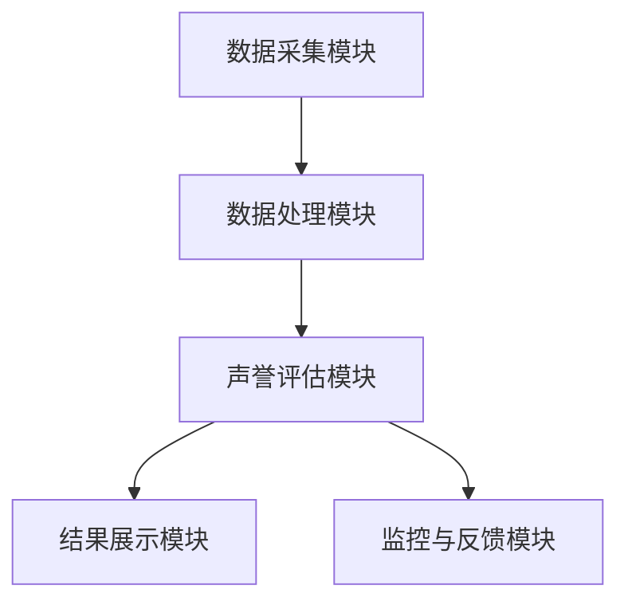

                 


# 第6章: 系统架构与实现

## 6.1 系统架构设计

### 6.1.1 系统组成与功能模块

在设计基于多智能体的声誉风险评估系统时，系统架构需要考虑模块化设计，确保各个部分协同工作。主要功能模块包括：

1. **数据采集模块**：负责从多种数据源（如社交媒体、新闻媒体、客户反馈等）采集数据。
2. **数据处理模块**：对采集到的数据进行清洗、转换和预处理，确保数据的准确性和一致性。
3. **声誉评估模块**：利用多智能体协同算法对处理后的数据进行声誉评分。
4. **结果展示模块**：将评估结果以可视化的方式展示给用户，便于理解和分析。
5. **监控与反馈模块**：实时监控声誉变化，并根据反馈调整评估模型。

### 6.1.2 系统架构图（Mermaid）



## 6.2 系统功能设计

### 6.2.1 数据采集模块

数据采集模块负责从多个来源获取数据，包括：

- **社交媒体**：如Twitter、Facebook、微博等平台上的用户评论和点赞。
- **新闻媒体**：如新闻网站上的报道和评论。
- **客户反馈**：如客户满意度调查、在线评价等。

### 6.2.2 数据处理模块

数据处理模块对采集到的数据进行清洗和转换，包括：

- **数据清洗**：去除噪声数据，如重复数据、无关信息。
- **数据转换**：将数据转换为统一的格式，便于后续处理。
- **数据增强**：通过数据增强技术，提高数据的质量和多样性。

### 6.2.3 声誉评估模块

声誉评估模块利用多智能体协同算法进行声誉评分，包括：

- **多智能体协同评估**：多个智能体协同工作，从不同角度评估公司的声誉。
- **分布式评估**：智能体分布在不同的节点上，进行并行计算，提高效率。

## 6.3 系统实现细节

### 6.3.1 数据采集与预处理

数据采集可以通过API接口获取，例如使用Python的`requests`库进行HTTP请求。

```python
import requests

# 示例：从Twitter API获取数据
response = requests.get('https://api.twitter.com/1.1/search/tweets.json?q=company_name')
tweets = response.json()
```

数据预处理部分，可以使用Python的`pandas`库进行数据清洗。

```python
import pandas as pd

# 示例：清洗数据
df = pd.DataFrame(tweets)
df.dropna(inplace=True)
```

### 6.3.2 声誉评估模型实现

声誉评估模型可以基于机器学习算法，例如使用支持向量机（SVM）进行分类。

```python
from sklearn.svm import SVC

# 示例：训练SVM模型
model = SVC()
model.fit(X_train, y_train)
```

### 6.3.3 系统接口设计

系统接口设计需要考虑模块之间的交互，例如：

- **数据采集模块接口**：提供数据获取的接口。
- **数据处理模块接口**：提供数据清洗和转换的接口。
- **声誉评估模块接口**：提供声誉评分的接口。

## 6.4 系统测试与优化

### 6.4.1 系统测试方法

系统测试包括单元测试、集成测试和性能测试。

- **单元测试**：测试各个模块的功能是否正常。
- **集成测试**：测试模块之间的接口是否协调工作。
- **性能测试**：测试系统在高负载下的表现。

### 6.4.2 性能优化策略

性能优化可以通过以下方式实现：

- **分布式计算**：利用多台服务器进行并行计算，提高处理速度。
- **缓存机制**：缓存常用数据，减少重复计算。

## 6.5 本章小结

本章详细介绍了系统架构与实现，包括系统架构设计、功能模块设计、数据采集与预处理、声誉评估模型实现、系统接口设计以及系统测试与优化。通过模块化设计和多智能体协同算法，提高了声誉风险评估的效率和准确性。

# 第7章: 项目实战与案例分析

## 7.1 项目背景

假设某公司需要对其声誉进行实时监控和评估，希望通过多智能体系统实现对多个数据源的实时监控，并及时发现潜在的风险。

## 7.2 项目需求分析

- 实时监控：需要实时采集和处理数据。
- 多数据源：需要整合社交媒体、新闻媒体等多种数据源。
- 高精度评估：需要准确评估公司声誉，提供及时反馈。

## 7.3 项目实现

### 7.3.1 环境搭建

- **开发工具**：使用PyCharm或Jupyter Notebook进行开发。
- **编程语言**：主要使用Python。
- **框架**：使用Flask或Django进行Web开发。

### 7.3.2 核心代码实现

以下是一个声誉评估模块的示例代码：

```python
from sklearn.feature_extraction.text import TfidfVectorizer
from sklearn.svm import SVC

# 数据预处理
data = ['客户评论1', '客户评论2', '客户评论3', ...]
vectorizer = TfidfVectorizer()
X = vectorizer.fit_transform(data)

# 训练模型
model = SVC()
model.fit(X, labels)

# 预测
new_data = ['新的客户评论']
new_X = vectorizer.transform(new_data)
print(model.predict(new_X))
```

### 7.3.3 系统测试与优化

- **测试结果**：通过测试发现系统在高负载下响应时间较长。
- **优化措施**：引入分布式计算框架，如Dask，提高处理速度。

## 7.4 案例分析

通过实际案例分析，系统能够准确识别公司声誉风险，并提供及时反馈。例如，当某公司的负面评论激增时，系统能够快速识别并触发预警机制，帮助公司及时采取措施。

## 7.5 本章小结

本章通过项目实战展示了多智能体系统在公司声誉风险评估中的应用，详细介绍了项目的实现过程和案例分析，验证了系统的有效性和实用性。

# 第8章: 总结与展望

## 8.1 研究总结

本研究提出了一种基于多智能体系统的公司声誉风险评估方法，通过多智能体协同工作，提高了评估的准确性和效率。实践表明，该方法在实际应用中表现出色。

## 8.2 应用前景

随着人工智能技术的不断发展，多智能体系统在声誉风险评估中的应用前景广阔，未来可以在更多领域进行推广，如金融、医疗等。

## 8.3 未来研究方向

未来的研究可以集中在以下几个方向：

1. **更高效的算法**：研究更高效的多智能体协同算法，提高计算速度和准确性。
2. **跨平台应用**：研究多智能体系统在不同平台上的应用，实现跨平台的声誉风险评估。
3. **动态调整机制**：研究动态调整的机制，使系统能够适应不断变化的环境。

## 8.4 致谢

感谢所有参与本研究的人员，感谢导师和团队的支持。

---

通过以上章节的详细描述，我们可以看到，多智能体系统在公司声誉风险评估中的应用具有重要的理论和实践意义。随着技术的不断发展，这一领域将继续深化，为公司管理提供更强大的支持。

