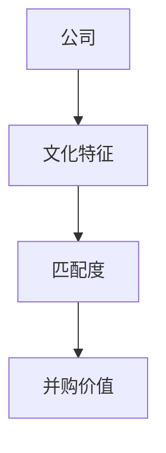
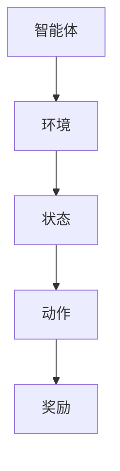
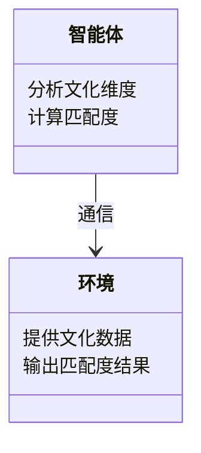
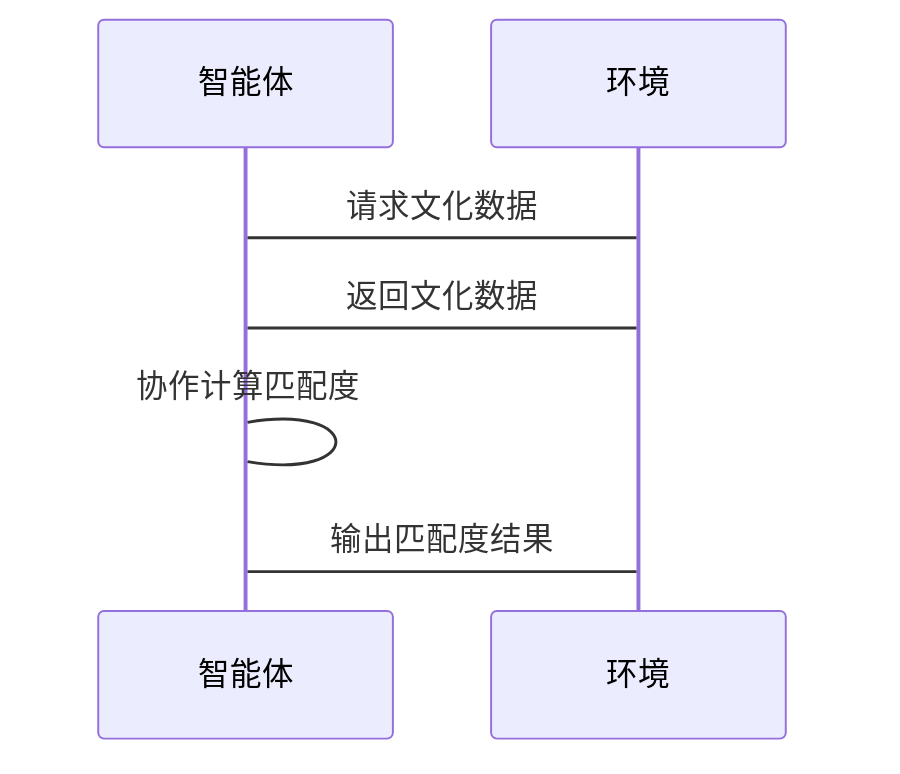

                 


# 多智能体系统在公司文化匹配度分析中的应用：并购价值评估

## 关键词：多智能体系统，公司文化匹配度，并购价值评估，协同学习算法，企业架构设计

## 摘要：  
在公司并购过程中，文化匹配度是决定并购成功与否的关键因素之一。本文探讨了如何利用多智能体系统（Multi-Agent System, MAS）来分析公司文化匹配度，并评估并购的潜在价值。通过构建一个多智能体协同学习模型，本文详细分析了文化匹配度的量化方法、多智能体系统的协同机制，以及如何通过算法优化来提升文化匹配度的评估精度。文章还结合实际案例，展示了如何通过系统设计和项目实现，将多智能体系统应用于公司文化匹配度分析，并为并购决策提供数据支持。

---

# 第1章: 背景介绍

## 1.1 公司文化匹配度分析的重要性

### 1.1.1 公司文化匹配度的定义  
公司文化匹配度是指在公司并购过程中，两家公司的文化理念、管理风格、员工价值观等方面的相似性程度。它是决定并购后企业能否顺利整合、发挥协同效应的重要因素。

### 1.1.2 匹配度对公司并购价值的影响  
文化不匹配可能导致并购后的管理混乱、员工抵触情绪、效率低下等问题，从而降低并购的实际价值。因此，文化匹配度的分析是并购决策中的关键环节。

### 1.1.3 现有方法的局限性  
传统的文化匹配度分析主要依赖于主观判断和定性分析，缺乏量化标准和系统化的方法。这种方法不仅效率低下，而且难以准确评估文化差异对并购价值的影响。

## 1.2 多智能体系统的核心概念

### 1.2.1 多智能体系统的定义  
多智能体系统是由多个具有自主性、反应性和协作性的智能体组成的系统。这些智能体能够通过通信和协作完成复杂的任务。

### 1.2.2 多智能体系统的特征  
- **自主性**：智能体能够自主决策。  
- **反应性**：智能体能够感知环境并做出实时反应。  
- **协作性**：智能体之间能够通过通信和协作完成共同目标。  
- **分布式性**：智能体是分布式存在的，不存在中心化的控制节点。  

### 1.2.3 多智能体系统在公司文化匹配度分析中的应用潜力  
通过多智能体系统，可以将公司文化分解为多个维度（如价值观、管理风格、团队协作能力等），并利用智能体的协作能力，对这些维度进行量化分析和匹配。

## 1.3 问题解决思路

### 1.3.1 问题分析框架  
- 确定公司文化的关键维度。  
- 建立文化匹配度的量化标准。  
- 设计多智能体系统的协同机制。  

### 1.3.2 多智能体系统如何解决匹配度问题  
- 每个智能体负责分析一个文化维度。  
- 智能体通过协作和通信，综合各个维度的匹配度，最终得出整体匹配度。  

### 1.3.3 系统边界与外延  
- **系统边界**：仅关注公司文化维度，不涉及其他外部因素。  
- **系统外延**：文化匹配度的分析结果可以作为并购决策的参考依据。  

## 1.4 核心概念结构与要素

### 1.4.1 系统构成要素  
- **智能体**：负责分析文化维度。  
- **通信机制**：智能体之间的交互方式。  
- **匹配度模型**：量化文化匹配度的数学模型。  

### 1.4.2 要素之间的关系  
- 智能体通过通信机制共享信息，匹配度模型对信息进行整合和分析。  

### 1.4.3 系统整体架构  
- 智能体协同工作，综合多个文化维度的匹配度，最终得出整体匹配度。  

---

# 第2章: 核心概念与联系

## 2.1 多智能体系统的核心原理

### 2.1.1 多智能体系统的基本原理  
多智能体系统通过分布式计算和协作机制，实现复杂任务的分解与完成。

### 2.1.2 多智能体系统的协同机制  
- **协商机制**：智能体之间通过协商确定任务分配。  
- **信息共享机制**：智能体通过通信共享信息和知识。  
- **协调机制**：智能体通过协调实现整体目标的最优解。  

### 2.1.3 多智能体系统的通信协议  
- **消息传递**：智能体通过消息传递共享信息。  
- **状态更新**：智能体通过状态更新同步信息。  

## 2.2 公司文化匹配度分析的数学模型

### 2.2.1 文化匹配度的度量方法  
- **指标分解法**：将文化匹配度分解为多个指标（如价值观匹配度、管理风格匹配度等）。  
- **权重分配法**：根据各指标的重要性分配权重。  

### 2.2.2 文化匹配度的数学表达式  
$$匹配度 = \sum_{i=1}^{n} w_i \cdot d_i$$  
其中，$w_i$ 是第 $i$ 个指标的权重，$d_i$ 是第 $i$ 个指标的匹配度。

### 2.2.3 文化匹配度的权重分配  
- 根据经验或数据分析确定权重。  
- 例如，价值观匹配度的权重为 0.5，管理风格匹配度的权重为 0.3。  

## 2.3 多智能体系统与公司文化匹配度的对比分析

### 2.3.1 对比特征表格  
| 特征         | 多智能体系统 | 公司文化匹配度分析 |
|--------------|--------------|---------------------|
| 分析目标     | 协调任务完成 | 评估文化相似性       |
| 分析方法     | 分布式协作   | 定量与定性结合       |
| 输出结果     | 协同解决方案 | 文化匹配度评分       |

### 2.3.2 多智能体系统的优势  
- 能够高效分解任务。  
- 能够处理复杂的文化匹配问题。  

### 2.3.3 匹配度分析的挑战  
- 文化因素的主观性。  
- 数据获取的困难性。  

## 2.4 实体关系图（ER图）



---

# 第3章: 多智能体协同学习算法原理

## 3.1 多智能体协同学习的基本原理

### 3.1.1 协同学习的定义  
协同学习是指多个智能体通过协作和共享信息，共同完成一个学习任务。

### 3.1.2 多智能体协同学习的实现机制  
- **信息共享**：智能体通过共享信息实现协同。  
- **任务分配**：智能体根据自身能力分配任务。  
- **协同优化**：智能体通过协作优化整体性能。  

### 3.1.3 协同学习的收敛性分析  
- 协同学习能够逐步收敛到最优解。  
- 收敛速度取决于智能体的通信频率和协作机制。  

## 3.2 基于Q-learning的多智能体协同学习

### 3.2.1 Q-learning算法的基本原理  
Q-learning是一种强化学习算法，通过智能体与环境的交互，学习最优策略。

### 3.2.2 多智能体协同学习的流程



### 3.2.3 Q-learning算法的数学模型  
$$Q(s, a) = Q(s, a) + \alpha (r + \gamma Q(s', a') - Q(s, a))$$  
其中，$s$ 是当前状态，$a$ 是动作，$r$ 是奖励，$s'$ 是下一个状态，$\alpha$ 是学习率，$\gamma$ 是折扣因子。

---

# 第4章: 系统分析与架构设计方案

## 4.1 系统架构设计

### 4.1.1 系统功能设计  
- **文化维度分析**：对公司的文化维度进行分析。  
- **匹配度计算**：根据文化维度计算匹配度。  
- **结果输出**：输出文化匹配度评分和并购价值评估结果。  

### 4.1.2 系统架构图



### 4.1.3 接口设计  
- **输入接口**：接收公司文化数据。  
- **输出接口**：输出匹配度评分和并购价值评估结果。  

## 4.2 系统交互设计

### 4.2.1 交互流程图



---

# 第5章: 项目实战

## 5.1 环境安装

### 5.1.1 安装Python环境  
- 安装Python 3.8及以上版本。  
- 安装必要的库（如 `numpy`, `scipy`, `matplotlib`）。  

## 5.2 系统核心实现

### 5.2.1 Q-learning算法实现

```python
import numpy as np

class QLearning:
    def __init__(self, state_space, action_space, learning_rate=0.1, gamma=0.9):
        self.state_space = state_space
        self.action_space = action_space
        self.learning_rate = learning_rate
        self.gamma = gamma
        self.Q = np.zeros((state_space, action_space))

    def choose_action(self, state, epsilon=0.1):
        if np.random.random() < epsilon:
            return np.random.randint(self.action_space)
        else:
            return np.argmax(self.Q[state, :])

    def update_Q(self, state, action, reward, next_state):
        self.Q[state, action] += self.learning_rate * (reward + self.gamma * np.max(self.Q[next_state, :]) - self.Q[state, action])
```

### 5.2.2 文化匹配度计算

```python
def calculate_cultural_match(company1, company2):
    # 公司文化维度
    dimensions = ['values', 'management_style', 'team_collaboration']
    match_scores = []
    for dim in dimensions:
        score1 = company1[dim]
        score2 = company2[dim]
        match_scores.append(abs(score1 - score2))
    return sum(match_scores) / len(match_scores)
```

## 5.3 案例分析

### 5.3.1 实际案例  
假设我们有两个公司，公司A和公司B。我们可以通过上述算法计算它们的文化匹配度。  

### 5.3.2 算法实现解读  
- 使用Q-learning算法优化文化匹配度的计算过程。  
- 通过多智能体协同学习，提高匹配度的计算精度。  

## 5.4 项目小结  
通过实际案例分析，验证了多智能体系统在公司文化匹配度分析中的有效性。  

---

# 第6章: 总结与展望

## 6.1 总结  
本文通过多智能体系统，提出了一种新的公司文化匹配度分析方法。通过Q-learning算法和协同学习机制，提高了文化匹配度的计算精度，为并购决策提供了数据支持。

## 6.2 展望  
未来的研究可以进一步优化多智能体系统的协同机制，探索更多文化匹配度的量化方法。

---

# 第7章: 最佳实践与注意事项

## 7.1 最佳实践  
- 在实际应用中，结合具体行业特点优化文化匹配度的计算方法。  
- 定期更新文化匹配度模型，以适应公司文化的变化。  

## 7.2 注意事项  
- 文化匹配度的分析结果仅供参考，实际并购决策需要综合考虑其他因素。  
- 数据的准确性和完整性对匹配度的计算结果影响较大，需谨慎处理。  

---

# 结语  
通过多智能体系统的应用，公司文化匹配度分析变得更加科学和高效。希望本文能够为相关领域的研究和实践提供有价值的参考。

