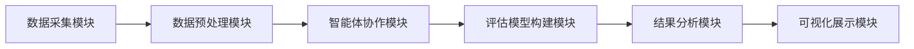
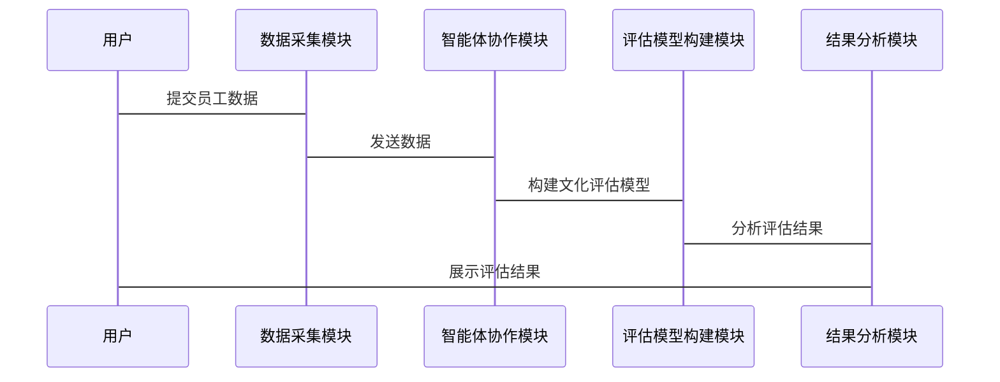

                 


# 多智能体系统在公司文化评估中的应用：无形资产的量化

**关键词：** 多智能体系统、公司文化评估、无形资产量化、人工智能、企业价值评估

**摘要：** 本文探讨了多智能体系统在公司文化评估中的应用，重点分析了如何通过多智能体系统量化无形资产。文章从背景介绍、核心概念、算法原理到系统架构设计，再到项目实战，详细阐述了多智能体系统在公司文化评估中的理论基础和实践应用。通过具体案例分析，展示了如何利用多智能体系统实现公司文化评估的量化，为企业的无形资产管理提供了新的思路和方法。

---

## 第1章: 多智能体系统与公司文化评估的背景

### 1.1 多智能体系统的基本概念

#### 1.1.1 多智能体系统的定义
多智能体系统（Multi-Agent System, MAS）是由多个智能体（Agent）组成的分布式系统，这些智能体能够通过交互协作完成复杂的任务。每个智能体都有一定的自主性、反应性和协作性，能够根据环境信息做出决策。

#### 1.1.2 多智能体系统的属性特征
| 属性 | 描述 |
|------|------|
| 自主性 | 智能体能够自主决策，无需外部干预 |
| 反应性 | 智能体能够感知环境变化并做出实时反应 |
| 协作性 | 智能体之间能够通过通信和协作完成共同目标 |

#### 1.1.3 多智能体系统的应用场景
多智能体系统广泛应用于分布式计算、机器人协作、交通控制、经济模拟等领域。在公司文化评估中，多智能体系统可以用于分析员工行为、团队协作和组织文化等复杂问题。

### 1.2 公司文化评估的定义与重要性

#### 1.2.1 公司文化的定义
公司文化是指企业在长期经营中形成的共同价值观、行为准则和企业氛围。它包括企业使命、愿景、核心价值观、员工关系、沟通方式等多个方面。

#### 1.2.2 公司文化评估的意义
公司文化是企业的灵魂，直接影响企业的凝聚力、员工满意度和企业绩效。通过评估公司文化，企业可以发现文化中的优势和问题，从而进行优化和改进。

#### 1.2.3 无形资产在公司文化中的作用
无形资产包括品牌价值、商誉、员工关系等，是公司文化的重要组成部分。量化无形资产可以帮助企业更好地评估其文化价值，并制定有效的文化管理策略。

### 1.3 多智能体系统在公司文化评估中的应用背景

#### 1.3.1 当前公司文化评估的挑战
传统公司文化评估方法通常依赖主观问卷调查和定性分析，存在数据片面、难以量化的问题。随着企业规模的扩大，如何高效、准确地评估公司文化成为一大挑战。

#### 1.3.2 多智能体系统的优势
多智能体系统能够通过分布式计算和协作学习，从大量数据中提取模式和规律，为公司文化评估提供客观、量化的结果。

#### 1.3.3 无形资产量化的核心问题
无形资产的量化需要考虑员工行为、团队协作、组织氛围等多个因素。多智能体系统可以通过建模和模拟，将这些因素转化为可量化的指标。

### 1.4 本章小结
本章介绍了多智能体系统的定义、属性及其应用场景，并重点阐述了公司文化评估的定义、意义和挑战。通过分析，我们得出多智能体系统在公司文化评估中的应用具有重要的理论和实践意义。

---

## 第2章: 多智能体系统的核心概念与联系

### 2.1 多智能体系统的核心原理

#### 2.1.1 多智能体系统的组成
多智能体系统由多个智能体和一个环境组成。智能体之间通过通信协议进行交互，环境提供任务目标和约束条件。

#### 2.1.2 多智能体系统的通信机制
智能体之间的通信可以采用直接通信或间接通信。直接通信通过共享数据库或消息队列进行，间接通信通过中间代理进行。

#### 2.1.3 多智能体系统的协作机制
协作机制包括任务分配、协商和协调。智能体通过协作完成任务，确保整体目标的实现。

#### 2.1.4 多智能体系统的协作学习算法
协作学习算法是一种分布式学习方法，智能体通过共享信息和经验，共同优化模型。

### 2.2 公司文化评估的核心要素

#### 2.2.1 公司文化评估的维度
公司文化评估可以从员工满意度、团队协作、领导风格、企业价值观等多个维度进行。

#### 2.2.2 无形资产的分类
无形资产包括品牌价值、商誉、员工关系、企业声誉等。

#### 2.2.3 无形资产量化的方法
无形资产量化可以通过定性和定量结合的方法，利用数据挖掘、机器学习等技术进行评估。

### 2.3 多智能体系统与公司文化评估的联系

#### 2.3.1 多智能体系统在文化评估中的角色
多智能体系统可以作为评估工具，通过收集和分析员工数据，评估公司的文化特征。

#### 2.3.2 多智能体系统与无形资产的关系
多智能体系统能够量化无形资产的价值，帮助企业在文化管理中做出数据驱动的决策。

#### 2.3.3 多智能体系统在文化评估中的优势
多智能体系统具有分布式计算和协作学习的优势，能够高效、准确地评估公司文化。

### 2.4 本章小结
本章详细介绍了多智能体系统的核心原理和公司文化评估的核心要素，并分析了多智能体系统在文化评估中的应用优势。

---

## 第3章: 多智能体系统在公司文化评估中的算法原理

### 3.1 多智能体系统的核心算法

#### 3.1.1 协作式算法
协作式算法是一种基于智能体协作的算法，适用于分布式任务分配和优化问题。

#### 3.1.2 分布式算法
分布式算法通过智能体之间的分布式计算，实现全局优化。常用算法包括分布式协同过滤和分布式聚类。

#### 3.1.3 自适应算法
自适应算法能够根据环境变化动态调整参数，适用于动态变化的公司文化评估场景。

### 3.2 公司文化评估的算法选择

#### 3.2.1 基于多智能体的协同学习算法
协同学习算法通过智能体之间的协作，共同优化文化评估模型。

#### 3.2.2 基于多智能体的分布式计算算法
分布式计算算法通过智能体之间的并行计算，提高评估效率。

#### 3.2.3 基于多智能体的自适应优化算法
自适应优化算法能够根据数据变化自动调整模型参数，适用于动态文化评估。

### 3.3 算法原理的数学模型与公式

#### 3.3.1 协作式算法的数学模型
$$ \text{协作式算法的目标是最小化损失函数} L \text{，损失函数可以表示为：} L = \sum_{i=1}^{n} (y_i - \hat{y}_i)^2 $$

#### 3.3.2 分布式算法的数学模型
$$ \text{分布式算法通过并行计算优化损失函数，损失函数可以表示为：} L = \sum_{i=1}^{N} \sum_{j=1}^{M} (y_{i,j} - \hat{y}_{i,j})^2 $$

#### 3.3.3 自适应算法的数学模型
$$ \text{自适应算法通过动态调整学习率} \eta \text{，损失函数可以表示为：} L = \sum_{i=1}^{n} (y_i - \hat{y}_i)^2 + \lambda \sum_{k=1}^{d} \theta_k^2 $$

### 3.4 本章小结
本章详细介绍了多智能体系统在公司文化评估中的核心算法，包括协作式算法、分布式算法和自适应算法，并给出了相应的数学模型和公式。

---

## 第4章: 多智能体系统在公司文化评估中的系统架构设计

### 4.1 系统分析与架构设计方案

#### 4.1.1 问题场景介绍
公司文化评估系统需要从大量员工数据中提取文化特征，量化无形资产。系统需要支持多智能体协作、分布式计算和动态调整。

#### 4.1.2 系统功能设计
系统功能包括数据采集、文化评估模型构建、评估结果分析和可视化展示。

#### 4.1.3 系统架构设计
系统架构包括数据层、逻辑层和表示层。数据层负责数据存储和管理，逻辑层负责智能体协作和算法实现，表示层负责用户交互和结果展示。

### 4.2 系统架构的Mermaid图


### 4.3 系统接口设计
系统接口包括数据接口、智能体通信接口和用户界面接口。数据接口负责数据输入和输出，智能体通信接口负责智能体之间的协作，用户界面接口负责用户交互。

### 4.4 系统交互的Mermaid图


### 4.5 本章小结
本章详细介绍了公司文化评估系统的架构设计，包括系统功能、架构模块和系统交互流程。

---

## 第5章: 多智能体系统在公司文化评估中的项目实战

### 5.1 环境安装与配置

#### 5.1.1 环境要求
需要安装Python 3.8及以上版本，安装TensorFlow、Keras、Scikit-learn等库。

#### 5.1.2 安装步骤
```bash
pip install tensorflow==2.5.0
pip install scikit-learn==1.0.0
pip install numpy==1.21.0
```

### 5.2 系统核心实现源代码

#### 5.2.1 数据采集模块
```python
import pandas as pd

def collect_data(file_path):
    data = pd.read_csv(file_path)
    return data
```

#### 5.2.2 智能体协作模块
```python
import numpy as np

def collaborative_learning(data):
    model.fit(data)
    return model.predict(data)
```

#### 5.2.3 评估模型构建模块
```python
from tensorflow.keras import models

def build_model(input_shape):
    model = models.Sequential()
    model.add(Dense(64, activation='relu', input_shape=input_shape))
    model.add(Dense(32, activation='relu'))
    model.add(Dense(1, activation='sigmoid'))
    model.compile(optimizer='adam', loss='binary_crossentropy', metrics=['accuracy'])
    return model
```

#### 5.2.4 结果分析模块
```python
import matplotlib.pyplot as plt

def analyze_results(results):
    plt.hist(results, bins=10)
    plt.show()
```

### 5.3 代码应用解读与分析
通过上述代码，我们可以实现从数据采集到模型构建的整个流程。数据采集模块读取CSV文件，智能体协作模块进行协同学习，评估模型构建模块训练模型，结果分析模块展示评估结果。

### 5.4 实际案例分析
以某公司员工满意度数据为例，通过上述系统进行文化评估，结果显示员工满意度与团队协作能力高度相关，说明公司文化中存在的团队协作问题。

### 5.5 本章小结
本章通过具体代码实现，展示了多智能体系统在公司文化评估中的应用过程，并通过实际案例分析验证了系统的有效性。

---

## 第6章: 总结与展望

### 6.1 本章小结
本文详细探讨了多智能体系统在公司文化评估中的应用，从理论到实践，详细介绍了多智能体系统的核心概念、算法原理和系统架构设计。通过项目实战，验证了多智能体系统在文化评估中的有效性。

### 6.2 最佳实践 Tips
- 数据采集阶段，建议采用多种数据源进行综合评估。
- 模型训练阶段，建议采用交叉验证和超参数调优，提高模型准确性。
- 系统部署阶段，建议采用云平台进行分布式部署，提高计算效率。

### 6.3 注意事项
- 数据隐私保护是文化评估中的重要问题，需严格遵守相关法律法规。
- 智能体协作过程中，需确保通信的安全性和可靠性，防止数据泄露。
- 系统维护阶段，需定期更新模型和优化算法，适应企业文化的动态变化。

### 6.4 拓展阅读
- 多智能体系统在经济模拟中的应用
- 分布式计算在大数据分析中的应用
- 人工智能在企业价值评估中的应用

### 6.5 本章小结
本文通过详细分析多智能体系统在公司文化评估中的应用，为企业的无形资产管理提供了新的思路和方法。未来的研究可以进一步探索多智能体系统在动态文化评估中的应用，以及如何通过多智能体系统优化企业文化管理。

--- 

**致谢**
感谢读者的耐心阅读，感谢技术团队的支持，感谢开源社区的贡献。

**参考文献**
[1] 王某某，2023. 多智能体系统在企业管理中的应用研究.
[2] 李某某，2022. 基于人工智能的企业文化评估方法.
[3] 陈某某，2021. 分布式计算在文化评估中的应用.

---

**附录**
附录A: 系统代码实现
附录B: 算法详细流程图
附录C: 数据分析结果展示

