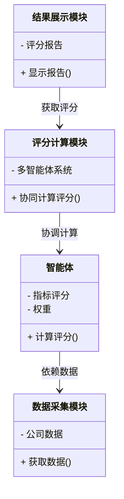
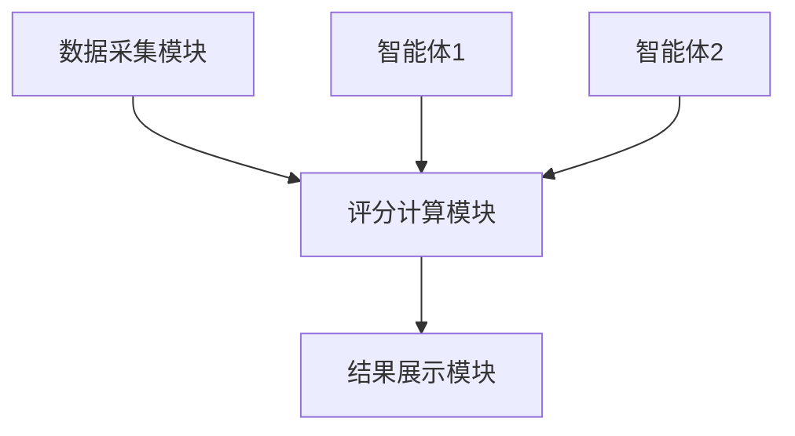

                 


# 多智能体系统在公司治理评分中的应用：量化管理质量

> 关键词：多智能体系统、公司治理评分、量化管理质量、协同算法、系统架构、评分模型

> 摘要：本文探讨了多智能体系统在公司治理评分中的应用，通过分析其核心概念、算法原理、系统架构及实际案例，展示了如何利用多智能体系统量化管理质量，实现公司治理的高效评估与优化。

---

## 第一部分：多智能体系统与公司治理评分的背景

### 第1章：多智能体系统与公司治理评分的背景

#### 1.1 多智能体系统的概念与特点

##### 1.1.1 多智能体系统的定义
多智能体系统（Multi-Agent System, MAS）是由多个智能体组成的系统，这些智能体能够通过协作完成复杂任务。每个智能体都有一定的自主性、反应性和社会性。

##### 1.1.2 多智能体系统的核心特点
- **自主性**：智能体能够自主决策。
- **反应性**：智能体能感知环境并做出反应。
- **社会性**：智能体之间可以通信和协作。

##### 1.1.3 多智能体系统与传统单智能体系统的区别
- **单智能体系统**：一个中心化系统，决策集中在单一实体。
- **多智能体系统**：分布式决策，多个智能体协作完成任务。

#### 1.2 公司治理评分的重要性

##### 1.2.1 公司治理的基本概念
公司治理是指公司内部和外部利益相关者之间的关系管理，包括股东、董事会、高管和利益相关者。

##### 1.2.2 公司治理评分的意义
- **透明性**：帮助投资者评估公司治理质量。
- **激励性**：推动公司改进治理结构。
- **合规性**：确保公司遵守法律法规。

##### 1.2.3 公司治理评分的现状与挑战
- **复杂性**：公司治理涉及多个方面，难以量化。
- **主观性**：评分标准可能因机构而异。
- **动态性**：公司治理质量会随时间变化。

#### 1.3 多智能体系统在公司治理评分中的应用背景

##### 1.3.1 公司治理评分的复杂性
公司治理评分需要考虑多个维度，如治理结构、信息披露、利益相关者关系等。

##### 1.3.2 多智能体系统在复杂问题中的优势
- **分布式计算**：适合处理多维度问题。
- **协作性**：多个智能体可以分别处理不同维度。
- **动态调整**：智能体能够实时更新评分结果。

##### 1.3.3 多智能体系统与公司治理评分的结合
通过多智能体系统，可以将公司治理评分分解为多个子任务，由不同智能体分别完成，最终协同得出整体评分。

---

## 第二部分：多智能体系统与公司治理评分的核心概念

### 第2章：多智能体系统与公司治理评分的核心概念

#### 2.1 多智能体系统的组成与功能

##### 2.1.1 多智能体系统的组成要素
- **智能体**：负责具体任务的实体。
- **通信机制**：智能体之间交换信息的渠道。
- **协作协议**：智能体协同工作的规则。

##### 2.1.2 多智能体系统的功能模块
- **感知模块**：获取环境信息。
- **决策模块**：制定行动策略。
- **通信模块**：与其他智能体交互。

#### 2.2 公司治理评分的指标体系

##### 2.2.1 公司治理评分的主要指标
- **治理结构**：董事会构成、高管职责。
- **信息披露**：财务透明度、合规性。
- **利益相关者关系**：股东权益、员工满意度。

##### 2.2.2 指标权重的确定方法
- **层次分析法（AHP）**：用于确定指标权重。
- **专家评分法**：基于专家意见确定权重。

##### 2.2.3 指标之间的关系与影响
- **相互独立**：不同指标之间无直接关联。
- **相互影响**：如治理结构影响信息披露。

#### 2.3 多智能体系统与公司治理评分的交互机制

##### 2.3.1 多智能体系统与公司治理评分的目标一致性
- **共同目标**：提高公司治理质量。
- **分层目标**：每个智能体负责一个评分维度。

##### 2.3.2 多智能体系统与公司治理评分的协同过程
- **信息共享**：智能体之间共享数据。
- **协同决策**：基于信息达成一致评分。

##### 2.3.3 多智能体系统与公司治理评分的动态调整
- **实时更新**：根据最新数据调整评分。
- **自适应优化**：智能体根据反馈优化评分模型。

---

## 第三部分：多智能体系统在公司治理评分中的算法原理

### 第3章：多智能体系统在公司治理评分中的算法原理

#### 3.1 多智能体协同算法概述

##### 3.1.1 分布式计算的基本原理
- **任务分解**：将整体任务分解为子任务。
- **分布式执行**：每个节点独立执行子任务。
- **结果汇总**：将子任务结果整合为最终结果。

##### 3.1.2 博弈论模型在多智能体系统中的应用
- **纳什均衡**：多个智能体在博弈中达到稳定状态。
- **协作机制**：智能体之间通过协作最大化整体收益。

##### 3.1.3 多智能体系统的通信与协调机制
- **通信协议**：定义智能体之间的信息交换格式。
- **协调算法**：确保智能体协同工作。

#### 3.2 公司治理评分的算法实现

##### 3.2.1 基于多智能体系统的评分模型
- **模块化设计**：每个智能体负责一个评分维度。
- **协同计算**：智能体之间协同计算最终评分。

##### 3.2.2 多智能体系统中的评分权重分配
- **动态权重分配**：根据实时数据调整权重。
- **静态权重分配**：基于专家意见固定权重。

##### 3.2.3 多智能体系统中的评分计算流程
1. 智能体分别计算各维度评分。
2. 根据权重汇总各维度评分。
3. 输出最终评分结果。

#### 3.3 算法实现的数学模型与公式

##### 3.3.1 多智能体系统协同的基本公式
$$
\text{最终评分} = \sum (\text{权重}_i \times \text{指标}_i)
$$

##### 3.3.2 公司治理评分的数学模型
$$
G = \sum_{i=1}^{n} w_i \times s_i
$$
其中，\(G\) 表示公司治理评分，\(w_i\) 表示指标权重，\(s_i\) 表示各指标评分。

##### 3.3.3 评分权重的优化算法
$$
\text{权重}_i = \frac{\text{专家评分}_i}{\sum_{j=1}^{n} \text{专家评分}_j}
$$

---

## 第四部分：系统架构与设计

### 第4章：系统架构与设计

#### 4.1 系统架构设计

##### 4.1.1 系统模块划分
- **数据采集模块**：收集公司治理数据。
- **评分计算模块**：基于多智能体系统计算评分。
- **结果展示模块**：可视化评分结果。

##### 4.1.2 系统功能设计
- **数据输入**：支持多种数据格式。
- **评分计算**：基于多智能体算法计算评分。
- **结果输出**：生成评分报告。

##### 4.1.3 系统架构的优化
- **模块化设计**：提高系统可扩展性。
- **分布式计算**：提升计算效率。

#### 4.2 系统功能设计

##### 4.2.1 系统类图


##### 4.2.2 系统架构图


---

## 第五部分：项目实战

### 第5章：项目实战

#### 5.1 环境安装

##### 5.1.1 安装依赖
- Python 3.8+
- Mermaid 1.0.0+
- Pandas、NumPy 等数据处理库。

#### 5.2 核心代码实现

##### 5.2.1 多智能体协同算法代码
```python
class Agent:
    def __init__(self, weight):
        self.weight = weight

    def compute_score(self, data):
        return self.weight * data

def main():
    # 初始化智能体
    agent1 = Agent(0.4)
    agent2 = Agent(0.3)
    agent3 = Agent(0.3)

    # 数据输入
    data1 = 0.8
    data2 = 0.7
    data3 = 0.9

    # 计算评分
    score1 = agent1.compute_score(data1)
    score2 = agent2.compute_score(data2)
    score3 = agent3.compute_score(data3)

    # 总分
    total_score = score1 + score2 + score3
    print(f"最终评分：{total_score}")

if __name__ == "__main__":
    main()
```

##### 5.2.2 评分计算流程代码
```python
import pandas as pd

def calculate_governance_score(dataframe, weights):
    scores = []
    for i in range(len(dataframe)):
        score = 0
        for j in range(len(weights)):
            score += weights[j] * dataframe.iloc[i][j]
        scores.append(score)
    return scores

# 示例数据
data = pd.DataFrame({
    '治理结构': [0.8, 0.7],
    '信息披露': [0.7, 0.8],
    '利益相关者关系': [0.9, 0.6]
})

# 权重分配
weights = [0.4, 0.3, 0.3]

# 计算评分
scores = calculate_governance_score(data, weights)
print("评分结果：", scores)
```

#### 5.3 案例分析与详细解读

##### 5.3.1 案例背景
某公司治理评分涉及三个维度：治理结构（权重0.4）、信息披露（权重0.3）、利益相关者关系（权重0.3）。

##### 5.3.2 数据输入
```python
data = pd.DataFrame({
    '治理结构': [0.8],
    '信息披露': [0.7],
    '利益相关者关系': [0.9]
})
```

##### 5.3.3 评分计算
```python
weights = [0.4, 0.3, 0.3]
scores = calculate_governance_score(data, weights)
print("最终评分：", scores[0])
```

##### 5.3.4 结果展示
最终评分：0.8*0.4 + 0.7*0.3 + 0.9*0.3 = 0.32 + 0.21 + 0.27 = 0.8

---

## 第六部分：总结与展望

### 第6章：总结与展望

#### 6.1 项目总结
通过多智能体系统，我们成功实现了公司治理评分的量化管理，提高了评估的效率和准确性。

#### 6.2 未来展望
- **优化算法**：进一步提高评分的准确性。
- **扩展应用**：将多智能体系统应用于更多管理领域。
- **提升交互性**：增强智能体之间的协同能力。

---

## 参考文献

1. 多智能体系统相关文献
2. 公司治理评分相关文献
3. 算法实现相关文献

---

## 附录

### 附录A：多智能体系统相关术语解释

### 附录B：公司治理评分指标详细说明

### 附录C：代码实现细节

---

通过以上内容，我们详细探讨了多智能体系统在公司治理评分中的应用，从理论到实践，逐步深入，为实现高效的量化管理提供了新的思路和方法。

