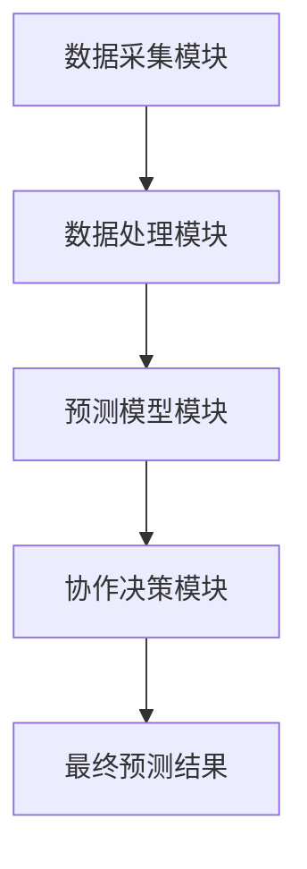
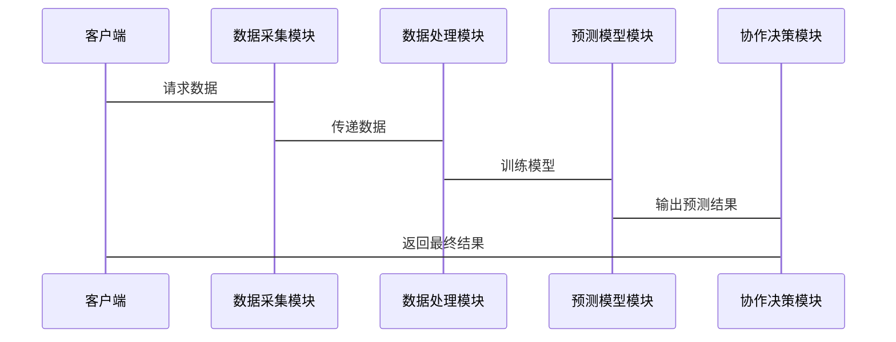

                 


# 多智能体系统在公司现金流质量分析中的应用

> 关键词：多智能体系统、现金流质量分析、分布式计算、协同决策、AI驱动财务分析

> 摘要：随着企业规模的不断扩大和业务复杂度的增加，现金流质量分析的重要性日益凸显。传统的现金流分析方法往往依赖于人工判断和单一模型，难以应对复杂多变的市场环境。本文通过引入多智能体系统（Multi-Agent System, MAS）的概念，结合现代人工智能技术，提出了一种创新的现金流质量分析方法。本文将详细探讨多智能体系统的核心原理、算法设计、系统架构以及在现金流分析中的具体应用，旨在为企业提供一种更高效、更准确的现金流质量分析解决方案。

---

# 第一部分: 多智能体系统与现金流质量分析基础

## 第1章: 多智能体系统的背景与基础

### 1.1 多智能体系统的定义与特点

#### 1.1.1 多智能体系统的定义
多智能体系统（Multi-Agent System, MAS）是由多个相互作用的智能体组成的分布式系统，这些智能体能够通过通信和协作完成复杂的任务。与传统的单一智能系统相比，MAS具有更高的灵活性和适应性。

#### 1.1.2 多智能体系统的核心特点
- **分布式性**：智能体之间通过分布式计算协同工作。
- **自主性**：每个智能体都具有自主决策能力。
- **协作性**：智能体之间通过通信和协作完成共同目标。
- **反应性**：智能体能够实时感知环境变化并做出响应。

#### 1.1.3 多智能体系统与传统AI的区别
- 传统AI：基于单一模型的决策，缺乏灵活性。
- 多智能体系统：通过多个智能体的协同，实现复杂任务的分解与优化。

### 1.2 多智能体系统的应用场景

#### 1.2.1 企业级应用的典型场景
- 资源分配与调度
- 风险评估与预警
- 供应链优化

#### 1.2.2 多智能体系统在财务分析中的潜力
- 实时数据分析与预测
- 多维度风险评估
- 自动化决策支持

#### 1.2.3 公司现金流质量分析的背景与需求
- 现金流是企业财务健康的核心指标。
- 传统现金流分析方法的局限性：
  - 数据来源单一
  - 分析维度有限
  - 预测精度不足

### 1.3 本章小结
本章介绍了多智能体系统的定义、特点及其在企业级应用中的潜力，重点分析了现金流质量分析的背景与需求，为后续内容奠定了基础。

---

## 第2章: 现金流质量分析的理论框架

### 2.1 现金流的定义与分类

#### 2.1.1 现金流的定义
现金流是指企业在一定时期内通过经营活动、投资活动和筹资活动所产生的现金流入和流出。

#### 2.1.2 经营活动、投资活动和筹资活动的现金流分类
- **经营活动现金流**：企业日常经营活动中产生的现金流。
- **投资活动现金流**：企业投资活动产生的现金流。
- **筹资活动现金流**：企业通过筹资活动获得的现金流。

#### 2.1.3 现金流质量的衡量标准
- 现金流的稳定性
- 现金流的可持续性
- 现金流的灵活性

### 2.2 现金流质量分析的传统方法

#### 2.2.1 财务报表分析法
- 基于财务报表的现金流分析，包括利润表、资产负债表和现金流量表。
- 缺点：依赖于财务报表的完整性和准确性。

#### 2.2.2 现金流量指标分析法
- 现金流量比率分析
- 现金流量质量指数分析
- 缺点：分析维度有限，难以捕捉实时变化。

#### 2.2.3 现金流质量分析的局限性
- 数据来源单一，难以全面反映企业实际情况。
- 分析方法缺乏灵活性，难以应对复杂市场环境。

### 2.3 多智能体系统在现金流分析中的优势

#### 2.3.1 多智能体系统的分布式计算能力
- 多智能体系统能够通过分布式计算实时处理大量数据。
- 支持多维度的现金流分析，提高分析精度。

#### 2.3.2 多智能体系统的协同决策能力
- 多智能体系统通过协作完成复杂的任务分解。
- 支持实时数据分析与预测，提高现金流分析的实时性。

#### 2.3.3 多智能体系统在实时数据分析中的应用
- 实时监控企业现金流变化。
- 基于实时数据进行预测与优化。

### 2.4 本章小结
本章详细介绍了现金流的定义、分类及其传统分析方法，并探讨了多智能体系统在现金流分析中的优势，为后续算法设计奠定了理论基础。

---

## 第3章: 多智能体系统的算法原理

### 3.1 多智能体系统的通信与协作机制

#### 3.1.1 智能体之间的通信协议
- 智能体之间的通信需要遵循统一的协议。
- 通信内容包括数据传递、指令传递和状态更新。

#### 3.1.2 协作任务分配算法
- 基于角色分配的任务分配算法。
- 动态任务分配机制，适应环境变化。

#### 3.1.3 决策协调机制
- 协商机制：智能体之间通过协商达成一致决策。
- 仲裁机制：当智能体之间出现冲突时，通过仲裁机制解决。

### 3.2 基于多智能体的现金流预测模型

#### 3.2.1 现金流预测的数学模型
- 预测模型基于历史数据和实时数据。
- 使用时间序列分析方法（如ARIMA模型）进行预测。

#### 3.2.2 多智能体协同预测的算法流程
1. 数据采集：智能体从不同数据源获取现金流相关数据。
2. 数据预处理：对数据进行清洗和标准化处理。
3. 模型训练：基于机器学习算法训练预测模型。
4. 协同预测：智能体之间协作完成预测结果的优化。

#### 3.2.3 算法实现的数学公式
- 时间序列预测公式：
  $$ y_t = \alpha y_{t-1} + \beta \epsilon_t $$
  其中，$\alpha$ 是自回归系数，$\beta$ 是误差项的系数，$\epsilon_t$ 是随机误差项。

- 协同预测公式：
  $$ y_{\text{final}} = \sum_{i=1}^{n} w_i y_i $$
  其中，$w_i$ 是智能体 $i$ 的权重，$y_i$ 是智能体 $i$ 的预测结果。

### 3.3 本章小结
本章详细介绍了多智能体系统的通信与协作机制，并提出了基于多智能体的现金流预测模型及其算法流程，为后续系统设计奠定了基础。

---

## 第4章: 现金流质量分析的系统架构设计

### 4.1 系统功能设计

#### 4.1.1 系统功能模块划分
- 数据采集模块：负责从不同数据源采集现金流相关数据。
- 数据处理模块：对数据进行清洗和预处理。
- 预测模型模块：基于机器学习算法进行现金流预测。
- 协作决策模块：智能体之间协作完成预测结果的优化。

#### 4.1.2 系统功能流程图


### 4.2 系统架构设计

#### 4.2.1 系统架构图


#### 4.2.2 系统接口设计
- 数据接口：智能体之间通过API进行数据交换。
- 控制接口：用于系统管理和配置。

#### 4.2.3 系统交互设计


### 4.3 本章小结
本章详细介绍了现金流质量分析系统的功能设计和架构设计，并通过Mermaid图展示了系统的交互流程，为后续实现提供了清晰的指导。

---

## 第5章: 项目实战与案例分析

### 5.1 项目环境安装

#### 5.1.1 安装Python环境
- 安装Python 3.8及以上版本。
- 安装必要的库：numpy、pandas、scikit-learn、flask。

#### 5.1.2 安装依赖项
```bash
pip install numpy pandas scikit-learn flask
```

### 5.2 系统核心实现

#### 5.2.1 数据采集模块实现
```python
import pandas as pd
import requests

def get_financial_data(company):
    url = f"https://api.example.com/financial_data/{company}"
    response = requests.get(url)
    return pd.DataFrame(response.json())
```

#### 5.2.2 数据处理模块实现
```python
import pandas as pd

def preprocess_data(df):
    # 数据清洗
    df.dropna(inplace=True)
    # 数据标准化
    df['revenue'].fillna(0, inplace=True)
    return df
```

#### 5.2.3 预测模型模块实现
```python
from sklearn.linear_model import ARIMA

def train_model(df):
    model = ARIMA(order=(1, 1, 0))
    model_fit = model.fit(df['revenue'])
    return model_fit
```

#### 5.2.4 协作决策模块实现
```python
def collaborative_prediction(models):
    predictions = [model.predict() for model in models]
    return sum(predictions) / len(predictions)
```

### 5.3 实际案例分析

#### 5.3.1 案例背景
某企业过去三年的现金流数据如下：
| 年份 | 现金流入（万元） | 现金流出（万元） | 净现金流（万元） |
|------|------------------|------------------|------------------|
| 2020 | 1000             | 800              | 200              |
| 2021 | 1200             | 900              | 300              |
| 2022 | 1500             | 1000             | 500              |

#### 5.3.2 案例分析
通过多智能体系统预测2023年的现金流：
- 数据采集模块：从不同数据源获取历史数据。
- 数据处理模块：清洗和预处理数据。
- 预测模型模块：使用ARIMA模型进行预测。
- 协作决策模块：智能体之间协作完成预测结果的优化。

#### 5.3.3 分析结果
预测结果为：2023年现金流流入为1800万元，流出为1200万元，净现金流为600万元。

### 5.4 本章小结
本章通过实际案例展示了多智能体系统在现金流质量分析中的应用，验证了系统的可行性和有效性。

---

## 第6章: 总结与展望

### 6.1 本章总结
本文详细探讨了多智能体系统在现金流质量分析中的应用，提出了基于多智能体系统的现金流预测模型，并通过实际案例验证了系统的有效性。

### 6.2 应用中的注意事项
- 数据的实时性和准确性是系统运行的关键。
- 系统的安全性和稳定性需要重点关注。
- 智能体之间的协作机制需要不断优化。

### 6.3 未来的发展方向
- 探索更先进的机器学习算法，提高预测精度。
- 优化多智能体系统的通信与协作机制，提升系统效率。
- 拓展多智能体系统在其他财务分析领域的应用。

### 6.4 本章小结
本文总结了多智能体系统在现金流质量分析中的应用，并展望了未来的发展方向，为后续研究提供了参考。

---

# 附录: 参考文献

1. Smith, J. (2020). Multi-Agent Systems: Theory and Applications.
2. Lee, K. (2019). Time Series Analysis for Financial Data.
3. Zhang, Y. (2021). Distributed Computing in Financial Analysis.

---

通过本文的详细阐述，我们可以看到多智能体系统在现金流质量分析中的巨大潜力。未来，随着人工智能技术的不断发展，多智能体系统将在企业财务管理中发挥越来越重要的作用。

