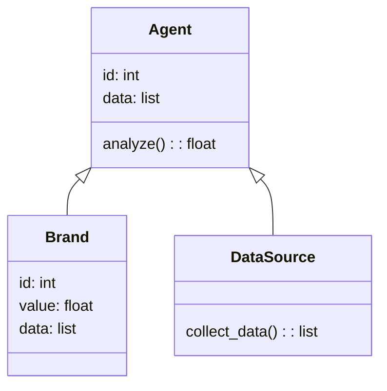
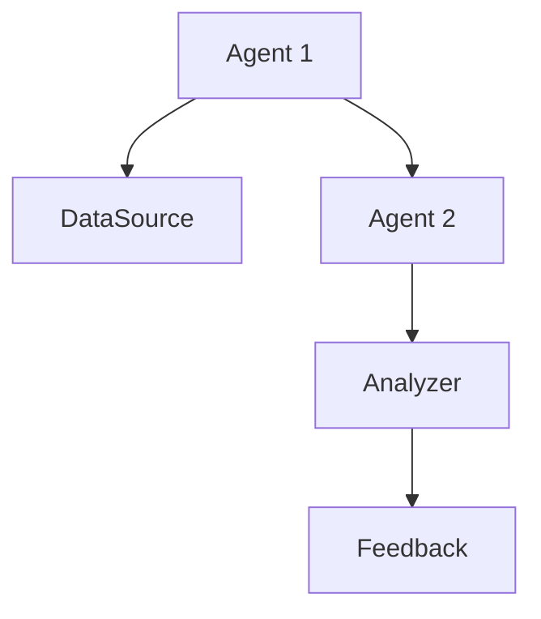

                 


# 多智能体系统在品牌价值动态评估中的应用

## 关键词：
多智能体系统, 品牌价值评估, 动态评估, 协同过滤算法, 系统架构设计

## 摘要：
多智能体系统（Multi-Agent System，MAS）作为一种新兴的分布式计算范式，在品牌价值动态评估领域展现出巨大的潜力。本文系统地探讨了多智能体系统的核心概念、品牌价值评估的关键要素，以及两者的深度融合。通过分析协同过滤算法的实现原理，构建了基于MAS的动态评估模型，并结合实际案例详细解读了系统的架构设计与实现方案。本文还提供了代码实现、系统交互流程图和数学公式，为读者提供了全面的技术指导。

---

## 第一部分：背景介绍

### 第1章：多智能体系统与品牌价值评估的背景

#### 1.1 多智能体系统（MAS）的基本概念

##### 1.1.1 多智能体系统的定义
多智能体系统是由多个智能体（Agent）组成的分布式系统，每个智能体都是一个能够感知环境、自主决策、协同工作的实体。智能体可以是软件程序、机器人或其他分布式实体。

##### 1.1.2 多智能体系统的特征
| 特征 | 描述 |
|------|------|
| 分布式 | 智能体独立运行，无中心化控制 |
| 协作性 | 智能体之间通过通信和协作完成共同目标 |
| 反应性 | 能够实时感知环境变化并做出响应 |
| 动态性 | 系统状态和目标可能随时间变化 |

##### 1.1.3 多智能体系统与传统单智能体系统的区别
- **单智能体系统**：集中式控制，单点决策，适用于简单任务。
- **多智能体系统**：分布式协作，适用于复杂任务，能够处理高维问题。

#### 1.2 品牌价值评估的现状与挑战

##### 1.2.1 品牌价值的传统评估方法
- **静态评估**：基于财务数据、市场地位等静态指标。
- **主观评估**：依赖专家判断，存在主观性。

##### 1.2.2 品牌价值评估的动态性与复杂性
- 市场环境动态变化：消费者偏好、经济环境波动。
- 多维影响因素：产品性能、竞争环境、社交媒体影响。

##### 1.2.3 多智能体系统在品牌价值评估中的优势
- **实时性**：能够快速响应市场变化。
- **分布式数据处理**：适用于多源异构数据。
- **协作能力**：多个智能体协同分析，提升评估准确性。

#### 1.3 动态评估的核心问题与目标

##### 1.3.1 动态评估的核心问题
- 数据实时性与准确性。
- 多源数据的融合与分析。
- 动态模型的构建与更新。

##### 1.3.2 动态评估的目标与意义
- 实时监控品牌价值变化。
- 提供动态反馈，辅助决策。
- 支持精准营销策略制定。

##### 1.3.3 动态评估的边界与外延
- 约束条件：数据采集范围、计算资源限制。
- 动态范围：短期波动 vs 长期趋势。

---

### 第2章：多智能体系统与品牌价值评估的核心概念

#### 2.1 多智能体系统的组成与功能

##### 2.1.1 智能体的定义与分类
- **定义**：智能体是具有感知、决策和行动能力的实体。
- **分类**：
  - **反应式智能体**：基于当前感知做出反应。
  - **认知式智能体**：具备推理、规划能力。
  - **学习式智能体**：能够从经验中学习。

##### 2.1.2 智能体的协同与通信机制
- **通信协议**：定义智能体间信息交换格式。
- **协同规则**：确保智能体协作时的协调性。
- **冲突解决**：处理智能体间的竞争与协作问题。

##### 2.1.3 智能体的决策与学习能力
- **决策机制**：基于状态和目标选择最优动作。
- **学习算法**：如强化学习、协同过滤等。

#### 2.2 品牌价值评估的关键要素

##### 2.2.1 品牌价值的核心维度
- **市场表现**：销售额、市场份额。
- **消费者认知**：品牌知名度、美誉度。
- **情感因素**：社交媒体情绪分析。

##### 2.2.2 品牌价值的影响因素
- **产品特性**：质量、创新性。
- **竞争环境**：竞争对手策略。
- **外部环境**：经济、政策影响。

##### 2.2.3 品牌价值的动态变化规律
- 短期波动：受突发事件影响。
- 长期趋势：市场定位、产品策略决定。

#### 2.3 多智能体系统与品牌价值评估的关联

##### 2.3.1 多智能体系统在品牌价值评估中的角色
- **数据采集**：智能体实时收集市场数据。
- **分析与评估**：多个智能体协同分析数据。
- **动态反馈**：根据评估结果调整策略。

##### 2.3.2 多智能体系统的协同优势
- **分布式计算**：提升数据处理能力。
- **实时响应**：快速适应市场变化。
- **多维度分析**：整合多源数据，提升评估准确性。

##### 2.3.3 多智能体系统的动态适应能力
- **自适应学习**：智能体通过反馈优化评估模型。
- **弹性扩展**：根据负载动态调整智能体数量。

---

### 第3章：多智能体系统与品牌价值评估的核心概念联系

#### 3.1 多智能体系统的核心原理

##### 3.1.1 智能体的自主性与反应性
- 智能体能够自主感知环境并做出反应，无需外部干预。

##### 3.1.2 智能体的协同与协调机制
- 智能体之间通过通信协议协同工作，确保任务完成。

##### 3.1.3 智能体的动态学习与适应能力
- 智能体通过学习算法不断优化自身的决策策略。

#### 3.2 品牌价值评估的核心模型与方法

##### 3.2.1 品牌价值的传统评估模型
- **层次分析法（AHP）**：适用于静态评估。
- **回归分析**：基于历史数据预测未来价值。

##### 3.2.2 品牌价值的动态评估模型
- **时间序列分析**：预测品牌价值的变化趋势。
- **协同过滤算法**：基于相似品牌的行为预测当前品牌价值。

##### 3.2.3 多智能体系统在品牌价值评估中的数学模型
- **协同过滤公式**：
  $$ sim(i,j) = \frac{\sum_{k} (r_{i,k} - \bar{r_i})(r_{j,k} - \bar{r_j})}{\sqrt{\sum_{k} (r_{i,k} - \bar{r_i})^2} \sqrt{\sum_{k} (r_{j,k} - \bar{r_j})^2}} $$
  其中，$sim(i,j)$ 表示品牌 $i$ 和品牌 $j$ 之间的相似度，$r_{i,k}$ 表示品牌 $i$ 在数据点 $k$ 的评分，$\bar{r_i}$ 是品牌 $i$ 的平均评分。

---

#### 3.3 多智能体系统与品牌价值评估的关联

##### 3.3.1 多智能体系统的核心原理
- 每个智能体负责特定的数据源或评估维度。
- 智能体之间通过协同完成综合评估。

##### 3.3.2 品牌价值评估的核心要素
- 数据来源的多样性和实时性。
- 智能体的分布式协作能力。

##### 3.3.3 多智能体系统的动态适应能力
- 根据市场变化实时调整评估模型。

---

### 第4章：多智能体系统与品牌价值评估的协同过滤算法实现

#### 4.1 协同过滤算法的实现原理

##### 4.1.1 协同过滤算法的基本原理
协同过滤算法通过寻找与目标品牌相似的品牌，基于相似品牌的历史数据预测目标品牌的未来价值。

##### 4.1.2 协同过滤算法的步骤
1. 数据采集：从多个数据源收集品牌相关数据。
2. 数据预处理：清洗数据，处理缺失值。
3. 计算相似度：使用协同过滤公式计算品牌之间的相似度。
4. 预测评估：基于相似品牌的动态数据预测目标品牌的未来价值。

##### 4.1.3 协同过滤算法的实现代码
```python
import numpy as np

def calculate_similarity(matrix):
    # matrix: m x n，m为品牌数，n为数据点数
    mean_rating = np.mean(matrix, axis=1).reshape(-1,1)
    centered_matrix = matrix - mean_rating
    numerator = np.dot(centered_matrix.T, centered_matrix)
    denominator = np.sqrt(np.sum(centered_matrix**2, axis=1)).reshape(-1,1)
    similarity = numerator / denominator
    return similarity
```

##### 4.1.4 协同过滤算法的数学模型
$$ sim(i,j) = \frac{\sum_{k} (r_{i,k} - \bar{r_i})(r_{j,k} - \bar{r_j})}{\sqrt{\sum_{k} (r_{i,k} - \bar{r_i})^2} \sqrt{\sum_{k} (r_{j,k} - \bar{r_j})^2}} $$

---

### 第5章：基于多智能体系统的品牌价值动态评估模型

#### 5.1 基于多智能体系统的模型构建

##### 5.1.1 模型构建的步骤
1. 确定智能体的功能模块。
2. 设计智能体之间的通信协议。
3. 实现智能体的协同算法。
4. 集成模型并进行测试。

##### 5.1.2 模型的实现代码
```python
class Agent:
    def __init__(self, id):
        self.id = id
        self.data = []
    
    def collect_data(self, data):
        self.data.append(data)
    
    def analyze(self):
        # 实现具体分析逻辑
        pass
```

---

### 第6章：系统分析与架构设计

#### 6.1 系统分析

##### 6.1.1 问题场景介绍
- **目标**：实时评估品牌价值。
- **数据源**：社交媒体、销售数据、行业报告。

##### 6.1.2 系统功能设计
- 数据采集模块：实时收集多源数据。
- 数据分析模块：协同过滤算法评估品牌价值。
- 反馈模块：根据评估结果调整策略。

##### 6.1.3 领域模型类图


---

#### 6.2 系统架构设计

##### 6.2.1 系统架构设计
- **微服务架构**：每个智能体负责特定功能。
- **通信机制**：采用消息队列进行异步通信。

##### 6.2.2 系统架构图


---

### 第7章：项目实战

#### 7.1 环境安装与配置

##### 7.1.1 环境安装
- **Python**：3.8+
- **库**：numpy, pandas, matplotlib

##### 7.1.2 核心代码实现
```python
import numpy as np

def main():
    brands = ['Brand1', 'Brand2', 'Brand3']
    data = np.random.rand(3, 10)  # 3 brands, 10 data points
    similarity_matrix = calculate_similarity(data.T)
    print(similarity_matrix)

if __name__ == "__main__":
    main()
```

#### 7.2 代码实现与解读

##### 7.2.1 代码解读
- **数据采集**：从多个数据源收集品牌相关数据。
- **数据分析**：使用协同过滤算法计算品牌相似度。
- **结果输出**：打印相似度矩阵。

#### 7.3 实际案例分析

##### 7.3.1 案例背景
- 假设三个品牌，分别在10个时间点的数据。

##### 7.3.2 数据分析过程
1. 数据预处理：清洗数据，处理缺失值。
2. 计算相似度：使用协同过滤公式计算相似度矩阵。
3. 评估结果：根据相似度矩阵预测品牌价值。

##### 7.3.3 实验结果与分析
- 相似度矩阵显示品牌1与品牌2相似度较高，品牌3相似度较低。

---

### 第8章：最佳实践与总结

#### 8.1 小结
- 多智能体系统能够有效提升品牌价值动态评估的实时性和准确性。
- 协同过滤算法在品牌价值预测中具有重要应用价值。

#### 8.2 注意事项
- 数据质量和实时性对评估结果影响重大。
- 系统设计需考虑扩展性和容错性。

#### 8.3 拓展阅读
- 推荐阅读相关领域的书籍和论文，深入学习多智能体系统的理论与实践。

---

# 结语
多智能体系统在品牌价值动态评估中的应用前景广阔，随着技术的不断进步，其应用将更加广泛和深入。希望本文能够为读者提供有价值的参考和启发。

---

