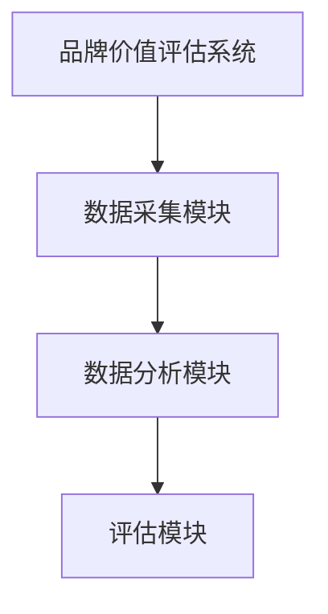

                 


# 多智能体系统在品牌价值评估中的应用：量化无形资产

## 关键词：
多智能体系统，品牌价值评估，无形资产，D-S证据推理，协作优化算法，系统架构设计，品牌量化

## 摘要：
本文探讨了多智能体系统在品牌价值评估中的应用，重点介绍如何利用多智能体系统量化无形资产。通过分析多智能体系统的协作机制、算法原理和系统架构设计，本文详细讲解了D-S证据推理和协作优化算法在品牌价值评估中的应用，并提供实际案例分析和系统实现方案，帮助读者理解如何利用多智能体系统提升品牌价值评估的效率和准确性。

---

## 第1章：多智能体系统概述

### 1.1 多智能体系统的基本概念
多智能体系统（Multi-Agent System, MAS）由多个智能体组成，这些智能体能够自主决策、协作完成任务。智能体通过通信和协作解决复杂问题，广泛应用于分布式计算、机器人、游戏AI等领域。

**问题背景**：品牌价值评估传统方法依赖人工分析，效率低且主观性强。随着市场竞争加剧，企业需要更高效、客观的方法量化品牌价值。

**问题描述**：品牌价值涉及多个因素，如市场表现、消费者认知、社交媒体影响力等。传统方法难以整合这些多维数据，且缺乏动态调整能力。

**解决方法**：引入多智能体系统，利用其协作和分布式计算能力，整合多源数据，动态评估品牌价值。

**边界与外延**：品牌价值评估不仅包括财务指标，还包括市场影响力、消费者情感等非财务因素。多智能体系统通过智能体协作，全面分析这些因素。

**核心要素**：智能体、通信机制、协作协议、任务分配算法。

---

## 第2章：无形资产量化的核心概念

### 2.1 无形资产的定义与分类
**无形资产**指无法实物化的资产，如品牌、专利、声誉等。品牌价值是无形资产的重要组成部分，涉及市场地位、客户忠诚度等因素。

**品牌价值评估的传统方法**：包括财务指标（销售额、利润）和非财务指标（市场份额、品牌认知度）。传统方法主观性强，难以量化动态因素。

**多智能体系统的作用**：通过智能体协作，实时收集和分析多源数据，动态评估品牌价值，提供客观、精准的评估结果。

---

## 第3章：多智能体系统的协作机制

### 3.1 多智能体系统中的通信与协作
**通信机制**：智能体通过消息传递进行协作，支持同步和异步通信。通信内容包括数据、请求和反馈。

**协作机制**：基于任务分解，智能体协作完成数据收集、分析和评估。协作协议定义智能体之间的交互规则。

### 3.2 多智能体系统的协调与冲突解决
**协调问题**：智能体在协作过程中可能出现目标冲突，需通过协调机制解决。

**冲突解决策略**：协商、仲裁、优先级调整等方法。协商通过智能体之间谈判达成一致，仲裁由第三方调解。

---

## 第4章：品牌价值评估的多智能体算法实现

### 4.1 基于D-S证据推理的品牌价值评估
**D-S证据推理**：通过 Dempster-Shafer 理论整合多个证据，计算品牌价值的概率。

**算法流程**：
1. 收集多源数据，如市场数据、社交媒体数据。
2. 数据预处理，提取关键指标。
3. 基于D-S理论，计算各指标对品牌价值的贡献概率。
4. 综合各指标概率，得到品牌价值评估结果。

**数学模型**：
$$ Dempster's rule: \text{Bel}_A = \text{Bel}_A + \text{Bel}_B + \text{min}(\text{Bel}_A, \text{Bel}_B) $$

### 4.2 多智能体协作优化算法
**算法原理**：基于粒子群优化，通过智能体协作搜索最优解。

**实现步骤**：
1. 初始化智能体参数。
2. 智能体协作搜索，更新参数。
3. 收敛至最优解。

**实例分析**：评估品牌在多个市场的表现，通过算法优化得到最优品牌价值。

---

## 第5章：系统分析与架构设计

### 5.1 问题场景介绍
**系统目标**：构建多智能体系统，量化品牌无形资产，提供动态品牌价值评估。

**系统功能需求**：
- 数据采集模块：收集市场、消费者数据。
- 数据分析模块：处理数据，提取关键指标。
- 评估模块：计算品牌价值，输出结果。

**系统性能需求**：实时性、准确性、可扩展性。

### 5.2 系统功能设计
**领域模型设计**：定义数据流、功能模块和交互关系。

**功能模块划分**：
- 数据采集模块：负责数据收集。
- 数据分析模块：处理数据，提取指标。
- 评估模块：计算品牌价值。

---

## 第6章：系统架构设计与实现

### 6.1 系统架构设计
**系统架构图**：


**实现细节**：模块化设计，各模块独立开发，便于维护。

### 6.2 系统实现
**环境配置**：安装所需库和工具。
**核心代码**：
```python
class Agent:
    def __init__(self, id):
        self.id = id
        self.data = {}

    def collect_data(self):
        # 数据收集逻辑
        pass

    def analyze(self):
        # 数据分析逻辑
        pass

    def evaluate(self):
        # 评估逻辑
        pass
```

---

## 总结
通过多智能体系统，品牌价值评估变得高效、精准。本文详细探讨了系统的协作机制、算法原理和架构设计，为实际应用提供了指导。未来，随着技术进步，多智能体系统在品牌价值评估中的应用将更加广泛和深入。

