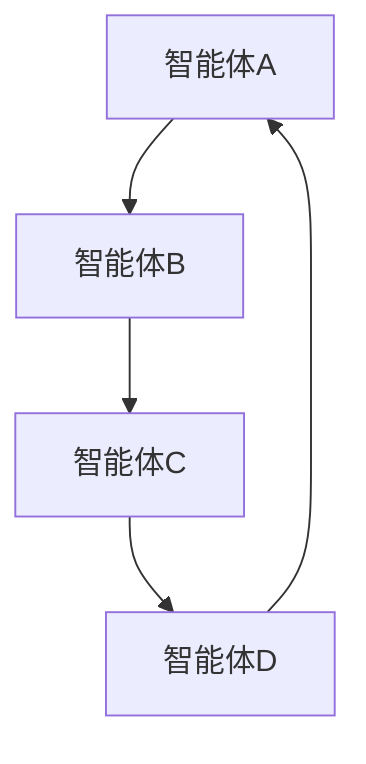
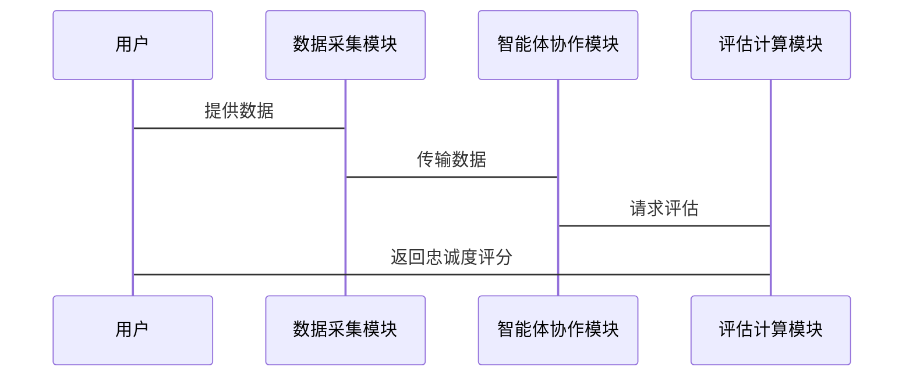

                 


# 多智能体系统在品牌忠诚度动态评估中的应用

## 关键词
- 多智能体系统
- 品牌忠诚度
- 动态评估
- 人工智能
- 协作学习

## 摘要
在当今竞争激烈的市场环境中，品牌忠诚度的动态评估对于企业维护客户关系至关重要。本文探讨多智能体系统（MAS）在品牌忠诚度评估中的应用，分析其优势、核心原理、系统架构，并通过实际案例展示其应用。文章详细讲解了算法原理、系统设计及项目实现，为企业提供了一套高效的品牌忠诚度动态评估解决方案。

---

## 第一部分：背景介绍

### 第1章：多智能体系统与品牌忠诚度概述

#### 1.1 多智能体系统的定义与特点
多智能体系统是由多个智能体组成的分布式系统，每个智能体能够自主决策并协作完成任务。其特点包括：
- **自主性**：智能体能独立决策。
- **反应性**：能感知环境并实时响应。
- **协作性**：智能体之间通过通信协作解决问题。
- **分布性**：计算资源分散，无单一控制点。

#### 1.2 品牌忠诚度的定义与影响因素
品牌忠诚度是客户对品牌的情感和行为上的忠诚度，影响因素包括产品质量、客户体验、品牌认知等。动态评估需实时捕捉这些变化。

#### 1.3 动态评估的重要性
动态评估能及时调整策略，增强客户粘性。多智能体系统通过协作提供精准评估，帮助企业优化客户关系管理。

---

## 第二部分：核心概念与联系

### 第2章：多智能体系统与品牌忠诚度动态评估的核心原理

#### 2.1 多智能体系统与品牌忠诚度的关系
多智能体系统的协作性和实时性使其适合动态评估。通过分布式计算和协作学习，系统能高效处理海量数据。

#### 2.2 动态评估的核心原理
动态评估基于实时数据和客户行为分析，多智能体系统通过协作学习不断优化评估模型。

#### 2.3 概念对比表格
| 特性       | 多智能体系统 | 传统评估方法 |
|------------|--------------|---------------|
| 准确性     | 高           | 中             |
| 实时性     | 高           | 低             |
| 适应性     | 强           | 弱             |

#### 2.4 ER实体关系图
```mermaid
erd
    顾客(顾客ID, 品牌ID, 忠诚度评分)
    产品(产品ID, 品牌ID, 产品属性)
    交易记录(交易ID, 顾客ID, 时间戳, 金额)
    服务反馈(反馈ID, 顾客ID, 评分, 反馈内容)
    品牌(品牌ID, 品牌名称, 行业)
    顾客-产品(顾客ID, 产品ID, 购买频率)
```

---

## 第三部分：算法原理讲解

### 第3章：多智能体系统中的协作学习算法

#### 3.1 分布式协作学习模型
协作学习通过智能体间的知识共享优化评估模型，减少数据冗余。

#### 3.2 协作学习的流程


#### 3.3 数学模型
协作学习的数学模型：
$$
f(x) = \sum_{i=1}^{n} w_i x_i
$$
其中，$w_i$为权重，$x_i$为输入特征。

#### 3.4 Python实现
```python
import numpy as np

def collaborative_learning_agents(data, agents):
    for agent in agents:
        agent.update_weights(data)
    return np.mean([agent.predict(data) for agent in agents], axis=0)
```

---

## 第四部分：系统分析与架构设计

### 第4章：系统功能与架构设计

#### 4.1 问题场景
在实时数据流中评估品牌忠诚度，涉及数据采集、处理和分析。

#### 4.2 功能设计
- 数据采集模块：收集客户行为数据。
- 智能体协作模块：处理数据并生成评估结果。
- 评估计算模块：输出忠诚度评分。

#### 4.3 系统架构设计
分层架构：
- 数据层：存储原始数据。
- 业务逻辑层：处理数据并进行评估。
- 表现层：展示结果。

#### 4.4 接口设计
API接口实现数据输入和输出，确保各模块协作顺畅。

#### 4.5 交互流程图


---

## 第五部分：项目实战

### 第5章：环境安装与核心代码实现

#### 5.1 环境安装
安装必要的Python库，如NumPy和Scikit-learn。

#### 5.2 核心代码实现
```python
class Agent:
    def __init__(self, weights):
        self.weights = weights

    def update_weights(self, data):
        # 更新权重逻辑
        pass

    def predict(self, data):
        return np.dot(data, self.weights)
```

#### 5.3 代码解读
- **Agent类**：定义智能体结构，包含权重更新和预测方法。
- **协作学习函数**：实现多智能体协作，计算最终评估结果。

#### 5.4 实际案例分析
通过具体案例展示系统如何动态评估品牌忠诚度，分析结果并提出改进建议。

#### 5.5 项目总结
总结项目成果，指出成功经验和未来改进方向。

---

## 第六部分：最佳实践与小结

### 第6章：最佳实践和注意事项

#### 6.1 应用中的注意事项
- 数据隐私保护
- 系统维护与更新
- 多智能体系统的可扩展性

#### 6.2 小结
多智能体系统通过协作学习和实时数据处理，显著提升了品牌忠诚度评估的准确性和效率。

### 第7章：拓展阅读与学习资料

#### 7.1 推荐阅读
- 多智能体系统相关书籍
- 品牌忠诚度评估的经典文献
- 人工智能领域的最新研究

#### 7.2 项目代码与资源
提供GitHub链接和相关资源，方便读者实践。

---

## 结语
本文详细探讨了多智能体系统在品牌忠诚度动态评估中的应用，从理论到实践，为企业提供了一套高效解决方案。通过系统化的分析和实例展示，帮助读者理解并应用多智能体系统优化品牌忠诚度评估。

