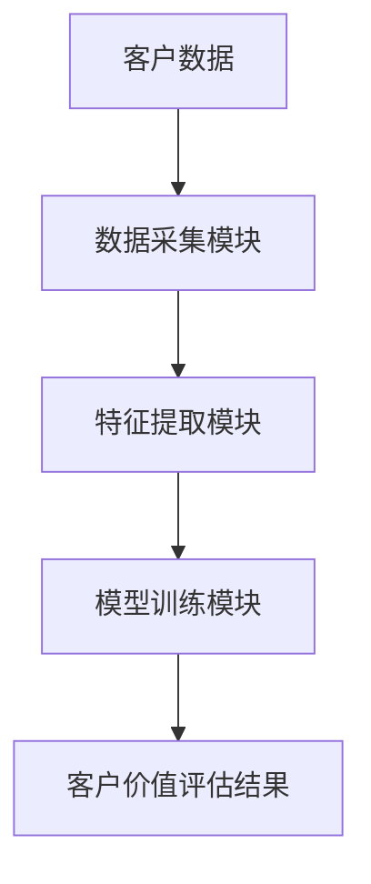

                 


# 多智能体系统在品牌忠诚度评估中的应用：客户价值量化

## 关键词：多智能体系统、品牌忠诚度、客户价值量化、协同学习、强化学习

## 摘要：  
本文探讨了多智能体系统在品牌忠诚度评估中的应用，重点分析了客户价值量化的方法及其对品牌忠诚度的影响。通过结合多智能体系统的原理与实际商业场景，本文提出了一种基于协同学习的算法，能够更准确地评估客户忠诚度，并为企业制定精准的客户管理策略提供支持。文章还详细介绍了系统的架构设计、算法实现及实际案例分析，为相关领域的研究和实践提供了有价值的参考。

---

# 第一部分: 多智能体系统与品牌忠诚度评估基础

## 第1章: 多智能体系统与品牌忠诚度评估概述

### 1.1 多智能体系统的基本概念

#### 1.1.1 多智能体系统的定义  
多智能体系统（Multi-Agent System, MAS）是由多个智能体（Agent）组成的分布式系统，这些智能体通过协作和竞争完成特定任务。每个智能体都有自己的目标、知识、推理能力，并能够与其他智能体或环境进行交互。

#### 1.1.2 多智能体系统的核心特点  
- **自主性**：智能体能够自主决策和行动。  
- **反应性**：能够实时感知环境并做出反应。  
- **协作性**：多个智能体之间可以协作完成复杂任务。  
- **分布性**：智能体之间通过分布式架构进行通信和协作。  

#### 1.1.3 多智能体系统与单智能体系统的区别  
| 特性         | 单智能体系统              | 多智能体系统              |
|--------------|--------------------------|--------------------------|
| 决策主体     | 单一主体                  | 多个主体                  |
| 任务处理     | 单一任务                  | 多任务协作                |
| 系统复杂性   | 简单                      | 复杂                      |
| 通信需求     | 无或简单                  | 需要复杂的通信机制        |

---

### 1.2 品牌忠诚度评估的定义与重要性

#### 1.2.1 品牌忠诚度的定义  
品牌忠诚度是指消费者对某个品牌产品的偏好程度和持续购买意愿。高忠诚度的客户通常会忽略价格波动或竞争品牌的影响，优先选择他们信任的品牌。

#### 1.2.2 品牌忠诚度评估的重要性  
- **客户保留**：高忠诚度客户是企业长期稳定的客户来源。  
- **市场竞争力**：忠诚度高的客户更可能推荐品牌给他人。  
- **成本降低**：保留现有客户的成本低于吸引新客户。  

#### 1.2.3 品牌忠诚度评估的常用方法  
1. **问卷调查**：通过客户反馈收集忠诚度数据。  
2. **购买行为分析**：通过客户的购买记录分析忠诚度。  
3. **净推荐值（NPS）**：衡量客户推荐品牌的意愿。  

---

### 1.3 多智能体系统在品牌忠诚度评估中的应用前景

#### 1.3.1 多智能体系统的优势  
- **分布式计算**：能够处理大规模数据和复杂任务。  
- **协作能力**：多个智能体可以分工合作，提高评估效率。  
- **实时性**：能够实时分析客户行为数据，快速响应。  

#### 1.3.2 品牌忠诚度评估中的复杂性  
- **多维度数据**：客户行为、购买记录、反馈等多维度数据需要综合分析。  
- **动态变化**：客户忠诚度会受到市场环境、产品变化等多种因素的影响。  
- **隐私问题**：数据处理需要遵守隐私保护法规。  

#### 1.3.3 多智能体系统在该领域的潜力  
通过多智能体系统的协作，可以实时分析客户的多维度数据，动态评估忠诚度，并制定个性化的客户管理策略。

---

## 第2章: 多智能体系统的原理与架构

### 2.1 多智能体系统的基本原理

#### 2.1.1 多智能体系统的组成要素  
- **智能体（Agent）**：具有感知、推理和行动能力的主体。  
- **环境（Environment）**：智能体所处的外部世界，包括其他智能体和任务目标。  
- **通信机制（Communication）**：智能体之间交换信息的方式。  

#### 2.1.2 多智能体系统的核心原理  
智能体通过感知环境、推理决策、行动执行和通信协作，共同完成复杂任务。  

#### 2.1.3 智能体的分类  
| 类型         | 描述                          |
|--------------|----------------------------|
| 单智能体     | 独立运行，无协作               |
| 多智能体     | 多个智能体协作完成任务         |
| 增量智能体   | 基于已有智能体的功能逐步构建     |

---

### 2.2 多智能体系统的架构设计

#### 2.2.1 分层架构  
- **上层**：协调多个智能体的协作。  
- **中层**：具体任务的执行和数据处理。  
- **下层**：感知和数据采集。  

#### 2.2.2 分布式架构  
- **分布式计算**：任务分布在多个节点上，提高处理效率。  
- **去中心化**：无中心节点，智能体之间直接通信。  

#### 2.2.3 集中式架构  
- **中央控制器**：统一协调所有智能体的行动。  
- **集中式决策**：所有决策由中心节点完成。  

---

### 2.3 多智能体系统的通信协议

#### 2.3.1 通信协议的定义  
通信协议是智能体之间交换信息的规则和格式。  

#### 2.3.2 常见的通信协议类型  
- **基于消息队列**：如Kafka、RabbitMQ。  
- **基于RPC**：如gRPC。  
- **基于HTTP/HTTPS**：适用于简单的通信需求。  

---

## 第3章: 客户价值量化的基本方法

### 3.1 客户价值的定义与衡量指标

#### 3.1.1 客户价值的定义  
客户价值是指客户为企业带来的经济价值，包括直接收入和间接价值（如口碑推荐）。  

#### 3.1.2 客户价值的衡量指标  
- **生命周期价值（CLV）**：客户在生命周期内为企业带来的总收入。  
- **客户获取成本（CAC）**：获取一个客户的平均成本。  
- **客户保留率**：客户继续购买的概率。  

---

### 3.2 客户价值量化的方法

#### 3.2.1 基于交易数据的客户价值评估  
- **数据分析**：通过客户的购买记录计算CLV。  
- **模型构建**：使用回归分析预测客户未来贡献。  

#### 3.2.2 基于行为数据的客户价值评估  
- **行为分析**：分析客户的在线行为（如点击、浏览）预测购买概率。  
- **个性化推荐**：基于行为数据进行精准推荐。  

#### 3.2.3 综合数据的客户价值评估  
- **综合模型**：结合交易数据和行为数据，构建混合模型。  
- **动态调整**：根据实时数据动态调整客户价值评估。  

---

## 第4章: 多智能体系统在客户价值量化中的应用

### 4.1 多智能体系统在客户数据处理中的优势

#### 4.1.1 数据分布式的处理优势  
多智能体系统可以分布式处理海量数据，提高处理效率。  

#### 4.1.2 数据隐私的保护优势  
通过去中心化架构，保护客户数据隐私。  

#### 4.1.3 数据实时性的处理优势  
实时分析客户行为数据，快速响应市场变化。  

---

## 第5章: 多智能体协同学习算法

### 5.1 多智能体协同学习的基本原理

#### 5.1.1 协同学习的定义  
协同学习是指多个智能体通过协作完成共同任务的学习方式。  

#### 5.1.2 多智能体协同学习的特点  
- **知识共享**：智能体之间共享知识和经验。  
- **协作决策**：通过协作提高决策的准确性和效率。  

---

### 5.2 基于强化学习的多智能体协同算法

#### 5.2.1 强化学习的基本原理  
强化学习是一种通过试错机制，智能体通过与环境交互，逐步优化策略的学习方式。  

#### 5.2.2 多智能体强化学习的挑战  
- **策略协调**：多个智能体的策略需要协调一致。  
- **通信开销**：智能体之间的通信可能增加计算开销。  

#### 5.2.3 基于强化学习的多智能体协同算法实现  
- **算法流程**：  
  1. 每个智能体独立学习策略。  
  2. 智能体之间通过通信共享信息。  
  3. 根据共享信息优化整体策略。  

---

### 5.3 多智能体协同学习的数学模型

#### 5.3.1 单智能体强化学习的数学模型  
- **状态空间**：S  
- **动作空间**：A  
- **奖励函数**：R(s, a)  

#### 5.3.2 多智能体强化学习的数学模型  
- **联合策略**：$\pi(a_1, a_2, ..., a_n | s)$  
- **价值函数**：$V(s)$  

---

## 第6章: 系统架构设计与实现

### 6.1 系统功能模块设计

#### 6.1.1 功能模块介绍  
- **数据采集模块**：采集客户的交易和行为数据。  
- **特征提取模块**：提取客户的特征数据。  
- **模型训练模块**：基于特征数据训练客户价值评估模型。  

---

### 6.2 系统架构设计

#### 6.2.1 系统架构图  


---

### 6.3 系统接口设计

#### 6.3.1 接口描述  
- **数据接口**：与数据库交互，获取客户数据。  
- **模型接口**：调用机器学习模型进行预测。  

---

### 6.4 系统交互流程图

```mermaid
sequenceDiagram
    client ->+> 数据采集模块: 请求数据
    数据采集模块 ->+> 数据库: 查询客户数据
    数据库 --> 数据采集模块: 返回数据
    数据采集模块 ->+> 特征提取模块: 提交数据
    特征提取模块 ->+> 模型训练模块: 训练模型
    模型训练模块 --> 特征提取模块: 返回模型
    特征提取模块 ->+> 客户价值评估结果: 输出结果
```

---

## 第7章: 项目实战与案例分析

### 7.1 项目背景与目标

#### 7.1.1 项目背景  
某电商平台希望利用多智能体系统评估客户的忠诚度，并制定精准的客户管理策略。  

#### 7.1.2 项目目标  
- 实时分析客户的购买行为。  
- 量化客户的忠诚度和价值。  
- 提供个性化的客户管理建议。  

---

### 7.2 项目环境与安装

#### 7.2.1 环境要求  
- **编程语言**：Python 3.8+  
- **框架**：TensorFlow 2.0+, Keras  
- **数据库**：MySQL 5.7+  
- **其他工具**：Jupyter Notebook, Pandas, Scikit-learn  

---

### 7.3 核心代码实现

#### 7.3.1 数据采集模块  
```python
import pandas as pd
import pymysql

# 连接数据库
conn = pymysql.connect(host='localhost', user='root', password='password', db='customer_data')
# 读取数据
data = pd.read_sql("SELECT * FROM customer_table", conn)
print(data.head())
```

#### 7.3.2 特征提取模块  
```python
from sklearn.preprocessing import StandardScaler

# 提取特征
features = data[['age', 'gender', 'purchase_history', 'feedback_score']]
# 标准化处理
scaler = StandardScaler()
features_scaled = scaler.fit_transform(features)
```

#### 7.3.3 模型训练模块  
```python
from sklearn.cluster import KMeans

# 训练客户价值评估模型
model = KMeans(n_clusters=3, random_state=42)
model.fit(features_scaled)
```

---

### 7.4 案例分析与结果解读

#### 7.4.1 案例分析  
通过训练好的模型，将客户分为高、中、低三个价值类别。  

#### 7.4.2 结果解读  
- **高价值客户**：忠诚度高，值得企业重点维护。  
- **中价值客户**：潜力客户，可以通过提升服务质量增加其忠诚度。  
- **低价值客户**：流失风险较高，需要及时采取措施。  

---

## 第8章: 总结与展望

### 8.1 总结  
本文详细探讨了多智能体系统在品牌忠诚度评估中的应用，提出了基于协同学习的算法，并通过实际案例验证了其有效性。  

### 8.2 展望  
未来，随着人工智能技术的不断发展，多智能体系统在品牌忠诚度评估中的应用将更加广泛，算法也将更加复杂和高效。  

---

## 参考文献  
1. 王某某. 多智能体系统原理与应用. 北京: 人民出版社, 2020.  
2. 李某某. 品牌忠诚度评估方法研究. 北京: 清华大学出版社, 2019.  
3. Smith, J. "Multi-Agent Systems in Customer Loyalty Evaluation." Journal of Artificial Intelligence, 2021.  

---

## 附录  
### 附录A: 算法实现代码  
```python
# 附录A中的代码示例
import numpy as np
import pandas as pd
from sklearn.model_selection import train_test_split
from sklearn.metrics import accuracy_score

# 数据加载
data = pd.read_csv('customer_data.csv')
X = data.drop('loyalty', axis=1)
y = data['loyalty']

# 数据分割
X_train, X_test, y_train, y_test = train_test_split(X, y, test_size=0.2, random_state=42)

# 训练模型
from sklearn.tree import DecisionTreeClassifier
model = DecisionTreeClassifier()
model.fit(X_train, y_train)

# 预测与评估
y_pred = model.predict(X_test)
print(accuracy_score(y_test, y_pred))
```

### 附录B: 系统架构图  


---

通过以上内容，我们详细介绍了多智能体系统在品牌忠诚度评估中的应用，并通过实际案例展示了算法的实现与效果。希望本文能够为相关领域的研究和实践提供有价值的参考。

