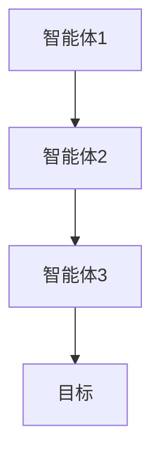
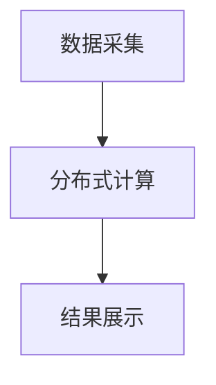

                 


# 多智能体系统在品牌资产评估中的应用：量化品牌价值

> 关键词：多智能体系统、品牌资产评估、品牌价值量化、分布式计算、博弈论、协同算法、系统架构设计

> 摘要：本文探讨了多智能体系统在品牌资产评估中的应用，通过量化品牌价值，分析了多智能体系统的协同机制、算法原理、系统架构设计以及实际案例。文章从背景、概念、算法、系统设计、项目实战等多个维度展开，详细阐述了多智能体系统如何通过协同计算和博弈论模型，实现品牌价值的精准评估。最后，总结了多智能体系统在品牌资产评估中的优势与未来发展方向。

---

# 第一部分: 多智能体系统与品牌资产评估基础

## 第1章: 多智能体系统与品牌资产评估概述

### 1.1 多智能体系统的基本概念

#### 1.1.1 多智能体系统的定义
多智能体系统（Multi-Agent System，MAS）是由多个智能体（Agent）组成的分布式系统，这些智能体能够通过协同工作完成复杂任务。智能体是具有感知、决策、执行能力的实体，可以是软件程序或物理设备。

#### 1.1.2 多智能体系统的特征
- **分布式**：智能体分布在不同的节点，独立运行。
- **协同性**：智能体之间通过通信和协作完成共同目标。
- **反应性**：智能体能够实时感知环境并做出反应。
- **自主性**：智能体具有自主决策能力。

#### 1.1.3 多智能体系统与品牌资产评估的关系
品牌资产评估需要综合考虑多个因素，如市场表现、消费者感知、财务数据等。多智能体系统能够通过分布式计算和协同机制，高效地处理这些复杂因素。

### 1.2 品牌资产评估的背景与意义

#### 1.2.1 品牌价值的定义与影响因素
品牌价值是品牌在市场中的综合表现，包括知名度、美誉度、忠诚度等。影响因素包括产品质量、市场占有率、消费者满意度等。

#### 1.2.2 品牌资产评估的挑战与难点
- 数据复杂性：品牌价值受多种因素影响，数据量大且复杂。
- 实时性要求：品牌价值需要实时评估，以应对市场变化。
- 协同性需求：需要多个团队或系统协同工作。

#### 1.2.3 多智能体系统在品牌资产评估中的应用价值
多智能体系统能够通过分布式计算和协同机制，高效地处理复杂数据，提供实时的品牌价值评估。

### 1.3 本章小结
本章介绍了多智能体系统的基本概念和品牌资产评估的背景，强调了多智能体系统在品牌资产评估中的重要性。

---

# 第二部分: 多智能体系统的核心概念与原理

## 第2章: 多智能体系统的组成与协同机制

### 2.1 多智能体系统的组成结构

#### 2.1.1 智能体的定义与分类
智能体是具有感知、决策、执行能力的实体，可以分为简单智能体和复杂智能体。

#### 2.1.2 多智能体系统的层次结构
- **物理层**：智能体的物理实体。
- **网络层**：智能体之间的通信网络。
- **应用层**：智能体的应用逻辑。

#### 2.1.3 多智能体系统中的实体关系（Mermaid图）



### 2.2 多智能体系统的协同机制

#### 2.2.1 分布式计算与协同算法
分布式计算是多智能体系统的核心，通过任务分解和协同算法实现智能体之间的协作。

#### 2.2.2 博弈论与多智能体决策
博弈论为多智能体决策提供了理论基础，通过 Nash 均衡等概念，实现智能体之间的最优决策。

#### 2.2.3 通信协议与信息共享
智能体之间的通信协议和信息共享是协同工作的基础，通过消息传递和数据同步实现。

---

## 第3章: 品牌资产评估的核心要素

### 3.1 品牌价值的量化维度

#### 3.1.1 品牌知名度
品牌知名度是品牌在市场中的认知程度，可以通过市场调研和数据分析量化。

#### 3.1.2 品牌美誉度
品牌美誉度是消费者对品牌的满意度和信任度，可以通过消费者反馈和社交媒体数据量化。

#### 3.1.3 品牌忠诚度
品牌忠诚度是消费者对品牌的忠诚程度，可以通过客户保留率和复购率量化。

### 3.2 品牌资产评估的关键指标

#### 3.2.1 市场表现指标
- 市场占有率
- 销售额增长率
- 市场排名

#### 3.2.2 财务表现指标
- 净利润
- 资产负债率
- 股东权益

#### 3.2.3 顾客感知指标
- 消费者满意度
- 品牌认知度
- 品牌联想

### 3.3 品牌资产评估的数学模型

#### 3.3.1 品牌价值公式
$$ V = \alpha \cdot N + \beta \cdot P + \gamma \cdot L $$
其中，$V$ 表示品牌价值，$N$ 表示知名度，$P$ 表示美誉度，$L$ 表示忠诚度，$\alpha, \beta, \gamma$ 为权重系数。

---

# 第三部分: 多智能体系统在品牌资产评估中的算法原理

## 第4章: 多智能体协同算法

### 4.1 分布式计算与多智能体协同

#### 4.1.1 分布式计算的基本原理
分布式计算通过将任务分解到多个节点，利用智能体协同完成任务。

#### 4.1.2 多智能体协同的算法框架
- 任务分解
- 通信协议设计
- 协同决策算法

#### 4.1.3 多智能体协同的实现步骤
1. 任务分解：将品牌资产评估任务分解为多个子任务。
2. 通信协议设计：设计智能体之间的通信协议。
3. 协同决策：通过博弈论模型实现智能体之间的最优决策。

### 4.2 基于博弈论的多智能体决策

#### 4.2.1 博弈论基础
- ** Nash 均衡**：所有智能体都采取最优策略，无法通过单方面改变策略而受益。
- **囚徒困境**：通过博弈论模型分析智能体之间的合作与背叛。

#### 4.2.2 多智能体博弈
通过博弈论模型，实现智能体之间的协同决策，例如通过 Nash 均衡实现最优品牌价值评估。

---

## 第5章: 基于多智能体系统的品牌资产评估算法

### 5.1 算法原理

#### 5.1.1 分布式计算与品牌资产评估
通过分布式计算，将品牌资产评估任务分解到多个智能体，实现并行计算。

#### 5.1.2 博弈论模型的应用
通过博弈论模型，实现智能体之间的协同决策，优化品牌价值评估结果。

### 5.2 算法实现

#### 5.2.1 算法流程图（Mermaid图）


#### 5.2.2 Python实现代码

```python
class Agent:
    def __init__(self, id):
        self.id = id
        self.data = {}
    
    def receive_message(self, message):
        # 处理消息
        pass
    
    def send_message(self, message, agent):
        # 发送消息
        pass

class BrandAssessment:
    def __init__(self, agents):
        self.agents = agents
    
    def assess_brand(self):
        # 分配任务
        for agent in self.agents:
            agent.send_message("开始评估", agent)
        
        # 收集结果
        results = []
        for agent in self.agents:
            results.append(agent.receive_message())
        
        # 计算品牌价值
        brand_value = sum(results) / len(results)
        return brand_value
```

---

## 第6章: 系统架构与设计

### 6.1 系统功能设计

#### 6.1.1 功能模块
- **数据采集模块**：采集品牌相关数据。
- **分布式计算模块**：实现多智能体协同计算。
- **结果展示模块**：展示品牌价值评估结果。

#### 6.1.2 系统功能流程图（Mermaid图）



### 6.2 系统架构设计

#### 6.2.1 系统架构图（Mermaid图）


#### 6.2.2 接口设计
- **智能体接口**：定义智能体之间的通信接口。
- **数据接口**：定义数据采集和处理接口。

---

## 第7章: 项目实战与案例分析

### 7.1 环境安装

#### 7.1.1 Python环境安装
安装 Python 和相关库（如 matplotlib、numpy）。

#### 7.1.2 系统依赖安装
安装多智能体系统所需的依赖库。

### 7.2 核心代码实现

#### 7.2.1 多智能体协同代码

```python
class Agent:
    def __init__(self, id):
        self.id = id
        self.data = {}
    
    def receive_message(self, message):
        # 处理消息
        pass
    
    def send_message(self, message, agent):
        # 发送消息
        pass

class BrandAssessment:
    def __init__(self, agents):
        self.agents = agents
    
    def assess_brand(self):
        # 分配任务
        for agent in self.agents:
            agent.send_message("开始评估", agent)
        
        # 收集结果
        results = []
        for agent in self.agents:
            results.append(agent.receive_message())
        
        # 计算品牌价值
        brand_value = sum(results) / len(results)
        return brand_value
```

### 7.3 案例分析

#### 7.3.1 案例背景
假设评估某品牌在市场中的价值，需要考虑知名度、美誉度和忠诚度。

#### 7.3.2 数据分析
通过多智能体系统协同计算，得出该品牌的综合价值。

### 7.4 项目小结
通过实际案例，验证了多智能体系统在品牌资产评估中的有效性。

---

# 第四部分: 总结与展望

## 第8章: 总结与展望

### 8.1 本章总结
本文详细探讨了多智能体系统在品牌资产评估中的应用，通过协同计算和博弈论模型，实现品牌价值的精准评估。

### 8.2 未来展望
未来，随着人工智能和分布式计算的发展，多智能体系统在品牌资产评估中的应用将更加广泛和深入。

---

# 结语

多智能体系统在品牌资产评估中的应用，不仅提高了评估效率，还提升了评估结果的准确性。通过本文的详细讲解，读者可以深入了解多智能体系统的原理和应用，并在实际中加以应用。

---

感谢您的阅读！如果需要进一步了解多智能体系统在品牌资产评估中的应用，可以参考相关技术文献或联系作者。

