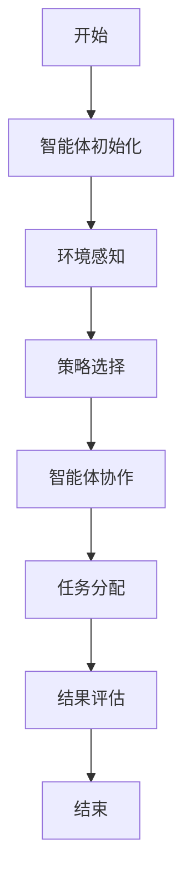
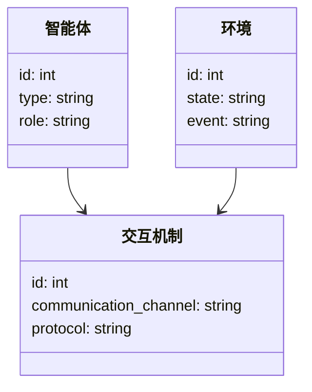
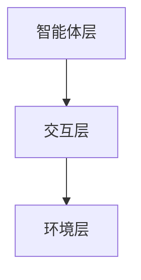
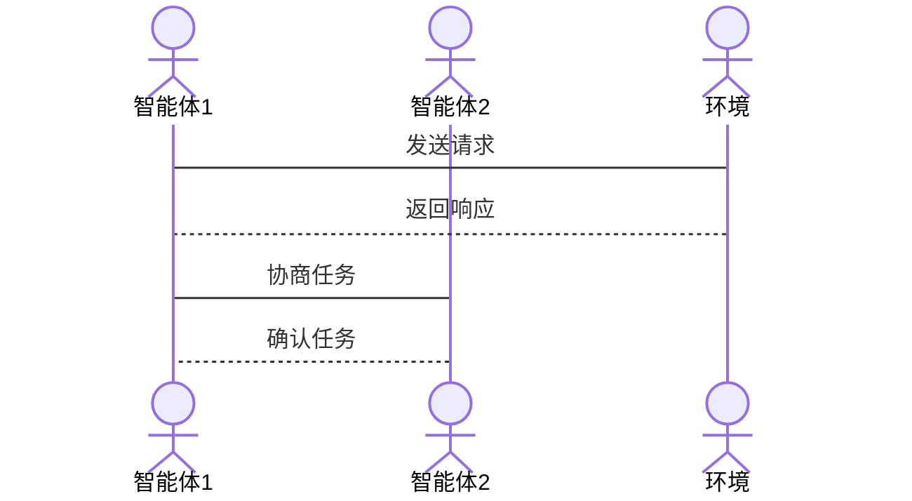

                 


# 多智能体系统在商业模式可持续性分析中的应用

> 关键词：多智能体系统，商业模式，可持续性分析，分布式计算，博弈论

> 摘要：随着全球经济的快速发展和环境问题的日益严重，商业模式的可持续性成为企业生存和发展的关键。多智能体系统（Multi-Agent System，MAS）作为一种新兴的分布式计算范式，为企业分析和优化商业模式提供了新的思路。本文将详细探讨多智能体系统在商业模式可持续性分析中的应用，从理论基础到实际案例，全面解析其优势、挑战及解决方案。通过本文的分析，读者将深入了解如何利用多智能体系统来构建可持续的商业模式，从而在激烈的市场竞争中占据优势。

---

## 第一部分: 多智能体系统与商业模式可持续性分析概述

### 第1章: 多智能体系统概述

#### 1.1 多智能体系统的定义与特点
多智能体系统（MAS）是由多个智能体（Agent）组成的分布式系统，每个智能体都是一个能够感知环境、自主决策并执行任务的实体。与传统的单智能体系统相比，MAS具有以下特点：
- **自主性**：每个智能体能够独立决策和行动。
- **反应性**：智能体能够实时感知环境变化并做出响应。
- **协作性**：智能体之间可以通过通信和协调共同完成复杂任务。
- **分布式性**：系统中的智能体分布在不同的位置，通过网络进行交互。

#### 1.2 商业模式可持续性分析的定义与重要性
商业模式是指企业如何创造、传递和获取价值的方式。可持续性商业模式不仅关注经济利益，还考虑环境和社会效益。商业模式的可持续性分析旨在评估其在长期运行中的稳定性和适应性，确保企业在实现经济目标的同时，减少对环境的负面影响，履行社会责任。

### 第2章: 多智能体系统在商业模式分析中的应用背景

#### 2.1 当前商业模式面临的挑战
随着全球化和科技的进步，商业模式面临诸多挑战：
- **环境变化对企业的影响**：气候变化、资源枯竭等问题迫使企业重新审视其商业模式。
- **技术进步的推动**：新技术（如人工智能、大数据）的应用要求商业模式更加灵活和高效。
- **用户需求的多样化**：消费者需求的变化对企业的产品和服务提出更高的要求。

#### 2.2 多智能体系统在商业模式分析中的优势
多智能体系统在商业模式分析中具有显著优势：
- **复杂问题的解决能力**：MAS能够处理多智能体之间的复杂交互，适用于分析涉及多个利益相关者的商业模式。
- **动态环境的适应性**：MAS能够实时感知环境变化并调整策略，适应市场波动。
- **多利益相关者的协调**：MAS通过智能体之间的协作，实现企业内部和外部利益相关者的有效协调。

### 第3章: 多智能体系统与商业模式可持续性分析的结合

#### 3.1 多智能体系统在商业模式分析中的核心概念
- **智能体的定义与角色**：智能体可以是企业的不同部门、供应商、消费者或其他利益相关者。
- **智能体之间的交互机制**：智能体之间通过通信和协商进行协作，共同优化商业模式。
- **智能体的环境感知与决策**：智能体能够实时感知市场环境并做出决策，确保商业模式的灵活性。

#### 3.2 多智能体系统在商业模式可持续性分析中的应用框架
- **商业模式分析的多智能体框架**：通过构建多个智能体，分别代表不同的利益相关者，模拟其交互和决策过程。
- **多智能体系统在商业模式优化中的作用**：通过智能体之间的协作，优化资源配置，提高商业模式的效率。
- **多智能体系统在商业模式风险评估中的应用**：通过模拟不同场景，评估商业模式在各种情况下的风险和应对策略。

---

## 第二部分: 多智能体系统的核心概念与联系

### 第4章: 多智能体系统的原理与核心概念

#### 4.1 多智能体系统的原理
多智能体系统的核心原理包括：
- **分布式计算**：系统中的智能体分布在网络中，通过通信进行协作。
- **协作与协调**：智能体之间通过协商和协调，共同完成任务。
- **博弈论模型**：智能体之间的交互可以用博弈论模型描述，分析其策略选择和收益分配。

#### 4.2 多智能体系统的核心概念
- **智能体的定义与分类**：智能体可以分为简单反应型智能体、基于模型的反射型智能体、目标驱动型智能体和效用驱动型智能体。
- **智能体之间的交互机制**：智能体之间的交互可以通过直接通信或通过中介进行。
- **智能体的环境感知与决策**：智能体通过传感器或数据源感知环境，并基于感知信息做出决策。

#### 4.3 多智能体系统的核心概念对比
以下是多智能体系统中几个核心概念的对比表：

| 概念         | 描述                                                         |
|--------------|--------------------------------------------------------------|
| 智能体       | 具有自主性、反应性和协作性的实体                           |
| 交互机制     | 智能体之间通过通信进行交互                                 |
| 环境感知      | 智能体通过传感器或数据源感知环境                           |

#### 4.4 多智能体系统的ER实体关系图
以下是多智能体系统的ER实体关系图：

```mermaid
er
actor 智能体 {
    id: int
    type: string
    role: string
}
actor 环境 {
    id: int
    state: string
    event: string
}
actor 交互机制 {
    id: int
    communication_channel: string
    protocol: string
}
```

### 第5章: 多智能体系统的算法原理

#### 5.1 多智能体系统的算法原理
多智能体系统的算法主要包括：
- **分布式计算算法**：用于智能体之间的协作和任务分配。
- **博弈论算法**：用于分析智能体之间的策略选择和收益分配。
- **协调与协作算法**：用于智能体之间的协商和任务分配。

#### 5.2 多智能体系统的博弈论模型
博弈论模型是多智能体系统分析中的重要工具，以下是纳什均衡的定义：

$$ 纳什均衡是指在所有参与人策略均为最优反应的情况下，任何参与人都无改进策略的余地。 $$

#### 5.3 多智能体系统的协调与协作算法
以下是多智能体系统的协调与协作算法的流程图：



---

## 第三部分: 系统分析与架构设计

### 第6章: 多智能体系统的系统分析

#### 6.1 系统分析概述
系统分析是多智能体系统设计的第一步，包括：
- **问题场景介绍**：描述系统需要解决的问题。
- **系统功能设计**：定义系统需要实现的功能。
- **系统架构设计**：设计系统的整体架构。

#### 6.2 系统功能设计
以下是系统功能设计的类图：



### 第7章: 多智能体系统的架构设计

#### 7.1 系统架构设计
以下是系统的分层架构图：



#### 7.2 系统接口设计
系统接口设计包括：
- **智能体接口**：定义智能体之间的通信接口。
- **环境接口**：定义智能体与环境之间的交互接口。

#### 7.3 系统交互流程
以下是系统交互流程的序列图：



---

## 第四部分: 项目实战

### 第8章: 项目实战

#### 8.1 环境配置
以下是项目环境配置：

```python
import os
import json
from agent import Agent
```

#### 8.2 核心代码实现
以下是核心代码实现：

```python
class Agent:
    def __init__(self, id, role):
        self.id = id
        self.role = role
        self.state = "idle"

    def感知环境(self, 环境状态):
        self.state = 环境状态

    def 决策(self):
        if self.role == "生产者":
            return "生产产品"
        elif self.role == "消费者":
            return "购买产品"

    def 交互(self, 另一个智能体):
        return self.决策()
```

#### 8.3 代码功能解读
- **感知环境**：智能体根据环境状态调整自身状态。
- **决策**：智能体根据自身角色做出决策。
- **交互**：智能体与另一个智能体进行交互，返回决策结果。

#### 8.4 实际案例分析
以下是电商平台的可持续性分析案例：

```python
电商平台 = [
    Agent(1, "生产者"),
    Agent(2, "消费者"),
    Agent(3, "物流")
]

环境 = {
    "状态": "正常"
}

for agent in 电商平台:
    agent.感知环境(环境["状态"])
    print(f"{agent.role}的状态：{agent.state}")
```

---

## 第五部分: 最佳实践与小结

### 第9章: 最佳实践

#### 9.1 小结
多智能体系统在商业模式可持续性分析中的应用具有显著优势，能够帮助企业优化资源配置、提高效率并降低风险。

#### 9.2 注意事项
- **智能体的设计**：智能体的设计需要考虑其角色和功能。
- **交互机制的选择**：选择合适的交互机制是系统设计的关键。
- **环境的动态变化**：系统需要能够适应环境的动态变化。

#### 9.3 拓展阅读
建议读者进一步阅读以下内容：
- 多智能体系统的分布式计算
- 博弈论在多智能体系统中的应用
- 多智能体系统的优化算法

---

# 结语

通过本文的分析，读者可以深入了解多智能体系统在商业模式可持续性分析中的应用。从理论基础到实际案例，我们全面探讨了其优势、挑战及解决方案。希望本文能够为企业优化商业模式、实现可持续发展提供有价值的参考。

