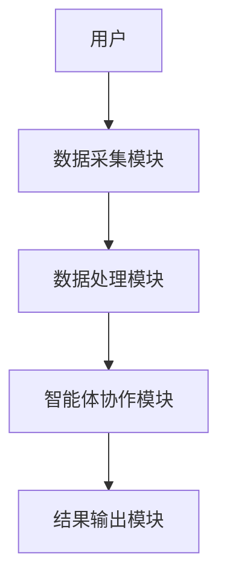
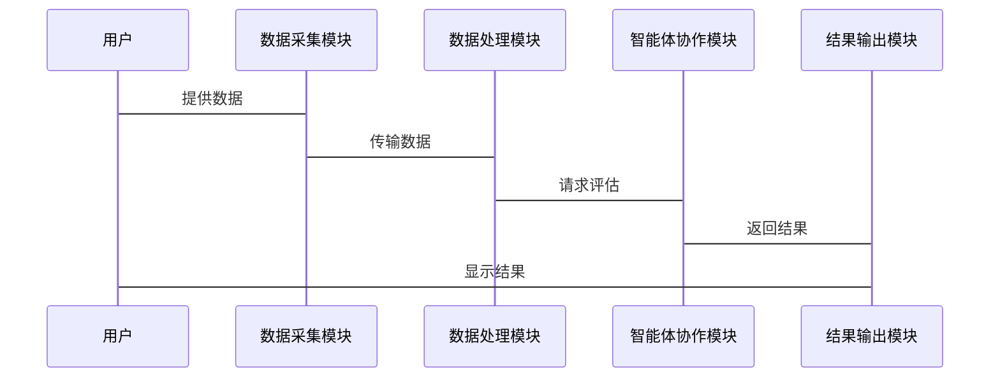

                 


# 多智能体系统在无形资产价值量化中的应用

> **关键词**：多智能体系统、无形资产、价值量化、协同学习、算法原理  
> **摘要**：多智能体系统（Multi-Agent System, MAS）是一种由多个智能体组成的分布式系统，能够通过协作完成复杂任务。本文探讨了MAS在无形资产价值量化中的应用，分析了其核心原理、算法实现及实际案例，揭示了MAS在提升无形资产价值评估准确性、效率和可解释性方面的重要作用。

---

## 第1章: 多智能体系统与无形资产概述

### 1.1 多智能体系统的基本概念

#### 1.1.1 多智能体系统的定义与特点
多智能体系统（MAS）是由多个智能体（Agent）组成的分布式系统，每个智能体都是一个能够感知环境、自主决策、执行任务的实体。MAS的特点包括：

1. **自主性**：智能体能够自主决策，无需外部干预。
2. **反应性**：智能体能够实时感知环境变化并做出响应。
3. **协作性**：多个智能体通过协作完成复杂任务。
4. **分布性**：智能体之间通过通信进行协作，不存在集中控制。

#### 1.1.2 多智能体系统的核心要素
多智能体系统的核心要素包括：

1. **智能体**：智能体是MAS的基本单元，具有感知、决策和执行能力。
2. **通信机制**：智能体之间通过通信机制进行信息交换。
3. **协作协议**：智能体之间的协作需要遵循特定的协议。
4. **环境模型**：智能体需要对环境进行建模，以便更好地理解环境并做出决策。

#### 1.1.3 多智能体系统的优势
多智能体系统的优势包括：

1. **分布式计算**：能够处理大规模数据和复杂任务。
2. **高容错性**：单个智能体故障不会导致整个系统崩溃。
3. **灵活性**：能够适应环境变化和任务需求的变化。

### 1.2 无形资产的定义与特征

#### 1.2.1 无形资产的定义
无形资产是指企业拥有或控制的，没有实物形态，能够为企业带来长期经济利益的资源。常见的无形资产包括专利权、商标权、商誉、品牌价值、技术秘密等。

#### 1.2.2 无形资产的主要类型
无形资产的主要类型包括：

1. **知识产权**：如专利权、商标权、著作权等。
2. **商誉**：企业因其良好的声誉和客户关系而产生的价值。
3. **品牌价值**：品牌在市场上的影响力和认知度。
4. **技术秘密**：企业独有的技术诀窍和工艺。
5. **客户关系**：企业与客户之间建立的长期关系。

#### 1.2.3 无形资产的价值影响因素
无形资产的价值受多种因素影响，包括：

1. **市场环境**：市场需求、竞争状况等。
2. **技术发展**：技术的先进性和成熟度。
3. **企业实力**：企业的财务状况、管理水平等。
4. **法律保护**：知识产权的法律保护力度。

### 1.3 多智能体系统在无形资产价值量化中的应用背景

#### 1.3.1 无形资产价值量化的重要性
无形资产是企业的重要资产，其价值往往占企业总价值的很大比重。准确评估无形资产的价值对于企业并购、融资、管理决策等具有重要意义。

#### 1.3.2 多智能体系统在无形资产价值量化中的优势
多智能体系统在无形资产价值量化中的优势包括：

1. **分布式计算能力**：能够处理大规模数据和复杂任务。
2. **协作能力**：多个智能体可以协同完成复杂的价值评估任务。
3. **动态适应性**：能够适应市场环境的变化，实时更新评估结果。

#### 1.3.3 当前研究现状与挑战
当前，多智能体系统在无形资产价值量化中的研究主要集中在以下几个方面：

1. **协同学习**：通过智能体之间的协作学习来提高评估准确性。
2. **动态评估**：基于MAS的动态评估方法，能够实时更新评估结果。
3. **多目标优化**：通过多目标优化算法，提高评估结果的全面性。

然而，MAS在无形资产价值量化中的应用也面临一些挑战，如智能体之间的通信效率、协作协议的设计、数据隐私保护等。

---

## 第2章: 多智能体系统的核心原理

### 2.1 多智能体系统的组成与结构

#### 2.1.1 智能体的定义与特征
智能体（Agent）是MAS的基本单元，具有以下特征：

1. **自主性**：智能体能够自主决策，无需外部干预。
2. **反应性**：智能体能够实时感知环境变化并做出响应。
3. **目标导向性**：智能体具有明确的目标，并能够采取行动实现目标。
4. **社会能力**：智能体能够与其他智能体或人类进行交互和协作。

#### 2.1.2 多智能体系统的层次结构
多智能体系统的层次结构通常包括以下层次：

1. **物理层**：包括硬件设备和物理环境。
2. **数据层**：包括数据采集、存储和管理。
3. **算法层**：包括智能体的算法实现和协作协议。
4. **应用层**：包括具体的应用场景和任务。

#### 2.1.3 智能体之间的通信与协作机制
智能体之间的通信与协作机制包括：

1. **直接通信**：智能体之间通过直接通信进行信息交换。
2. **间接通信**：通过中间媒介进行信息交换。
3. **协作协议**：智能体之间通过协作协议实现任务分配和协作。

### 2.2 多智能体系统的建模与分析

#### 2.2.1 多智能体系统建模的基本方法
多智能体系统建模的基本方法包括：

1. **基于状态的建模**：通过状态机描述智能体的行为。
2. **基于规则的建模**：通过预定义规则描述智能体的行为。
3. **基于目标的建模**：通过目标导向模型描述智能体的行为。

#### 2.2.2 多智能体系统的动态行为分析
多智能体系统的动态行为分析包括：

1. **行为预测**：预测智能体在特定环境下的行为。
2. **行为评估**：评估智能体行为的正确性和有效性。
3. **行为优化**：优化智能体的行为以提高系统的整体性能。

#### 2.2.3 多智能体系统的复杂性与可扩展性
多智能体系统的复杂性与可扩展性包括：

1. **复杂性**：系统中智能体数量越多，系统的复杂性越高。
2. **可扩展性**：系统能够扩展到更大的规模，同时保持性能。

---

## 第3章: 无形资产价值量化的方法与挑战

### 3.1 无形资产价值量化的基本方法

#### 3.1.1 市场法
市场法是通过比较类似资产的市场交易价格，来评估无形资产价值的方法。其步骤包括：

1. **数据收集**：收集类似资产的交易数据。
2. **数据分析**：分析数据，找出影响价格的主要因素。
3. **价值评估**：根据分析结果，评估无形资产的价值。

#### 3.1.2 收益法
收益法是通过预测无形资产带来的未来收益，来评估其价值的方法。其步骤包括：

1. **收益预测**：预测无形资产在未来带来的收益。
2. **贴现率确定**：确定合适的贴现率。
3. **价值评估**：根据收益和贴现率，计算无形资产的价值。

#### 3.1.3 成本法
成本法是通过估算开发无形资产所需的成本，来评估其价值的方法。其步骤包括：

1. **成本估算**：估算开发无形资产所需的成本。
2. **调整因素**：考虑成本之外的其他因素，如市场风险、技术风险等。
3. **价值评估**：根据成本和调整因素，评估无形资产的价值。

### 3.2 多智能体系统在无形资产价值量化中的应用

#### 3.2.1 多智能体系统在无形资产价值量化中的优势
多智能体系统在无形资产价值量化中的优势包括：

1. **分布式计算**：能够处理大规模数据和复杂任务。
2. **协作能力**：多个智能体可以协同完成复杂的价值评估任务。
3. **动态适应性**：能够适应市场环境的变化，实时更新评估结果。

#### 3.2.2 多智能体系统在无形资产价值量化中的应用场景
多智能体系统在无形资产价值量化中的应用场景包括：

1. **企业并购评估**：通过MAS评估目标企业的无形资产价值。
2. **知识产权保护**：通过MAS保护企业的知识产权。
3. **品牌价值评估**：通过MAS评估企业的品牌价值。

#### 3.2.3 多智能体系统在无形资产价值量化中的实现流程
多智能体系统在无形资产价值量化中的实现流程包括：

1. **数据采集**：采集相关数据，如市场数据、企业数据等。
2. **数据处理**：对数据进行清洗、转换和分析。
3. **智能体协作**：多个智能体协同完成价值评估任务。
4. **结果输出**：输出评估结果，并进行分析和解释。

---

## 第4章: 多智能体系统在无形资产价值量化中的算法原理

### 4.1 基于多智能体的无形资产价值评估算法

#### 4.1.1 算法的基本原理
基于多智能体的无形资产价值评估算法的基本原理包括：

1. **智能体协作**：多个智能体协同完成评估任务。
2. **分布式计算**：通过分布式计算提高评估效率。
3. **动态适应**：根据环境变化动态调整评估策略。

#### 4.1.2 算法的实现步骤
算法的实现步骤包括：

1. **数据采集**：采集相关数据，如市场数据、企业数据等。
2. **数据预处理**：对数据进行清洗、转换和分析。
3. **智能体协作**：多个智能体协同完成评估任务。
4. **结果输出**：输出评估结果，并进行分析和解释。

#### 4.1.3 算法的数学模型与公式
算法的数学模型与公式包括：

$$
\text{价值} = \sum_{i=1}^{n} w_i \cdot x_i
$$

其中，\( w_i \) 是权重，\( x_i \) 是影响价值的因素。

### 4.2 多智能体系统中的协同学习算法

#### 4.2.1 协同学习的基本概念
协同学习是通过多个智能体协作学习，提高学习效果的一种方法。

#### 4.2.2 协同学习在多智能体系统中的应用
协同学习在多智能体系统中的应用包括：

1. **分布式学习**：通过分布式学习提高学习效率。
2. **协作决策**：通过协作决策提高决策的准确性。

#### 4.2.3 协同学习算法的数学模型与公式
协同学习算法的数学模型与公式包括：

$$
\text{最终结果} = \sum_{i=1}^{n} \text{智能体}_i(\text{输入})
$$

---

## 第5章: 无形资产价值量化中的系统架构设计

### 5.1 问题场景介绍
在企业并购中，准确评估目标企业的无形资产价值是至关重要的。传统的评估方法往往依赖于少量数据和简单模型，难以应对复杂多变的市场环境。

### 5.2 系统功能设计
系统功能设计包括：

1. **数据采集模块**：采集相关数据，如市场数据、企业数据等。
2. **数据处理模块**：对数据进行清洗、转换和分析。
3. **智能体协作模块**：多个智能体协同完成评估任务。
4. **结果输出模块**：输出评估结果，并进行分析和解释。

### 5.3 系统架构设计

#### 5.3.1 系统架构图


#### 5.3.2 系统交互序列图


---

## 第6章: 项目实战

### 6.1 环境安装
安装必要的软件和库，如Python、NumPy、Pandas、Matplotlib等。

### 6.2 系统核心实现源代码

```python
class Agent:
    def __init__(self, id, goal):
        self.id = id
        self.goal = goal
        self.current_state = None

    def感知(self, 环境):
        self.current_state = 环境.获取状态()

    def 决策(self):
        pass

    def 执行(self, action):
        pass

class MultiAgentSystem:
    def __init__(self, agents):
        self.agents = agents

    def 运行(self):
        for agent in self.agents:
            agent.感知(环境)
            agent.决策()
            agent.执行()
```

### 6.3 代码应用解读与分析
代码实现了一个简单的多智能体系统，包括智能体类和多智能体系统类。智能体类具有感知、决策和执行方法，多智能体系统类负责协调多个智能体的运行。

### 6.4 实际案例分析和详细讲解剖析
通过具体案例，如企业并购中的无形资产价值评估，展示MAS的实际应用效果。

### 6.5 项目小结
总结项目实现的关键点和经验教训，提出改进建议。

---

## 第7章: 总结与展望

### 7.1 最佳实践 tips
- 在MAS设计中，注意智能体之间的通信效率和协作协议的设计。
- 在无形资产价值量化中，结合多智能体系统的分布式计算能力和协作能力。

### 7.2 小结
本文系统地探讨了MAS在无形资产价值量化中的应用，分析了其核心原理、算法实现及实际案例。

### 7.3 未来展望
未来，MAS在无形资产价值量化中的应用将更加广泛，特别是在动态环境下的实时评估和多目标优化方面。

### 7.4 拓展阅读
推荐相关领域的书籍和论文，供读者进一步学习。

---

**结语**  
通过本文的探讨，读者可以全面了解MAS在无形资产价值量化中的应用，掌握其核心原理和实际应用方法，为后续的研究和实践提供有益的参考。

