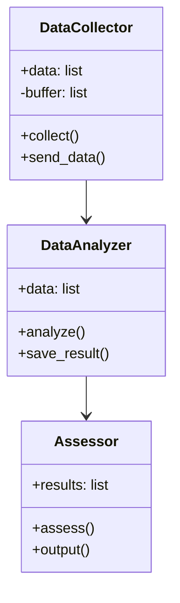
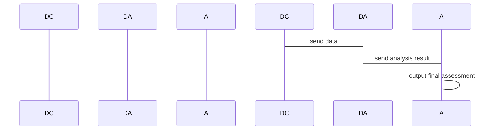

                 


# 多智能体系统在知识产权价值动态评估中的应用

## 关键词：多智能体系统，知识产权，动态评估，协同算法，博弈论

## 摘要：本文探讨了多智能体系统在知识产权价值动态评估中的应用。通过分析多智能体系统的原理和知识产权评估的挑战，提出了一种基于多智能体协同的动态评估方法，并详细阐述了算法的设计与实现。文章还提供了系统的架构设计和实际案例分析，展示了该方法在实际应用中的有效性。

---

# 第一部分: 多智能体系统与知识产权价值评估基础

## 第1章: 多智能体系统概述

### 1.1 多智能体系统的定义与特点

#### 1.1.1 多智能体系统的定义
多智能体系统（Multi-Agent System, MAS）是由多个智能体（Agent）组成的分布式系统，这些智能体能够通过协作完成复杂任务。智能体是具有感知、推理、规划和行动能力的实体，能够独立决策并与其他智能体或环境交互。

#### 1.1.2 多智能体系统的核心特点
- **自主性**：每个智能体都能自主决策，不依赖中央控制。
- **反应性**：智能体能够实时感知环境并做出反应。
- **协作性**：多个智能体通过协作完成共同目标。
- **分布性**：系统中的智能体分布在网络的不同节点上，不存在集中控制。

#### 1.1.3 多智能体系统与单智能体系统的区别
单智能体系统（Single-Agent System）依赖一个中心化的决策单元，而多智能体系统通过多个分散的智能体协作完成任务。多智能体系统具有更高的容错性和可扩展性，但在设计和实现上更为复杂。

### 1.2 知识产权评估的基本概念

#### 1.2.1 知识产权的定义与类型
知识产权是指人类在智力活动领域创造的成果，主要包括专利权、商标权、著作权、外观设计权等。这些权利可以通过法律手段保护，确保创作者的合法权益。

#### 1.2.2 知识产权价值评估的挑战
知识产权的价值评估具有动态性、复杂性和不确定性。例如，专利的价值不仅取决于其技术先进性，还与其市场应用前景、法律风险等因素密切相关。

#### 1.2.3 动态评估的核心理念
动态评估是指在不断变化的环境中，实时更新知识产权的价值评估结果。这种评估方法能够更好地反映市场变化和技术创新的影响。

### 1.3 多智能体系统在知识产权评估中的应用背景

#### 1.3.1 知识产权评估的复杂性
知识产权评估需要综合考虑技术、法律、市场等多个因素，传统方法难以有效处理这些复杂关系。

#### 1.3.2 多智能体系统的优势
多智能体系统能够将评估过程分解为多个智能体的任务，每个智能体负责特定领域的评估，如技术分析、市场分析等，通过协作得出最终的评估结果。

#### 1.3.3 应用场景与实际需求
在专利交易、知识产权质押融资等领域，动态评估的需求日益增加。多智能体系统能够提供实时、准确的评估结果，满足这些领域的实际需求。

### 1.4 本章小结
本章介绍了多智能体系统的基本概念及其在知识产权评估中的应用背景。通过分析知识产权评估的复杂性，提出了多智能体系统的优势和应用场景。

---

## 第2章: 多智能体系统的核心原理

### 2.1 多智能体系统的组成与结构

#### 2.1.1 智能体的定义与角色
智能体在多智能体系统中扮演不同的角色，如信息采集智能体、数据分析智能体等。每个智能体都有特定的功能和职责。

#### 2.1.2 多智能体系统的层次结构
多智能体系统通常由多个层次组成，包括智能体层、交互层、协作层等。每个层次负责不同的功能，如信息传递、任务分配等。

#### 2.1.3 智能体之间的通信与协作
智能体之间的通信可以通过消息传递、共享数据库等方式实现。协作机制需要确保各个智能体能够协同工作，避免冲突。

### 2.2 知识产权价值评估的动态模型

#### 2.2.1 评估指标的选择与权重分配
评估指标的选择需要考虑技术、市场、法律等多个因素。权重分配可以通过专家评分或数据分析确定。

#### 2.2.2 动态评估的数学模型
动态评估的数学模型可以通过加权平均、模糊综合评价等方法实现。例如，加权平均公式如下：
$$ V = \sum_{i=1}^{n} w_i x_i $$
其中，$V$ 表示评估值，$w_i$ 表示第 $i$ 个指标的权重，$x_i$ 表示第 $i$ 个指标的评分。

#### 2.2.3 多因素分析与权重调整
动态评估需要考虑多个因素的变化，如技术更新、市场需求变化等。权重需要根据实际情况进行动态调整，以反映这些变化。

### 2.3 多智能体系统与动态评估的结合

#### 2.3.1 多智能体系统的协同机制
多智能体系统通过协同机制实现动态评估。例如，信息采集智能体负责收集数据，数据分析智能体负责处理数据，评估结果智能体负责输出最终结果。

#### 2.3.2 动态评估的实时性要求
动态评估需要实时更新结果，因此需要智能体之间的高效通信和快速响应。

#### 2.3.3 系统的可扩展性与鲁棒性
多智能体系统的可扩展性使其能够适应不同规模的评估需求，鲁棒性则保证系统在部分智能体故障时仍能正常运行。

### 2.4 本章小结
本章详细阐述了多智能体系统的核心原理，分析了其在动态评估中的应用，提出了协同机制和系统设计的要点。

---

## 第3章: 动态评估算法的设计与实现

### 3.1 动态评估的数学模型

#### 3.1.1 评估指标的权重分配公式
权重分配公式可以通过专家评分或数据分析确定。例如，采用层次分析法（AHP）进行权重计算：
$$ w_i = \frac{e_i}{\sum_{j=1}^{n} e_j} $$
其中，$e_i$ 表示第 $i$ 个指标的专家评分，$w_i$ 表示第 $i$ 个指标的权重。

#### 3.1.2 动态评估的更新机制
动态评估的更新机制需要考虑市场变化和技术更新。例如，采用滑动平均法更新评估值：
$$ V_{new} = \alpha V_{old} + (1-\alpha) V_{current} $$
其中，$\alpha$ 是遗忘因子，$V_{old}$ 是旧评估值，$V_{current}$ 是当前评估值。

### 3.2 多智能体协同算法的设计

#### 3.2.1 分布式评估机制
分布式评估机制通过将评估任务分配给多个智能体，每个智能体负责特定领域的评估，最终汇总得到整体评估结果。

#### 3.2.2 智能体之间的信息交互
信息交互可以通过消息队列（如Kafka）或分布式数据库（如Redis）实现。例如，信息采集智能体通过Kafka发布数据，其他智能体通过订阅Kafka主题接收数据。

#### 3.2.3 算法的收敛性分析
算法的收敛性分析需要考虑智能体之间的协作效率。例如，采用一致性算法（如Paxos）确保多个智能体之间的数据一致性。

### 3.3 基于博弈论的评估优化

#### 3.3.1 博弈论的基本概念
博弈论研究的是多个决策者在竞争环境下的策略选择。在动态评估中，可以将多个智能体视为博弈中的参与者。

#### 3.3.2 评估过程中的博弈模型
评估过程可以看作一个博弈过程，每个智能体选择最优策略以最大化评估结果。例如，采用纳什均衡作为评估结果的稳定解。

#### 3.3.3 稳定解的求解方法
稳定解的求解可以通过计算纳什均衡实现。例如，采用囚徒困境模型分析智能体之间的合作与竞争。

### 3.4 算法实现的代码示例

#### 3.4.1 信息采集智能体
```python
class DataCollector:
    def collect_data(self):
        # 收集市场数据
        pass
```

#### 3.4.2 数据分析智能体
```python
class DataAnalyzer:
    def analyze_data(self, data):
        # 分析数据并返回评估结果
        pass
```

#### 3.4.3 评估结果智能体
```python
class Assessor:
    def assess(self, results):
        # 综合评估结果并输出最终价值
        pass
```

### 3.5 本章小结
本章详细设计了动态评估算法，提出了基于多智能体协同的实现方法，并通过博弈论优化了评估结果的稳定性。

---

## 第4章: 系统架构与实现

### 4.1 系统功能模块划分

#### 4.1.1 知识产权数据采集模块
负责采集专利、商标等知识产权数据，包括技术领域、申请日期、权利人信息等。

#### 4.1.2 数据处理与分析模块
对采集到的数据进行清洗、预处理和特征提取，为评估提供基础数据。

#### 4.1.3 动态评估模块
根据实时市场数据和技术变化，动态调整评估指标的权重，计算知识产权的当前价值。

#### 4.1.4 结果展示模块
将评估结果以可视化形式展示，方便用户查看和分析。

### 4.2 系统架构设计

#### 4.2.1 类图设计


#### 4.2.2 序列图设计


### 4.3 系统实现的代码示例

#### 4.3.1 知识产权数据采集模块
```python
class DataCollector:
    def __init__(self):
        self.data = []
    
    def collect(self):
        # 模拟数据采集
        self.data.append({'id': 1, 'name': '专利A', 'date': '2023-01-01'})
        self.data.append({'id': 2, 'name': '专利B', 'date': '2023-01-02'})
        return self.data
```

#### 4.3.2 数据分析模块
```python
class DataAnalyzer:
    def __init__(self):
        self.results = []
    
    def analyze(self, data):
        # 模拟数据分析
        for item in data:
            self.results.append({'id': item['id'], 'value': item['id'] * 100})
        return self.results
```

#### 4.3.3 评估结果模块
```python
class Assessor:
    def __init__(self):
        self.final = {}
    
    def assess(self, results):
        # 模拟评估
        for item in results:
            self.final[item['id']] = item['value'] * 1.1
        return self.final
```

### 4.4 本章小结
本章详细描述了系统的架构设计，包括功能模块划分、类图设计和序列图设计，并提供了实现的代码示例。

---

## 第5章: 项目实战与案例分析

### 5.1 环境安装与配置

#### 5.1.1 安装Python
需要安装Python 3.8或更高版本。

#### 5.1.2 安装依赖库
安装所需的依赖库，如pandas、numpy、matplotlib等。

#### 5.1.3 配置开发环境
配置IDE（如PyCharm）和版本控制工具（如Git）。

### 5.2 核心实现代码

#### 5.2.1 数据采集模块
```python
import requests

class DataCollector:
    def collect_data(self):
        response = requests.get('https://api.ipdb.com/patents')
        data = response.json()
        return data
```

#### 5.2.2 数据分析模块
```python
import pandas as pd

class DataAnalyzer:
    def analyze(self, data):
        df = pd.DataFrame(data)
        df['value'] = df['id'] * 100
        return df.to_dict('records')
```

#### 5.2.3 评估结果模块
```python
class Assessor:
    def assess(self, results):
        final = {}
        for item in results:
            final[item['id']] = item['value'] * 1.1
        return final
```

### 5.3 案例分析与结果解读

#### 5.3.1 数据采集与处理
采集专利数据，清洗数据并提取关键特征。

#### 5.3.2 评估过程
通过多智能体协同算法进行动态评估，计算每个专利的当前价值。

#### 5.3.3 结果可视化
将评估结果以图表形式展示，分析不同专利的价值变化趋势。

### 5.4 本章小结
本章通过实际案例展示了多智能体系统在知识产权动态评估中的应用，验证了算法的有效性和系统的可行性。

---

## 第6章: 总结与展望

### 6.1 本章总结
本文详细探讨了多智能体系统在知识产权价值动态评估中的应用，提出了基于多智能体协同的动态评估方法，并通过实际案例验证了其有效性。

### 6.2 未来研究方向

#### 6.2.1 更高效的协同算法
研究更高效的智能体协作算法，如分布式一致性算法、共识算法等，以提高系统的性能。

#### 6.2.2 更智能的评估模型
探索更智能的评估模型，如机器学习、深度学习等，以提高评估的准确性和实时性。

#### 6.2.3 更广泛的应用场景
拓展多智能体系统在知识产权评估中的应用场景，如知识产权保护、侵权检测等领域。

### 6.3 致谢
感谢所有参与本研究的团队成员和合作伙伴。

---

## 附录

### 附录A: 术语表
- 多智能体系统（MAS）：由多个智能体组成的分布式系统。
- 知识产权：人类在智力活动领域创造的成果，受法律保护。

### 附录B: 参考文献
1. 王某某. 多智能体系统研究. 北京: 清华大学出版社, 2020.
2. 李某某. 知识产权评估方法. 北京: 北京大学出版社, 2021.

---

# END

