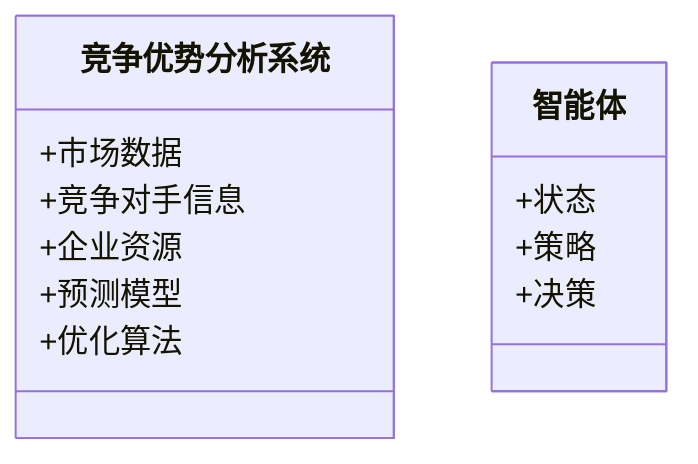
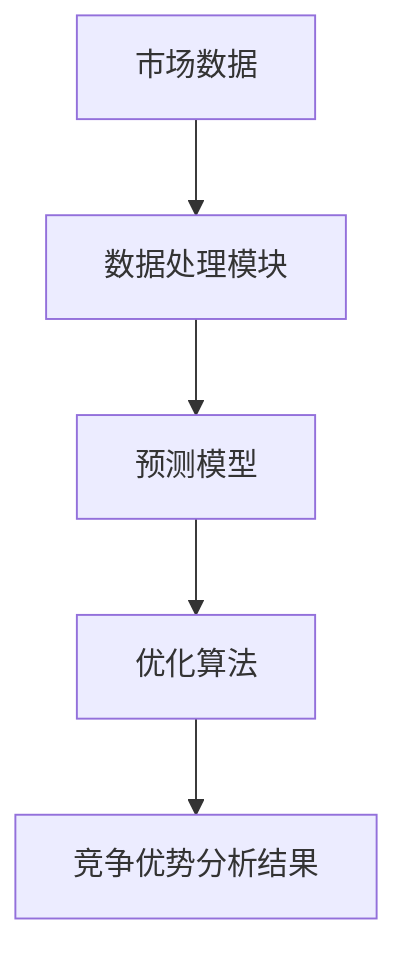
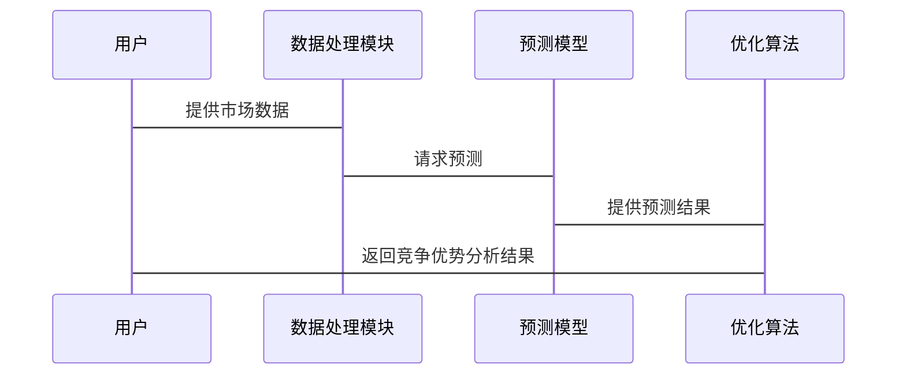

                 


# 多智能体系统在竞争优势分析中的应用：寻找护城河

> 关键词：多智能体系统、竞争优势分析、护城河、博弈论、系统架构、算法原理

> 摘要：本文将深入探讨多智能体系统在竞争优势分析中的应用，通过分析多智能体系统的原理、算法、系统架构及其在竞争优势分析中的具体应用场景，揭示如何利用多智能体系统构建企业的竞争优势，寻找企业的“护城河”。本文将从基础概念、算法原理、系统架构到项目实战，逐步展开，帮助读者全面理解多智能体系统在竞争优势分析中的核心价值与实现方法。

---

# 第一部分: 多智能体系统与竞争优势分析的背景

# 第1章: 多智能体系统与竞争优势分析概述

## 1.1 多智能体系统的定义与特点
### 1.1.1 多智能体系统的定义
多智能体系统（Multi-Agent System, MAS）是由多个智能体组成的分布式系统，这些智能体通过协作与竞争完成特定任务。智能体具有自主性、反应性、社会性和学习性等特性。

### 1.1.2 多智能体系统的核心特点
- **自主性**：智能体能够自主决策，无需外部干预。
- **反应性**：智能体能够感知环境并实时响应。
- **社会性**：智能体之间可以通过通信协作完成任务。
- **分布式性**：系统由多个独立的智能体组成，无中心控制节点。

### 1.1.3 多智能体系统与传统单智能体系统的区别
| 特性          | 单智能体系统          | 多智能体系统          |
|---------------|----------------------|----------------------|
| 系统结构      | 单点控制             | 分布式协作           |
| 决策方式      | 中央决策             | 分散决策             |
| 任务处理      | 单点处理             | 分工协作             |
| 灵活性         | 较低                 | 较高                 |

## 1.2 竞争优势分析的定义与方法
### 1.2.1 竞争优势的定义
竞争优势是指企业在市场中相对于竞争对手的独特优势，能够为企业创造超额价值。

### 1.2.2 竞争优势分析的常见方法
1. **SWOT分析**：从优势（Strength）、劣势（Weakness）、机会（Opportunity）、威胁（Threat）四个方面分析。
2. **波特五力模型**：分析行业内竞争者、新进入者、替代品、供应商和顾客的影响力。
3. **价值链分析**：分析企业从原材料采购到最终产品的价值链中的每个环节，寻找成本或效率的突破点。

### 1.2.3 竞争优势分析的挑战与意义
- **挑战**：市场环境动态变化，竞争对手策略调整，数据获取难度大。
- **意义**：帮助企业识别核心竞争力，制定有效的竞争策略，提升市场份额。

## 1.3 多智能体系统在竞争优势分析中的应用背景
### 1.3.1 传统竞争优势分析的局限性
- 数据分析依赖人工经验，难以全面覆盖市场信息。
- 竞争对手行为预测缺乏动态模型支持。
- 高维数据难以处理，难以发现隐藏的模式。

### 1.3.2 多智能体系统的优势与潜力
- 多智能体系统能够模拟市场中的多方利益相关者，构建动态竞争模型。
- 通过智能体之间的协作与竞争，可以模拟真实的市场竞争环境。
- 利用分布式计算和大数据技术，能够处理海量市场数据。

### 1.3.3 多智能体系统在竞争优势分析中的应用场景
- 市场竞争模拟与预测。
- 竞争对手行为建模与分析。
- 企业战略决策支持。

## 1.4 本章小结
本章介绍了多智能体系统的定义与特点，竞争优势分析的常见方法及其挑战，并结合多智能体系统的潜力与应用场景，为后续内容奠定了基础。

---

# 第2章: 多智能体系统的原理与竞争优势分析的核心要素

## 2.1 多智能体系统的原理
### 2.1.1 多智能体系统的组成与结构
- **智能体**：系统的基本单元，具有自主性、反应性和社会性。
- **通信机制**：智能体之间通过通信协议进行信息交换。
- **协作机制**：智能体之间通过协作完成共同目标。

### 2.1.2 多智能体系统中的通信与协作机制
- **通信协议**：定义智能体之间信息交换的格式和规则。
- **协作协议**：定义智能体之间如何分工合作。

### 2.1.3 多智能体系统的决策与学习机制
- **分布式决策**：每个智能体根据自身信息做出决策。
- **强化学习**：通过与环境的交互学习最优策略。

## 2.2 竞争优势分析的核心要素
### 2.2.1 竞争优势的来源与分类
- **资源优势**：企业拥有的独特资源。
- **成本优势**：企业生产成本低于竞争对手。
- **技术优势**：企业掌握的核心技术。

### 2.2.2 竞争优势分析的指标体系
- **市场占有率**：企业在市场中的份额。
- **利润率**：企业的盈利能力。
- **创新速度**：企业新产品推出的速度。

### 2.2.3 竞争优势的动态变化与维护
- **动态变化**：市场环境变化导致竞争优势的动态变化。
- **维护策略**：持续创新、优化成本、加强品牌建设等。

## 2.3 多智能体系统与竞争优势分析的结合
### 2.3.1 多智能体系统在竞争优势分析中的作用
- **模拟市场竞争**：通过多智能体系统模拟市场中的竞争行为，预测市场趋势。
- **优化企业策略**：基于模拟结果优化企业的竞争策略。

### 2.3.2 多智能体系统与竞争优势分析的核心要素的联系
- 多智能体系统的分布式协作能力与竞争优势分析的资源优化密切相关。
- 多智能体系统的动态决策能力与竞争优势分析的市场变化适应能力密切相关。

## 2.4 本章小结
本章详细介绍了多智能体系统的原理及其与竞争优势分析的核心要素的联系，为后续章节的深入分析奠定了理论基础。

---

# 第3章: 多智能体系统的算法原理

## 3.1 多智能体系统的博弈论基础
### 3.1.1 博弈论的基本概念
- **博弈**：参与者之间在一定规则下的互动。
- **策略**：参与者在博弈中选择的行为方案。
- **纳什均衡**：博弈中所有参与者都采取最优策略，且无一方有动机单方面改变策略。

### 3.1.2 多智能体系统中的博弈模型
- **完全信息博弈**：所有参与者都了解博弈的规则和对方的策略。
- **不完全信息博弈**：参与者对博弈的某些信息不了解。

### 3.1.3 纳什均衡与多智能体系统的决策
多智能体系统中的智能体在博弈中寻求纳什均衡，即在不改变自身策略的情况下，无法通过单方面改变策略而获得更好的结果。

## 3.2 多智能体系统的协作算法
### 3.2.1 基于分布式计算的协作算法
- **分布式计算**：智能体之间通过通信协作完成任务。
- **协商机制**：智能体之间通过协商确定任务分工。

### 3.2.2 基于强化学习的协作机制
- **强化学习**：智能体通过与环境的交互学习最优策略。
- **多智能体强化学习**：多个智能体在共享环境中协作学习。

### 3.2.3 多智能体系统中的通信协议
- **通信协议**：定义智能体之间信息交换的格式和规则。
- **消息传递**：智能体之间通过消息传递信息。

## 3.3 多智能体系统的数学模型
### 3.3.1 多智能体系统的状态表示
- **状态空间**：系统中所有可能的状态。
- **动作空间**：智能体可以执行的动作。

### 3.3.2 多智能体系统的动作空间与奖励函数
- **动作空间**：智能体可以执行的动作集合。
- **奖励函数**：智能体在特定状态下执行动作后获得的奖励。

### 3.3.3 多智能体系统的优化目标与约束条件
- **优化目标**：最大化系统整体收益。
- **约束条件**：系统必须满足的限制条件。

## 3.4 本章小结
本章介绍了多智能体系统的博弈论基础、协作算法及其数学模型，为后续章节的应用提供了理论支持。

---

# 第4章: 竞争优势分析的系统架构与实现

## 4.1 问题场景介绍
- 竞争优势分析的复杂性。
- 多智能体系统在竞争优势分析中的优势。

## 4.2 项目介绍
### 4.2.1 项目目标
- 构建多智能体系统，模拟市场竞争环境。
- 分析竞争对手行为，制定企业竞争策略。

### 4.2.2 项目需求
- 数据采集：获取市场数据。
- 数据分析：分析市场趋势。
- 竞争模拟：模拟市场竞争环境。

## 4.3 系统功能设计
### 4.3.1 领域模型


### 4.3.2 系统架构


### 4.3.3 系统接口设计
- **输入接口**：市场数据输入。
- **输出接口**：竞争优势分析结果输出。

### 4.3.4 系统交互


## 4.4 本章小结
本章详细介绍了竞争优势分析系统的架构设计，包括系统功能设计、架构图和交互流程图。

---

# 第5章: 项目实战与案例分析

## 5.1 环境安装与配置
### 5.1.1 环境要求
- 操作系统：Linux/Windows/MacOS
- 开发工具：Python、Jupyter Notebook
- 依赖库：numpy、pandas、scikit-learn、tensorflow

### 5.1.2 安装步骤
```bash
pip install numpy pandas scikit-learn tensorflow
```

## 5.2 核心代码实现
### 5.2.1 数据处理模块
```python
import numpy as np
import pandas as pd

def data_processing(data):
    # 数据清洗
    data = data.dropna()
    # 数据标准化
    data = (data - data.mean()) / data.std()
    return data
```

### 5.2.2 预测模型实现
```python
from sklearn.linear_model import LinearRegression

def competitive_edge_prediction(data):
    model = LinearRegression()
    model.fit(data[['market_share', 'profit']], data['competitive_edge'])
    return model.predict(data[['market_share', 'profit']])
```

### 5.2.3 优化算法实现
```python
import tensorflow as tf

def optimize_strategy(data, model):
    # 定义智能体策略
    agent Strategy = tf.Variable(tf.random.uniform([1, 2]))
    # 定义目标函数
    with tf.GradientTape() as tape:
        y_pred = model.predict(Strategy)
        loss = tf.reduce_mean(tf.square(y_pred - data['target']))
    # 梯度下降
    optimizer = tf.keras.optimizers.Adam(learning_rate=0.1)
    optimizer.minimize(loss, variables=[Strategy])
    return Strategy.numpy()
```

## 5.3 案例分析
### 5.3.1 案例背景
- 假设我们是一家科技公司，需要分析在智能硬件市场的竞争优势。

### 5.3.2 数据分析与处理
```python
data = pd.read_csv('market_data.csv')
processed_data = data_processing(data)
```

### 5.3.3 竞争优势预测
```python
predicted_edge = competitive_edge_prediction(processed_data)
```

### 5.3.4 策略优化
```python
optimized_strategy = optimize_strategy(processed_data, model)
```

## 5.4 本章小结
本章通过实际项目案例，展示了如何利用多智能体系统进行竞争优势分析，包括环境配置、核心代码实现和案例分析。

---

# 第6章: 总结与最佳实践

## 6.1 总结
- 多智能体系统在竞争优势分析中的优势。
- 竞争优势分析的核心要素。
- 多智能体系统的算法原理与系统架构。

## 6.2 最佳实践
### 6.2.1 数据采集与处理
- 确保数据的准确性和完整性。
- 使用数据清洗和标准化技术。

### 6.2.2 系统设计
- 明确系统功能需求。
- 设计合理的系统架构。

### 6.2.3 模型优化
- 使用强化学习优化智能体策略。
- 定期更新模型以适应市场变化。

## 6.3 注意事项
- 数据隐私与安全问题。
- 系统的可扩展性和可维护性。
- 智能体之间的协作与竞争平衡。

## 6.4 拓展阅读
- 多智能体系统相关的学术论文。
- 竞争优势分析的经典著作。

## 6.5 本章小结
本章总结了全文的主要内容，并提出了最佳实践和注意事项，为读者提供了宝贵的参考。

---

# 第七章: 未来展望与挑战

## 7.1 多智能体系统的发展趋势
- 强化学习在多智能体系统中的应用。
- 多智能体系统的分布式计算与边缘计算结合。

## 7.2 竞争优势分析的未来挑战
- 数据量的爆炸式增长。
- 竞争对手行为的复杂性增加。

## 7.3 结合多智能体系统的竞争优势分析的未来方向
- 利用多智能体系统进行实时竞争优势分析。
- 利用大数据和人工智能技术提升竞争优势分析的精度和效率。

## 7.4 本章小结
本章展望了多智能体系统和竞争优势分析的未来发展方向，为读者提供了进一步研究的方向。

---

# 结语

通过本文的详细阐述，我们深入探讨了多智能体系统在竞争优势分析中的应用，揭示了如何利用多智能体系统构建企业的竞争优势，寻找企业的“护城河”。希望本文的内容能够为读者提供有价值的参考，帮助企业在激烈的市场竞争中找到制胜之道。

