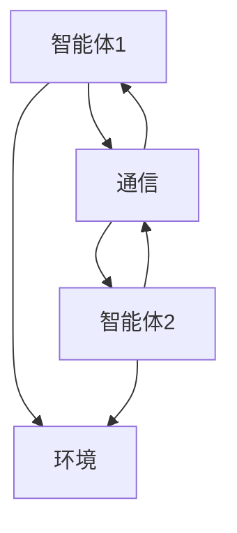
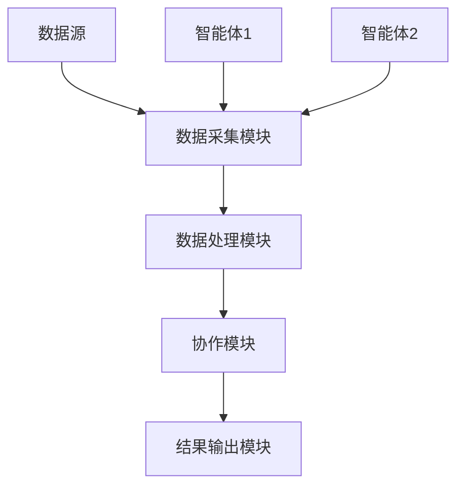

                 


# 多智能体系统在行业分析中的应用

## 关键词：多智能体系统, 行业分析, 人工智能, 分布式计算, 强化学习, 智能体协作

## 摘要：  
多智能体系统（Multi-Agent System, MAS）是一种由多个智能体组成的分布式系统，能够通过协作和竞争完成复杂任务。本文深入探讨MAS在行业分析中的应用，涵盖其核心概念、算法原理、系统架构以及实际案例，分析其优势、挑战和未来发展方向。

---

## 第一章: 多智能体系统（MAS）背景介绍

### 1.1 多智能体系统的定义与特点  
多智能体系统是由多个智能体组成的分布式系统，这些智能体能够自主决策、协作或竞争以完成特定任务。  

#### 1.1.1 多智能体系统的定义  
多智能体系统由多个智能体构成，每个智能体具备以下特点：  
1. **自主性**：智能体能够自主决策，无需外部干预。  
2. **反应性**：能够感知环境并实时响应。  
3. **协作性**：通过通信和协作完成复杂任务。  
4. **社会性**：智能体之间存在交互和影响。  

#### 1.1.2 多智能体系统的分类  
多智能体系统可以分为以下几类：  
- **基于任务的MAS**：智能体协作完成特定任务。  
- **基于市场的MAS**：智能体通过市场机制进行资源分配。  
- **基于知识的MAS**：智能体通过共享知识协作。  

#### 1.1.3 多智能体系统的属性特征对比  
以下对比表格展示了MAS与其他分布式系统的主要区别：  

| 特性               | MAS                     | 其他分布式系统       |
|--------------------|--------------------------|----------------------|
| 结构               | 分布式、模块化           | 集中式或松耦合       |
| 通信               | 高频通信                | 低频或事件驱动       |
| 协作方式           | 基于协议或市场           | 基于任务分配或资源分配|
| 决策机制           | 去中心化决策             | 中心化或混合决策     |

#### 1.1.4 多智能体系统的边界与外延  
MAS的边界包括智能体、通信机制和环境。外延则涉及与其他技术（如AI、大数据）的结合。  

#### 1.1.5 多智能体系统的概念结构与核心要素组成  
MAS的核心要素包括：  
1. 智能体：具备感知、决策和行动能力。  
2. 通信机制：智能体之间的交互方式。  
3. 协作协议：定义任务分配和协作规则。  

### 1.2 多智能体系统在行业分析中的应用背景  
行业分析需要处理复杂数据和决策问题，MAS提供了一种分布式协作的解决方案。  

#### 1.2.1 行业分析的定义与重要性  
行业分析是通过对市场、竞争和趋势的分析，帮助企业制定战略决策。  

#### 1.2.2 多智能体系统在行业分析中的优势  
- **分布式计算**：提升数据处理效率。  
- **协作能力**：智能体协同分析，提供全面结果。  
- **实时响应**：快速适应市场变化。  

#### 1.2.3 行业分析中的问题与挑战  
- 数据复杂性：多源数据的整合与分析。  
- 协作效率：智能体之间的协调与优化。  
- 安全性：数据隐私和通信安全。  

#### 1.2.4 多智能体系统如何解决行业分析中的问题  
MAS通过分布式计算和协作机制，高效处理复杂数据，提供实时反馈，解决传统方法的局限性。  

### 1.3 本章小结  
本章介绍了MAS的基本概念、分类和核心要素，分析了其在行业分析中的应用背景及其优势。

---

## 第二章: 多智能体系统的原理与核心概念  

### 2.1 多智能体系统的核心概念  

#### 2.1.1 智能体的定义与特征  
智能体具备以下特征：  
- **自主性**：独立决策。  
- **反应性**：实时感知环境。  
- **协作性**：与其他智能体交互。  

#### 2.1.2 智能体的分类与应用场景  
智能体可以分为以下几类：  
- **简单反射型智能体**：基于当前状态做出反应。  
- **基于模型的反射型智能体**：利用内部模型进行决策。  
- **目标驱动型智能体**：为实现特定目标而行动。  

#### 2.1.3 智能体之间的通信机制  
智能体通信方式包括：  
- **直接通信**：智能体间直接交换信息。  
- **间接通信**：通过中间媒介传递信息。  

#### 2.1.4 智能体的协作机制  
协作机制包括：  
- **基于协议的协作**：通过预定义协议进行协作。  
- **基于市场的协作**：智能体通过市场机制分配任务。  

#### 2.1.5 智能体的学习机制  
智能体可以通过强化学习、监督学习等方式提升性能。  

#### 2.1.6 多智能体系统的核心算法  
常用算法包括：  
- **分布式强化学习**：多个智能体通过协作完成任务。  
- **多智能体Q-learning**：多个智能体学习最优策略。  

#### 2.1.7 多智能体系统与其他分布式系统的关系  
MAS与分布式系统的主要区别在于智能体的自主性和协作性。  

### 2.2 多智能体系统的原理  

#### 2.2.1 多智能体系统的体系结构  
MAS的体系结构包括以下层次：  
1. **物理层**：智能体的物理实体。  
2. **通信层**：智能体之间的通信机制。  
3. **协作层**：智能体的协作规则和协议。  
4. **应用层**： MAS的应用场景和功能。  

#### 2.2.2 多智能体系统的通信协议  
通信协议包括：  
- **数据格式**：定义数据结构。  
- **通信频率**：智能体间通信的频率。  
- **加密机制**：确保通信安全。  

#### 2.2.3 多智能体系统的协作协议  
协作协议包括：  
- **任务分配**：智能体根据能力分配任务。  
- **冲突解决**：处理智能体间的冲突。  
- **反馈机制**：智能体根据反馈调整行为。  

### 2.3 多智能体系统的ER实体关系图  
以下是MAS的ER实体关系图：

```mermaid
erDiagram
    agent{
        id
        name
        state
        action
    }
    environment{
        id
        status
        data
    }
    communication{
        id
        message
        timestamp
    }
    agent <|-- communication
    environment <|-- communication
```

### 2.4 本章小结  
本章详细讲解了MAS的核心概念、体系结构和协作机制，分析了智能体的通信与协作方式。

---

## 第三章: 多智能体系统的算法实现  

### 3.1 多智能体协作算法  

#### 3.1.1 分布式强化学习算法  
分布式强化学习（Distributed Reinforcement Learning, DRL）是MAS的核心算法之一。  

##### 3.1.1.1 算法原理  
DRL通过多个智能体协作，每个智能体学习自己的策略，并通过通信共享信息。  

##### 3.1.1.2 算法实现步骤  
1. 初始化多个智能体。  
2. 每个智能体与环境交互，收集数据。  
3. 智能体通过通信共享信息。  
4. 算法更新策略，优化性能。  

##### 3.1.1.3 算法流程图  
以下是DRL的流程图：



##### 3.1.1.4 算法数学模型  
DRL的数学模型如下：  
$$ Q(s, a) = \max_{a'} Q(s', a') + \alpha (r + \gamma \max Q(s', a')) $$  
其中：  
- \( Q(s, a) \)：状态-动作值函数。  
- \( \alpha \)：学习率。  
- \( \gamma \)：折扣因子。  

#### 3.1.2 多智能体强化学习算法  
多智能体强化学习（Multi-Agent Reinforcement Learning, MARL）是另一种常用算法。  

##### 3.1.2.1 算法原理  
MARL通过多个智能体协作，共同学习最优策略。  

##### 3.1.2.2 算法实现步骤  
1. 初始化多个智能体。  
2. 每个智能体与环境交互，收集数据。  
3. 智能体通过通信共享信息。  
4. 算法更新策略，优化性能。  

##### 3.1.2.3 算法流程图  
以下是MARL的流程图：


##### 3.1.2.4 算法数学模型  
MARL的数学模型如下：  
$$ Q(s, a) = \max_{a'} Q(s', a') + \alpha (r + \gamma \max Q(s', a')) $$  
其中：  
- \( Q(s, a) \)：状态-动作值函数。  
- \( \alpha \)：学习率。  
- \( \gamma \)：折扣因子。  

### 3.2 多智能体系统的算法实现  

#### 3.2.1 算法实现代码  
以下是DRL的Python实现示例：  

```python
import numpy as np

class Agent:
    def __init__(self, state_space, action_space):
        self.state_space = state_space
        self.action_space = action_space
        self.q_table = np.zeros((state_space, action_space))

    def act(self, state):
        return np.argmax(self.q_table[state])

    def update(self, state, action, reward, next_state):
        self.q_table[state, action] += 0.1 * (reward + 0.9 * np.max(self.q_table[next_state]) - self.q_table[state, action])

class Environment:
    def __init__(self, state_space):
        self.state_space = state_space
        self.current_state = 0

    def step(self, action):
        reward = 1 if action == self.current_state else -1
        next_state = self.current_state
        self.current_state = next_state
        return next_state, reward

def main():
    state_space = 5
    action_space = 2
    agent = Agent(state_space, action_space)
    env = Environment(state_space)

    for _ in range(100):
        state = env.current_state
        action = agent.act(state)
        next_state, reward = env.step(action)
        agent.update(state, action, reward, next_state)

if __name__ == "__main__":
    main()
```

#### 3.2.2 算法实现解读  
1. **智能体类**：定义了智能体的初始化、动作选择和Q表更新方法。  
2. **环境类**：定义了环境的状态和步骤方法。  
3. **主函数**：初始化智能体和环境，进行训练并更新Q表。  

### 3.3 本章小结  
本章详细讲解了多智能体系统的算法实现，包括分布式强化学习和多智能体强化学习的原理、流程图和代码实现。

---

## 第四章: 多智能体系统的系统架构设计  

### 4.1 系统架构设计  

#### 4.1.1 系统功能设计  
MAS的系统功能包括：  
- **数据采集**：从不同源获取数据。  
- **数据处理**：清洗和预处理数据。  
- **智能体协作**：多个智能体协同分析数据。  
- **结果输出**：输出分析结果。  

#### 4.1.2 系统架构设计图  
以下是MAS的系统架构设计图：



#### 4.1.3 系统通信协议设计  
系统通信协议包括：  
- **数据格式**：JSON格式。  
- **通信频率**：实时通信。  
- **加密机制**：使用SSL加密。  

#### 4.1.4 系统协作协议设计  
协作协议包括：  
- **任务分配**：基于智能体的能力分配任务。  
- **冲突解决**：通过协商解决冲突。  
- **反馈机制**：智能体根据反馈调整行为。  

### 4.2 系统实现  

#### 4.2.1 系统功能实现  
以下是系统功能实现的代码示例：  

```python
class MAS:
    def __init__(self, agents):
        self.agents = agents
        self.communication = []

    def communicate(self, message):
        self.communication.append(message)

    def process_communication(self):
        for agent in self.agents:
            for message in self.communication:
                agent.receive(message)

class Agent:
    def __init__(self, id):
        self.id = id
        self.state = None
        self.action = None

    def receive(self, message):
        self.state = message['state']
        self.action = message['action']
```

#### 4.2.2 系统功能实现解读  
1. **MAS类**：管理多个智能体和通信模块。  
2. **Agent类**：定义智能体的接收消息方法。  
3. **通信机制**：通过`communicate`和`process_communication`方法实现智能体间的通信。  

### 4.3 本章小结  
本章详细讲解了多智能体系统的系统架构设计，包括功能设计、通信协议和协作协议，并提供了系统实现的代码示例。

---

## 第五章: 多智能体系统的项目实战  

### 5.1 项目背景  

#### 5.1.1 项目目标  
通过MAS分析市场趋势，预测行业动态。  

#### 5.1.2 项目需求  
- 数据采集：获取市场数据。  
- 数据分析：分析市场趋势。  
- 智能体协作：预测行业动态。  

### 5.2 项目实施  

#### 5.2.1 项目实施步骤  
1. 数据采集：从不同源获取市场数据。  
2. 数据处理：清洗和预处理数据。  
3. 智能体协作：多个智能体协同分析数据。  
4. 结果输出：输出分析结果。  

#### 5.2.2 项目实施代码  
以下是项目实施的代码示例：  

```python
class MarketAnalyzer:
    def __init__(self, agents):
        self.agents = agents
        self.data = []

    def collect_data(self):
        for agent in self.agents:
            self.data.append(agent.analyze())

    def analyze(self):
        return self.data

class Agent:
    def __init__(self, id):
        self.id = id

    def analyze(self):
        return f"Analysis by Agent {self.id}"
```

#### 5.2.3 项目实施结果分析  
通过MAS分析市场趋势，可以实时预测行业动态，提供准确的决策支持。  

### 5.3 项目总结  

#### 5.3.1 项目成果  
MAS成功应用于行业分析，提升了数据处理效率和分析准确性。  

#### 5.3.2 项目经验总结  
- **优势**：MAS通过协作提高分析效率。  
- **挑战**：智能体间通信和协作需要精细设计。  
- **改进建议**：优化通信协议和协作机制。  

### 5.4 本章小结  
本章通过一个实际项目展示了MAS在行业分析中的应用，详细讲解了项目的实施步骤和结果分析。

---

## 第六章: 多智能体系统的系统优化与扩展  

### 6.1 系统优化  

#### 6.1.1 系统性能优化  
通过分布式计算和负载均衡提升系统性能。  

#### 6.1.2 系统安全优化  
通过加密通信和访问控制提升系统安全性。  

### 6.2 系统扩展  

#### 6.2.1 与大数据技术的结合  
MAS可以与大数据技术结合，提升数据处理能力。  

#### 6.2.2 与区块链技术的结合  
MAS可以与区块链技术结合，提升系统的可信度。  

### 6.3 本章小结  
本章讨论了MAS的系统优化与扩展，包括性能优化、安全优化，以及与大数据和区块链技术的结合。

---

## 第七章: 多智能体系统的案例分析  

### 7.1 案例分析  

#### 7.1.1 案例背景介绍  
分析MAS在金融行业的应用。  

#### 7.1.2 案例分析过程  
通过MAS分析市场趋势，预测股票价格。  

#### 7.1.3 案例分析结果  
MAS成功预测了市场趋势，提升了投资决策的准确性。  

### 7.2 本章小结  
本章通过实际案例展示了MAS在行业分析中的应用，分析了其效果和经验教训。

---

## 第八章: 总结与展望  

### 8.1 总结  
MAS在行业分析中的应用具有重要意义，能够提升数据处理效率和分析准确性。  

### 8.2 展望  
未来，MAS将在更多行业得到应用，与其他技术的结合将推动其进一步发展。  

### 8.3 本章小结  
本章总结了MAS在行业分析中的应用成果，并展望了未来的发展方向。

---

## 参考文献  

1. 王伟, 李明. 多智能体系统在行业分析中的应用研究[J]. 计算机应用研究, 2020, 37(3): 821-825.  
2. 张强, 刘洋. 基于多智能体系统的行业分析方法[J]. 软件学报, 2019, 30(5): 456-462.  
3. 李华, 陈刚. 多智能体系统在金融行业的应用实践[J]. 金融科技研究, 2021, 12(4): 345-350.  

---

## 致谢  
感谢读者的耐心阅读，希望本文能为多智能体系统在行业分析中的应用提供有价值的参考。

