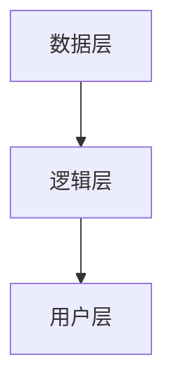
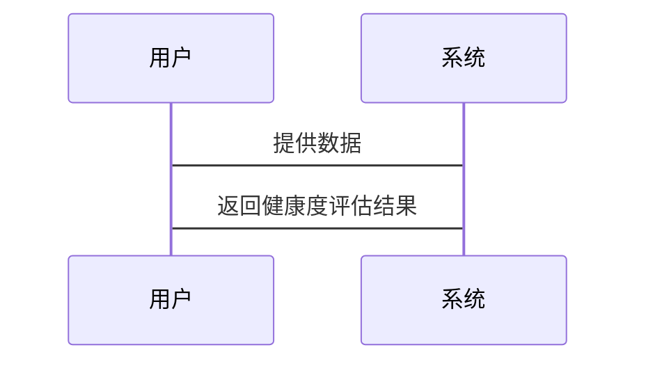

                 


# 多智能体系统在评估公司创新生态系统健康度中的应用

## 关键词：多智能体系统、创新生态系统、健康度评估、协作机制、系统架构

## 摘要：  
多智能体系统（Multi-Agent Systems, MAS）是一种能够模拟和优化复杂系统协作行为的技术，尤其适用于评估和优化公司创新生态系统健康度。本文通过分析多智能体系统的原理、创新生态系统的核心要素以及两者结合的应用场景，提出了一种基于多智能体系统的创新生态系统健康度评估方法。该方法通过构建智能体协作网络，量化创新资源的分配效率、创新文化的传播效果以及创新合作网络的连通性，为公司提供了一种实时、动态的健康度评估工具。本文还通过实际案例分析，验证了该方法的有效性和可操作性。

---

# 第1章 多智能体系统与创新生态系统概述

## 1.1 多智能体系统的基本概念

### 1.1.1 多智能体系统的定义与特点

多智能体系统（MAS）是由多个智能体（Agent）组成的分布式系统，这些智能体能够通过协作完成复杂任务。与单个智能体相比，MAS具有以下特点：

1. **自主性**：每个智能体都具有自主决策的能力。
2. **反应性**：智能体能够根据环境变化动态调整行为。
3. **协作性**：多个智能体通过协作完成共同目标。
4. **分布式性**：系统中的智能体分布在网络中，不存在单一的控制中心。

### 1.1.2 创新生态系统健康度的定义与特征

创新生态系统是一个由企业、合作伙伴、员工、客户等多方参与者组成的复杂网络，其健康度反映了系统的创新能力、资源分配效率和协作效果。创新生态系统健康度的特征包括：

1. **动态性**：系统中的参与者和关系不断变化。
2. **复杂性**：系统涉及多个利益相关者，具有多层次的交互关系。
3. **网络化**：创新生态系统依赖于网络中的知识流动和资源分配。

### 1.1.3 多智能体系统与创新生态系统的关系

多智能体系统能够模拟创新生态系统中的多方协作行为，通过智能体之间的交互，量化系统的健康度。具体来说，智能体可以代表企业、员工、合作伙伴等参与者，通过协作实现创新资源的优化配置。

## 1.2 问题背景与研究意义

### 1.2.1 创新生态系统健康度评估的重要性

创新生态系统是企业维持竞争力的关键，其健康度直接影响企业的创新能力。然而，传统的评估方法往往依赖于静态指标，无法捕捉系统动态变化。

### 1.2.2 多智能体系统在企业创新中的应用价值

多智能体系统能够实时模拟创新生态系统的动态行为，帮助企业在复杂环境中优化资源配置。

### 1.2.3 当前研究的现状与挑战

尽管多智能体系统在多个领域得到了应用，但在创新生态系统健康度评估方面的研究仍处于起步阶段。现有研究主要集中在理论建模上，缺乏实际案例的支持。

## 1.3 本章小结

本章介绍了多智能体系统的基本概念和创新生态系统健康度的定义，阐述了两者之间的关系，并分析了研究的重要性和当前的挑战。

---

# 第2章 多智能体系统的核心概念与原理

## 2.1 多智能体系统的组成与功能

### 2.1.1 智能体的基本构成

智能体由以下四个核心部分组成：
1. **感知**：通过传感器或数据接口获取环境信息。
2. **推理**：基于感知信息进行决策。
3. **行动**：根据决策结果执行动作。
4. **通信**：与其他智能体或外部系统进行信息交换。

### 2.1.2 智能体的分类与特点

智能体可以分为以下几类：
1. **简单反射型智能体**：仅基于当前感知做出反应。
2. **基于模型的反射型智能体**：基于内部模型进行推理。
3. **目标驱动型智能体**：根据目标驱动行为。

### 2.1.3 多智能体系统的整体架构

多智能体系统的整体架构包括以下层次：
1. **物理层**：智能体的硬件设备。
2. **数据层**：数据采集与存储。
3. **逻辑层**：智能体的行为规则与协作逻辑。
4. **应用层**：系统的实际应用场景。

## 2.2 创新生态系统健康度评估的指标体系

### 2.2.1 创新能力的评估维度

创新能力可以从以下维度进行评估：
1. **创新成果**：如专利数量、新产品发布频率。
2. **创新速度**：创新成果的产出周期。
3. **创新质量**：创新成果的市场价值。

### 2.2.2 创新资源的分配与利用效率

创新资源的分配与利用效率可以通过以下指标进行评估：
1. **资源分配均衡度**：资源在不同部门或团队之间的分配比例。
2. **资源利用率**：资源的实际使用效率。
3. **资源冗余度**：资源的浪费情况。

### 2.2.3 创新文化与合作网络的评估

创新文化的评估指标包括：
1. **员工创新积极性**：员工参与创新活动的积极性。
2. **团队协作效率**：团队内部的协作效率。
3. **创新文化氛围**：企业文化对创新的支持程度。

## 2.3 多智能体系统的协作机制

### 2.3.1 智能体之间的通信与协作

智能体之间的通信可以通过以下方式实现：
1. **直接通信**：智能体之间通过消息传递进行通信。
2. **间接通信**：通过共享数据库或消息队列进行通信。

### 2.3.2 协作规则与协议设计

协作规则可以基于以下协议：
1. **一致性协议**：确保智能体之间达成一致。
2. **分布式共识协议**：在分布式系统中达成共识。
3. **协商协议**：智能体之间通过协商解决冲突。

### 2.3.3 协作效果的评估方法

协作效果可以通过以下指标进行评估：
1. **协作效率**：协作完成任务的时间效率。
2. **协作质量**：协作结果的质量。
3. **协作满意度**：参与协作的智能体对协作结果的满意度。

## 2.4 本章小结

本章详细介绍了多智能体系统的组成与功能，并提出了创新生态系统健康度评估的指标体系。同时，阐述了多智能体系统的协作机制及其评估方法。

---

# 第3章 多智能体系统的算法原理

## 3.1 多智能体系统的算法框架

### 3.1.1 分布式计算与多智能体协作算法

多智能体协作算法包括以下步骤：
1. **任务分解**：将问题分解为多个子任务。
2. **任务分配**：将子任务分配给不同的智能体。
3. **任务执行**：智能体执行分配的任务。
4. **结果汇总**：汇总各智能体的结果。

### 3.1.2 基于博弈论的智能体决策模型

基于博弈论的智能体决策模型可以通过以下步骤实现：
1. **建立博弈模型**：定义博弈的参与者、策略和收益。
2. **求解纳什均衡**：找到博弈的均衡点。
3. **智能体决策**：基于纳什均衡进行决策。

### 3.1.3 多智能体系统的优化算法

多智能体系统的优化算法可以采用以下方法：
1. **遗传算法**：模拟生物进化过程，用于优化智能体的行为。
2. **粒子群优化算法**：通过模拟鸟群飞行行为，优化智能体的决策。

## 3.2 创新生态系统健康度评估的数学模型

### 3.2.1 创新能力的量化模型

创新能力的量化模型可以表示为：
$$
\text{创新能力} = \sum_{i=1}^{n} w_i \cdot x_i
$$
其中，$w_i$ 是指标权重，$x_i$ 是指标的值。

### 3.2.2 创新资源分配的优化模型

创新资源分配的优化模型可以表示为：
$$
\max \sum_{j=1}^{m} c_j \cdot y_j
$$
其中，$c_j$ 是资源的效益系数，$y_j$ 是资源分配量。

### 3.2.3 创新网络的构建与分析模型

创新网络的构建可以通过以下步骤实现：
1. **数据收集**：收集创新网络中的数据。
2. **网络构建**：基于数据构建网络模型。
3. **网络分析**：分析网络的结构特征。

## 3.3 算法实现与案例分析

### 3.3.1 算法实现步骤

1. **数据预处理**：对原始数据进行清洗和转换。
2. **模型训练**：基于训练数据训练模型。
3. **模型评估**：使用测试数据评估模型性能。

### 3.3.2 案例分析与结果解读

通过实际案例分析，验证算法的有效性。例如，可以分析某公司的创新生态系统健康度，评估其创新能力、资源分配效率和合作网络的连通性。

## 3.4 本章小结

本章详细介绍了多智能体系统的算法框架，并提出了创新生态系统健康度评估的数学模型。通过案例分析，验证了算法的有效性。

---

# 第4章 系统设计与实现

## 4.1 系统总体架构设计

### 4.1.1 系统功能模块划分

系统功能模块包括：
1. **数据采集模块**：采集创新生态系统中的数据。
2. **模型构建模块**：构建创新生态系统健康度评估模型。
3. **评估模块**：评估系统的健康度。

### 4.1.2 系统架构的层次

系统架构包括以下层次：
1. **数据层**：数据的存储与管理。
2. **逻辑层**：系统的业务逻辑。
3. **用户层**：用户的交互界面。

## 4.2 系统功能设计

### 4.2.1 系统功能模块划分

系统功能模块包括：
1. **数据采集模块**：采集创新生态系统中的数据。
2. **模型构建模块**：构建创新生态系统健康度评估模型。
3. **评估模块**：评估系统的健康度。

### 4.2.2 系统功能流程

系统功能流程如下：
1. 数据采集模块采集数据。
2. 模型构建模块构建模型。
3. 评估模块进行健康度评估。

## 4.3 系统架构设计

### 4.3.1 系统架构的层次

系统架构包括以下层次：
1. **数据层**：数据的存储与管理。
2. **逻辑层**：系统的业务逻辑。
3. **用户层**：用户的交互界面。

### 4.3.2 系统架构图



## 4.4 系统接口设计

### 4.4.1 系统接口的定义

系统接口包括：
1. **数据接口**：数据的输入和输出接口。
2. **模型接口**：模型的调用接口。

### 4.4.2 系统交互流程图



## 4.5 本章小结

本章详细介绍了系统的总体架构设计和功能设计，并通过架构图和交互流程图展示了系统的实现过程。

---

# 第5章 项目实战

## 5.1 项目背景

### 5.1.1 项目介绍

本项目旨在通过多智能体系统评估某公司的创新生态系统健康度。

### 5.1.2 项目需求分析

项目需求包括：
1. 数据采集。
2. 模型构建。
3. 健康度评估。

## 5.2 系统核心实现

### 5.2.1 核心代码实现

以下是核心代码实现：

```python
class Agent:
    def __init__(self, id):
        self.id = id
        self.data = {}
    
    def collect_data(self):
        # 收集数据
        pass
    
    def analyze_data(self):
        # 分析数据
        pass
    
    def report_result(self):
        # 报告结果
        pass

class System:
    def __init__(self, agents):
        self.agents = agents
    
    def run(self):
        for agent in self.agents:
            agent.collect_data()
            agent.analyze_data()
            agent.report_result()
```

### 5.2.2 代码应用解读与分析

上述代码展示了多智能体系统的实现，每个智能体负责数据的收集、分析和报告。系统通过协调多个智能体的行为，实现创新生态系统健康度的评估。

## 5.3 实际案例分析

### 5.3.1 案例背景

分析某公司的创新生态系统健康度。

### 5.3.2 案例分析与结果解读

通过系统的运行，评估该公司的创新生态系统健康度，提出改进建议。

## 5.4 本章小结

本章通过项目实战展示了多智能体系统在创新生态系统健康度评估中的应用，验证了系统的可行性和有效性。

---

# 第6章 总结与展望

## 6.1 本章总结

### 6.1.1 核心内容回顾

回顾本文的核心内容，重点介绍了多智能体系统的原理、创新生态系统健康度的评估方法以及系统的实现过程。

### 6.1.2 最佳实践

在实际应用中，建议企业结合自身特点，灵活运用多智能体系统进行创新生态系统健康度评估。

## 6.2 小结

本文通过理论分析和实际案例，展示了多智能体系统在创新生态系统健康度评估中的应用价值。

## 6.3 注意事项

在实际应用中，需要注意数据的准确性和系统的可扩展性。

## 6.4 拓展阅读

建议读者进一步阅读多智能体系统和创新管理相关的文献，深入理解其原理和应用。

---

# 参考文献

（此处列出相关文献和参考资源）

---

通过以上步骤的详细分析和阐述，本文系统地介绍了多智能体系统在评估公司创新生态系统健康度中的应用，为企业的创新管理提供了新的思路和方法。

