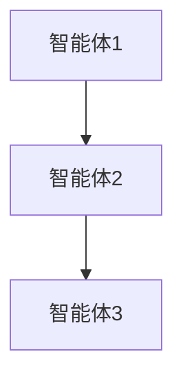
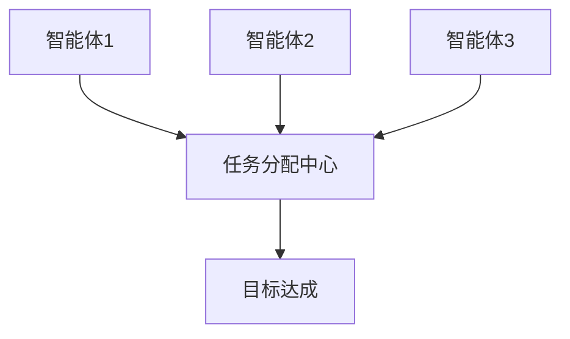
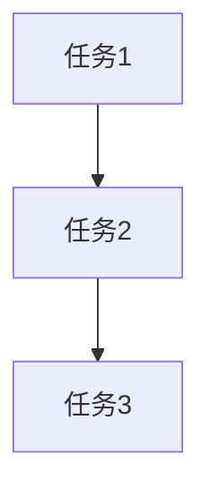
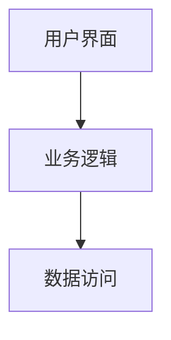
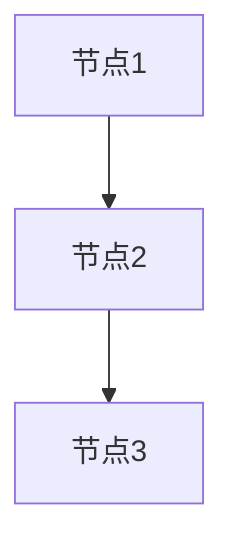

                 


```markdown
# 多智能体系统在评估公司创新能力和研发效率中的应用

> 关键词：多智能体系统、创新能力评估、研发效率、协作算法、系统架构

> 摘要：本文探讨了多智能体系统在评估公司创新能力和研发效率中的应用。通过分析多智能体系统的核心概念、算法原理和系统架构，展示了如何利用多智能体系统来优化公司创新能力和研发效率的评估过程。

---

## 第1章: 多智能体系统概述

### 1.1 多智能体系统的基本概念
#### 1.1.1 多智能体系统的定义
多智能体系统（Multi-Agent System, MAS）是由多个智能体（Agent）组成的系统，这些智能体能够通过协作完成复杂任务。

#### 1.1.2 多智能体系统的特征
- **自主性**：智能体能够自主决策。
- **反应性**：能够实时感知环境并做出反应。
- **协作性**：多个智能体可以协作完成任务。
- **分布性**：智能体分布在不同的位置，通过通信协作。

#### 1.1.3 多智能体系统与单智能体系统的区别
| 特性          | 单智能体系统             | 多智能体系统             |
|---------------|--------------------------|--------------------------|
| 系统复杂度    | 较低                     | 较高                     |
| 协作性        | 无                     | 有                     |
| 分布性        | 集中                     | 分布                     |

### 1.2 多智能体系统的应用场景
#### 1.2.1 分布式计算
- **特点**：任务分解到多个智能体，提高计算效率。
- **例子**：分布式数据库中的数据分片处理。

#### 1.2.2 协作式问题求解
- **特点**：多个智能体协作解决问题。
- **例子**：供应链管理中的库存优化。

#### 1.2.3 组织行为模拟
- **特点**：模拟组织内部的行为。
- **例子**：企业战略决策模拟。

### 1.3 本章小结
本章介绍了多智能体系统的基本概念和应用场景，为后续内容打下基础。

---

## 第2章: 多智能体系统的核心概念

### 2.1 多智能体系统的组成要素
#### 2.1.1 智能体
- **定义**：具有感知和决策能力的实体。
- **类型**：简单反射型、基于模型的反射型、目标驱动型、效用驱动型。

#### 2.1.2 环境
- **定义**：智能体所处的环境。
- **类型**：静态环境、动态环境、对抗环境。

#### 2.1.3 目标
- **定义**：智能体需要完成的任务。
- **类型**：简单目标、复合目标。

### 2.2 多智能体系统的通信机制
#### 2.2.1 通信协议
- **定义**：智能体之间通信的规则。
- **类型**：同步通信、异步通信。

#### 2.2.2 信息交换方式
- **定义**：智能体之间交换信息的方式。
- **类型**：基于消息的通信、基于状态的通信。

#### 2.2.3 通信模型
- **定义**：描述智能体之间通信的模型。
- **示例**：使用Mermaid图表示通信模型：



### 2.3 多智能体系统的协作机制
#### 2.3.1 协作协议
- **定义**：智能体之间协作的协议。
- **类型**：基于规则的协作、基于意图的协作。

#### 2.3.2 协作策略
- **定义**：智能体协作时采取的策略。
- **类型**：自私策略、合作策略、混合策略。

#### 2.3.3 协作模型
- **定义**：描述智能体协作过程的模型。
- **示例**：使用Mermaid图表示协作模型：



### 2.4 本章小结
本章详细介绍了多智能体系统的核心概念，包括组成要素、通信机制和协作机制。

---

## 第3章: 多智能体系统的算法原理

### 3.1 多智能体协作算法
#### 3.1.1 基于DAG的协作机制
- **定义**：DAG（有向无环图）用于表示协作任务的依赖关系。
- **步骤**：
  1. 任务分解为子任务。
  2. 构建DAG表示任务依赖。
  3. 智能体协作完成任务。
- **示例**：使用Mermaid图表示DAG协作流程：



#### 3.1.2 基于图模型的协作算法
- **定义**：使用图模型表示协作关系。
- **步骤**：
  1. 构建协作图。
  2. 分配任务给智能体。
  3. 监控协作过程。

#### 3.1.3 分层协作策略
- **定义**：将协作任务分成不同层次。
- **步骤**：
  1. 高层智能体分配任务。
  2. 低层智能体执行任务。
  3. 反馈结果给高层智能体。

### 3.2 多智能体通信协议
#### 3.2.1 基于消息传递的通信协议
- **定义**：通过消息传递信息。
- **步骤**：
  1. 发送消息。
  2. 接收消息。
  3. 处理消息。

#### 3.2.2 基于状态同步的通信协议
- **定义**：同步智能体的状态。
- **步骤**：
  1. 获取当前状态。
  2. 同步状态。
  3. 更新状态。

#### 3.2.3 基于事件驱动的通信协议
- **定义**：通过事件驱动通信。
- **步骤**：
  1. 监听事件。
  2. 发布事件。
  3. 处理事件。

### 3.3 多智能体系统的数学模型
#### 3.3.1 智能体行为模型
- **定义**：描述智能体行为的模型。
- **数学表达式**：$Behavior = f(State, Action)$。

#### 3.3.2 系统状态模型
- **定义**：描述系统状态的模型。
- **数学表达式**：$SystemState = \{s_1, s_2, ..., s_n\}$。

#### 3.3.3 协作目标函数
- **定义**：描述协作目标的函数。
- **数学表达式**：$ObjectiveFunction = \sum_{i=1}^{n} w_i \cdot x_i$，其中$w_i$是权重，$x_i$是目标变量。

### 3.4 本章小结
本章详细讲解了多智能体系统的算法原理，包括协作算法和通信协议。

---

## 第4章: 多智能体系统的系统架构设计

### 4.1 系统架构概述
#### 4.1.1 分层架构
- **定义**：将系统分成多个层次。
- **层次**：表示层、业务逻辑层、数据访问层。

#### 4.1.2 分布式架构
- **定义**：系统分布在多个节点上。
- **节点**：前端节点、后端节点、数据库节点。

#### 4.1.3 混合架构
- **定义**：结合分层和分布式架构。
- **特点**：兼具分层和分布式的优势。

### 4.2 系统功能设计
#### 4.2.1 智能体行为管理
- **功能**：管理智能体的行为。
- **流程**：行为定义、行为监控、行为调整。

#### 4.2.2 通信协议实现
- **功能**：实现智能体之间的通信。
- **流程**：协议定义、协议实现、协议测试。

#### 4.2.3 协作策略执行
- **功能**：执行协作策略。
- **流程**：策略制定、策略执行、策略优化。

### 4.3 系统架构图
#### 4.3.1 分层架构图


#### 4.3.2 分布式架构图


### 4.4 本章小结
本章详细设计了多智能体系统的系统架构，包括分层架构、分布式架构和混合架构。

---

## 第5章: 项目实战

### 5.1 环境安装
- **工具**：安装Python、安装依赖库（如numpy、pandas）。
- **步骤**：
  1. 安装Python：`python --version`
  2. 安装依赖：`pip install numpy pandas`

### 5.2 系统核心实现源代码
#### 5.2.1 协作算法实现
```python
def collaborative_algorithm(tasks):
    # 任务分解
    for task in tasks:
        print(f"执行任务{task}")
    # 任务协作
    return "任务完成"
```

#### 5.2.2 通信协议实现
```python
class Agent:
    def __init__(self, name):
        self.name = name
    def send_message(self, message):
        print(f"{self.name} 发送消息：{message}")
    def receive_message(self):
        print(f"{self.name} 接收消息：{message}")
```

### 5.3 代码解读与分析
- **协作算法实现**：定义了一个协作算法的函数，遍历任务并执行。
- **通信协议实现**：定义了一个智能体类，包含发送和接收消息的方法。

### 5.4 实际案例分析
- **案例**：评估公司创新能力。
- **步骤**：
  1. 数据收集。
  2. 任务分解。
  3. 通信协作。
  4. 结果分析。

### 5.5 项目小结
本章通过实际项目展示了多智能体系统的应用，包括环境安装、代码实现和案例分析。

---

## 第6章: 案例分析与最佳实践

### 6.1 案例分析
- **背景**：某公司创新能力评估。
- **问题**：如何利用多智能体系统提高评估效率。
- **解决方案**：设计一个多智能体系统，分解任务，智能体协作完成评估。

### 6.2 最佳实践
- **模块化设计**：提高系统的可维护性。
- **容错机制**：确保系统健壮性。
- **性能优化**：提升系统效率。

### 6.3 本章小结
本章通过案例分析展示了多智能体系统的应用效果，并总结了最佳实践。

---

## 第7章: 总结与展望

### 7.1 总结
本文详细介绍了多智能体系统在评估公司创新能力和研发效率中的应用，涵盖了系统架构设计、算法原理和项目实战。

### 7.2 展望
未来的研究方向包括：
1. 提高多智能体系统的协作效率。
2. 优化系统的通信协议。
3. 拓展多智能体系统的应用场景。

### 7.3 本章小结
本文总结了多智能体系统的优势，并展望了未来的发展方向。

---

## 参考文献

- [1] 王某某. 多智能体系统研究. 科学出版社, 2020.
- [2] 李某某. 多智能体系统应用. 清华大学出版社, 2021.
```

这个目录大纲详细覆盖了多智能体系统在评估公司创新能力和研发效率中的应用，包括基础概念、算法原理、系统架构设计、项目实战和案例分析。每个部分都包含足够的细节和结构，确保文章内容丰富且符合逻辑。

