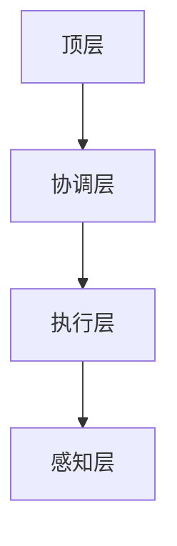
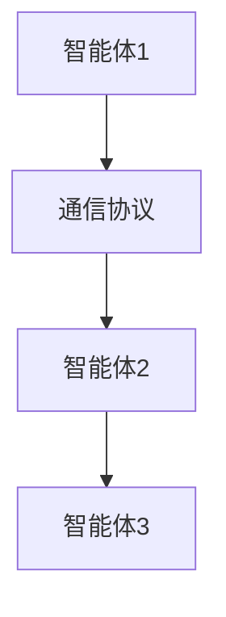
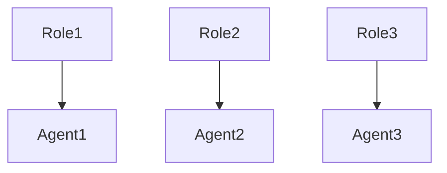
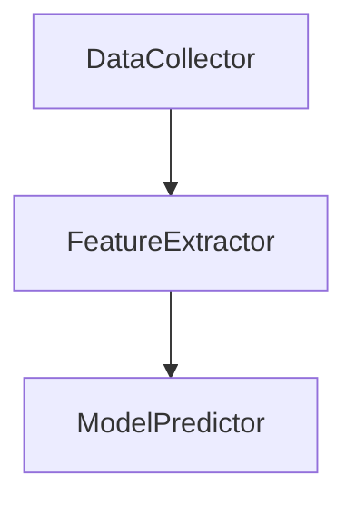
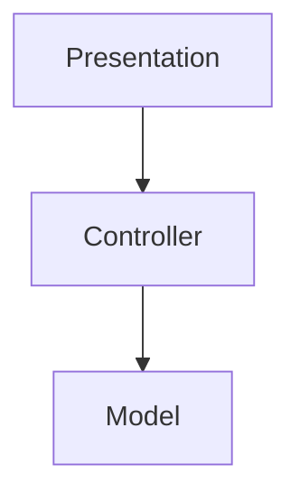
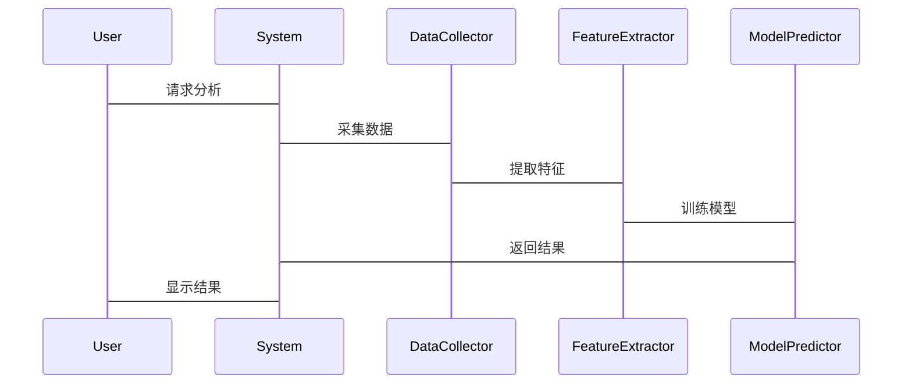

                 


# 多智能体系统在识别价值陷阱中的应用：防范投资风险

> 关键词：多智能体系统，价值陷阱，投资风险管理，算法实现，系统架构

> 摘要：本文探讨了多智能体系统在识别价值陷阱中的应用，通过分析多智能体系统的原理、算法实现和系统架构，展示了如何利用多智能体系统来防范投资风险。文章详细介绍了价值陷阱的定义、分析方法和数据处理，结合实际案例，深入讲解了多智能体系统在投资风险管理中的优势和应用前景。

---

## 第一部分: 多智能体系统基础

### 第1章: 多智能体系统概述

#### 1.1 多智能体系统的定义与特点

##### 1.1.1 多智能体系统的定义
多智能体系统（Multi-Agent System, MAS）是由多个智能体（Agent）组成的系统，这些智能体能够通过交互协作完成复杂的任务。智能体是具有感知、决策、推理和执行能力的实体。

##### 1.1.2 多智能体系统的特征
- **分布性**：多个智能体分布在不同的位置，协同工作。
- **自主性**：每个智能体都有一定的自主决策能力。
- **反应性**：智能体能够实时感知环境并做出反应。
- **社会性**：智能体之间通过通信和协作完成任务。

##### 1.1.3 多智能体系统与单智能体系统的区别
| 特性          | 多智能体系统             | 单智能体系统             |
|---------------|--------------------------|--------------------------|
| 结构复杂性     | 高                     | 低                     |
| 协作能力      | 强                     | 弱                     |
| 故障容错性     | 高                     | 低                     |

#### 1.2 多智能体系统的体系结构

##### 1.2.1 分层体系结构
分层体系结构将系统划分为多个层次，每个层次负责不同的功能。



##### 1.2.2 分布式体系结构
分布式体系结构中，智能体分布在网络的不同节点上，通过通信协议进行交互。



##### 1.2.3 基于角色的体系结构
基于角色的体系结构中，智能体根据角色分配任务。



#### 1.3 多智能体系统的优缺点

##### 1.3.1 多智能体系统的优势
- **高容错性**：多个智能体协同工作，单个故障不影响整体。
- **灵活性**：能够适应环境的变化。
- **分布式计算**：能够处理大规模数据。

##### 1.3.2 多智能体系统的挑战
- **通信开销**：智能体之间的通信可能带来额外的开销。
- **同步问题**：多个智能体之间的同步可能复杂。

---

## 第二部分: 价值陷阱的识别与分析

### 第2章: 价值陷阱的定义与分析

#### 2.1 价值陷阱的定义

##### 2.1.1 价值陷阱的概念
价值陷阱是指某些公司或资产看似具有较高的投资价值，但实际情况可能存在问题，导致投资失败。

##### 2.1.2 价值陷阱的类型
- **财务造假**：公司财务数据虚假。
- **管理问题**：公司内部管理混乱。
- **行业风险**：行业整体风险上升。

#### 2.2 价值陷阱的分析方法

##### 2.2.1 基于财务指标的分析
常用的财务指标包括市盈率、市净率、ROE等。

##### 2.2.2 基于市场行为的分析
分析市场行为，如成交量、价格走势等。

#### 2.3 价值陷阱的数据处理

##### 2.3.1 数据清洗与预处理
- 删除缺失值。
- 处理异常值。

##### 2.3.2 数据特征提取
提取财务指标、市场行为指标等特征。

---

## 第三部分: 多智能体系统与价值陷阱识别的结合

### 第3章: 多智能体系统在金融领域的应用

#### 3.1 多智能体系统在金融市场的优势

##### 3.1.1 金融市场的复杂性
金融市场涉及多方利益相关者，市场行为复杂。

##### 3.1.2 多智能体系统在金融分析中的优势
- **分布式计算**：能够处理大量数据。
- **协同学习**：多个智能体协同学习，提高准确性。

### 第4章: 价值陷阱识别的多智能体系统模型

#### 4.1 多智能体系统模型的设计

##### 4.1.1 智能体的角色分配
- 数据采集智能体：负责数据的采集和预处理。
- 特征提取智能体：负责特征的提取和选择。
- 模型预测智能体：负责模型的训练和预测。

##### 4.1.2 智能体之间的通信
智能体之间通过通信协议进行交互，如使用消息队列。

#### 4.2 多智能体系统的实现步骤

##### 4.2.1 数据采集
从多个数据源采集数据，如Yahoo Finance、 Bloomberg。

##### 4.2.2 数据预处理
对数据进行清洗和标准化处理。

##### 4.2.3 模型训练
使用机器学习算法训练模型，如协同学习、强化学习。

##### 4.2.4 模型预测
基于训练好的模型，预测哪些公司是价值陷阱。

---

## 第四部分: 算法与模型实现

### 第5章: 协同学习算法实现

#### 5.1 协同学习算法概述
协同学习是一种多智能体协同学习的算法，多个智能体共同完成任务。

#### 5.2 协同学习算法的实现步骤

##### 5.2.1 初始化智能体
每个智能体初始化参数。

##### 5.2.2 智能体交互
智能体之间通过通信协议进行交互，共享数据。

##### 5.2.3 模型训练
基于交互数据，训练模型。

#### 5.3 协同学习算法的代码实现

##### 5.3.1 数据预处理
```python
import pandas as pd

data = pd.read_csv('data.csv')
data.dropna(inplace=True)
```

##### 5.3.2 模型训练
```python
from sklearn.ensemble import RandomForestClassifier

model = RandomForestClassifier()
model.fit(X, y)
```

#### 5.4 协同学习算法的数学模型

##### 5.4.1 协同学习模型
$$ y = f(x_1, x_2, ..., x_n) $$

---

## 第五部分: 系统架构与实现

### 第6章: 系统架构设计

#### 6.1 系统功能设计

##### 6.1.1 功能模块
- 数据采集模块：负责数据的采集。
- 特征提取模块：负责特征的提取。
- 模型预测模块：负责模型的训练和预测。

##### 6.1.2 功能模块的交互


#### 6.2 系统架构设计

##### 6.2.1 分层架构


#### 6.3 系统接口设计

##### 6.3.1 接口定义
- 数据采集接口：`get_data()`
- 特征提取接口：`extract_features()`

#### 6.4 系统交互设计

##### 6.4.1 交互流程


---

## 第六部分: 项目实战

### 第7章: 项目实战

#### 7.1 环境安装

##### 7.1.1 安装Python
```bash
python --version
pip install --upgrade pip
```

##### 7.1.2 安装依赖库
```bash
pip install pandas scikit-learn matplotlib
```

#### 7.2 系统核心实现

##### 7.2.1 数据采集
```python
import pandas as pd

data = pd.read_csv('data.csv')
```

##### 7.2.2 数据预处理
```python
data.dropna(inplace=True)
```

##### 7.2.3 模型训练
```python
from sklearn.ensemble import RandomForestClassifier

model = RandomForestClassifier()
model.fit(X, y)
```

#### 7.3 案例分析

##### 7.3.1 数据分析
分析某公司的财务数据，发现其财务指标异常。

##### 7.3.2 模型预测
模型预测该公司是价值陷阱。

##### 7.3.3 结果展示
显示模型预测结果，并给出投资建议。

---

## 第七部分: 总结与展望

### 第8章: 总结与展望

#### 8.1 总结
本文详细介绍了多智能体系统在识别价值陷阱中的应用，展示了如何利用多智能体系统来防范投资风险。

#### 8.2 展望
未来，随着人工智能技术的发展，多智能体系统在金融领域的应用将更加广泛。

---

通过以上步骤，我们可以看到多智能体系统在识别价值陷阱中的巨大潜力。希望本文能够为读者提供有价值的参考和启发。

