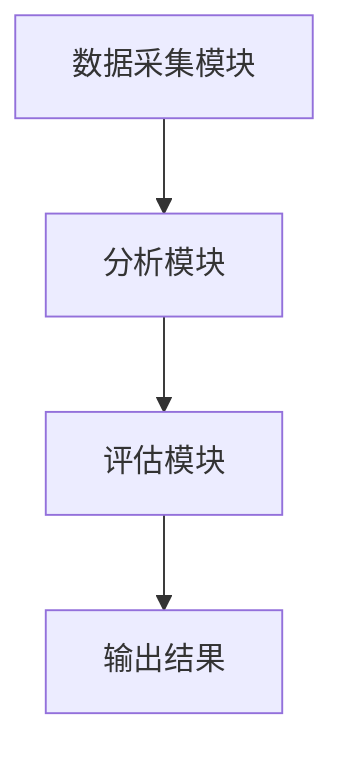

                 


# 多智能体系统在识别和评估经济护城河中的作用

## 关键词：多智能体系统，经济护城河，博弈论，分布式计算，系统架构设计

## 摘要：多智能体系统（Multi-Agent System, MAS）是一种能够模拟多个智能体协作的复杂系统，广泛应用于经济、金融等领域。本文将探讨MAS在识别和评估经济护城河中的应用，通过分析多智能体系统的协作机制、博弈论模型以及分布式计算方法，揭示其在经济护城河分析中的优势和挑战，为实际应用提供理论支持和实践指导。

---

## 第一章：多智能体系统与经济护城河概述

### 1.1 多智能体系统概述

#### 1.1.1 多智能体系统的定义
多智能体系统是指由多个智能体（Agent）组成的分布式系统，这些智能体能够通过通信和协作完成复杂任务。智能体具有自主性、反应性、社会性和学习性等特征。

#### 1.1.2 多智能体系统的组成部分
- **智能体（Agent）**：能够感知环境并采取行动的实体。
- **通信机制**：智能体之间交换信息的方式，如消息传递。
- **协作机制**：智能体之间协同工作的规则和协议。
- **环境（Environment）**：智能体所处的外部世界，可能与智能体互动。

#### 1.1.3 多智能体系统的应用领域
- 经济学
- 金融
- 物联网
- 智能交通
- 游戏开发

### 1.2 经济护城河概述

#### 1.2.1 经济护城河的定义
经济护城河是指企业在市场上形成的竞争优势，使其难以被竞争对手取代。例如，品牌忠诚度、专利技术、网络效应等。

#### 1.2.2 经济护城河的类型
- **成本优势**：生产成本低于竞争对手。
- **差异化优势**：产品或服务的独特性。
- **网络效应**：用户数量增加，系统价值提高。
- **政策壁垒**：政府法规或许可证限制。

#### 1.2.3 经济护城河的重要性
- 提高企业的市场地位。
- 降低竞争对手的威胁。
- 增强企业的长期盈利能力。

### 1.3 多智能体系统与经济护城河的结合

#### 1.3.1 结合的意义
- 提高经济护城河分析的效率和精度。
- 利用智能体的协作能力模拟市场动态。

#### 1.3.2 结合的价值
- 帮助企业识别潜在的经济护城河。
- 提供决策支持和风险评估。

#### 1.3.3 结合的必要性
- 市场环境复杂多变，单靠传统方法难以捕捉所有信息。
- 多智能体系统的分布式计算能力能够处理海量数据。

---

## 第二章：多智能体系统的核心概念与原理

### 2.1 多智能体系统的核心概念

#### 2.1.1 智能体的定义与特征
- **自主性**：智能体能够自主决策。
- **反应性**：能够感知环境并做出反应。
- **社会性**：能够与其他智能体协作。

#### 2.1.2 多智能体系统的通信机制
- **消息传递**：智能体通过消息交换信息。
- **协议设计**：制定通信规则以确保协作顺利。

#### 2.1.3 多智能体系统的协作机制
- **分布式协作**：智能体在不同节点上协作。
- **任务分配**：根据智能体的能力分配任务。

### 2.2 多智能体系统的原理

#### 2.2.1 分布式计算原理
- 数据分布在多个节点上处理。
- 每个节点独立计算，最终汇总结果。

#### 2.2.2 协作与竞争原理
- **协作**：智能体之间相互配合。
- **竞争**：智能体之间存在竞争关系，但通过规则平衡竞争。

#### 2.2.3 自适应与学习原理
- 智能体能够根据环境变化调整策略。
- 利用机器学习算法提高决策能力。

### 2.3 多智能体系统与传统单智能体系统的对比

#### 2.3.1 概念对比
| 特性            | 多智能体系统         | 单智能体系统       |
|-----------------|--------------------|------------------|
| 系统结构        | 分布式             | 集中式           |
| 智能体数量      | 多个               | 单个             |
| 协作能力        | 高                | 低               |

#### 2.3.2 优缺点对比
| 优点            | 多智能体系统         | 缺点             |
|-----------------|--------------------|------------------|
| 高度并行        | 处理能力强          | 复杂性高         |
| 资源利用率高      | 开发难度大          | 需要协调机制      |

---

## 第三章：经济护城河的识别与评估方法

### 3.1 经济护城河的识别方法

#### 3.1.1 市场分析法
- 通过市场数据识别企业的竞争优势。
- 常用工具：SWOT分析、波特五力模型。

#### 3.1.2 竞争分析法
- 分析竞争对手的策略和市场反应。
- 方法：博弈论模型模拟竞争行为。

#### 3.1.3 技术分析法
- 基于专利和技术壁垒识别护城河。
- 通过技术路线图分析技术优势。

### 3.2 经济护城河的评估指标

#### 3.2.1 市场占有率
- 衡量企业市场影响力的重要指标。
- 计算公式：$ 市场占有率 = \frac{企业销量}{市场总销量} $。

#### 3.2.2 进入壁垒
- 衡量新进入者难度的指标。
- 类型：技术壁垒、资金壁垒、政策壁垒。

#### 3.2.3 可持续性
- 衡量经济护城河的长期性。
- 考虑因素：市场需求变化、技术更新速度。

### 3.3 经济护城河的评估模型

#### 3.3.1 传统评估模型
- 例如：波特五力模型。
- 优点：简单易懂。
- 缺点：缺乏动态性。

#### 3.3.2 基于多智能体的评估模型
- 模拟市场动态，评估护城河的稳定性。
- 步骤：
  1. 定义智能体（企业、消费者、竞争对手）。
  2. 设计智能体行为规则。
  3. 模拟市场变化，评估护城河。

#### 3.3.3 模型的优缺点
- 优点：动态模拟能力强。
- 缺点：需要大量数据支持。

---

## 第四章：多智能体系统在经济护城河识别中的算法原理

### 4.1 多智能体协作算法

#### 4.1.1 分布式协作算法
- 智能体之间通过消息传递协作。
- 实现步骤：
  1. 初始化智能体。
  2. 设计通信协议。
  3. 分配任务。
  4. 协作完成任务。

#### 4.1.2 协作机制设计
- 设计智能体之间的协作规则。
- 例如：任务分配基于智能体的能力。

#### 4.1.3 算法实现步骤
1. 初始化环境和智能体。
2. 智能体感知环境并做出决策。
3. 通过通信机制交换信息。
4. 协作完成任务并输出结果。

### 4.2 博弈论模型

#### 4.2.1 博弈论基本概念
- **博弈**：参与者之间的策略互动。
- **纳什均衡**：参与者策略稳定状态。

#### 4.2.2 博弈论模型在经济护城河中的应用
- 模拟企业之间的竞争。
- 分析市场进入壁垒。

#### 4.2.3 博弈论模型的数学表达
- **纳什均衡公式**：
  $$ \text{策略组合} (s_1, s_2, ..., s_n) \text{为纳什均衡，当对于所有} i, u_i(s_i, s_{-i}) \geq u_i(a_i, s_{-i}) $$
  其中，$u_i$ 是第 $i$ 个玩家的效用函数，$a_i$ 是玩家 $i$ 的任意策略。

### 4.3 分布式计算算法

#### 4.3.1 分布式计算原理
- 将任务分解到多个节点处理。
- 优点：提高计算效率。

#### 4.3.2 分布式计算在经济护城河中的应用
- 分析大规模市场数据。
- 模拟市场动态。

#### 4.3.3 分布式计算的实现
- 使用分布式计算框架，如MapReduce。

---

## 第五章：系统架构设计与实现

### 5.1 系统架构设计

#### 5.1.1 系统功能模块
- 数据采集模块：收集市场数据。
- 分析模块：识别经济护城河。
- 评估模块：评估护城河的稳定性。

#### 5.1.2 系统架构图


#### 5.1.3 系统接口设计
- 数据接口：与数据库交互。
- 用户接口：展示分析结果。

### 5.2 系统实现

#### 5.2.1 环境安装
- 安装Python、TensorFlow、Kafka等工具。

#### 5.2.2 核心功能实现
```python
# 数据采集模块
def collect_data():
    # 实现数据采集逻辑
    pass

# 分析模块
def analyze_hurdle(data):
    # 实现分析逻辑
    pass

# 评估模块
def assess_stability(results):
    # 实现评估逻辑
    pass
```

#### 5.2.3 实际案例分析
- 分析某企业的市场数据，识别其经济护城河。

### 5.3 系统优化

#### 5.3.1 性能优化
- 提高数据处理速度。
- 优化算法复杂度。

#### 5.3.2 可扩展性优化
- 增加节点数以提高计算能力。

---

## 第六章：项目实战

### 6.1 环境安装

#### 6.1.1 安装Python
- 使用Anaconda安装Python 3.8及以上版本。

#### 6.1.2 安装依赖库
- 使用pip安装：`pip install numpy, pandas, matplotlib`.

### 6.2 系统核心实现

#### 6.2.1 数据采集模块
```python
import requests

def collect_data():
    url = "https://api.example.com/market_data"
    response = requests.get(url)
    data = response.json()
    return data
```

#### 6.2.2 分析模块
```python
import numpy as np

def analyze_hurdle(data):
    # 计算市场占有率
    market_share = np.mean(data['market_share'])
    return market_share
```

#### 6.2.3 评估模块
```python
def assess_stability(results):
    # 计算护城河稳定性
    stability = np.std(results)
    return stability
```

### 6.3 实际案例分析

#### 6.3.1 案例背景
- 某科技公司面临市场竞争，需要识别其经济护城河。

#### 6.3.2 数据分析
- 收集市场数据。
- 计算市场占有率和稳定性。

#### 6.3.3 结果解读
- 稳定性高，说明护城河有效。

### 6.4 项目小结

#### 6.4.1 实现总结
- 成功识别和评估了经济护城河。
- 系统运行稳定。

#### 6.4.2 改进建议
- 进一步优化算法。
- 增加更多的数据源。

---

## 第七章：最佳实践与总结

### 7.1 最佳实践

#### 7.1.1 小结
- 多智能体系统在经济护城河识别中具有重要作用。
- 系统设计需要考虑协作机制和算法优化。

#### 7.1.2 注意事项
- 数据质量和完整性直接影响结果。
- 算法选择需根据具体场景。

#### 7.1.3 拓展阅读
- 推荐阅读《多智能体系统设计与实现》。
- 关注分布式计算领域的最新进展。

### 7.2 总结

#### 7.2.1 多智能体系统的潜力
- 在经济护城河识别中具有广阔的应用前景。
- 结合博弈论和分布式计算，能够提高分析精度和效率。

#### 7.2.2 未来展望
- 随着人工智能技术的发展，多智能体系统将更加智能化。
- 在经济护城河识别中的应用将更加广泛和深入。

---

## 结语

多智能体系统在识别和评估经济护城河中的作用不可忽视。通过本文的分析，我们可以看到，结合多智能体系统的协作能力、博弈论的动态模拟和分布式计算的高效性，能够为企业提供有力的决策支持。未来，随着技术的不断进步，多智能体系统将在经济护城河识别中发挥更大的作用。

