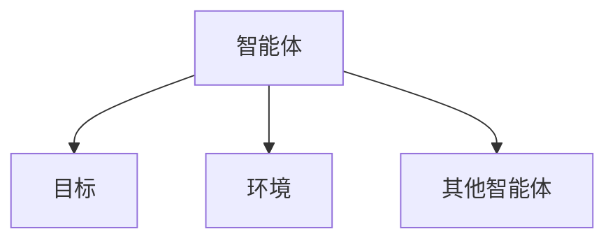

                 


# 多智能体系统在识别和评估颠覆性技术投资机会中的作用

## 关键词：
多智能体系统, 颠覆性技术, 投资机会, 系统架构, 算法原理, 项目实战

## 摘要：
本文探讨多智能体系统在识别和评估颠覆性技术投资机会中的应用。通过分析多智能体系统的原理、算法和架构，结合实际案例，展示其在投资决策中的优势，为企业提供有效策略和工具。

---

# 第1章: 多智能体系统与颠覆性技术投资概述

## 1.1 多智能体系统的定义与特点
### 1.1.1 多智能体系统的定义
多智能体系统（Multi-Agent System, MAS）由多个智能体组成，这些智能体能够自主决策、协作和通信，共同完成复杂任务。

### 1.1.2 多智能体系统的核心特点
- **自主性**：每个智能体独立决策。
- **反应性**：能感知环境并实时响应。
- **协作性**：通过通信协作完成目标。
- **分布性**：智能体分布在网络中，不依赖中心节点。

### 1.1.3 多智能体系统与传统单智能体系统的区别
| 特性 | 单智能体系统 | 多智能体系统 |
|------|--------------|--------------|
| 决策 | 中央决策     | 分布式决策   |
| 通信 | 无          | 高           |
| 并行性 | 串行        | 并行         |

## 1.2 颠覆性技术的定义与特征
### 1.2.1 颠覆性技术的定义
颠覆性技术指能够改变市场规则或技术基础的创新，如人工智能、区块链等。

### 1.2.2 颠覆性技术的核心特征
- **创新性**：技术新颖，突破传统。
- **破坏性**：可能颠覆现有市场。
- **高潜力**：可能带来巨大价值。

### 1.2.3 颠覆性技术的识别与评估
识别颠覆性技术需要分析市场趋势、技术成熟度和潜在影响。

## 1.3 多智能体系统在投资中的作用
### 1.3.1 多智能体系统在投资决策中的优势
- 提高决策效率和准确性。
- 处理复杂信息和风险。

### 1.3.2 多智能体系统在识别颠覆性技术中的应用
通过分布式分析和协作，快速识别潜在颠覆性技术。

### 1.3.3 多智能体系统在评估投资机会中的价值
提供实时分析和协作，帮助评估投资价值。

## 1.4 本章小结
本章介绍了多智能体系统和颠覆性技术的基本概念，及其在投资中的作用。

---

# 第2章: 多智能体系统的原理与机制

## 2.1 多智能体系统的原理
### 2.1.1 多智能体系统的组成要素
- 智能体：独立决策单元。
- 通信机制：信息交换方式。
- 协作机制：任务分配与协调。

### 2.1.2 多智能体系统的核心机制
- **通信机制**：通过消息传递进行信息共享。
- **协作机制**：智能体之间通过协商分配任务。
- **协调机制**：确保智能体行动一致。

## 2.2 多智能体系统的属性特征对比
| 特性 | 协作式MAS | 竞争式MAS |
|------|-----------|-----------|
| 智能体关系 | 合作       | 竞争       |
| 信息共享 | 高         | 低         |
| 目标一致性 | 高         | 低         |

## 2.3 多智能体系统的ER实体关系图


## 2.4 本章小结
本章分析了多智能体系统的原理和机制，解释了其在投资中的应用。

---

# 第3章: 多智能体系统的算法原理

## 3.1 多智能体协作算法
### 3.1.1 多智能体协作的基本原理
智能体通过通信协作，共同完成任务。

### 3.1.2 多智能体协作的实现步骤
1. 确定目标。
2. 分配任务。
3. 协作执行。
4. 反馈优化。

### 3.1.3 多智能体协作的数学模型
$$E = k \cdot n$$

## 3.2 多智能体决策算法
### 3.2.1 基于博弈论的决策算法
分析各方利益，制定最优策略。

### 3.2.2 基于分布式计算的决策算法
每个智能体独立计算，形成共识。

### 3.2.3 基于强化学习的决策算法
通过奖励机制优化决策。

## 3.3 多智能体系统的通信协议
### 3.3.1 通信协议的基本概念
定义智能体间信息传递规则。

### 3.3.2 常见的通信协议类型
- HTTP：常用网络通信。
- MQTT：适合物联网环境。

### 3.3.3 通信协议在投资中的应用
用于实时信息共享和协作。

## 3.4 算法实现的Python代码示例
```python
def multi_agent_communication():
    agents = ['Agent1', 'Agent2']
    message = {'source': 'Agent1', 'target': 'Agent2', 'content': '投资机会'}
    for agent in agents:
        if agent == message['source']:
            print(f"{agent} 发送消息：{message['content']}")
        elif agent == message['target']:
            print(f"{agent} 收到消息：{message['content']}")
```

## 3.5 本章小结
本章详细讲解了多智能体系统的算法原理和实现方法。

---

# 第4章: 多智能体系统在投资机会识别中的应用

## 4.1 多智能体系统的应用场景
### 4.1.1 金融投资中的应用场景
识别市场趋势和潜在投资机会。

### 4.1.2 科技投资中的应用场景
评估技术创新和市场潜力。

## 4.2 系统设计与实现
### 4.2.1 系统功能设计
- 数据采集：收集市场数据。
- 分析模块：评估技术潜力。
- 决策模块：制定投资策略。

### 4.2.2 系统架构设计


### 4.2.3 系统接口设计
- 数据接口：与数据库交互。
- 用户接口：显示分析结果。

## 4.3 项目实战
### 4.3.1 环境安装
安装Python和相关库。

### 4.3.2 核心代码实现
```python
def assess_technology(technology_data):
    # 评估技术潜力
    return {'risk': 0.2, 'potential': 0.8}
```

### 4.3.3 实际案例分析
分析人工智能技术的投资潜力。

## 4.4 项目小结
本章展示了多智能体系统在投资中的实际应用。

---

# 第5章: 多智能体系统投资中的最佳实践

## 5.1 最佳实践
### 5.1.1 数据质量的重要性
确保数据准确可靠。

### 5.1.2 系统维护与优化
定期更新模型和优化算法。

### 5.1.3 人才与团队协作
多学科团队合作。

## 5.2 小结与展望
### 5.2.1 小结
总结全文内容。

### 5.2.2 展望
未来研究方向和应用前景。

---

通过以上结构，文章详细阐述了多智能体系统在识别和评估颠覆性技术投资机会中的作用，结合理论和实际案例，为读者提供了全面的知识和实践指导。

