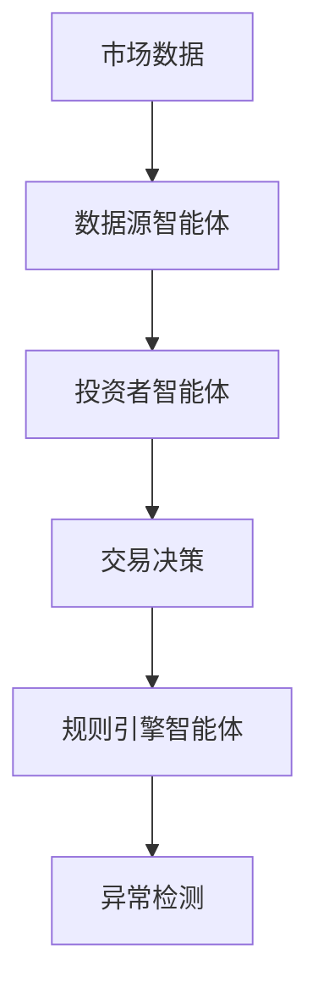
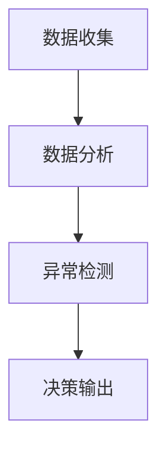
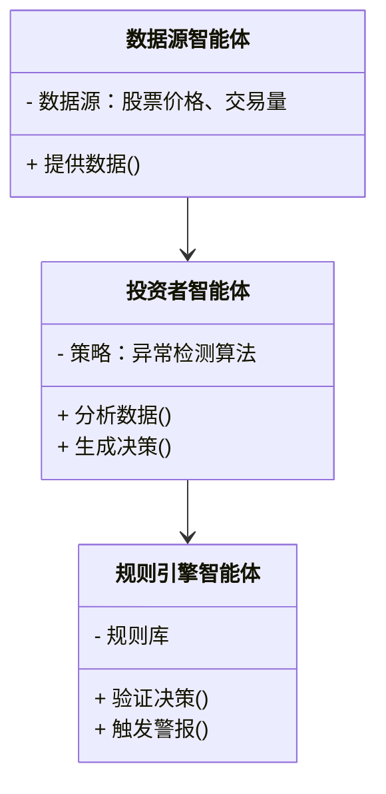
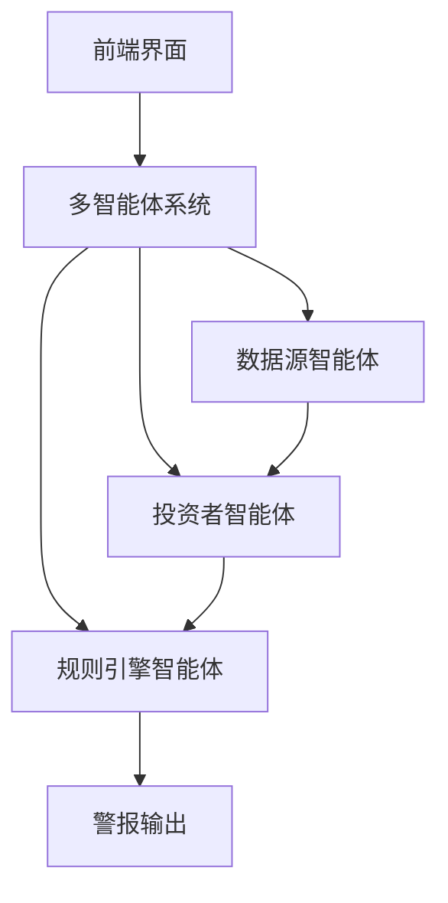
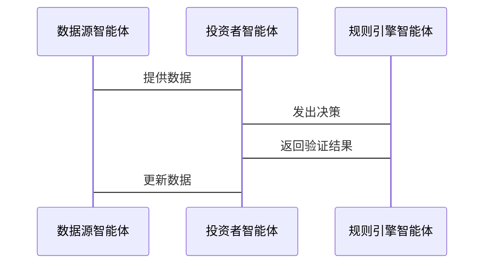

                 


# 多智能体系统在识别市场异常机会中的应用

## 关键词：多智能体系统、市场异常机会、人工智能、算法原理、系统架构

## 摘要：  
本文探讨了多智能体系统在识别市场异常机会中的应用。通过分析多智能体系统的定义、核心概念、算法原理、系统架构设计以及实际项目案例，本文详细阐述了多智能体系统在市场机会识别中的优势和应用场景。文章结合理论与实践，提供了丰富的技术细节和实际案例分析，帮助读者全面理解多智能体系统在识别市场异常机会中的潜力和实现方法。

---

# 第一部分: 多智能体系统与市场机会识别的背景

## 第1章: 多智能体系统与市场机会识别的背景

### 1.1 多智能体系统的定义与特点

#### 1.1.1 多智能体系统的定义  
多智能体系统（Multi-Agent System, MAS）是由多个智能体组成的系统，这些智能体能够自主决策、协作或竞争，以完成特定目标。每个智能体都具有一定的知识、推理能力、规划能力以及与环境和其他智能体交互的能力。

#### 1.1.2 多智能体系统的核心特点  
- **自主性**：智能体能够自主决策，无需外部干预。  
- **反应性**：能够实时感知环境并做出反应。  
- **协作性**：多个智能体能够协同工作，共同完成任务。  
- **分布性**：智能体分布在网络中，任务分布化。  

#### 1.1.3 多智能体系统与传统单智能体系统的区别  
| 特性 | 单智能体系统 | 多智能体系统 |  
|------|--------------|--------------|  
| 决策 | 中央化决策 | 分布化决策 |  
| 交互 | 无交互 | 智能体之间有交互 |  
| 可扩展性 | 有限 | 高 |  

---

### 1.2 市场异常机会的定义与分类

#### 1.2.1 市场机会的定义  
市场机会是指在特定市场中，由于某种外部变化或内部条件的变化，可能出现的有利条件或趋势，能够为企业或投资者带来超额收益的机遇。

#### 1.2.2 市场异常机会的分类  
- **短期异常**：如价格波动、突发事件引发的机会。  
- **长期异常**：如市场结构变化、技术进步带来的机会。  
- **局部异常**：特定行业或地区的市场机会。  

#### 1.2.3 市场异常机会的识别挑战  
- 数据复杂性：市场数据量大、维度多，难以快速识别。  
- 动态性：市场环境变化快，异常机会易逝。  
- 不确定性：市场行为受多种因素影响，难以预测。  

---

### 1.3 多智能体系统在市场机会识别中的作用

#### 1.3.1 多智能体系统的优势  
- **分布式计算**：能够处理海量数据，提高计算效率。  
- **协作能力**：多个智能体可以协同分析，覆盖更多维度。  
- **实时性**：能够快速响应市场变化，抓住机会。  

#### 1.3.2 多智能体系统在市场机会识别中的应用场景  
- **股票交易**：识别市场波动中的交易机会。  
- **供应链优化**：发现供应链中的异常机会。  
- **市场营销**：识别市场趋势中的营销机会。  

#### 1.3.3 多智能体系统与传统市场分析方法的对比  
| 特性 | 传统方法 | 多智能体系统 |  
|------|-----------|--------------|  
| 数据处理 | 中央化 | 分布化 |  
| 决策速度 | 较慢 | 较快 |  
| 可扩展性 | 有限 | 高 |  

---

### 1.4 本章小结  
本章介绍了多智能体系统的定义、特点及其在市场机会识别中的作用。通过对比分析，展示了多智能体系统在识别市场异常机会中的独特优势。

---

# 第二部分: 多智能体系统的核心概念与原理

## 第2章: 多智能体系统的核心概念

### 2.1 多智能体系统的组成与结构

#### 2.1.1 实体与角色  
- **实体**：市场中的参与者，如投资者、企业、消费者等。  
- **角色**：智能体在系统中的具体职责，如数据收集、分析、决策等。  

#### 2.1.2 行为与交互  
- **行为**：智能体根据环境信息采取的行动。  
- **交互**：智能体之间通过信息交换进行协作或竞争。  

#### 2.1.3 环境与约束  
- **环境**：智能体所处的市场环境，包括数据、规则等。  
- **约束**：智能体在决策过程中需要遵守的限制条件。  

---

### 2.2 市场机会识别的多智能体模型

#### 2.2.1 实体关系模型  
市场机会识别的多智能体模型包括以下几个实体：  
1. **投资者智能体**：负责分析市场数据并提出交易建议。  
2. **数据源智能体**：提供市场数据，如股票价格、交易量等。  
3. **规则引擎智能体**：根据市场规则判断异常情况。  

#### 2.2.2 信息流与决策过程  
信息流从数据源流向投资者智能体，投资者智能体通过分析数据做出决策，并将结果反馈给规则引擎智能体进行验证。

#### 2.2.3 异常检测机制  
通过设置阈值和触发条件，智能体能够自动检测市场中的异常情况，并向相关决策者发出警报。

---

### 2.3 多智能体系统与市场机会识别的关联

#### 2.3.1 核心概念对比  
| 概念 | 多智能体系统 | 市场机会识别 |  
|------|--------------|---------------|  
| 核心目标 | 协作完成任务 | 发现市场机会 |  
| 关键能力 | 分布式计算、协作 | 数据分析、异常检测 |  

#### 2.3.2 关系图分析  
以下是多智能体系统与市场机会识别的关系图：



#### 2.3.3 案例分析  
假设某股票价格突然大幅波动，投资者智能体通过分析数据源智能体提供的信息，发现异常情况，并向规则引擎智能体报告，触发异常检测机制，最终识别出市场机会。

---

### 2.4 本章小结  
本章详细介绍了多智能体系统的核心概念，包括实体、行为、环境等，并通过案例分析展示了其在市场机会识别中的应用。

---

# 第三部分: 多智能体系统识别市场异常机会的算法原理

## 第3章: 多智能体系统识别市场异常机会的算法原理

### 3.1 多智能体系统算法概述

#### 3.1.1 算法分类  
- **基于规则的算法**：根据预设规则进行决策。  
- **基于学习的算法**：通过机器学习模型进行预测。  
- **基于博弈论的算法**：模拟市场中的竞争与合作。  

#### 3.1.2 算法选择依据  
根据具体应用场景选择算法，如实时性要求高时选择基于规则的算法，数据量大时选择基于学习的算法。

#### 3.1.3 算法优化策略  
- **并行计算**：提高计算效率。  
- **动态调整**：根据市场变化动态调整算法参数。  

---

### 3.2 基于多智能体的市场异常检测算法

#### 3.2.1 算法流程  
1. 数据收集：从数据源智能体获取市场数据。  
2. 数据分析：使用机器学习模型进行异常检测。  
3. 决策输出：根据分析结果触发异常警报。  

#### 3.2.2 算法实现步骤  


#### 3.2.3 算法的数学模型  
异常检测的数学模型如下：  
$$ \text{异常概率} = f(x, y, z) $$  
其中，$x$、$y$、$z$分别代表市场数据的不同特征。

---

### 3.3 算法实现的Python代码示例

#### 3.3.1 环境安装  
需要安装以下库：  
- `numpy`  
- `pandas`  
- `scikit-learn`  

#### 3.3.2 核心代码实现  
```python
import numpy as np
from sklearn.ensemble import IsolationForest

# 数据加载
data = np.array([1, 2, 3, 4, 5, 6, 7, 8, 9, 10, 100])

# 异常检测模型训练
model = IsolationForest(n_estimators=100, random_state=42)
model.fit(data.reshape(-1, 1))

# 预测异常
pred = model.predict(data.reshape(-1, 1))
outliers = data[pred == -1]

print("异常值为：", outliers)
```

#### 3.3.3 代码解读与分析  
上述代码使用了Isolation Forest算法进行异常检测，将数据加载后训练模型，并预测异常值。通过这种方式，可以快速识别市场中的异常数据点。

---

### 3.4 本章小结  
本章详细介绍了多智能体系统识别市场异常机会的算法原理，并通过代码示例展示了算法的实现过程。

---

# 第四部分: 多智能体系统识别市场异常机会的系统分析与架构设计

## 第4章: 系统分析与架构设计

### 4.1 问题场景介绍

#### 4.1.1 问题背景  
在金融市场中，价格波动频繁，异常机会难以捕捉。  
#### 4.1.2 问题目标  
通过多智能体系统快速识别市场异常机会。  
#### 4.1.3 问题约束  
- 数据实时性要求高。  
- 系统需要具备高可扩展性。  

---

### 4.2 系统功能设计

#### 4.2.1 领域模型设计  
以下是领域模型的类图：  



#### 4.2.2 系统架构设计  
以下是系统架构图：  



#### 4.2.3 系统接口设计  
- 数据接口：与数据源智能体交互。  
- 分析接口：与投资者智能体交互。  
- 警报接口：向规则引擎智能体输出警报信息。  

---

### 4.3 系统交互设计

#### 4.3.1 序列图设计  
以下是系统交互的序列图：  



#### 4.3.2 状态图设计  
以下是系统状态图：  


---

### 4.4 本章小结  
本章通过系统分析与架构设计，展示了多智能体系统在识别市场异常机会中的具体实现方式。

---

# 第五部分: 多智能体系统识别市场异常机会的项目实战

## 第5章: 项目实战

### 5.1 环境安装与配置

#### 5.1.1 系统环境要求  
- 操作系统：Linux/Windows/MacOS  
- 内存：4GB以上  
- 处理器：支持多线程  

#### 5.1.2 开发工具安装  
- 安装Python和必要的库（numpy、pandas、scikit-learn）。  

---

### 5.2 核心代码实现

#### 5.2.1 数据收集与预处理  
```python
import pandas as pd
import numpy as np

# 数据收集
data = pd.read_csv('market_data.csv')

# 数据预处理
data = data.dropna()
data = data[['timestamp', 'price', 'volume']]
```

#### 5.2.2 异常检测算法实现  
```python
from sklearn.ensemble import IsolationForest

# 模型训练
model = IsolationForest(n_estimators=100, random_state=42)
model.fit(data[['price', 'volume']].values)

# 预测异常
pred = model.predict(data[['price', 'volume']].values)
outliers = data[pred == -1]
```

#### 5.2.3 系统交互设计  
```python
# 与数据源智能体交互
def get_data():
    return data

# 与投资者智能体交互
def analyze_data():
    return pred

# 与规则引擎智能体交互
def trigger_alarm():
    print("异常警报！")
```

---

### 5.3 实际案例分析与详细解读

#### 5.3.1 案例分析  
假设某股票在交易日中的价格突然大幅波动，系统通过异常检测算法识别出这一异常情况，并触发警报。  

#### 5.3.2 案例解读  
- 数据源智能体提供股票价格和交易量数据。  
- 投资者智能体通过Isolation Forest算法检测出异常。  
- 规则引擎智能体验证异常情况并触发警报。  

---

### 5.4 本章小结  
本章通过实际项目案例，展示了多智能体系统在识别市场异常机会中的具体实现过程，并对案例进行了详细解读。

---

# 第六部分: 总结与展望

## 第6章: 总结与展望

### 6.1 最佳实践 Tips  
- 在实际应用中，建议结合多种算法进行多维度分析。  
- 定期更新规则库，以适应市场变化。  

### 6.2 本章小结  
本文详细探讨了多智能体系统在识别市场异常机会中的应用，通过理论分析和实际案例展示了其优势和实现方法。

### 6.3 注意事项  
- 数据安全：确保数据的保密性和完整性。  
- 系统稳定性：确保系统在高负载下的稳定运行。  

### 6.4 拓展阅读  
- 推荐阅读《Multi-Agent Systems: Algorithmic Foundations》。  

---

# 结语  
通过本文的分析与实践，读者可以深入了解多智能体系统在识别市场异常机会中的应用，并在实际项目中加以应用和优化。

