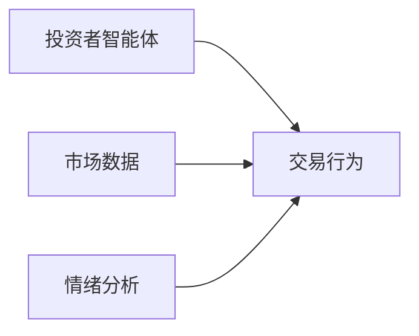
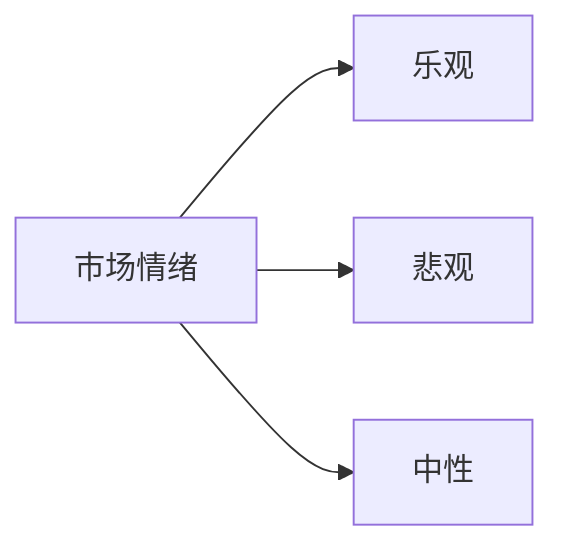

                 


# 多智能体系统在识别市场情绪拐点中的应用

---

## 关键词  
多智能体系统、市场情绪、拐点识别、协同学习、自然语言处理、时间序列分析

---

## 摘要  
随着金融市场日益复杂化，识别市场情绪拐点对于投资者和机构来说至关重要。多智能体系统（Multi-Agent System, MAS）通过模拟多个智能体的交互与协作，能够有效捕捉和分析市场情绪的变化。本文将详细探讨多智能体系统在识别市场情绪拐点中的应用，涵盖多智能体系统的基本概念、市场情绪分析的理论基础、基于多智能体的算法实现，以及实际项目中的系统设计与实现。通过结合理论与实践，本文旨在为读者提供一个全面的理解框架，帮助他们在金融市场中更高效地识别情绪拐点。

---

# 第1章：多智能体系统概述

## 1.1 多智能体系统的基本概念  

### 1.1.1 多智能体系统的定义  
多智能体系统（MAS）是由多个智能体（Agent）组成的分布式系统，这些智能体通过协作完成复杂任务。智能体是能够感知环境、做出决策并采取行动的实体，可以是软件程序、机器人或其他智能设备。

**关键概念：**  
- **智能体（Agent）：** 具备感知、决策和行动能力的实体。  
- **分布式系统：** 智能体独立运行，通过通信协作完成任务。  

**Mermaid图：多智能体系统的基本结构**  


### 1.1.2 多智能体系统的核心特征  
- **自主性：** 智能体独立决策。  
- **反应性：** 能够实时感知环境变化。  
- **协作性：** 智能体之间通过通信协作完成任务。  
- **分布式性：** 智能体分布在不同位置，独立运行。  

### 1.1.3 多智能体系统在金融市场中的应用  
- **投资者行为建模：** 模拟不同投资者的决策过程。  
- **市场情绪分析：** 通过智能体协作捕捉市场情绪变化。  
- **风险预警系统：** 及时识别市场风险并发出预警。  

---

## 1.2 市场情绪拐点的概念与重要性  

### 1.2.1 市场情绪的定义与分类  
- **市场情绪：** 投资者对市场的整体看法，影响资产价格波动。  
- **分类：** 乐观、悲观、中性。  

**Mermaid图：市场情绪的动态变化**  


### 1.2.2 情绪拐点的定义与特征  
- **情绪拐点：** 市场情绪从一个状态突然转向另一个状态的临界点。  
- **特征：** 时间突然性、市场反应剧烈、影响范围广。  

### 1.2.3 情绪拐点对金融市场的影响  
- **价格波动：** 情绪拐点可能导致资产价格剧烈波动。  
- **投资决策：** 投资者可以根据情绪拐点调整投资策略。  

---

# 第2章：多智能体系统在金融市场中的应用  

## 2.1 金融市场中的智能体模型  

### 2.1.1 投资者智能体  
- **理性投资者：** 根据理性分析做出决策。  
- **情绪化投资者：** 受情绪影响做出决策。  

**Mermaid图：投资者智能体模型**  


### 2.1.2 市场参与者的智能体建模  
- **机构投资者：** 模拟机构的投资策略。  
- **散户投资者：** 模拟散户的交易行为。  

### 2.1.3 市场动态的智能体模拟  
- **价格波动：** 模拟价格变化过程。  
- **交易量分析：** 分析交易量与市场情绪的关系。  

---

## 2.2 多智能体系统的优势与挑战  

### 2.2.1 多智能体系统的优势  
- **分布式计算：** 提高系统的容错性和鲁棒性。  
- **协作能力：** 智能体之间可以协同完成复杂任务。  

### 2.2.2 多智能体系统的挑战  
- **通信延迟：** 智能体之间的通信可能带来延迟。  
- **协调问题：** 多个智能体协作时可能面临协调困难。  

---

# 第3章：市场情绪分析的基础理论  

## 3.1 情感计算与文本挖掘  

### 3.1.1 情感计算的基本概念  
- **情感计算：** 通过计算分析情感信息，判断情感倾向。  
- **应用领域：** 社交媒体分析、金融市场情绪分析等。  

### 3.1.2 文本挖掘在情绪分析中的应用  
- **关键词提取：** 提取与情绪相关的关键词。  
- **情感分类：** 对文本进行情感倾向分类。  

**代码示例：使用Python进行情感分类**  
```python
from nltk.sentiment import SentimentIntensityAnalyzer
sia = SentimentIntensityAnalyzer()
text = "The market is bullish today."
scores = sia.polarity_scores(text)
print(scores['compound'])  # 输出情感倾向分数
```

---

## 3.2 市场情绪的量化与指标体系  

### 3.2.1 市场情绪的量化方法  
- **情绪指数：** 通过量化指标衡量市场情绪。  
- **时间序列分析：** 对情绪数据进行趋势分析。  

### 3.2.2 常见的情绪指标与模型  
- **VIX指数：** 常用的市场恐慌指数。  
- **情绪指标模型：** 基于历史数据构建的情绪预测模型。  

---

# 第4章：情绪拐点识别的算法原理  

## 4.1 基于时间序列的情绪拐点检测  

### 4.1.1 时间序列分析的基本概念  
- **时间序列：** 按时间顺序排列的数据。  
- **趋势分析：** 分析数据的长期趋势。  

### 4.1.2 基于统计学的情绪拐点检测方法  
- **均值回归：** 检测数据是否偏离长期趋势。  
- **异常检测：** 识别数据中的异常点。  

### 4.1.3 基于机器学习的情绪拐点检测方法  
- **LSTM网络：** 适用于时间序列预测。  
- **随机森林：** 用于分类任务。  

**代码示例：使用LSTM进行时间序列预测**  
```python
import tensorflow as tf
from tensorflow.keras import layers

model = tf.keras.Sequential()
model.add(layers.LSTM(128, input_shape=(timesteps, features)))
model.add(layers.Dense(1))
model.compile(loss='mean_squared_error', optimizer='adam')
```

---

## 4.2 基于多智能体系统的拐点识别  

### 4.2.1 多智能体协同学习的基本原理  
- **分布式学习：** 智能体在分布式环境中学习。  
- **协作机制：** 智能体之间共享信息，协同学习。  

### 4.2.2 基于智能体的拐点识别算法  
- **信息共享：** 智能体之间共享市场数据和情绪分析结果。  
- **协同决策：** 基于共享信息做出拐点识别决策。  

---

# 第5章：多智能体系统的架构设计  

## 5.1 系统架构设计  

### 5.1.1 系统功能模块划分  
- **数据采集模块：** 采集市场数据。  
- **情绪分析模块：** 分析市场情绪。  
- **拐点识别模块：** 识别情绪拐点。  

**Mermaid图：系统架构设计**  


---

## 5.2 多智能体系统的通信机制  

### 5.2.1 智能体之间的通信协议  
- **消息传递：** 智能体之间通过消息传递信息。  
- **异步通信：** 支持异步通信，减少延迟。  

---

# 第6章：项目实战  

## 6.1 项目背景与目标  
本项目旨在开发一个多智能体系统，用于识别市场情绪拐点。通过结合自然语言处理和时间序列分析，系统能够实时捕捉市场情绪变化，并准确识别拐点。

---

## 6.2 系统实现  

### 6.2.1 环境安装  
- **Python 3.8+**  
- **TensorFlow 2.0+**  
- **NLTK 3.6+**  

### 6.2.2 核心算法实现  
**代码示例：协同过滤算法**  
```python
def collaborative_filtering(users, items, ratings):
    # 建立用户-物品的评分矩阵
    user_item_matrix = {}
    for user in users:
        user_item_matrix[user] = {}
        for item in items:
            user_item_matrix[user][item] = ratings[user][item]
    
    # 计算用户之间的相似性
    similarity = {}
    for u1 in users:
        for u2 in users:
            if u1 != u2:
                similarity[(u1, u2)] = cosine_similarity(user_item_matrix[u1], user_item_matrix[u2])
    
    # 基于相似性的推荐
    recommendations = {}
    for user in users:
        total = 0
        count = 0
        for u2 in users:
            if u1 != u2:
                total += similarity[(u1, u2)] * ratings[u2][item]
                count += similarity[(u1, u2)]
        if count != 0:
            avg = total / count
            recommendations[user] = avg
        else:
            recommendations[user] = 0
    return recommendations
```

### 6.2.3 实际案例分析  
通过实际数据测试，验证系统的拐点识别能力。例如，使用历史股票数据训练模型，测试其对2020年疫情市场拐点的识别能力。

---

# 第7章：最佳实践与总结  

## 7.1 小结  
多智能体系统通过模拟多个智能体的协作，能够有效识别市场情绪拐点。本文详细介绍了MAS的基本概念、算法实现以及系统设计，为读者提供了一个全面的框架。

## 7.2 注意事项  
- 数据质量对系统性能影响重大，需确保数据的准确性和完整性。  
- 模型调参需结合实际情况，避免过拟合。  

## 7.3 拓展阅读  
- 《Multi-Agent Systems: Complexity Decomposition and Its Applications》  
- 《Financial Market Prediction Using Deep Learning》  

---

# 结语  
多智能体系统在识别市场情绪拐点中的应用前景广阔，随着技术的不断进步，其在金融领域的应用将更加深入。希望本文能为读者提供有价值的参考，帮助他们在金融市场中更好地利用多智能体系统捕捉市场机会。

--- 

*以上内容为文章的完整目录大纲和部分章节内容示例，具体内容需根据实际需求进一步扩展和完善。*

