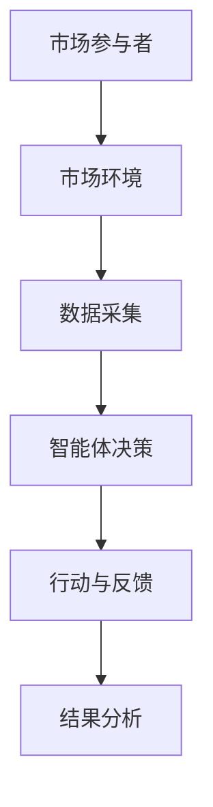

                 


# 多智能体系统在识别市场结构性变化中的应用

## 关键词：多智能体系统、市场结构性变化、强化学习、博弈论、算法实现

## 摘要：  
本文详细探讨了多智能体系统在识别市场结构性变化中的应用，从基本概念到算法实现，再到实际案例分析，系统性地介绍了多智能体系统如何在复杂市场环境中进行结构性变化的识别和预测。文章通过理论分析和实践案例相结合的方式，展示了多智能体系统在金融、经济等领域的广泛应用潜力。

---

## 第一部分: 多智能体系统与市场结构性变化概述

### 第1章: 多智能体系统基础

#### 1.1 多智能体系统的基本概念
多智能体系统（Multi-Agent System, MAS）是由多个智能体组成的分布式系统，这些智能体能够通过感知环境、自主决策并采取行动，实现特定目标。与单智能体系统相比，多智能体系统具有分布式性、协作性和智能性等特点，能够更好地应对复杂环境中的问题。

#### 1.2 市场结构性变化的定义与特征
市场结构性变化指的是市场中供需关系、价格波动、竞争格局等基本结构的变化。这些变化可能由政策调整、技术进步、经济周期等多种因素引发。市场结构性变化的主要特征包括渐进性、突变性、复杂性和不确定性。

#### 1.3 多智能体系统在市场分析中的应用背景
传统的市场分析方法往往依赖于单一模型或专家经验，难以捕捉复杂市场环境中的多种变量。多智能体系统通过模拟多个市场参与者的互动行为，能够更全面地分析市场结构性变化，为决策者提供更准确的市场洞察。

---

### 第2章: 多智能体系统的核心概念与联系

#### 2.1 多智能体系统的组成要素
多智能体系统由以下核心要素组成：
- **智能体**：具有感知、决策和行动能力的实体。
- **环境**：智能体所处的外部环境，包括市场、资源和其他参与者。
- **通信机制**：智能体之间交换信息的方式。
- **协作协议**：智能体之间协同工作的规则和策略。

#### 2.2 多智能体系统的通信机制
智能体之间的通信是多智能体系统的重要组成部分，主要通过以下方式实现：
- **直接通信**：智能体之间通过共享数据库或消息传递进行实时信息交换。
- **间接通信**：智能体通过中间媒介（如代理或服务器）进行信息传递。

#### 2.3 多智能体系统的协调与协作
多智能体系统的协调与协作机制包括：
- **协调机制**：通过设定共同目标或约束条件，使智能体之间形成一致行动。
- **协作策略**：基于博弈论的纳什均衡或其他协作模型，制定最优的协作方案。

---

### 第3章: 多智能体系统在识别市场结构性变化中的算法原理

#### 3.1 多智能体强化学习算法
多智能体强化学习是一种通过智能体与环境的互动来学习最优策略的方法。常见的算法包括：
- **Q-Learning**：基于状态-动作-奖励的强化学习算法。
- **Multi-Agent Q-Learning (MAQL)**：适用于多智能体协作环境的强化学习算法。

#### 3.2 基于博弈论的多智能体决策模型
博弈论为多智能体系统的决策提供了理论基础，主要模型包括：
- **纳什均衡**：所有参与者在最优策略下的均衡状态。
- **协同博弈**：智能体通过协作实现共同目标的博弈模型。

#### 3.3 算法实现的数学模型与公式
以下是多智能体强化学习的数学表达：
$$ Q(s,a) = Q(s,a) + \alpha [r + \max Q(s',a') - Q(s,a)] $$
其中，$Q(s,a)$ 表示状态-动作值函数，$\alpha$ 是学习率，$r$ 是奖励值，$s'$ 是下一个状态，$a'$ 是下一个动作。

---

## 第二部分: 多智能体系统在市场分析中的应用

### 第4章: 市场结构性变化的多智能体建模

#### 4.1 问题场景介绍
市场结构性变化通常涉及多个市场参与者的互动，例如买方、卖方、中间商等。通过建模这些参与者的策略和行为，可以更好地预测市场的变化趋势。

#### 4.2 系统功能设计
- **市场参与者建模**：定义各个智能体的属性和行为。
- **市场环境模拟**：构建虚拟市场环境，模拟价格波动、供需变化等。
- **决策与反馈机制**：设计智能体的决策模型和反馈机制。

#### 4.3 系统架构设计（Mermaid图）
以下是系统架构设计的Mermaid图：



---

### 第5章: 项目实战

#### 5.1 环境安装
- 需要安装的工具：Python、NumPy、Matplotlib、Scikit-learn。
- 安装命令：`pip install numpy matplotlib scikit-learn`

#### 5.2 系统核心实现源代码
以下是多智能体系统的Python实现代码示例：

```python
import numpy as np

class Agent:
    def __init__(self, learning_rate=0.1):
        self.lr = learning_rate
        self.Q = {}

    def perceive(self, state):
        # 感知环境状态
        return state

    def decide(self, state):
        # 决策动作
        if state not in self.Q:
            self.Q[state] = np.random.rand()
        return max(self.Q[state].keys())

    def learn(self, state, action, reward, next_state):
        # 强化学习
        target = reward + np.max(self.Q.get(next_state, 0))
        self.Q[state] = self.Q.get(state, 0) + self.lr * (target - self.Q.get(state, 0))

# 初始化智能体
agent = Agent()

# 模拟环境状态
state = "market_down"
action = agent.decide(state)
reward = -1 if action == "sell" else 1

# 学习更新
agent.learn(state, action, reward, next_state)
```

#### 5.3 代码应用解读与分析
上述代码实现了一个简单的多智能体系统，通过强化学习算法（Q-Learning）模拟市场参与者的决策过程。智能体根据当前市场状态（如“market_down”）做出买卖决策，并通过反馈机制（奖励或惩罚）更新其策略。

---

### 第6章: 总结与展望

#### 6.1 最佳实践 tips
- 在实际应用中，建议结合具体业务场景设计智能体的行为模型。
- 通过实验和数据验证，不断优化算法参数和模型结构。

#### 6.2 小结
多智能体系统通过模拟市场参与者的互动行为，能够有效识别市场结构性变化，为市场分析和决策提供有力支持。

#### 6.3 注意事项
- 确保数据质量和实时性，避免模型过时。
- 处理好智能体之间的通信和协作问题，避免信息孤岛。

#### 6.4 拓展阅读
推荐阅读相关领域的书籍和论文，例如《Multi-Agent Systems: Algorithmic, Complexity, and Synthesis》。

---

以上是《多智能体系统在识别市场结构性变化中的应用》的完整目录大纲和部分章节内容，希望对您有所帮助！

