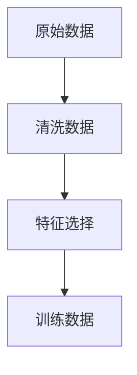
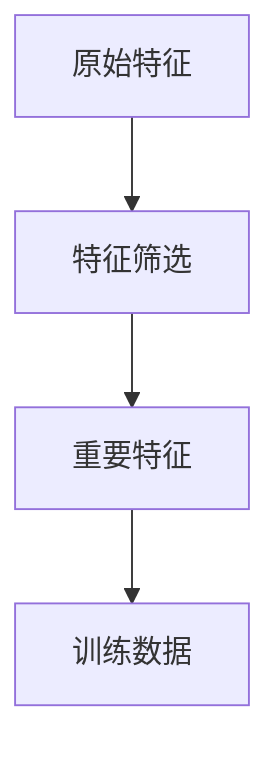
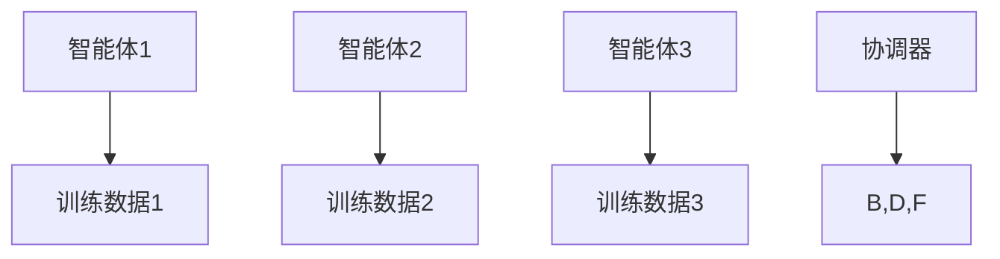
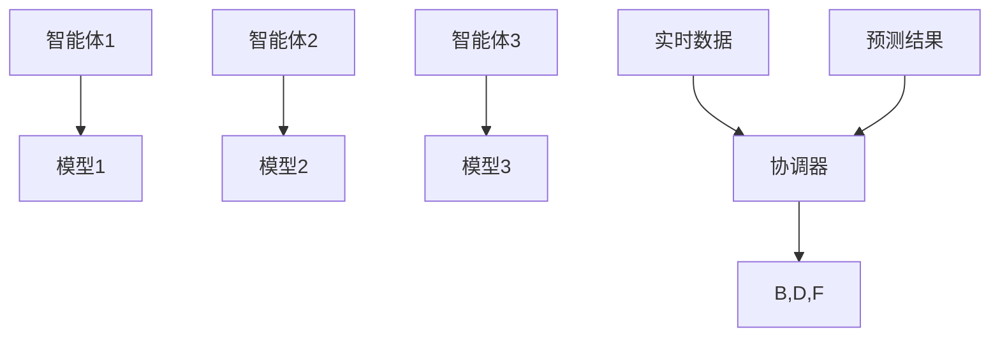
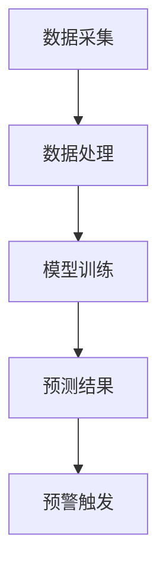
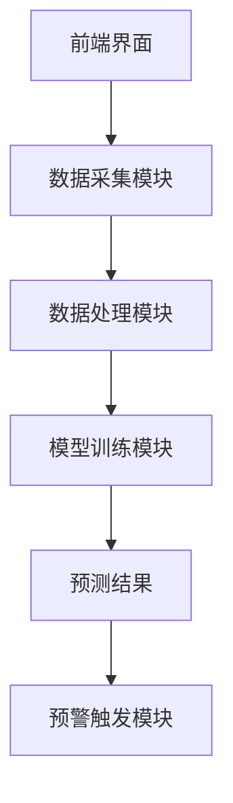
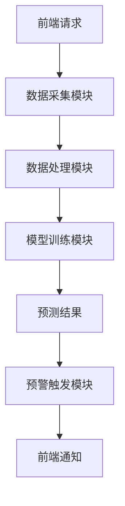
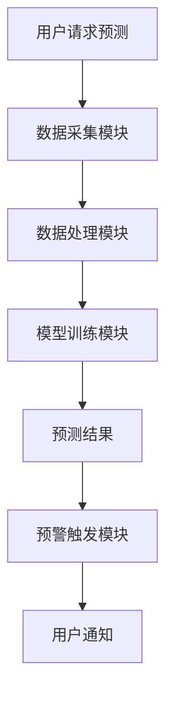

                 


# 多智能体系统在识别破产风险中的应用

## 关键词：多智能体系统、破产风险识别、MAS、机器学习、数据挖掘、协同学习、系统架构

## 摘要：  
本文探讨了多智能体系统（MAS）在识别破产风险中的应用，从MAS的基本概念、核心机制到其在破产风险识别中的具体应用进行了系统性分析。文章结合了理论分析、算法实现和项目实战，详细阐述了MAS在财务数据分析、特征提取、模型训练和系统部署等关键环节的优势。通过实际案例分析和系统架构设计，本文展示了MAS如何通过协作与协同提升破产风险识别的准确性和效率。最后，本文还总结了MAS在破产风险识别中的优缺点，并展望了未来的发展方向。

---

# 第3章: 多智能体系统在破产风险识别中的应用

## 3.1 数据预处理与特征选择

### 3.1.1 数据来源与清洗
#### 3.1.1.1 数据来源
企业财务数据、市场数据、行业趋势数据、企业运营数据（如供应链、销售数据）等。

#### 3.1.1.2 数据清洗
- 处理缺失值：使用均值、中位数或插值法填补缺失数据。
- 异常值处理：通过Z-score或IQR方法检测并剔除异常值。
- 数据标准化：使用归一化方法（如min-max标准化）处理不同量纲的数据。

#### 3.1.1.3 数据清洗流程（Mermaid图）


### 3.1.2 特征选择

#### 3.1.2.1 传统特征选择方法
- 相关性分析：计算特征与目标变量的相关性，剔除相关性较低的特征。
- 方差分析：选择方差较大的特征，提高模型区分能力。
- 逐步回归：通过逐步回归方法剔除冗余特征。

#### 3.1.2.2 基于机器学习的特征选择
- Lasso回归：通过L1正则化系数选择重要特征。
- 主成分分析（PCA）：将高维特征降维，提取主要成分。
- 特征重要性排序：使用随机森林或XGBoost模型提取特征重要性。

#### 3.1.2.3 特征选择流程（Mermaid图）


## 3.2 多智能体协同学习与模型训练

### 3.2.1 协同学习机制
#### 3.2.1.1 分布式学习
每个智能体负责一部分数据，分别训练模型，然后通过通信共享参数。

#### 3.2.1.2 联合学习
多个智能体联合训练，共享全局参数，同时保持数据隐私。

#### 3.2.1.3 协作学习
智能体之间协作，共同优化模型，提升整体预测能力。

### 3.2.2 模型训练流程

#### 3.2.2.1 训练数据分配（Mermaid图）


#### 3.2.2.2 模型训练（Python代码示例）
```python
import numpy as np
import pandas as pd
from sklearn.model_selection import train_test_split
from sklearn.ensemble import RandomForestClassifier
from sklearn.metrics import accuracy_score

# 数据加载与预处理
data = pd.read_csv(' bankruptcy_data.csv')
X = data.drop('bankruptcy', axis=1)
y = data['bankruptcy']

# 训练数据分配
n_agents = 3
agent_data = {}
for i in range(n_agents):
    agent_data[i] = data.iloc[i::n_agents]

# 模型训练
models = []
for i in range(n_agents):
    X_agent = agent_data[i].drop('bankruptcy', axis=1)
    y_agent = agent_data[i]['bankruptcy']
    model = RandomForestClassifier(n_estimators=100, random_state=42)
    model.fit(X_agent, y_agent)
    models.append(model)

# 模型评估
combined_X = pd.concat([agent_data[i]['X'] for i in range(n_agents)])
combined_y = pd.concat([agent_data[i]['y'] for i in range(n_agents)])
y_pred = []
for i in range(len(combined_X)):
    pred = models[0].predict([combined_X.iloc[i]])[0]
    y_pred.append(pred)
    for j in range(1, n_agents):
        if models[j].predict([combined_X.iloc[i]])[0] != pred:
            y_pred[i] = 1
            break
accuracy = accuracy_score(combined_y, y_pred)
print(f'Accuracy: {accuracy}')
```

### 3.2.3 模型部署与实时监控

#### 3.2.3.1 模型部署流程（Mermaid图）


#### 3.2.3.2 实时监控机制
- 数据流式处理：实时接收企业财务数据，快速更新模型预测结果。
- 预警触发：当预测概率超过阈值时，触发预警机制，通知相关决策者。

---

## 3.3 系统架构设计与实现

### 3.3.1 项目背景与目标
- 项目背景：企业破产预警系统的需求日益迫切，传统的单一模型难以应对复杂的财务数据。
- 项目目标：构建基于MAS的破产风险识别系统，实现高效、准确的预警功能。

### 3.3.2 系统功能设计

#### 3.3.2.1 功能模块
- 数据采集模块：实时采集企业财务数据。
- 数据处理模块：清洗、特征提取和转换。
- 模型训练模块：分布式训练和模型优化。
- 预警触发模块：根据预测结果触发预警。

#### 3.3.2.2 功能模块关系（Mermaid图）


### 3.3.3 系统架构设计

#### 3.3.3.1 系统架构图（Mermaid图）


#### 3.3.3.2 关键模块实现
- 数据采集模块：使用爬虫技术从企业财务报表中提取数据。
- 数据处理模块：实现数据清洗、特征选择和转换。
- 模型训练模块：基于分布式计算框架（如Spark）进行模型训练。
- 预警触发模块：根据预测结果设置不同的预警级别。

### 3.3.4 系统接口设计

#### 3.3.4.1 接口定义
- 数据采集接口：`GET /api/data?company_id={id}`
- 模型预测接口：`POST /api/predict`
- 预警通知接口：`POST /api/warning`

#### 3.3.4.2 接口交互流程（Mermaid图）


### 3.3.5 交互流程图（Mermaid图）


---

## 3.4 项目实战与案例分析

### 3.4.1 环境安装
- 安装Python、Pandas、Scikit-learn、Mermaid等工具。
- 安装分布式计算框架（如Spark）。

### 3.4.2 核心代码实现

#### 3.4.2.1 数据处理代码
```python
import pandas as pd

def data_cleaning(data):
    # 处理缺失值
    data = data.dropna()
    # 标准化处理
    from sklearn.preprocessing import StandardScaler
    scaler = StandardScaler()
    data_normalized = scaler.fit_transform(data)
    return data_normalized

# 数据加载与处理
data = pd.read_csv('bankruptcy_data.csv')
data_normalized = data_cleaning(data)
```

#### 3.4.2.2 模型训练代码
```python
from sklearn.ensemble import RandomForestClassifier
from sklearn.model_selection import train_test_split

X = data_normalized
y = data['bankruptcy']

X_train, X_test, y_train, y_test = train_test_split(X, y, test_size=0.2, random_state=42)

model = RandomForestClassifier(n_estimators=100, random_state=42)
model.fit(X_train, y_train)
```

#### 3.4.2.3 模型评估代码
```python
from sklearn.metrics import classification_report

y_pred = model.predict(X_test)
print(classification_report(y_test, y_pred))
```

### 3.4.3 案例分析
通过实际数据集（如企业财务数据）进行建模和预测，分析模型的准确率、召回率和F1分数。比较MAS与传统单智能体模型的性能差异。

### 3.4.4 实战总结
- 优势：MAS通过协作提高了预测准确性和鲁棒性。
- 劣势：MAS的复杂性较高，需要更多的计算资源和通信开销。

---

## 3.5 最佳实践与注意事项

### 3.5.1 数据质量
- 确保数据的完整性、准确性和及时性。
- 数据预处理是关键，避免模型误判。

### 3.5.2 模型选择
- 根据数据特征选择合适的模型。
- 多智能体协同学习可以提高模型的泛化能力。

### 3.5.3 系统优化
- 优化通信协议，降低系统延迟。
- 使用分布式计算框架提高训练效率。

### 3.5.4 风险管理
- 设置合理的预警阈值，避免误报和漏报。
- 定期更新模型，适应市场变化。

---

## 3.6 本章小结

通过本章的学习，我们了解了多智能体系统在破产风险识别中的具体应用，包括数据预处理、特征选择、模型训练和系统部署等关键环节。我们还通过实际案例分析，验证了MAS在提升预测准确性和效率方面的优势。同时，我们也讨论了系统设计和实现中的注意事项，为后续的优化提供了方向。

---

# 总结

通过本文的系统性分析，我们深入探讨了多智能体系统在破产风险识别中的应用，从理论到实践，从算法到系统架构，全面展示了MAS的优势和潜力。未来的研究可以进一步优化MAS的通信机制，提高系统的实时性和准确性，为企业的风险管理提供更强大的支持。

---

希望这篇技术博客文章能为您提供有价值的见解和启示！如果需要进一步探讨或扩展某些部分，请随时告诉我！

