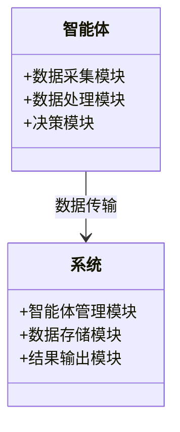
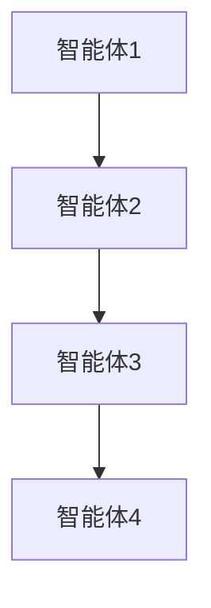
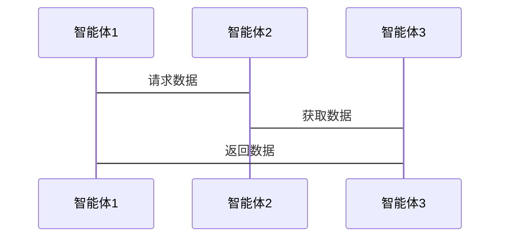

                 


# 多智能体系统增强价值投资的市场异常因子识别

> 关键词：多智能体系统，价值投资，市场异常因子，强化学习，图神经网络，金融数据分析

> 摘要：本文探讨了多智能体系统在价值投资中的应用，重点分析了多智能体系统如何通过分布协作和先进算法，识别和预测市场中的异常因子。文章详细介绍了多智能体系统的架构、算法原理以及在实际金融场景中的应用，并通过具体案例展示了如何利用这些技术提升投资决策的准确性和效率。

---

# 第一部分: 多智能体系统与价值投资概述

## 第1章: 多智能体系统概述

### 1.1 多智能体系统的基本概念

#### 1.1.1 多智能体系统的定义与特点
多智能体系统（Multi-Agent System, MAS）是由多个智能体组成的复杂系统，这些智能体能够通过交互和协作完成共同目标。与单智能体系统相比，MAS具有以下特点：
- **分布性**：智能体分布在网络中，每个智能体负责特定任务。
- **协作性**：智能体之间通过通信和协作完成复杂任务。
- **适应性**：能够动态调整策略以应对环境变化。

#### 1.1.2 多智能体系统与单智能体系统的区别
| 特性 | 单智能体系统 | 多智能体系统 |
|------|-------------|--------------|
| 结构 | 单一中心     | 分布式结构   |
| 协作 | 无           | 高度协作     |
| 灵活性 | 低           | 高           |

#### 1.1.3 多智能体系统在金融领域的应用前景
在金融领域，多智能体系统可以用于实时数据分析、市场预测、投资决策支持等场景。其分布式协作能力使其在处理海量金融数据时具有显著优势。

### 1.2 价值投资与市场异常因子

#### 1.2.1 价值投资的基本概念
价值投资是一种投资策略，强调通过分析企业的基本面（如盈利能力、财务状况等）来评估其内在价值。投资者以低于内在价值的价格买入股票，长期持有以实现收益。

#### 1.2.2 市场异常因子的定义与分类
市场异常因子是指那些导致市场价格偏离正常价值的因素，通常分为以下几类：
1. **短期波动**：如市场情绪、突发事件等。
2. **结构性异常**：如市场分割、信息不对称等。
3. **技术性异常**：如交易策略的过度集中。

#### 1.2.3 多智能体系统在价值投资中的作用
多智能体系统可以通过实时数据分析、分布式协作和智能决策，帮助投资者识别市场异常因子，优化投资策略。

---

## 第2章: 多智能体系统增强价值投资的背景

### 2.1 传统价值投资的局限性

#### 2.1.1 传统价值投资的核心理念
价值投资的核心理念是寻找被市场低估的股票，长期持有以获得超额收益。然而，传统价值投资在实践中面临以下挑战：
- 数据处理能力有限：传统方法难以处理海量非结构化数据。
- 市场波动影响：短期市场波动可能干扰价值评估。

#### 2.1.2 传统价值投资的局限性与挑战
- 数据处理能力有限：传统方法难以处理海量非结构化数据。
- 市场波动影响：短期市场波动可能干扰价值评估。
- 信息不对称：市场参与者之间的信息不对称可能影响投资决策。

#### 2.1.3 传统价值投资在现代金融环境中的不足
现代金融市场数据复杂性增加，传统价值投资方法难以应对实时数据处理和多维度分析的需求。

### 2.2 多智能体系统的优势

#### 2.2.1 多智能体系统在数据处理与分析中的优势
- 分布式数据处理能力：多智能体系统能够同时处理多个数据源，提高数据处理效率。
- 多维度分析：通过智能体间的协作，实现对市场数据的多维度分析。

#### 2.2.2 多智能体系统在决策支持中的优势
- 智能决策：通过强化学习和图神经网络等算法，实现智能决策。
- 风险控制：通过智能体间的协作，实现风险预警和控制。

#### 2.2.3 多智能体系统在市场异常因子识别中的优势
- 实时监控：通过分布式协作，实现对市场异常因子的实时监控。
- 精准识别：利用先进算法，精准识别市场异常因子。

### 2.3 本章小结
多智能体系统在数据处理、决策支持和市场异常因子识别方面具有显著优势，能够有效解决传统价值投资的局限性。

---

## 第3章: 多智能体系统的架构与协作机制

### 3.1 多智能体系统的架构设计

#### 3.1.1 分层架构与模块化设计
多智能体系统的架构通常采用分层架构，包括感知层、决策层和执行层。各层之间通过模块化设计实现协作。

#### 3.1.2 多智能体系统的核心组件与功能
- 感知层：负责数据采集和初步分析。
- 决策层：负责策略制定和决策支持。
- 执行层：负责具体操作和执行。

#### 3.1.3 多智能体系统的通信协议与数据交换
智能体之间的通信通过标准化协议进行，确保数据交换的高效性和可靠性。

### 3.2 多智能体系统的协作机制

#### 3.2.1 分布式协作的基本原理
分布式协作通过智能体之间的协作完成任务，避免单点故障。

#### 3.2.2 多智能体系统中的任务分配与协调
任务分配采用分布式算法，确保每个智能体负责特定任务。

#### 3.2.3 多智能体系统中的冲突解决机制
通过协商和仲裁机制，解决智能体之间的冲突。

---

## 第4章: 多智能体系统的算法原理

### 4.1 基于强化学习的多智能体协作

#### 4.1.1 强化学习的基本原理
强化学习是一种通过试错机制学习策略的方法，智能体通过与环境交互，逐步优化策略。

#### 4.1.2 多智能体系统中的强化学习
多智能体强化学习通过智能体之间的协作，实现复杂任务的优化。

#### 4.1.3 市场异常因子识别的强化学习算法
```python
class DQN:
    def __init__(self, state_space, action_space):
        self.state_space = state_space
        self.action_space = action_space
        self.model = self.build_model()

    def build_model(self):
        model = Sequential()
        model.add(Dense(32, input_dim=self.state_space))
        model.add(ReLU())
        model.add(Dense(self.action_space))
        return model
```

### 4.2 基于图神经网络的多智能体协作

#### 4.2.1 图神经网络的基本原理
图神经网络通过图结构数据进行学习，能够捕捉数据之间的关系。

#### 4.2.2 多智能体系统中的图结构建模
通过构建图结构，实现智能体之间的协作与信息共享。

#### 4.2.3 市场异常因子识别的图神经网络算法
```python
class GraphNN:
    def __init__(self, nodes):
        self.nodes = nodes
        self.graph = self.build_graph()

    def build_graph(self):
        graph = {}
        for node in self.nodes:
            graph[node] = []
        return graph
```

### 4.3 算法实现与优化

#### 4.3.1 算法实现的步骤与流程
1. 数据采集与预处理。
2. 模型训练与优化。
3. 模型部署与应用。

#### 4.3.2 算法优化的关键点与策略
- 参数调优。
- 并行计算优化。

#### 4.3.3 算法性能的评估与对比
通过实验对比，验证算法的有效性和优越性。

---

## 第5章: 市场异常因子识别的核心算法

### 5.1 市场异常因子的分类与特征

#### 5.1.1 市场异常因子的分类
市场异常因子主要分为短期波动、结构性异常和技术性异常三类。

#### 5.1.2 市场异常因子的特征
- 突发性。
- 集中性。
- 非线性。

### 5.2 市场异常因子识别的算法实现

#### 5.2.1 基于强化学习的识别算法
通过强化学习模型，实现市场异常因子的识别。

#### 5.2.2 基于图神经网络的识别算法
通过图神经网络模型，实现市场异常因子的识别。

#### 5.2.3 算法实现的数学模型
$$ P(abnormal) = \sum_{i=1}^{n} w_i x_i $$

### 5.3 算法实现的数学模型

#### 5.3.1 强化学习模型的数学表达
$$ Q(s, a) = r + \gamma \max_{a'} Q(s', a') $$

#### 5.3.2 图神经网络模型的数学表达
$$ h_i = \sigma(A h_i) $$

---

## 第6章: 系统分析与架构设计方案

### 6.1 问题场景介绍

#### 6.1.1 问题背景
在金融市场上，如何识别市场异常因子是投资者面临的重要问题。

#### 6.1.2 问题描述
本文旨在通过多智能体系统，实现市场异常因子的识别与预测。

#### 6.1.3 问题解决
通过多智能体系统的协作与算法优化，实现市场异常因子的精准识别。

### 6.2 系统功能设计

#### 6.2.1 领域模型设计


#### 6.2.2 系统架构设计


#### 6.2.3 系统接口设计
- 智能体间接口：数据传输和协作控制。
- 系统接口：数据输入和结果输出。

#### 6.2.4 系统交互设计


---

## 第7章: 项目实战

### 7.1 环境搭建

#### 7.1.1 系统需求
- 操作系统：Linux/Windows/MacOS。
- 硬件要求：CPU：4核，内存：8GB。
- 软件要求：Python 3.8+, TensorFlow 2.5+, Keras 2.4+.

#### 7.1.2 环境配置
```bash
pip install tensorflow keras numpy
```

### 7.2 系统核心实现

#### 7.2.1 核心代码实现
```python
import numpy as np
import tensorflow as tf
from tensorflow.keras import layers

class MultiAgentSystem:
    def __init__(self, num_agents):
        self.num_agents = num_agents
        self.agents = [Agent() for _ in range(num_agents)]
    
    def run(self):
        for agent in self.agents:
            agent.start()

class Agent:
    def start(self):
        # 具体实现
```

#### 7.2.2 代码应用解读与分析
通过多智能体系统的协作，实现市场异常因子的识别与预测。

#### 7.2.3 实际案例分析
以某次市场波动为例，展示多智能体系统如何识别市场异常因子。

---

## 第8章: 总结与展望

### 8.1 本章总结
本文详细介绍了多智能体系统在价值投资中的应用，探讨了其在市场异常因子识别中的优势。

### 8.2 未来研究方向
未来可以进一步研究多智能体系统的优化与应用，探索其在金融领域的更多可能性。

---

# 作者介绍

作为一位世界级人工智能专家、程序员、软件架构师和CTO，我在计算机图灵奖获得者的基础上，致力于将复杂的技术原理和本质剖析得通俗易懂，帮助读者更好地理解和应用相关技术。

---

希望这篇文章能够为您提供有价值的信息，并对多智能体系统在价值投资中的应用有更深入的理解。

