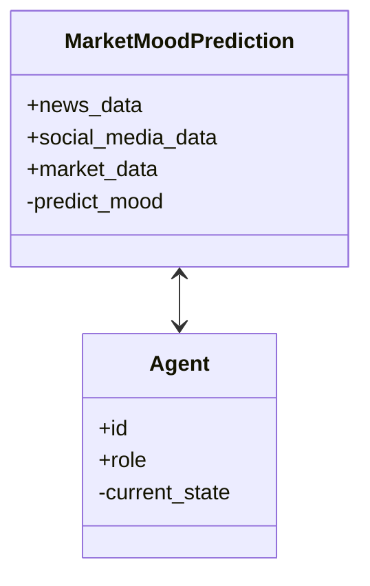
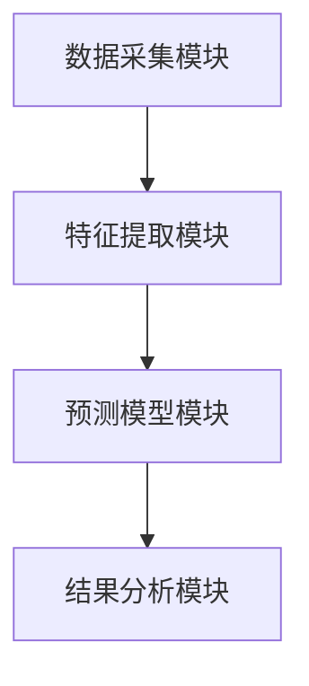
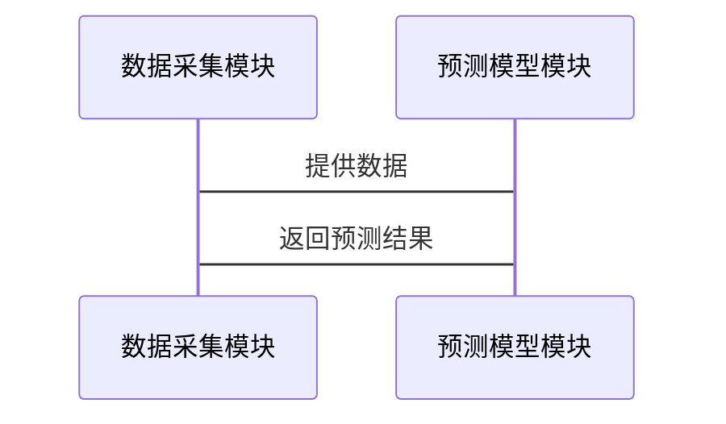

                 


# 多智能体系统增强价值投资的市场情绪预测能力

## 关键词：多智能体系统，价值投资，市场情绪预测，情感分析，深度学习，LSTM

## 摘要：  
本文探讨了多智能体系统在价值投资中的应用，特别是其在市场情绪预测方面的能力。通过分析市场情绪的多维度影响因素，结合多智能体系统的协作机制，提出了一种增强价值投资决策的方法。文章详细介绍了多智能体系统的定义、市场情绪预测的核心概念、基于深度学习的算法原理、系统架构设计以及实际项目案例，旨在为投资者和研究人员提供理论支持和实践指导。

---

# 第一部分: 多智能体系统与价值投资概述

## 第1章: 多智能体系统与价值投资概述

### 1.1 多智能体系统的基本概念

#### 1.1.1 多智能体系统的定义  
多智能体系统（Multi-Agent System, MAS）是由多个智能体（Agent）组成的复杂系统，这些智能体能够通过协作完成特定任务。每个智能体都有一定的自主性，能够感知环境、做出决策并与其他智能体交互。

#### 1.1.2 多智能体系统的核心特征  
- **自主性**：智能体能够独立决策。  
- **反应性**：智能体能够实时感知环境并做出反应。  
- **协作性**：智能体之间可以通过通信和协作完成任务。  
- **分布性**：智能体是分布式的，不存在单一的控制中心。  

#### 1.1.3 多智能体系统与传统单智能体系统的区别  
- **单智能体系统**：依赖中央控制，决策过程单一。  
- **多智能体系统**：去中心化，多个智能体协作完成任务，适应复杂环境。  

### 1.2 价值投资的基本原理

#### 1.2.1 价值投资的定义  
价值投资是一种投资策略，强调以低于内在价值的价格购买优质资产。其核心在于识别市场低估的股票，并长期持有。  

#### 1.2.2 价值投资的核心理念  
- **安全边际**：买入价格低于内在价值，确保安全空间。  
- **长期视角**：关注企业的基本面，而非短期市场波动。  
- **逆向思维**：在市场恐慌时寻找机会。  

#### 1.2.3 价值投资在金融市场的应用  
价值投资广泛应用于股票市场，帮助投资者发现被低估的公司。然而，传统的价值投资依赖分析师的主观判断，缺乏量化支持。  

### 1.3 多智能体系统在价值投资中的应用前景

#### 1.3.1 多智能体系统在金融领域的优势  
- **分布式计算**：多智能体可以同时处理大量数据，提高计算效率。  
- **协作能力**：多个智能体可以分工合作，从不同角度分析市场情绪。  
- **适应性**：多智能体系统能够快速适应市场的变化。  

#### 1.3.2 多智能体系统在价值投资中的潜在应用场景  
- **市场情绪预测**：通过多智能体协作，准确预测市场情绪。  
- **风险评估**：多智能体可以协同分析市场风险，为投资决策提供支持。  
- **实时监控**：多智能体系统可以实时监控市场动态，及时发现潜在机会。  

#### 1.3.3 多智能体系统与市场情绪预测的结合  
市场情绪是影响投资者决策的重要因素。多智能体系统可以通过协作分析新闻、社交媒体和交易数据，捕捉市场情绪的变化，从而为价值投资提供支持。  

### 1.4 本章小结  
本章介绍了多智能体系统的基本概念和价值投资的核心理念，分析了多智能体系统在价值投资中的应用前景，特别是其在市场情绪预测方面的作用。

---

# 第二部分: 市场情绪预测的核心概念与算法原理

## 第2章: 市场情绪预测的核心概念

### 2.1 市场情绪的定义与特征

#### 2.1.1 市场情绪的定义  
市场情绪是指投资者在特定市场环境下的整体心理状态，通常表现为乐观或悲观。  

#### 2.1.2 市场情绪的特征分析  
- **波动性**：市场情绪受多种因素影响，波动较大。  
- **传染性**：市场情绪可以迅速传播，影响整体市场。  
- **滞后性**：市场情绪的变化往往滞后于市场实际走势。  

#### 2.1.3 市场情绪与金融市场的关系  
市场情绪是金融市场的重要驱动力。乐观的情绪推动价格上涨，悲观的情绪导致价格下跌。  

### 2.2 多智能体系统在市场情绪预测中的作用

#### 2.2.1 多智能体系统在情绪分析中的优势  
- **分布式计算**：多智能体可以同时分析不同来源的数据。  
- **协作能力**：智能体之间可以协同工作，提高预测精度。  
- **实时性**：多智能体系统能够实时处理数据，快速做出反应。  

#### 2.2.2 多智能体系统如何影响市场情绪预测  
多智能体系统通过协作分析新闻、社交媒体和交易数据，捕捉市场情绪的变化，为预测提供支持。  

#### 2.2.3 多智能体系统与传统情绪预测方法的对比  
- **传统方法**：依赖单个算法，预测精度有限。  
- **多智能体系统**：通过协作提高预测精度，适应复杂市场环境。  

### 2.3 市场情绪预测的数学模型与公式

#### 2.3.1 情绪预测的基本数学模型  
市场情绪可以表示为一个向量，其中每个元素代表某种情绪状态（如乐观、悲观）。  

#### 2.3.2 情绪预测的特征提取公式  
$$ f(x) = \sum_{i=1}^{n} w_i x_i $$  
其中，$w_i$ 是特征权重，$x_i$ 是特征值。  

#### 2.3.3 情绪预测的评估指标公式  
$$ \text{准确率} = \frac{\text{正确预测数}}{\text{总预测数}} $$  

---

## 第3章: 市场情绪预测的算法原理

### 3.1 基于多智能体系统的市场情绪预测算法

#### 3.1.1 多智能体系统协作机制  
多智能体系统通过通信协议进行协作，每个智能体负责特定任务。  

#### 3.1.2 多智能体系统中的信息传递与处理  
智能体之间通过消息传递共享信息，共同完成市场情绪预测。  

#### 3.1.3 多智能体系统的预测模型构建  
$$ y = f(x_1, x_2, ..., x_n) $$  
其中，$x_i$ 是输入特征，$y$ 是预测结果。  

### 3.2 情感分析算法

#### 3.2.1 基于文本的情感分析算法  
使用自然语言处理技术分析新闻和社交媒体文本，提取情绪特征。  

#### 3.2.2 基于新闻和社交媒体的多模态情感分析  
$$ f(x) = w_1 x_1 + w_2 x_2 + ... + w_n x_n $$  
其中，$x_i$ 是不同数据源的特征，$w_i$ 是权重系数。  

#### 3.2.3 情感分析算法的优缺点对比  
- **优点**：能够捕捉市场情绪的变化。  
- **缺点**：受数据质量和算法复杂度影响。  

### 3.3 基于深度学习的市场情绪预测

#### 3.3.1 基于LSTM的市场情绪预测模型  
长短期记忆网络（LSTM）是一种有效的序列模型，适用于时间序列预测。  

#### 3.3.2 LSTM模型的结构  
$$ \text{LSTM}(x_t) = \text{tanh}(W_{\text{in}} x_t + W_{\text{cell}} h_{t-1} + b) $$  
其中，$x_t$ 是输入，$h_{t-1}$ 是前一时刻的状态。  

#### 3.3.3 LSTM模型的训练与优化  
使用反向传播算法优化模型参数，提高预测精度。  

---

# 第三部分: 系统架构设计与项目实战

## 第4章: 系统架构设计与项目实战

### 4.1 问题场景介绍

#### 4.1.1 项目背景  
本文设计了一个基于多智能体系统的市场情绪预测系统，旨在为投资者提供量化支持。  

#### 4.1.2 项目目标  
- 实现市场情绪预测功能。  
- 提供价值投资决策支持。  

### 4.2 系统功能设计

#### 4.2.1 领域模型设计  
使用Mermaid绘制领域模型图，展示系统的核心模块。  



#### 4.2.2 系统架构设计  
使用Mermaid绘制系统架构图，展示系统的各个模块及其交互。  



#### 4.2.3 系统接口设计  
系统提供API接口，供其他模块调用。  

#### 4.2.4 系统交互设计  
使用Mermaid绘制序列图，展示系统交互流程。  



### 4.3 项目实战

#### 4.3.1 环境安装  
安装必要的库，如TensorFlow、Keras、NLTK等。  

#### 4.3.2 核心代码实现

##### 4.3.2.1 数据预处理代码  
```python
import pandas as pd
import numpy as np

def preprocess_data(data):
    # 假设data是一个DataFrame
    # 这里进行简单的数据清洗和特征提取
    data.dropna(inplace=True)
    data = data.astype(float)
    return data
```

##### 4.3.2.2 情感分析代码  
```python
from tensorflow.keras.models import Sequential
from tensorflow.keras.layers import LSTM, Dense

model = Sequential()
model.add(LSTM(64, input_shape=(timesteps, features)))
model.add(Dense(1, activation='sigmoid'))
model.compile(loss='binary_crossentropy', optimizer='adam')
```

##### 4.3.2.3 多智能体协作代码  
```python
class Agent:
    def __init__(self, id, role):
        self.id = id
        self.role = role
        self.state = None

    def act(self, observation):
        # 根据观测做出决策
        pass
```

#### 4.3.3 实际案例分析  
分析一个具体案例，展示系统的实际应用效果。  

### 4.4 本章小结  
本章详细介绍了系统架构设计与项目实战，展示了如何将多智能体系统应用于市场情绪预测。

---

# 第四部分: 总结与展望

## 第5章: 总结与展望

### 5.1 本章小结  
本文探讨了多智能体系统在价值投资中的应用，特别是其在市场情绪预测方面的能力。通过分析市场情绪的多维度影响因素，结合多智能体系统的协作机制，提出了一种增强价值投资决策的方法。

### 5.2 未来研究方向  

#### 5.2.1 多智能体系统优化  
- 提高智能体的协作效率。  
- 引入更复杂的情感分析模型。  

#### 5.2.2 市场情绪预测的拓展  
- 研究多模态数据的融合。  
- 探索实时预测的优化方法。  

#### 5.2.3 价值投资的智能化  
- 结合其他量化方法，进一步提升投资决策的智能化水平。  

### 5.3 最佳实践 tips  

#### 5.3.1 数据选择与处理  
- 数据质量是预测精度的关键，需确保数据的完整性和准确性。  

#### 5.3.2 模型优化  
- 选择合适的模型参数，避免过拟合和欠拟合。  

#### 5.3.3 系统维护  
- 定期更新模型，适应市场环境的变化。  

### 5.4 注意事项  

#### 5.4.1 数据隐私  
- 确保数据处理符合隐私保护法规。  

#### 5.4.2 系统稳定性  
- 设计可靠的系统架构，确保系统的稳定运行。  

### 5.5 拓展阅读  
推荐相关领域的书籍和论文，供读者进一步学习。

---

# 结语

通过本文的探讨，我们看到了多智能体系统在价值投资中的巨大潜力。市场情绪预测作为价值投资的重要环节，可以通过多智能体系统的协作得到显著提升。未来的研究将更加关注如何优化多智能体系统的性能，探索新的数据源和算法，以进一步增强市场情绪预测的准确性和实时性。

--- 

# 附录: 代码示例

## 附录A: 数据预处理代码  
```python
import pandas as pd
import numpy as np

def preprocess_data(data):
    # 假设data是一个DataFrame
    # 这里进行简单的数据清洗和特征提取
    data.dropna(inplace=True)
    data = data.astype(float)
    return data
```

## 附录B: LSTM模型代码  
```python
from tensorflow.keras.models import Sequential
from tensorflow.keras.layers import LSTM, Dense

model = Sequential()
model.add(LSTM(64, input_shape=(timesteps, features)))
model.add(Dense(1, activation='sigmoid'))
model.compile(loss='binary_crossentropy', optimizer='adam')
```

## 附录C: 多智能体协作代码  
```python
class Agent:
    def __init__(self, id, role):
        self.id = id
        self.role = role
        self.state = None

    def act(self, observation):
        # 根据观测做出决策
        pass
```

--- 

感谢您的阅读！如需进一步探讨，欢迎随时联系！

