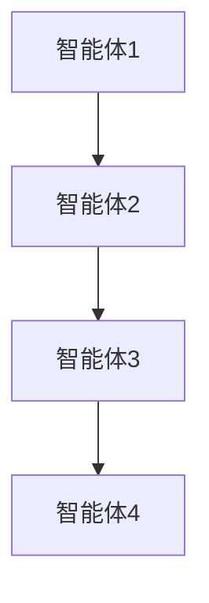
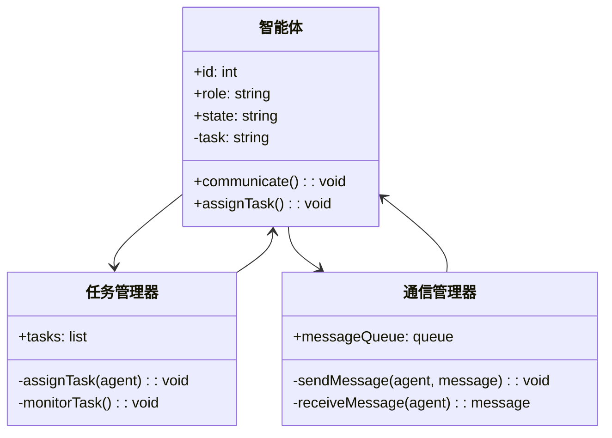
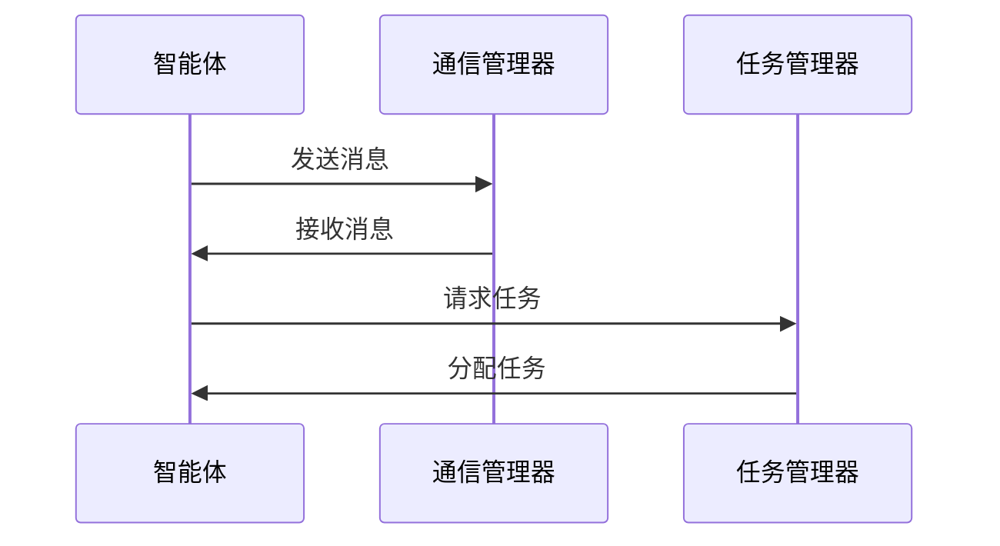

                 


# 多智能体系统如何实现动态行业轮动

> 关键词：多智能体系统，动态行业轮动，协同决策，任务分配，系统架构，轮动机制，轮动策略

> 摘要：多智能体系统通过多个智能体协同工作，能够实现动态行业的轮动。本文从多智能体系统的基本概念出发，分析了动态行业轮动的背景与意义，探讨了多智能体系统中的通信协议、任务分配与协作机制，详细讲解了动态行业轮动的实现策略，包括轮动机制和轮动策略。最后，通过具体的案例分析，展示了多智能体系统在动态行业轮动中的实际应用。

---

# 第一部分: 多智能体系统概述

## 第1章: 多智能体系统的基本概念

### 1.1 多智能体系统的基本定义

#### 1.1.1 多智能体系统的定义

多智能体系统（Multi-Agent System, MAS）是由多个智能体（Agent）组成的复杂系统。智能体是指能够感知环境、自主决策并采取行动的实体。多智能体系统通过智能体之间的协作与通信，共同完成复杂的任务。

#### 1.1.2 多智能体系统的特征

- **自主性**：每个智能体都能够自主决策。
- **反应性**：智能体能够实时感知环境并做出反应。
- **协作性**：多个智能体通过协作完成共同目标。
- **分布性**：智能体分布在网络中，可能位于不同的地理位置。

#### 1.1.3 多智能体系统与单智能体系统的区别

| 特性          | 单智能体系统                  | 多智能体系统                  |
|---------------|-----------------------------|-----------------------------|
| 智能体数量    | 1                           | 多                           |
| 任务分配      | 系统内部完成                 | 需要协调多个智能体完成任务   |
| 通信与协作    | 不需要                        | 需要智能体之间通信与协作     |
| 系统复杂性    | 较低                         | 较高                         |

### 1.2 多智能体系统的分类

#### 1.2.1 基于任务的分类

- **任务驱动型**：智能体之间的协作是为了完成特定任务。
- **学习驱动型**：智能体通过学习不断优化自身行为。

#### 1.2.2 基于结构的分类

- **层次结构型**：智能体之间有明确的层级关系。
- **网状结构型**：智能体之间通过网络进行通信与协作。

#### 1.2.3 基于通信方式的分类

- **直接通信型**：智能体之间直接通过通信协议进行交互。
- **间接通信型**：通过中间媒介进行通信。

## 第2章: 动态行业轮动的背景与意义

### 2.1 动态行业轮动的背景

动态行业轮动是指在不同行业之间快速切换或调整资源分配的过程。随着市场的变化和技术的进步，企业需要能够快速响应市场的需求，动态调整其业务策略。

### 2.2 多智能体系统在动态行业轮动中的作用

#### 2.2.1 多智能体系统的优势

- **高效性**：通过智能体之间的协作，能够快速完成任务。
- **灵活性**：智能体可以根据环境变化动态调整行为。
- **鲁棒性**：系统能够在部分智能体失效的情况下继续运行。

#### 2.2.2 多智能体系统在行业轮动中的应用场景

- **金融投资**：通过多智能体系统实时监控市场变化，动态调整投资组合。
- **供应链管理**：优化供应链中的资源分配，提高效率。

#### 2.2.3 多智能体系统实现动态行业轮动的挑战

- **通信延迟**：智能体之间的通信可能会引入延迟。
- **任务分配**：如何高效地分配任务是关键问题。
- **协作冲突**：智能体之间的协作可能会产生冲突。

---

# 第二部分: 多智能体系统的理论基础

## 第3章: 多智能体系统的通信协议

### 3.1 通信协议的基本概念

通信协议是智能体之间进行信息交换的规则。它定义了消息的格式、传输方式以及响应机制。

### 3.2 多智能体系统中的通信模型

#### 3.2.1 模型的基本结构



#### 3.2.2 模型的实现方式

- **基于消息队列**：智能体之间通过消息队列进行通信。
- **基于发布订阅**：智能体发布事件，其他智能体订阅并处理。

### 3.3 通信协议的实现

通信协议的实现通常包括以下几个步骤：

1. **消息格式定义**：定义消息的结构和内容。
2. **消息传输**：通过网络进行消息传输。
3. **消息处理**：接收端智能体处理接收到的消息。

---

## 第4章: 多智能体系统的任务分配与协作

### 4.1 任务分配的基本原理

任务分配是多智能体系统中的核心问题。智能体需要根据自身的能力和当前状态，选择适合的任务。

### 4.2 协作机制的实现

#### 4.2.1 协作的基本概念

协作机制是指智能体之间如何协同完成任务的规则和策略。

#### 4.2.2 协作的实现方式

- **基于角色分配**：根据智能体的角色分配任务。
- **基于能力分配**：根据智能体的能力分配任务。

---

# 第三部分: 动态行业轮动的实现机制

## 第5章: 动态行业轮动的轮动机制

### 5.1 轮动机制的基本概念

轮动机制是指智能体根据环境变化，动态调整自身行为和任务分配的机制。

### 5.2 轮动机制的实现

#### 5.2.1 轮动算法

轮动算法的核心思想是根据环境变化，动态调整智能体的任务分配。

#### 5.2.2 轮动策略

轮动策略是轮动机制的具体实现方式。常见的轮动策略包括：

1. **轮询策略**：按顺序轮询智能体，分配任务。
2. **优先级策略**：根据智能体的优先级分配任务。
3. **负载均衡策略**：根据智能体的负载情况分配任务。

---

## 第6章: 动态行业轮动的实现策略

### 6.1 动态行业轮动的实现框架

动态行业轮动的实现框架通常包括以下几个部分：

1. **感知环境**：智能体感知当前环境的变化。
2. **决策与规划**：智能体根据环境变化做出决策。
3. **任务分配**：智能体根据决策分配任务。
4. **协作执行**：智能体协作完成任务。
5. **反馈与优化**：根据执行结果优化决策。

---

# 第四部分: 系统架构设计

## 第7章: 动态行业轮动系统的架构设计

### 7.1 系统功能设计

#### 7.1.1 领域模型设计



#### 7.1.2 系统架构设计

```mermaid
container 动态行业轮动系统 {
    class 智能体 {
        +id: int
        +role: string
        +state: string
        -task: string
        +communicate(): void
        +assignTask(): void
    }
    class 任务管理器 {
        +tasks: list
        -assignTask(agent): void
        -monitorTask(): void
    }
    class 通信管理器 {
        +messageQueue: queue
        -sendMessage(agent, message): void
        -receiveMessage(agent): message
    }
    智能体 --> 任务管理器
    智能体 --> 通信管理器
    任务管理器 --> 智能体
    通信管理器 --> 智能体
}
```

#### 7.1.3 接口与交互设计



---

# 第五部分: 项目实战

## 第8章: 动态行业轮动系统的实现

### 8.1 环境安装

为了实现动态行业轮动系统，需要安装以下工具和库：

- **Python**：用于编写智能体和管理器。
- **networkx**：用于绘制系统架构图。
- **numpy**：用于处理数据。

### 8.2 系统核心实现

#### 8.2.1 智能体类的实现

```python
class Agent:
    def __init__(self, id):
        self.id = id
        self.role = "default"
        self.state = "idle"
        self.task = None

    def communicate(self, message):
        # 实现通信逻辑
        pass

    def assign_task(self, task):
        self.task = task
        self.state = "busy"
```

#### 8.2.2 任务管理器的实现

```python
class TaskManager:
    def __init__(self):
        self.tasks = []

    def assign_task(self, agent, task):
        agent.assign_task(task)
        self.tasks.append(task)

    def monitor_task(self):
        # 实现任务监控逻辑
        pass
```

### 8.3 案例分析与实现

#### 8.3.1 案例分析

假设我们有一个由4个智能体组成的系统，任务管理器根据智能体的负载情况动态分配任务。

#### 8.3.2 实现分析

通过上述代码，智能体可以根据任务管理器的分配完成任务。任务管理器可以根据智能体的负载情况，动态调整任务分配。

---

# 第六部分: 总结与展望

## 第9章: 总结

### 9.1 本文总结

本文详细介绍了多智能体系统如何实现动态行业轮动，从基本概念到具体实现，涵盖了通信协议、任务分配、轮动机制等多个方面。

### 9.2 未来展望

随着人工智能技术的不断发展，多智能体系统在动态行业轮动中的应用将更加广泛。未来的研究方向包括优化任务分配算法、提高通信效率等。

---

# 参考文献

1. 书籍：《多智能体系统》
2. 论文：《基于多智能体的动态行业轮动研究》
3. 网站：相关技术博客和开发者文档

---

通过本文的详细讲解，读者可以全面理解多智能体系统在动态行业轮动中的实现方法，并能够将其应用到实际项目中。

