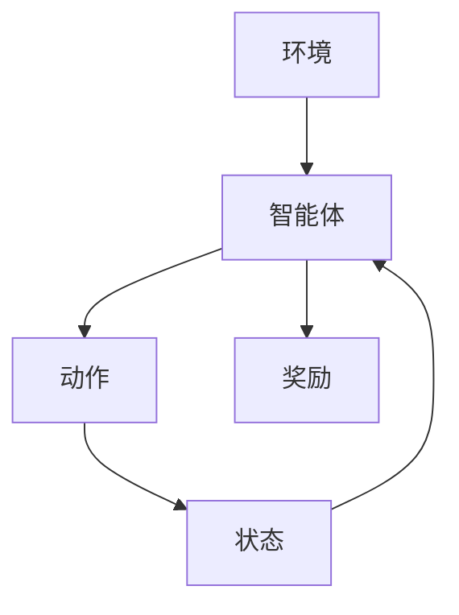

                 


# 多智能体系统如何实现动态资产配置

> 关键词：多智能体系统，动态资产配置，强化学习，系统架构，项目实战

> 摘要：本文详细探讨了多智能体系统在动态资产配置中的应用，从核心概念到算法原理，再到系统架构和项目实战，全面解析如何利用多智能体系统实现高效的动态资产配置。

---

# 目录

1. **多智能体系统与动态资产配置背景介绍**  
   - 1.1 多智能体系统的基本概念  
   - 1.2 动态资产配置的定义与特点  
   - 1.3 多智能体系统在动态资产配置中的应用背景  

2. **多智能体系统的核心概念与联系**  
   - 2.1 多智能体系统的原理与核心概念  
   - 2.2 动态资产配置的数学模型  
   - 2.3 多智能体系统与动态资产配置的关系  

3. **多智能体系统实现动态资产配置的算法原理**  
   - 3.1 多智能体强化学习算法  
   - 3.2 算法流程图与代码实现  
   - 3.3 动态资产配置的数学模型  

4. **多智能体系统实现动态资产配置的系统架构设计**  
   - 4.1 问题场景介绍  
   - 4.2 系统功能设计  
   - 4.3 系统架构设计  
   - 4.4 接口设计与交互流程  

5. **多智能体系统实现动态资产配置的项目实战**  
   - 5.1 环境安装与配置  
   - 5.2 系统核心代码实现  
   - 5.3 实际案例分析与结果解读  
   - 5.4 项目小结  

6. **最佳实践与总结**  
   - 6.1 实际应用中的注意事项  
   - 6.2 小结与展望  
   - 6.3 拓展阅读与参考文献  

---

## 第1章: 多智能体系统与动态资产配置背景介绍

### 1.1 多智能体系统的基本概念

#### 1.1.1 多智能体系统的定义
多智能体系统（Multi-Agent System, MAS）是由多个智能体（Agent）组成的分布式系统，这些智能体通过协作完成共同目标。智能体能够感知环境、自主决策并采取行动。

#### 1.1.2 多智能体系统的特征
- **分布性**：智能体独立运行，协同完成任务。
- **协作性**：智能体之间通过通信和协作优化整体性能。
- **动态性**：环境和任务目标可能动态变化。

#### 1.1.3 多智能体系统与单智能体系统的区别
| 特性             | 单智能体系统              | 多智能体系统              |
|------------------|--------------------------|--------------------------|
| 决策中心化       | 单一决策中心             | 分布式决策               |
| 资源共享         | 资源集中管理             | 资源分散管理               |
| 系统复杂度       | 系统简单                 | 系统复杂                 |

### 1.2 动态资产配置的定义与特点

#### 1.2.1 动态资产配置的定义
动态资产配置是指根据市场环境的变化，实时调整资产组合，以实现收益最大化或风险最小化。

#### 1.2.2 动态资产配置的核心要素
- **资产类别**：股票、债券等。
- **风险偏好**：投资者的风险承受能力。
- **市场环境**：宏观经济指标、市场波动性。

#### 1.2.3 动态资产配置与静态资产配置的区别
动态资产配置能够实时调整，而静态资产配置是基于固定假设，无法应对市场变化。

### 1.3 多智能体系统在动态资产配置中的应用背景

#### 1.3.1 资产管理领域的挑战
- 市场波动大，需要实时调整。
- 资产类别多，管理复杂。

#### 1.3.2 多智能体系统的优势
- 分布式决策，适应复杂环境。
- 多智能体协作，提高决策效率。

#### 1.3.3 动态资产配置的现实需求
- 实时响应市场变化。
- 高效管理多类资产。

---

## 第2章: 多智能体系统的核心概念与联系

### 2.1 多智能体系统的原理与核心概念

#### 2.1.1 多智能体系统的通信机制
智能体之间通过消息传递进行通信，协调行动。

#### 2.1.2 多智能体系统的协作机制
基于协同协议，实现任务分配和协作。

#### 2.1.3 多智能体系统的决策机制
每个智能体基于自身信息和全局信息做出决策。

### 2.2 动态资产配置的数学模型

#### 2.2.1 资产配置的基本模型
$$ w_i = \frac{p_i}{\sum p_j} $$
其中，$w_i$ 是资产i的权重，$p_i$ 是概率。

#### 2.2.2 动态资产配置的数学表达
$$ \max \sum w_i r_i $$
受约束于 $\sum w_i = 1$。

#### 2.2.3 动态资产配置的优化目标
最大化收益，最小化风险。

### 2.3 多智能体系统与动态资产配置的关系

#### 2.3.1 多智能体系统在动态资产配置中的角色
多个智能体分别负责不同资产类别，协同调整配置。

#### 2.3.2 多智能体系统如何实现动态资产配置
通过分布式决策和协作优化，快速响应市场变化。

#### 2.3.3 多智能体系统与动态资产配置的协同优化
实现全局最优，提高决策效率。

---

## 第3章: 多智能体系统实现动态资产配置的算法原理

### 3.1 多智能体强化学习算法

#### 3.1.1 多智能体强化学习的基本原理
智能体通过与环境互动，学习策略以最大化累积奖励。

#### 3.1.2 多智能体强化学习的挑战
- 状态空间复杂。
- 协作与竞争并存。

#### 3.1.3 基于Q-learning的多智能体算法

```python
class Agent:
    def __init__(self, state_size, action_size):
        self.q_table = np.zeros((state_size, action_size))
    
    def act(self, state):
        return np.argmax(self.q_table[state])
    
    def learn(self, state, action, reward, next_state):
        self.q_table[state][action] += reward
```

#### 3.1.4 算法流程图



---

接下来的部分将按照同样的逻辑继续展开，涵盖算法原理、系统架构设计、项目实战等。通过详细的讲解和实际案例，确保读者能够全面理解多智能体系统在动态资产配置中的应用。

