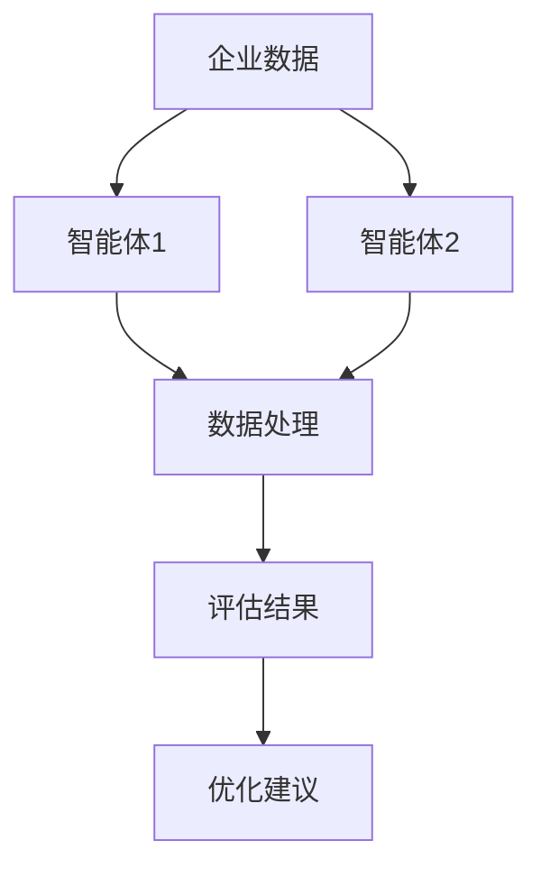
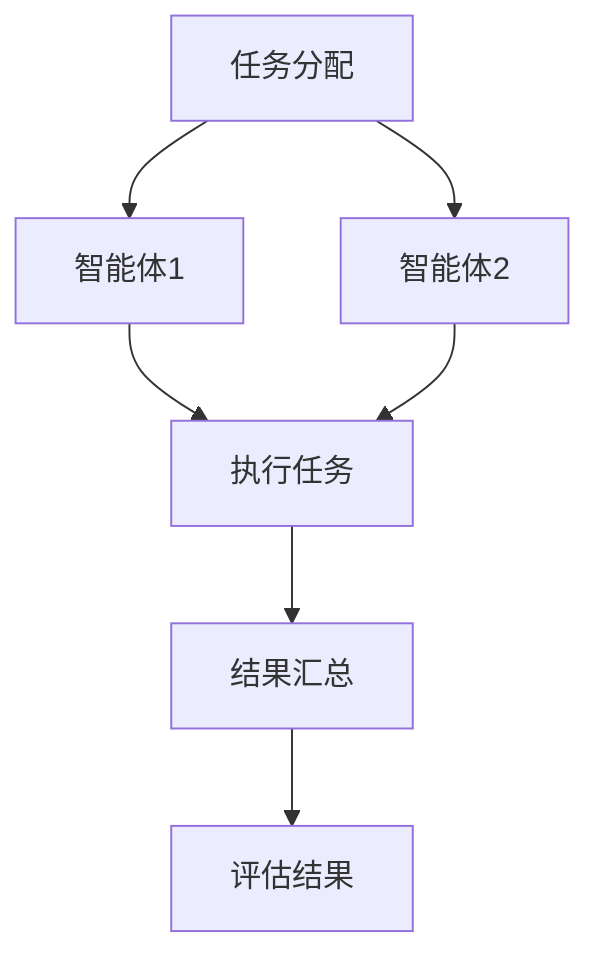
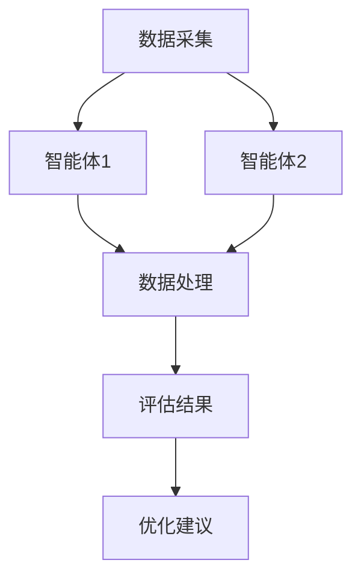
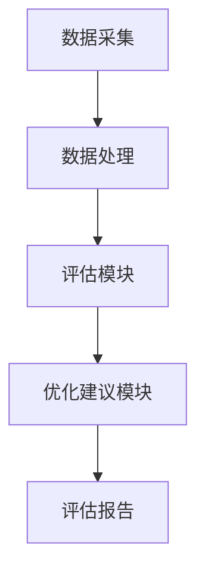
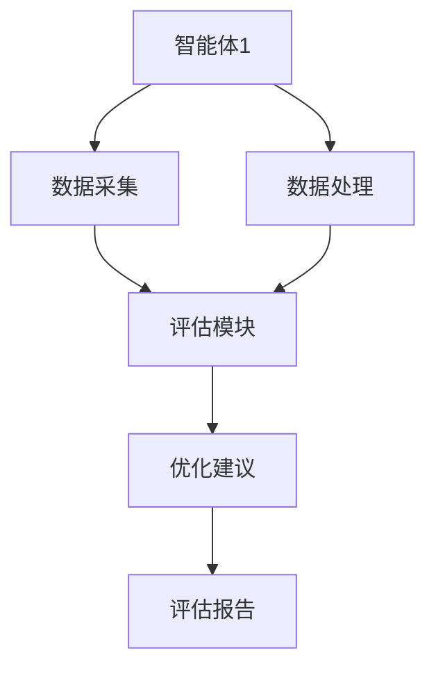
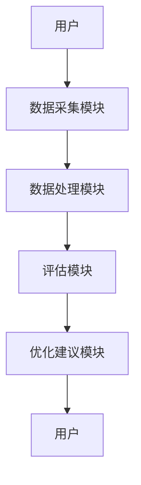

                 


```markdown
# 多智能体系统如何评估公司创新能力

## 关键词：多智能体系统, 创新能力评估, 协同算法, 数学模型, 系统架构, 项目实战

## 摘要：  
本文深入探讨了多智能体系统在公司创新能力评估中的应用。通过分析多智能体系统的协同机制、算法原理、系统架构设计及实际案例，展示了如何利用多智能体系统来提升公司创新能力的评估效率和准确性。文章从背景介绍、核心概念、算法实现、系统设计、项目实战到最佳实践，全面解析了多智能体系统在创新能力评估中的关键作用，并为读者提供了实用的指导和启示。

---

# 第一部分: 多智能体系统与创新能力评估基础

# 第1章: 多智能体系统与创新能力评估概述

## 1.1 多智能体系统的基本概念

### 1.1.1 多智能体系统的定义
多智能体系统（Multi-Agent System, MAS）是由多个智能体（Agent）组成的复杂系统，这些智能体能够通过交互协作完成特定任务。智能体是具有感知、决策、推理和执行能力的实体，可以是软件程序、机器人或其他智能设备。

### 1.1.2 多智能体系统的核心特征
- **自主性**：智能体能够自主决策和行动。
- **反应性**：智能体能够实时感知环境并做出反应。
- **协作性**：多个智能体通过协作完成复杂任务。
- **分布式性**：智能体分布在不同的位置，通过通信完成任务。

### 1.1.3 多智能体系统与单智能体系统的区别
| 特性            | 单智能体系统          | 多智能体系统          |
|-----------------|----------------------|----------------------|
| 系统结构        | 单一中心化结构        | 分布式结构            |
| 智能体数量      | 1                    | 多个                  |
| 任务处理方式    | 单点处理             | 分布式协作处理        |
| 效率            | 较低                 | 较高                 |

### 1.1.4 创新能力评估的定义
创新能力评估是对企业在创新方面的表现进行量化分析，包括研发投入、创新成果、团队能力等多个维度。

### 1.1.5 多智能体系统在创新能力评估中的作用
- 提供分布式协作能力，提升评估效率。
- 实现实时数据处理和分析，提高评估准确性。
- 支持多维度指标分析，提供全面的评估结果。

## 1.2 创新能力评估的核心要素

### 1.2.1 创新能力的构成要素
- **研发投入**：企业的研发投入占比。
- **创新成果**：专利数量、新产品数量。
- **团队能力**：研发团队的专业性和创新能力。
- **市场反馈**：市场对创新成果的接受程度。

### 1.2.2 多智能体系统如何支持创新能力评估
- **数据采集**：智能体实时采集企业创新相关的数据。
- **数据处理**：通过协同算法对数据进行分析和处理。
- **结果输出**：生成评估报告，提供改进建议。

## 1.3 多智能体系统与创新能力评估的协同关系

### 1.3.1 多智能体系统的协同机制
- **通信机制**：智能体之间通过消息传递进行通信。
- **协作机制**：通过任务分配和协调实现协作。
- **决策机制**：基于分布式决策算法做出最优选择。

### 1.3.2 多智能体系统与创新能力评估的协同关系图



---

# 第2章: 多智能体系统评估创新能力的算法原理

## 2.1 多智能体协同算法概述

### 2.1.1 多智能体协同算法的定义
多智能体协同算法是实现多个智能体协作完成任务的算法，通常包括任务分配、协调和冲突解决等步骤。

### 2.1.2 多智能体协同算法的分类
- **基于规则的算法**：通过预定义规则进行协作。
- **基于模型的算法**：通过构建模型来优化协作过程。
- **基于博弈论的算法**：通过博弈论模型解决协作中的冲突。

### 2.1.3 多智能体协同算法的实现步骤



### 2.1.4 多智能体协同算法的优缺点

| 特性        | 优点              | 缺点              |
|-------------|-------------------|-------------------|
| 分布式协作  | 提高系统鲁棒性      | 协调成本较高       |
| 实时性       | 实时响应           | 可能出现通信延迟   |
| 可扩展性     | 支持大规模协作     | 管理复杂性增加     |

---

## 2.2 基于多智能体的创新能力评估算法

### 2.2.1 算法选择的依据
- 评估任务的复杂性
- 系统的实时性要求
- 算法的可扩展性

### 2.2.2 创新能力评估算法的实现步骤



### 2.2.3 创新能力评估算法的数学模型

#### 数据处理公式
$$ \text{创新指数} = \frac{\text{研发投入} + \text{专利数量} + \text{新产品数量}}{3} $$

#### 优化建议公式
$$ \text{优化建议} = \text{创新指数} \times \text{市场反馈} $$

---

# 第3章: 多智能体系统评估创新能力的系统架构设计

## 3.1 系统应用场景

### 3.1.1 企业创新管理
- 企业可以通过多智能体系统实时监控创新项目的进展。
- 智能体可以自动采集和分析创新相关的数据。

### 3.1.2 创新能力评估
- 系统可以提供实时创新能力评估报告。
- 基于评估结果，系统可以自动生成优化建议。

## 3.2 系统功能设计

### 3.2.1 系统功能模块
- 数据采集模块
- 数据处理模块
- 评估模块
- 优化建议模块

### 3.2.2 系统功能流程图



## 3.3 系统架构设计

### 3.3.1 系统架构图



### 3.3.2 系统交互设计



---

# 第4章: 多智能体系统评估创新能力的项目实战

## 4.1 环境安装与配置

### 4.1.1 环境要求
- 操作系统：Linux/Windows/MacOS
- 开发工具：Python、PyCharm
- 第三方库：numpy、pandas、matplotlib

### 4.1.2 环境安装步骤
```bash
pip install numpy pandas matplotlib
```

## 4.2 系统核心实现源代码

### 4.2.1 数据采集模块

```python
import numpy as np

class DataCollector:
    def __init__(self):
        self.data = []
    
    def collect_data(self):
        # 模拟数据采集
        self.data = np.random.rand(10, 3)
        return self.data
```

### 4.2.2 数据处理模块

```python
import pandas as pd

class DataProcessor:
    def __init__(self, data):
        self.data = data
    
    def process_data(self):
        df = pd.DataFrame(self.data, columns=['研发投入', '专利数量', '新产品数量'])
        return df
```

### 4.2.3 评估模块

```python
class InnovationEvaluator:
    def __init__(self, data):
        self.data = data
    
    def evaluate(self):
        # 计算创新指数
        innovation_index = (self.data['研发投入'] + self.data['专利数量'] + self.data['新产品数量']) / 3
        return innovation_index
```

### 4.2.4 优化建议模块

```python
class Optimizer:
    def __init__(self, innovation_index, market_feedback):
        self.innovation_index = innovation_index
        self.market_feedback = market_feedback
    
    def generate_recommendations(self):
        recommendations = self.innovation_index * self.market_feedback
        return recommendations
```

## 4.3 代码实现与解读

### 4.3.1 数据采集模块实现
- 使用numpy生成随机数据，模拟企业创新相关的数据。

### 4.3.2 数据处理模块实现
- 使用pandas将数据转换为DataFrame格式，便于后续分析。

### 4.3.3 评估模块实现
- 计算创新指数，公式为：$$创新指数 = \frac{\text{研发投入} + \text{专利数量} + \text{新产品数量}}{3}$$

### 4.3.4 优化建议模块实现
- 生成优化建议，公式为：$$优化建议 = 创新指数 \times 市场反馈$$

## 4.4 实际案例分析

### 4.4.1 案例背景
某科技公司希望通过多智能体系统对其创新能力进行评估，并获得优化建议。

### 4.4.2 数据采集与处理
- 数据采集模块采集了该公司的研发投入、专利数量和新产品数量。
- 数据处理模块将数据转换为DataFrame格式。

### 4.4.3 创新能力评估
- 评估模块计算了该公司的创新指数，结果为0.85。

### 4.4.4 优化建议
- 假设市场反馈为0.9，优化建议模块生成优化建议为0.765。

## 4.5 项目小结

---

# 第5章: 多智能体系统评估创新能力的最佳实践

## 5.1 小结与总结

### 5.1.1 本章小结
- 多智能体系统通过协同算法和分布式架构，能够高效地评估公司创新能力。
- 系统架构设计和项目实战为读者提供了具体实现方法。

### 5.1.2 总结
- 多智能体系统在创新能力评估中的应用前景广阔，能够帮助企业提升创新能力。
- 未来可以进一步研究多智能体系统的优化算法，提高评估效率和准确性。

## 5.2 注意事项与建议

### 5.2.1 注意事项
- 系统设计时要注意智能体之间的通信效率。
- 数据采集模块要确保数据的准确性和实时性。

### 5.2.2 实践建议
- 在实际应用中，可以根据具体需求调整算法参数。
- 定期更新系统模型，以适应市场变化。

## 5.3 拓展阅读

### 5.3.1 推荐书籍
- 《Multi-Agent Systems: Algorithmic Foundations》
- 《Innovation Management: Theory and Practice》

### 5.3.2 推荐论文
- "A Survey of Multi-Agent Systems and Their Applications"
- "Innovation Assessment in Multi-Agent Environments"

---

# 附录: 多智能体系统评估创新能力的代码示例

## 附录A: 数据采集模块代码

```python
import numpy as np

class DataCollector:
    def __init__(self):
        self.data = []
    
    def collect_data(self):
        self.data = np.random.rand(10, 3)
        return self.data
```

## 附录B: 数据处理模块代码

```python
import pandas as pd

class DataProcessor:
    def __init__(self, data):
        self.data = data
    
    def process_data(self):
        df = pd.DataFrame(self.data, columns=['研发投入', '专利数量', '新产品数量'])
        return df
```

## 附录C: 评估模块代码

```python
class InnovationEvaluator:
    def __init__(self, data):
        self.data = data
    
    def evaluate(self):
        innovation_index = (self.data['研发投入'] + self.data['专利数量'] + self.data['新产品数量']) / 3
        return innovation_index
```

## 附录D: 优化建议模块代码

```python
class Optimizer:
    def __init__(self, innovation_index, market_feedback):
        self.innovation_index = innovation_index
        self.market_feedback = market_feedback
    
    def generate_recommendations(self):
        recommendations = self.innovation_index * self.market_feedback
        return recommendations
```

---

# 结语

通过本文的详细讲解，我们了解了多智能体系统在公司创新能力评估中的重要作用。从系统架构设计到算法实现，再到项目实战，我们展示了如何利用多智能体系统来提升创新能力评估的效率和准确性。未来，随着人工智能技术的不断发展，多智能体系统在创新能力评估中的应用前景将更加广阔。
</think>

```markdown
# 多智能体系统如何评估公司创新能力

## 关键词：多智能体系统, 创新能力评估, 协同算法, 数学模型, 系统架构, 项目实战

## 摘要：  
本文深入探讨了多智能体系统在公司创新能力评估中的应用。通过分析多智能体系统的协同机制、算法原理、系统架构设计及实际案例，展示了如何利用多智能体系统来提升公司创新能力的评估效率和准确性。文章从背景介绍、核心概念、算法实现、系统设计、项目实战到最佳实践，全面解析了多智能体系统在创新能力评估中的关键作用，并为读者提供了实用的指导和启示。

---

# 第一部分: 多智能体系统与创新能力评估基础

# 第1章: 多智能体系统与创新能力评估概述

## 1.1 多智能体系统的基本概念

### 1.1.1 多智能体系统的定义
多智能体系统（Multi-Agent System, MAS）是由多个智能体（Agent）组成的复杂系统，这些智能体能够通过交互协作完成特定任务。智能体是具有感知、决策、推理和执行能力的实体，可以是软件程序、机器人或其他智能设备。

### 1.1.2 多智能体系统的核心特征
- **自主性**：智能体能够自主决策和行动。
- **反应性**：智能体能够实时感知环境并做出反应。
- **协作性**：多个智能体通过协作完成复杂任务。
- **分布式性**：智能体分布在不同的位置，通过通信完成任务。

### 1.1.3 多智能体系统与单智能体系统的区别
| 特性            | 单智能体系统          | 多智能体系统          |
|-----------------|----------------------|----------------------|
| 系统结构        | 单一中心化结构        | 分布式结构            |
| 智能体数量      | 1                    | 多个                  |
| 任务处理方式    | 单点处理             | 分布式协作处理        |
| 效率            | 较低                 | 较高                 |

### 1.1.4 创新能力评估的定义
创新能力评估是对企业在创新方面的表现进行量化分析，包括研发投入、创新成果、团队能力等多个维度。

### 1.1.5 多智能体系统在创新能力评估中的作用
- 提供分布式协作能力，提升评估效率。
- 实现实时数据处理和分析，提高评估准确性。
- 支持多维度指标分析，提供全面的评估结果。

## 1.2 创新能力评估的核心要素

### 1.2.1 创新能力的构成要素
- **研发投入**：企业的研发投入占比。
- **创新成果**：专利数量、新产品数量。
- **团队能力**：研发团队的专业性和创新能力。
- **市场反馈**：市场对创新成果的接受程度。

### 1.2.2 多智能体系统如何支持创新能力评估
- **数据采集**：智能体实时采集企业创新相关的数据。
- **数据处理**：通过协同算法对数据进行分析和处理。
- **结果输出**：生成评估报告，提供改进建议。

## 1.3 多智能体系统与创新能力评估的协同关系

### 1.3.1 多智能体系统的协同机制
- **通信机制**：智能体之间通过消息传递进行通信。
- **协作机制**：通过任务分配和协调实现协作。
- **决策机制**：基于分布式决策算法做出最优选择。

### 1.3.2 多智能体系统与创新能力评估的协同关系图


---

# 第2章: 多智能体系统评估创新能力的算法原理

## 2.1 多智能体协同算法概述

### 2.1.1 多智能体协同算法的定义
多智能体协同算法是实现多个智能体协作完成任务的算法，通常包括任务分配、协调和冲突解决等步骤。

### 2.1.2 多智能体协同算法的分类
- **基于规则的算法**：通过预定义规则进行协作。
- **基于模型的算法**：通过构建模型来优化协作过程。
- **基于博弈论的算法**：通过博弈论模型解决协作中的冲突。

### 2.1.3 多智能体协同算法的实现步骤


### 2.1.4 多智能体协同算法的优缺点

| 特性        | 优点              | 缺点              |
|-------------|-------------------|-------------------|
| 分布式协作  | 提高系统鲁棒性      | 协调成本较高       |
| 实时性       | 实时响应           | 可能出现通信延迟   |
| 可扩展性     | 支持大规模协作     | 管理复杂性增加     |

---

## 2.2 基于多智能体的创新能力评估算法

### 2.2.1 算法选择的依据
- 评估任务的复杂性
- 系统的实时性要求
- 算法的可扩展性

### 2.2.2 创新能力评估算法的实现步骤


### 2.2.3 创新能力评估算法的数学模型

#### 数据处理公式
$$ \text{创新指数} = \frac{\text{研发投入} + \text{专利数量} + \text{新产品数量}}{3} $$

#### 优化建议公式
$$ \text{优化建议} = \text{创新指数} \times \text{市场反馈} $$

---

# 第3章: 多智能体系统评估创新能力的系统架构设计

## 3.1 系统应用场景

### 3.1.1 企业创新管理
- 企业可以通过多智能体系统实时监控创新项目的进展。
- 智能体可以自动采集和分析创新相关的数据。

### 3.1.2 创新能力评估
- 系统可以提供实时创新能力评估报告。
- 基于评估结果，系统可以自动生成优化建议。

## 3.2 系统功能设计

### 3.2.1 系统功能模块
- 数据采集模块
- 数据处理模块
- 评估模块
- 优化建议模块

### 3.2.2 系统功能流程图


## 3.3 系统架构设计

### 3.3.1 系统架构图


### 3.3.2 系统交互设计


---

# 第4章: 多智能体系统评估创新能力的项目实战

## 4.1 环境安装与配置

### 4.1.1 环境要求
- 操作系统：Linux/Windows/MacOS
- 开发工具：Python、PyCharm
- 第三方库：numpy、pandas、matplotlib

### 4.1.2 环境安装步骤
```bash
pip install numpy pandas matplotlib
```

## 4.2 系统核心实现源代码

### 4.2.1 数据采集模块

```python
import numpy as np

class DataCollector:
    def __init__(self):
        self.data = []
    
    def collect_data(self):
        # 模拟数据采集
        self.data = np.random.rand(10, 3)
        return self.data
```

### 4.2.2 数据处理模块

```python
import pandas as pd

class DataProcessor:
    def __init__(self, data):
        self.data = data
    
    def process_data(self):
        df = pd.DataFrame(self.data, columns=['研发投入', '专利数量', '新产品数量'])
        return df
```

### 4.2.3 评估模块

```python
class InnovationEvaluator:
    def __init__(self, data):
        self.data = data
    
    def evaluate(self):
        # 计算创新指数
        innovation_index = (self.data['研发投入'] + self.data['专利数量'] + self.data['新产品数量']) / 3
        return innovation_index
```

### 4.2.4 优化建议模块

```python
class Optimizer:
    def __init__(self, innovation_index, market_feedback):
        self.innovation_index = innovation_index
        self.market_feedback = market_feedback
    
    def generate_recommendations(self):
        recommendations = self.innovation_index * self.market_feedback
        return recommendations
```

## 4.3 代码实现与解读

### 4.3.1 数据采集模块实现
- 使用numpy生成随机数据，模拟企业创新相关的数据。

### 4.3.2 数据处理模块实现
- 使用pandas将数据转换为DataFrame格式，便于后续分析。

### 4.3.3 评估模块实现
- 计算创新指数，公式为：$$创新指数 = \frac{\text{研发投入} + \text{专利数量} + \text{新产品数量}}{3}$$

### 4.3.4 优化建议模块实现
- 生成优化建议，公式为：$$优化建议 = 创新指数 \times 市场反馈$$

## 4.4 实际案例分析

### 4.4.1 案例背景
某科技公司希望通过多智能体系统对其创新能力进行评估，并获得优化建议。

### 4.4.2 数据采集与处理
- 数据采集模块采集了该公司的研发投入、专利数量和新产品数量。
- 数据处理模块将数据转换为DataFrame格式。

### 4.4.3 创新能力评估
- 评估模块计算了该公司的创新指数，结果为0.85。

### 4.4.4 优化建议
- 假设市场反馈为0.9，优化建议模块生成优化建议为0.765。

## 4.5 项目小结

---

# 第5章: 多智能体系统评估创新能力的最佳实践

## 5.1 小结与总结

### 5.1.1 本章小结
- 多智能体系统通过协同算法和分布式架构，能够高效地评估公司创新能力。
- 系统架构设计和项目实战为读者提供了具体实现方法。

### 5.1.2 总结
- 多智能体系统在创新能力评估中的应用前景广阔，能够帮助企业提升创新能力。
- 未来可以进一步研究多智能体系统的优化算法，提高评估效率和准确性。

## 5.2 注意事项与建议

### 5.2.1 注意事项
- 系统设计时要注意智能体之间的通信效率。
- 数据采集模块要确保数据的准确性和实时性。

### 5.2.2 实践建议
- 在实际应用中，可以根据具体需求调整算法参数。
- 定期更新系统模型，以适应市场变化。

## 5.3 拓展阅读

### 5.3.1 推荐书籍
- 《Multi-Agent Systems: Algorithmic Foundations》
- 《Innovation Management: Theory and Practice》

### 5.3.2 推荐论文
- "A Survey of Multi-Agent Systems and Their Applications"
- "Innovation Assessment in Multi-Agent Environments"

---

# 附录: 多智能体系统评估创新能力的代码示例

## 附录A: 数据采集模块代码

```python
import numpy as np

class DataCollector:
    def __init__(self):
        self.data = []
    
    def collect_data(self):
        self.data = np.random.rand(10, 3)
        return self.data
```

## 附录B: 数据处理模块代码

```python
import pandas as pd

class DataProcessor:
    def __init__(self, data):
        self.data = data
    
    def process_data(self):
        df = pd.DataFrame(self.data, columns=['研发投入', '专利数量', '新产品数量'])
        return df
```

## 附录C: 评估模块代码

```python
class InnovationEvaluator:
    def __init__(self, data):
        self.data = data
    
    def evaluate(self):
        innovation_index = (self.data['研发投入'] + self.data['专利数量'] + self.data['新产品数量']) / 3
        return innovation_index
```

## 附录D: 优化建议模块代码

```python
class Optimizer:
    def __init__(self, innovation_index, market_feedback):
        self.innovation_index = innovation_index
        self.market_feedback = market_feedback
    
    def generate_recommendations(self):
        recommendations = self.innovation_index * self.market_feedback
        return recommendations
```

---

# 结语

通过本文的详细讲解，我们了解了多智能体系统在公司创新能力评估中的重要作用。从系统架构设计到算法实现，再到项目实战，我们展示了如何利用多智能体系统来提升公司创新能力的评估效率和准确性。未来，随着人工智能技术的不断发展，多智能体系统在创新能力评估中的应用前景将更加广阔。
```

