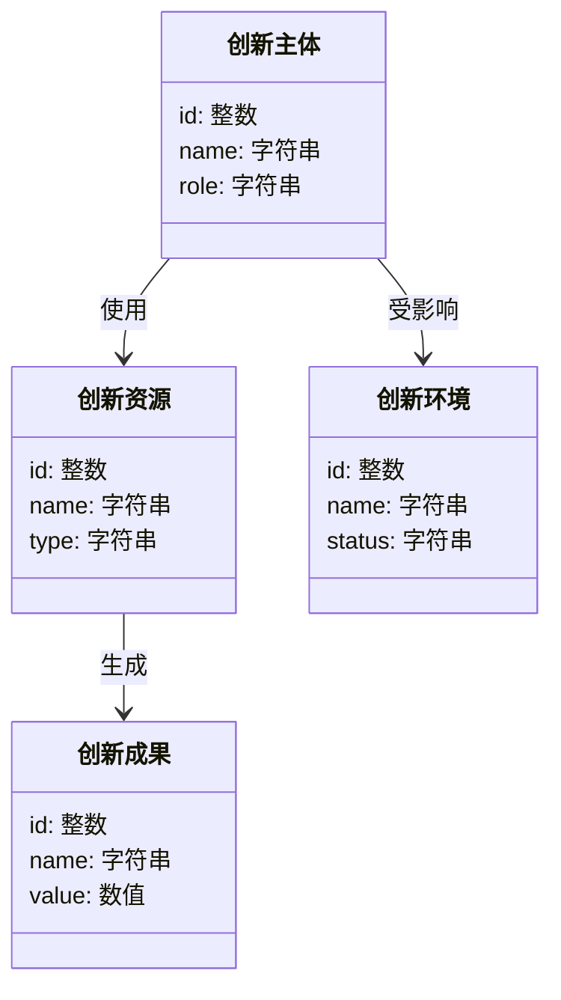
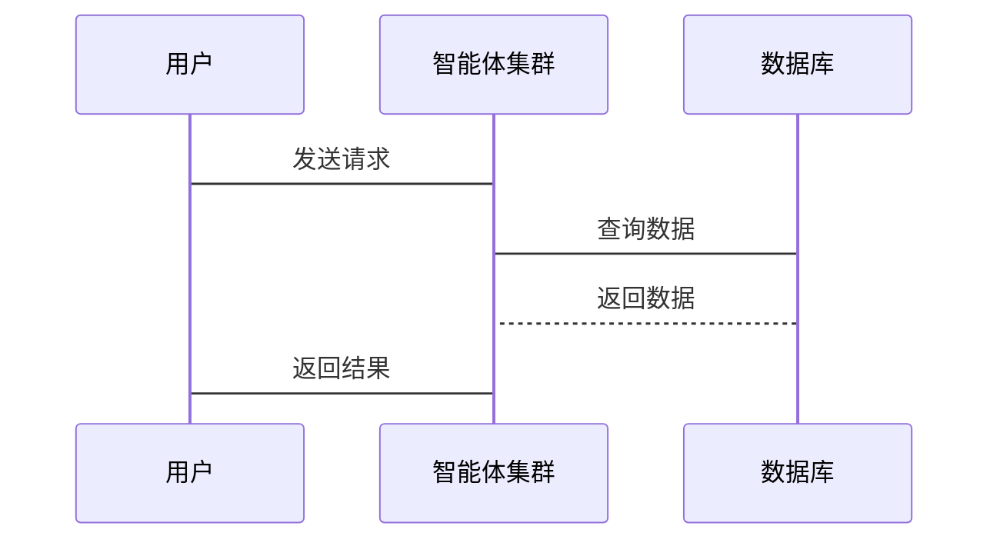

                 


# 多智能体系统如何评估公司的创新生态系统

## 关键词
多智能体系统, 创新生态系统, 协同优化, 企业创新, 数学建模

## 摘要
多智能体系统（Multi-Agent Systems, MAS）是一种能够模拟多个智能体之间协作与竞争的复杂系统，近年来在企业创新生态系统评估中展现出巨大潜力。本文从多智能体系统的定义与特点出发，详细探讨其在企业创新评估中的应用场景，并通过数学建模与算法实现，展示如何利用多智能体系统构建创新生态系统的评估模型。文章还结合实际案例，分析了多智能体系统在企业创新中的具体应用，总结了其优势与挑战，为企业的创新管理提供了新的思路与方法。

---

# 第一部分: 多智能体系统与创新生态系统概述

## 第1章: 多智能体系统的基本概念

### 1.1 多智能体系统的定义与特点
#### 1.1.1 多智能体系统的定义
多智能体系统（Multi-Agent Systems, MAS）是指由多个智能体（Agent）组成的分布式系统，这些智能体能够通过协作完成复杂任务。每个智能体都是一个独立的实体，具有感知环境、自主决策和执行任务的能力。

#### 1.1.2 多智能体系统的核心特点
- **自主性**：智能体能够自主决策，无需外部干预。
- **反应性**：智能体能够实时感知环境变化并做出响应。
- **协作性**：多个智能体通过协作完成共同目标。
- **分布性**：系统由多个分散的智能体组成，不存在集中控制。

#### 1.1.3 多智能体系统与传统单智能体系统的区别
| 特性          | 单智能体系统        | 多智能体系统        |
|---------------|---------------------|--------------------|
| 系统结构      | 集中式结构          | 分布式结构          |
| 决策方式      | 单点决策            | 分布式决策          |
| 系统复杂性    | 较低                | 较高                |
| 应用场景      | 简单任务            | 复杂任务            |

### 1.2 创新生态系统的基本概念
#### 1.2.1 创新生态系统的定义
创新生态系统是指由企业内外部各种创新要素（如企业团队、合作伙伴、客户、供应商、技术平台等）共同构成的动态系统，旨在通过协同创新实现价值最大化。

#### 1.2.2 创新生态系统的核心要素
- **创新主体**：包括企业内部的研发团队、外部合作伙伴等。
- **创新资源**：包括技术、资金、数据等。
- **创新环境**：包括政策、市场、文化等因素。
- **创新过程**：包括技术研发、产品开发、市场推广等。

#### 1.2.3 创新生态系统与企业创新的关系
创新生态系统为企业提供了更广泛的合作网络和资源支持，能够帮助企业更高效地实现创新目标。通过多智能体系统的引入，企业可以更好地协调内外部资源，优化创新过程。

---

## 第2章: 多智能体系统在企业创新评估中的应用背景

### 2.1 企业创新生态系统的重要性
#### 2.1.1 企业创新生态系统的作用
- 提供创新资源支持。
- 促进技术成果转化。
- 优化企业创新流程。
- 提高企业的市场竞争力。

#### 2.1.2 传统创新评估方法的局限性
传统创新评估方法通常基于静态指标，难以捕捉创新过程中的动态变化。此外，传统方法难以量化企业内外部资源的协同效应。

#### 2.1.3 多智能体系统在创新评估中的优势
- 能够实时监测创新过程中的动态变化。
- 可以量化多主体之间的协同效应。
- 能够模拟不同策略对创新结果的影响。

### 2.2 多智能体系统在企业创新中的应用场景
#### 2.2.1 创新资源的优化配置
通过多智能体系统，企业可以优化资源配置，确保创新资源在不同项目之间的合理分配。

#### 2.2.2 创新过程的协同优化
多智能体系统能够协调企业内外部主体的创新活动，实现创新过程的协同优化。

#### 2.2.3 创新成果的评估与反馈
多智能体系统能够实时评估创新成果，并根据反馈结果调整创新策略。

---

# 第二部分: 多智能体系统的核心概念与联系

## 第3章: 多智能体系统的核心原理

### 3.1 多智能体系统的核心原理
#### 3.1.1 智能体的定义与属性
智能体（Agent）是一个能够感知环境、自主决策并采取行动的实体。智能体具有以下属性：
- **自主性**：能够自主决策。
- **反应性**：能够感知环境变化并做出响应。
- **协作性**：能够与其他智能体协作完成任务。
- **学习能力**：能够通过经验改进自身行为。

#### 3.1.2 多智能体系统的协作机制
多智能体系统通过以下机制实现协作：
- **通信机制**：智能体之间通过通信交换信息。
- **协调机制**：通过协调算法实现任务分配与资源分配。
- **冲突解决机制**：通过协商解决智能体之间的冲突。

#### 3.1.3 多智能体系统的通信与协调
智能体之间的通信与协调是多智能体系统的核心。通信可以通过消息传递完成，协调则通过任务分配和资源分配实现。

### 3.2 创新生态系统与多智能体系统的联系
#### 3.2.1 创新生态系统的多智能体特征
创新生态系统具有分布式、动态性和复杂性等特点，与多智能体系统的特征高度契合。

#### 3.2.2 多智能体系统在创新生态系统中的角色
- **创新主体**：代表企业内部和外部的创新参与者。
- **创新资源**：表示企业内外部的创新资源。
- **创新环境**：模拟创新环境的动态变化。

#### 3.2.3 创新生态系统与多智能体系统的相互作用
创新生态系统为多智能体系统提供了应用场景，而多智能体系统则为创新生态系统提供了优化工具。

---

## 第4章: 多智能体系统的数学模型与算法

### 4.1 多智能体系统的数学模型
多智能体系统的数学模型通常包括以下部分：
- **状态空间**：描述系统中各智能体的状态。
- **动作空间**：描述智能体可以执行的动作。
- **转移概率**：描述状态转移的概率。

#### 4.1.1 多智能体系统的博弈论模型
多智能体系统可以用博弈论模型来描述，其中每个智能体是一个玩家，目标是通过协作或竞争最大化自身收益。

#### 4.1.2 多智能体系统的优化模型
多智能体系统的优化模型可以通过数学规划来描述，目标是最优化系统的整体收益。

### 4.2 多智能体系统的算法实现
#### 4.2.1 多智能体系统的协同优化算法
协同优化算法是多智能体系统的核心算法，用于实现系统内的协同优化。

#### 4.2.2 多智能体系统的分布式计算算法
分布式计算算法用于实现多智能体系统中各智能体之间的协作与计算。

---

## 第5章: 系统分析与架构设计

### 5.1 系统分析
#### 5.1.1 问题场景介绍
企业创新生态系统评估涉及多个主体和资源，传统的评估方法难以捕捉动态变化。

#### 5.1.2 项目介绍
本项目旨在利用多智能体系统构建企业创新生态系统评估模型。

### 5.2 系统功能设计
#### 5.2.1 领域模型类图
以下是领域模型类图的Mermaid表示：



#### 5.2.2 系统架构设计
以下是系统架构设计的Mermaid表示：

```mermaid
architecturalDiagram
    客户端 ---(协议)--> 服务端
    服务端 ---(数据库连接)--> 数据库
    服务端 ---(消息队列)--> 智能体集群
```

#### 5.2.3 系统接口设计
系统接口设计包括以下部分：
- **智能体接口**：用于智能体之间的通信与协作。
- **数据接口**：用于数据的输入与输出。
- **用户接口**：用于用户的交互与操作。

#### 5.2.4 系统交互序列图
以下是系统交互序列图的Mermaid表示：



---

## 第6章: 项目实战

### 6.1 环境安装
#### 6.1.1 系统需求
- 操作系统：Linux/Windows/MacOS
- Python版本：3.6+
- 依赖库：numpy, matplotlib, networkx

#### 6.1.2 安装步骤
```bash
pip install numpy matplotlib networkx
```

### 6.2 系统核心实现
#### 6.2.1 核心代码实现
以下是多智能体系统的核心代码实现：

```python
import numpy as np
import networkx as nx
import matplotlib.pyplot as plt

# 定义智能体类
class Agent:
    def __init__(self, id):
        self.id = id
        self.state = 0
        self.neighbors = []
    
    def update(self, neighbors_state):
        # 简单的协同优化算法
        new_state = np.mean(neighbors_state)
        self.state = new_state

# 初始化智能体网络
n = 5
agents = [Agent(i) for i in range(n)]
G = nx.complete_graph(n)

# 网络可视化
nx.draw(G, node_color='red', edge_color='blue')
plt.show()

# 协同优化过程
for _ in range(10):
    for agent in agents:
        neighbors = [agt.state for agt in agents if agt != agent]
        agent.update(neighbors)
    
    # 可视化协同优化结果
    states = [agt.state for agt in agents]
    plt.plot(states)
    plt.show()
```

#### 6.2.2 代码应用解读与分析
上述代码实现了多智能体系统的协同优化过程。通过网络结构的可视化和协同优化过程的动态展示，可以直观地观察到多智能体系统如何通过协作实现状态的收敛。

#### 6.2.3 实际案例分析
以某科技企业为例，通过多智能体系统评估其创新生态系统，可以发现企业内部团队与外部合作伙伴之间的协同效应，优化资源配置，提高创新效率。

---

## 第7章: 最佳实践与总结

### 7.1 最佳实践
#### 7.1.1 关键注意事项
- 确保系统设计的可扩展性。
- 定期更新系统模型以适应环境变化。
- 保证数据的准确性和实时性。

#### 7.1.2 小结
多智能体系统为企业创新生态系统评估提供了全新的思路和方法，能够有效优化创新过程和资源分配。

### 7.2 未来研究方向
- 研究多智能体系统的动态适应性。
- 探索多智能体系统与人工智能的结合。
- 开发更高效的协同优化算法。

### 7.3 拓展阅读
推荐阅读以下书籍和论文：
- 《Multi-Agent Systems: Algorithmic, Complexity Theoretic, and Game Theoretic Foundations》
- 《Multi-Agent Machine Learning: A Reinforcement Approach》
- 《Dynamic Network Analysis in Multi-Agent Systems》

---

通过本文的详细分析，我们可以看到，多智能体系统在企业创新生态系统评估中具有广阔的应用前景。利用多智能体系统，企业可以更高效地优化创新过程，提升创新效率，实现可持续发展。

