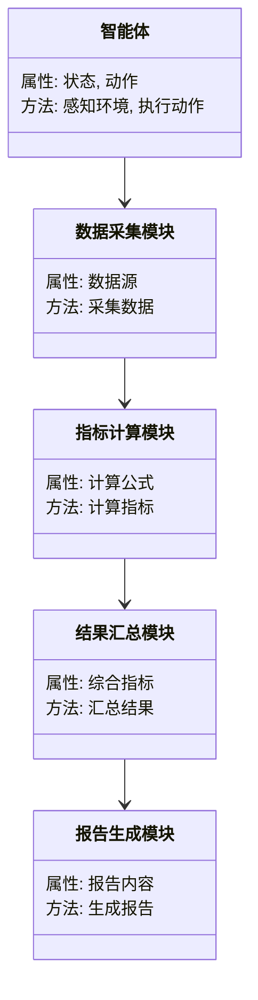
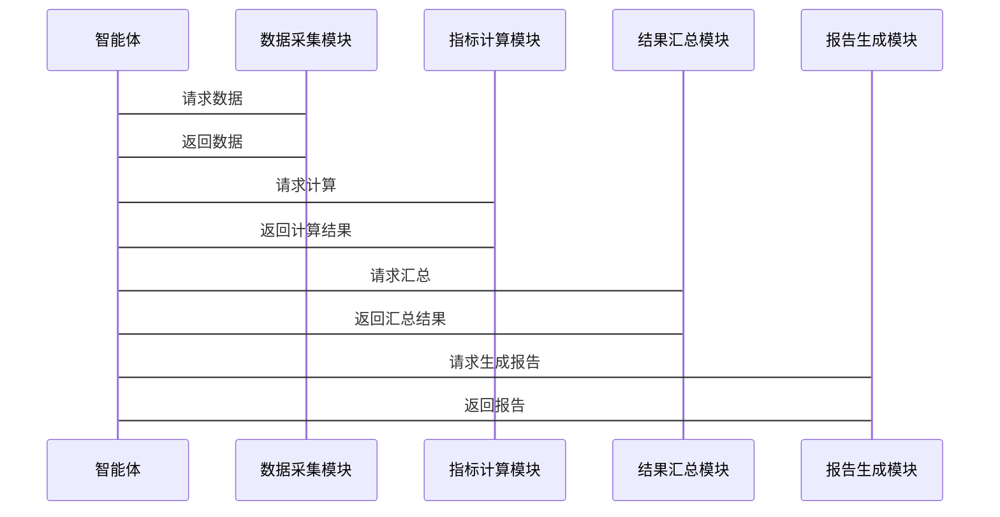

                 


# 多智能体系统如何评估公司的可持续发展能力

> 关键词：多智能体系统, 可持续发展能力, 企业评估, 系统架构, 算法设计, 多目标优化, 可视化分析

> 摘要：本文探讨了多智能体系统在公司可持续发展能力评估中的应用，从定义、核心概念、数学模型、系统架构、项目实战到总结，全面分析了多智能体系统如何帮助公司实现可持续发展目标。

---

# 第一部分: 多智能体系统与可持续发展概述

## 第1章: 多智能体系统概述

### 1.1 多智能体系统的基本概念

#### 1.1.1 多智能体系统的定义

多智能体系统（Multi-Agent Systems, MAS）是由多个智能体（Agent）组成的分布式系统，每个智能体能够感知环境、自主决策并与其他智能体协作完成任务。智能体可以是软件程序、算法或物理设备，具备以下核心特征：
- **自主性**：智能体能够自主决策，无需外部干预。
- **反应性**：能够感知环境并实时调整行为。
- **协作性**：多个智能体可以协同完成复杂任务。
- **分布式性**：系统中的智能体分布在不同的位置，通过通信和协调完成目标。

#### 1.1.2 多智能体系统的特征

- **分布式计算**：任务分解到多个智能体，减少单点故障。
- **动态适应**：智能体能够根据环境变化调整行为。
- **协同优化**：通过协作实现整体性能的提升。
- **复杂性管理**：多个智能体之间的交互增加了系统的复杂性，但通过合理的架构设计可以有效管理。

#### 1.1.3 多智能体系统与单智能体系统的区别

| 特性                | 单智能体系统          | 多智能体系统          |
|---------------------|----------------------|----------------------|
| 系统结构            | 集中式                | 分布式                |
| 智能体数量          | 单个                  | 多个                  |
| 任务处理方式        | 单一任务              | 多任务协作            |
| 决策方式            | 中央决策              | 分布式决策            |
| 系统复杂性          | 较低                  | 较高                  |

### 1.2 可持续发展能力的定义

#### 1.2.1 可持续发展的概念

可持续发展是指在满足当前需求的同时，不损害后代满足其需求的能力。在企业层面，可持续发展能力涉及环境、社会和经济三个维度的综合表现。

#### 1.2.2 公司可持续发展能力的维度

- **环境维度**：碳排放、资源利用效率、环保合规性。
- **社会维度**：员工福利、社会责任、公平性。
- **经济维度**：盈利能力、成本控制、投资回报率。

#### 1.2.3 可持续发展能力评估的重要性

通过评估可持续发展能力，企业可以识别自身的优缺点，制定改进策略，同时增强利益相关者的信任和投资意愿。此外，可持续发展能力评估也是企业履行社会责任、应对政策法规的重要手段。

---

## 第2章: 多智能体系统在可持续发展评估中的应用背景

### 2.1 当前企业面临的可持续发展挑战

#### 2.1.1 环境问题对企业的影响

- 环境法规日益严格，企业面临更高的环保要求。
- 碳排放问题导致企业面临罚款或声誉损失。
- 资源短缺可能导致生产成本上升。

#### 2.1.2 社会责任对企业发展的约束

- 员工权益保护、公平雇佣成为重要议题。
- 社会责任投资（ESG）成为资本市场的重要考量因素。
- 企业形象与社会责任履行密切相关。

#### 2.1.3 经济效益与可持续发展的平衡

- 短期经济效益与长期可持续发展目标可能存在冲突。
- 可持续发展投入可能影响短期利润，但有助于长期发展。
- 如何在两者之间找到平衡点是企业面临的重要挑战。

### 2.2 多智能体系统的优势

#### 2.2.1 多智能体系统的分布式计算能力

- 通过分布式计算，多智能体系统可以同时处理多个维度的评估任务，提高评估效率。
- 每个智能体专注于特定的评估指标，减少计算压力。

#### 2.2.2 多智能体系统的协同优化能力

- 多智能体系统能够通过协作优化算法，找到多个目标之间的最优平衡点。
- 例如，在环境、社会和经济三个维度之间找到最优解，实现整体效益的最大化。

#### 2.2.3 多智能体系统的动态适应性

- 多智能体系统能够实时感知环境变化，动态调整评估策略。
- 在评估过程中，可以根据最新数据和情况快速调整评估结果，提高评估的准确性。

---

## 第3章: 多智能体系统评估公司可持续发展能力的核心概念

### 3.1 多智能体系统的核心概念

#### 3.1.1 智能体的定义与属性

- **智能体**：具备自主性、反应性、协作性和分布式特征的实体。
- **属性**：
  - **目标**：智能体需要实现的具体目标。
  - **知识**：智能体拥有的信息和规则。
  - **能力**：智能体执行任务的能力和手段。
  - **通信**：智能体之间的交互方式。

#### 3.1.2 智能体之间的交互与协作

- 智能体之间的通信和协作是多智能体系统的核心机制。
- 通过通信协议，智能体可以交换信息、协调行动，共同完成复杂的评估任务。

#### 3.1.3 多智能体系统的整体架构

- **层次结构**：包括感知层、决策层和执行层。
- **功能模块**：包括数据采集、信息处理、决策制定和结果输出等模块。

### 3.2 可持续发展能力的评估指标

#### 3.2.1 环境指标

- **碳排放**：单位产品碳排放量。
- **资源利用效率**：单位资源的产出效率。
- **环保合规性**：企业是否符合环保法规。

#### 3.2.2 社会指标

- **员工满意度**：员工对工作条件和待遇的满意程度。
- **社会责任履行**：企业对社会责任的承担程度。
- **公平性**：企业在员工待遇、供应商选择等方面是否公平。

#### 3.2.3 经济指标

- **盈利能力**：企业的净利润率。
- **成本控制**：单位产品的生产成本。
- **投资回报率**：企业的投资回报率。

### 3.3 多智能体系统与可持续发展能力的关联

#### 3.3.1 多智能体系统的协同优化能力如何提升可持续发展能力

- 多智能体系统可以通过协同优化算法，综合考虑环境、社会和经济三个维度的指标，找到最优解。
- 例如，在优化生产过程中，可以同时考虑减少碳排放、提高员工满意度和降低成本。

#### 3.3.2 多智能体系统的动态适应性如何应对可持续发展的挑战

- 多智能体系统能够实时感知环境变化，动态调整评估策略。
- 例如，在环境法规发生变化时，系统可以快速调整评估指标的权重，确保评估结果的准确性。

---

## 第4章: 多智能体系统评估公司可持续发展能力的数学模型与算法

### 4.1 多智能体系统的数学模型

#### 4.1.1 多智能体系统的状态表示

- 每个智能体的状态可以用向量表示，例如，环境指标、社会指标和经济指标分别用不同的维度表示。
- 状态空间：S = (s₁, s₂, s₃)，其中s₁表示环境指标，s₂表示社会指标，s₃表示经济指标。

#### 4.1.2 多智能体系统的动作空间

- 每个智能体的动作可以用策略表示，例如，选择最优的生产参数以减少碳排放。
- 动作空间：A = (a₁, a₂, a₃)，其中a₁表示减少碳排放的策略，a₂表示提高员工满意度的策略，a₃表示降低成本的策略。

#### 4.1.3 多智能体系统的奖励机制

- 奖励机制用于评估智能体的行为是否符合目标。
- 例如，当智能体成功减少碳排放时，给予正奖励；当碳排放增加时，给予负奖励。

### 4.2 可持续发展能力评估的数学模型

#### 4.2.1 综合评估指标的加权模型

- 综合评估指标可以通过加权的方式计算，权重表示每个指标的重要性。
- 公式：$$ S = w₁x₁ + w₂x₂ + w₃x₃ $$
  其中，S是综合评估指标，x₁、x₂、x₃是环境、社会和经济指标，w₁、w₂、w₃是对应的权重。

#### 4.2.2 多目标优化模型

- 多目标优化模型用于在多个目标之间找到平衡点。
- 例如，在优化生产成本和减少碳排放之间找到最优解。

#### 4.2.3 动态评估模型

- 动态评估模型用于实时评估公司的可持续发展能力。
- 例如，根据最新的环境数据和经济指标，动态调整评估结果。

### 4.3 算法原理

#### 4.3.1 多智能体协同优化算法

- 多智能体协同优化算法是一种分布式优化算法，通过智能体之间的协作找到全局最优解。
- 例如，遗传算法和粒子群算法可以用于多智能体协同优化。

#### 4.3.2 分布式计算算法

- 分布式计算算法将任务分解到多个智能体，每个智能体处理一部分任务，最后汇总结果。
- 例如，MapReduce是一种常用的分布式计算框架。

#### 4.3.3 动态适应性算法

- 动态适应性算法能够根据环境变化动态调整评估策略。
- 例如，模糊逻辑和强化学习可以用于动态适应性算法。

---

## 第5章: 系统架构设计

### 5.1 问题场景分析

- **问题描述**：如何利用多智能体系统评估公司的可持续发展能力？
- **目标**：设计一个多智能体系统，能够从环境、社会和经济三个维度评估公司的可持续发展能力。
- **边界**：系统的输入是公司的运营数据，输出是可持续发展能力评估报告。
- **核心要素**：数据采集、指标计算、结果汇总和报告生成。

### 5.2 系统功能设计

- **数据采集模块**：负责采集公司的环境、社会和经济数据。
- **指标计算模块**：根据采集的数据计算各个指标。
- **结果汇总模块**：将各个指标综合成一个整体的评估结果。
- **报告生成模块**：生成可持续发展能力评估报告。

#### 5.2.1 领域模型（Mermaid 类图）



### 5.3 系统架构设计

#### 5.3.1 系统架构（Mermaid 架构图）


### 5.4 系统接口设计

- **数据接口**：智能体与数据采集模块之间的接口用于数据传输。
- **计算接口**：数据采集模块与指标计算模块之间的接口用于指标计算。
- **汇总接口**：指标计算模块与结果汇总模块之间的接口用于结果汇总。
- **报告接口**：结果汇总模块与报告生成模块之间的接口用于报告生成。

### 5.5 系统交互流程（Mermaid 序列图）



---

## 第6章: 项目实战

### 6.1 环境安装

- **安装多智能体系统**：需要安装必要的软件和工具，例如Python、Java、分布式计算框架等。
- **数据采集工具**：安装数据采集工具，例如数据库连接器、API接口等。
- **可视化工具**：安装可视化工具，例如Matplotlib、Tableau等。

### 6.2 核心代码实现

#### 6.2.1 数据采集模块

```python
import requests

def collect_data():
    # 采集环境数据
    response_env = requests.get('http://env_data_api.com/api')
    env_data = response_env.json()
    
    # 采集社会数据
    response_social = requests.get('http://social_data_api.com/api')
    social_data = response_social.json()
    
    # 采集经济数据
    response_economic = requests.get('http://economic_data_api.com/api')
    economic_data = response_economic.json()
    
    return env_data, social_data, economic_data
```

#### 6.2.2 指标计算模块

```python
def calculate_indicators(env_data, social_data, economic_data):
    # 计算环境指标
    carbon_emission = env_data['carbon_emission']
    resource_efficiency = env_data['resource_efficiency']
    
    # 计算社会指标
    employee_satisfaction = social_data['employee_satisfaction']
    social_responsibility = social_data['social_responsibility']
    
    # 计算经济指标
    profitability = economic_data['profitability']
    cost_control = economic_data['cost_control']
    
    return {
        '环境指标': {
            'carbon_emission': carbon_emission,
            'resource_efficiency': resource_efficiency
        },
        '社会指标': {
            'employee_satisfaction': employee_satisfaction,
            'social_responsibility': social_responsibility
        },
        '经济指标': {
            'profitability': profitability,
            'cost_control': cost_control
        }
    }
```

#### 6.2.3 结果汇总模块

```python
def aggregate_results(indicators):
    # 综合评估指标
    weights = {
        '环境指标': 0.4,
        '社会指标': 0.3,
        '经济指标': 0.3
    }
    
    total_score = 0
    for category, weight in weights.items():
        category_score = sum(indicators[category].values()) / len(indicators[category])
        total_score += category_score * weight
    
    return total_score
```

#### 6.2.4 报告生成模块

```python
def generate_report(total_score):
    if total_score >= 0.8:
        report = "公司可持续发展能力评估为优秀。"
    elif total_score >= 0.6:
        report = "公司可持续发展能力评估为良好。"
    else:
        report = "公司可持续发展能力评估为一般。"
    return report
```

### 6.3 代码解读与分析

- **数据采集模块**：通过API接口采集环境、社会和经济数据。
- **指标计算模块**：根据采集的数据计算各个指标。
- **结果汇总模块**：将各个指标按照权重汇总成一个综合评估指标。
- **报告生成模块**：根据综合评估指标生成报告。

### 6.4 实际案例分析

- **案例描述**：某制造企业希望评估其可持续发展能力。
- **数据采集**：采集该制造企业的环境、社会和经济数据。
- **指标计算**：计算环境、社会和经济三个维度的指标。
- **结果汇总**：综合三个维度的指标，得到综合评估指标。
- **报告生成**：根据综合评估指标生成报告。

### 6.5 项目小结

- **项目总结**：通过多智能体系统评估公司的可持续发展能力，能够从多个维度全面评估公司的表现。
- **项目成果**：生成可持续发展能力评估报告，帮助企业识别改进方向。
- **项目意义**：为企业提供科学的评估方法，帮助企业实现可持续发展目标。

---

## 第7章: 总结与展望

### 7.1 总结

- **核心内容回顾**：多智能体系统能够从环境、社会和经济三个维度全面评估公司的可持续发展能力。
- **系统优势**：多智能体系统的分布式计算能力和协同优化能力能够有效提升评估的准确性和效率。
- **实际应用价值**：通过多智能体系统评估公司的可持续发展能力，帮助企业制定科学的改进策略。

### 7.2 注意事项

- **数据隐私**：在数据采集和处理过程中，需要注意数据隐私问题。
- **系统安全性**：确保系统的安全性，防止数据泄露和系统攻击。
- **算法优化**：需要不断优化算法，提高评估的准确性和效率。

### 7.3 未来展望

- **算法优化**：研究更高效的多智能体协同优化算法，提高评估的准确性和效率。
- **系统扩展**：开发更多功能模块，例如预测分析、情景模拟等。
- **应用拓展**：将多智能体系统应用到更多的领域，例如城市规划、交通管理等。

---

## 第8章: 最佳实践与小结

### 8.1 最佳实践

- **数据质量管理**：确保数据的准确性和完整性，避免数据偏差。
- **算法选择**：根据具体需求选择合适的算法，确保算法的有效性和高效性。
- **系统维护**：定期维护系统，确保系统的稳定性和安全性。

### 8.2 小结

- **文章核心内容**：通过多智能体系统评估公司的可持续发展能力，从理论到实践，系统地分析了多智能体系统在可持续发展评估中的应用。
- **文章价值**：为企业提供科学的评估方法，帮助企业实现可持续发展目标。
- **读者收获**：读者能够理解多智能体系统在可持续发展评估中的作用，并能够实际应用到工作中。

---

通过以上内容，我们可以看到，多智能体系统在评估公司可持续发展能力方面具有重要的应用价值。它能够从多个维度全面评估公司的表现，帮助企业制定科学的改进策略，实现可持续发展目标。

