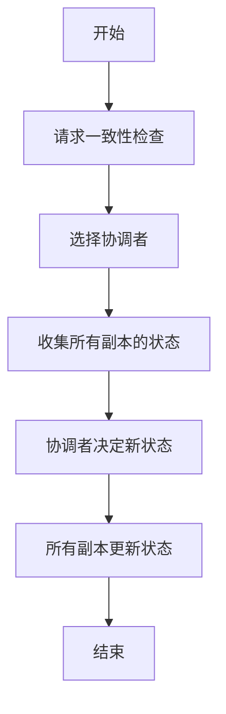
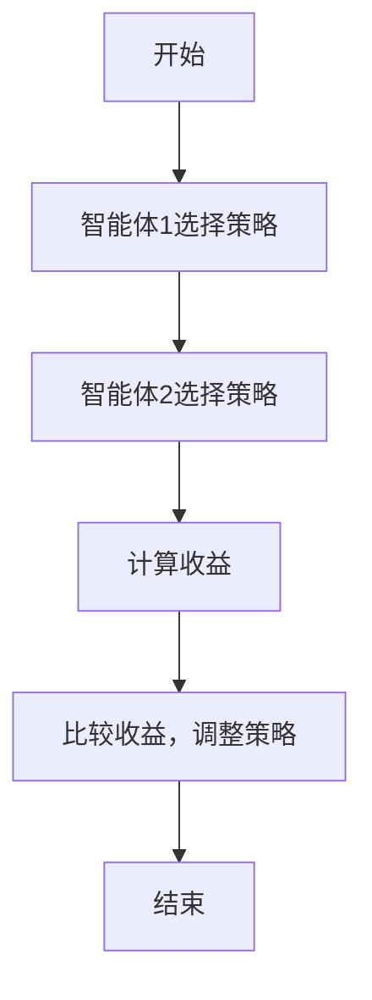
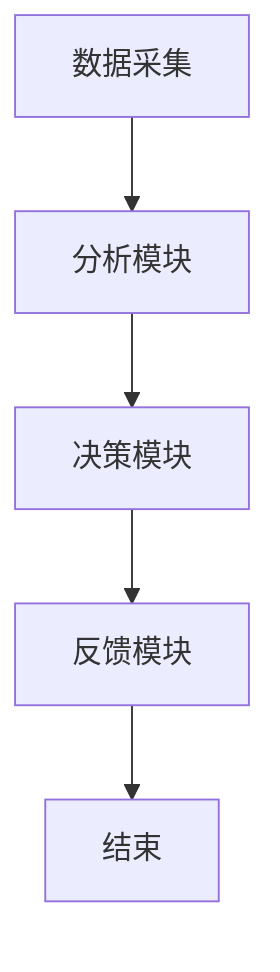
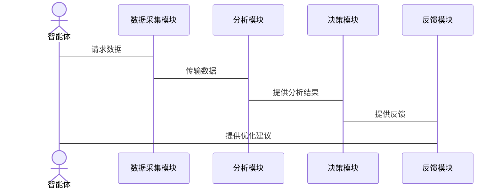
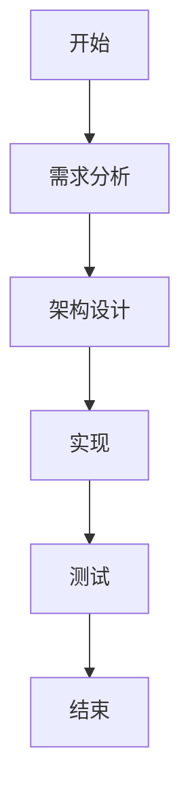

                 


# 第1章: 多智能体系统概述

## 1.1 多智能体系统的定义与特点
### 1.1.1 多智能体系统的定义
多智能体系统（Multi-Agent System, MAS）是由多个相互作用的智能体组成的系统，这些智能体通过协作或竞争完成特定任务。

### 1.1.2 多智能体系统的核心特点
- **分布式智能**：每个智能体都有自己的知识和行为。
- **自主性**：智能体能够自主决策。
- **协作性**：智能体之间可以协作完成任务。
- **动态性**：系统环境和智能体状态不断变化。

### 1.1.3 多智能体系统与传统AI的区别
- 传统AI：集中式决策，单个智能体完成任务。
- 多智能体系统：分布式智能体协作完成任务。

## 1.2 品牌价值的动态变化
### 1.2.1 品牌价值的定义与影响因素
品牌价值是品牌在市场上的价值，受产品质量、市场表现、消费者认知等多种因素影响。

### 1.2.2 品牌价值动态变化的特征
- **实时性**：品牌价值随时间变化。
- **复杂性**：受多种因素影响。
- **波动性**：市场波动导致品牌价值变化。

### 1.2.3 多智能体系统在品牌价值评估中的作用
- **实时监测**：多智能体系统可以实时监测品牌相关数据。
- **协作分析**：多个智能体协作分析品牌价值变化。
- **预测与决策**：基于分析结果预测品牌价值走势并做出决策。

## 1.3 本章小结
本章介绍了多智能体系统的定义、特点及其与传统AI的区别，并探讨了品牌价值动态变化的特征及其评估中的作用。

# 第2章: 多智能体系统的核心概念与联系

## 2.1 多智能体系统的实体关系图
### 2.1.1 实体关系图的定义
实体关系图（Entity Relationship Diagram, ER图）用于描述系统中各实体之间的关系。

### 2.1.2 多智能体系统的ER图架构
```mermaid
erdiagram
actor(智能体) -[参与者]-> entity(品牌)
entity(品牌) -[拥有]-> attribute(品牌价值)
actor(智能体) -[执行]-> action(评估)
```

### 2.1.3 实体关系图的分析与应用
- **参与者**：智能体通过参与者角色与品牌实体交互。
- **品牌价值**：品牌实体拥有品牌价值属性。
- **评估**：智能体执行评估动作，更新品牌价值。

## 2.2 多智能体系统的算法原理
### 2.2.1 一致性协议的原理
一致性协议用于确保分布式系统中的数据一致性。

#### 一致性协议的流程


### 2.2.2 博弈论模型的原理
博弈论模型模拟智能体之间的竞争与合作。

#### 博弈论模型的流程


### 2.2.3 算法原理的数学模型与公式
一致性协议的数学模型：
$$ \text{一致性} = \sum_{i=1}^{n} (v_i - \text{avg}(v)) $$
其中，\(v_i\) 是各副本的值，avg(v) 是平均值。

博弈论模型的数学模型：
$$ \text{收益} = \sum_{i=1}^{m} p_i \cdot r_i $$
其中，\(p_i\) 是策略概率，\(r_i\) 是收益。

## 2.3 本章小结
本章通过实体关系图和算法流程图，详细讲解了多智能体系统的核心概念与联系，并通过数学公式展示了算法原理。

# 第3章: 多智能体系统的算法原理

## 3.1 一致性协议
### 3.1.1 一致性协议的定义
一致性协议确保分布式系统中的数据一致性。

### 3.1.2 一致性协议的实现流程


### 3.1.3 一致性协议的数学模型
$$ \text{一致性} = \sum_{i=1}^{n} (v_i - \text{avg}(v)) $$
其中，\(v_i\) 是各副本的值，avg(v) 是平均值。

## 3.2 博弈论模型
### 3.2.1 博弈论模型的定义
博弈论模型模拟智能体之间的竞争与合作。

### 3.2.2 博弈论模型的实现流程


### 3.2.3 博弈论模型的数学模型
$$ \text{收益} = \sum_{i=1}^{m} p_i \cdot r_i $$
其中，\(p_i\) 是策略概率，\(r_i\) 是收益。

## 3.3 本章小结
本章详细讲解了一致性协议和博弈论模型的实现流程及其数学模型。

# 第4章: 多智能体系统的系统架构设计

## 4.1 系统功能设计
### 4.1.1 系统功能模块划分
- **数据采集模块**：采集品牌相关数据。
- **分析模块**：分析数据，评估品牌价值。
- **决策模块**：基于分析结果做出决策。
- **反馈模块**：根据结果反馈优化系统。

### 4.1.2 系统功能模块的实现流程


### 4.1.3 系统功能模块的交互设计


## 4.2 系统架构设计
### 4.2.1 系统架构的定义
系统架构设计是系统整体结构的规划。

### 4.2.2 系统架构的实现流程


### 4.2.3 系统架构的数学模型
$$ \text{架构} = \sum_{i=1}^{k} a_i \cdot f_i $$
其中，\(a_i\) 是架构要素，\(f_i\) 是功能。

## 4.3 本章小结
本章通过功能模块划分和架构设计，展示了如何构建一个多智能体系统来评估品牌价值。

# 第5章: 项目实战

## 5.1 环境安装
### 5.1.1 安装Python
安装Python 3.8或更高版本。

### 5.1.2 安装必要的库
安装numpy、pandas、scikit-learn等库。

## 5.2 核心代码实现
### 5.2.1 数据采集模块
```python
import numpy as np
import pandas as pd

# 采集数据
data = pd.DataFrame({'品牌': ['A', 'B', 'C'], '价值': [100, 200, 150]})
print(data)
```

### 5.2.2 分析模块
```python
from sklearn.metrics import mean_absolute_error

# 分析数据
def evaluateBrandValue(data):
    avg = np.mean(data['价值'])
    return avg

data = {'品牌': ['A', 'B', 'C'], '价值': [100, 200, 150]}
df = pd.DataFrame(data)
average_value = evaluateBrandValue(df)
print(f'平均品牌价值为：{average_value}')
```

### 5.2.3 决策模块
```python
# 决策模块
def makeDecision(current_value, target_value):
    if current_value < target_value:
        return '提升'
    else:
        return '保持'

decision = makeDecision(average_value, 150)
print(f'决策：{decision}')
```

## 5.3 代码应用解读与分析
### 5.3.1 数据采集模块解读
通过pandas库采集品牌数据，包括品牌名称和价值。

### 5.3.2 分析模块解读
使用numpy计算品牌价值的平均值，评估整体品牌价值。

### 5.3.3 决策模块解读
根据当前品牌价值与目标价值的对比，做出提升或保持的决策。

## 5.4 实际案例分析
### 5.4.1 案例背景
某公司希望提升品牌价值，目标价值为200。

### 5.4.2 案例分析
当前品牌价值为150，低于目标值，决策模块建议提升。

### 5.4.3 案例结果
根据决策，公司采取措施提升品牌价值，最终达到目标。

## 5.5 项目小结
本章通过实际案例分析，展示了如何将多智能体系统应用于品牌价值评估。

# 第6章: 总结与展望

## 6.1 本章总结
本章总结了多智能体系统在品牌价值评估中的应用，通过系统架构设计和项目实战，展示了其实际价值。

## 6.2 展望
未来的研究方向包括更复杂的算法优化、多智能体系统的协同优化以及在更多领域的应用。

## 6.3 最佳实践 tips
- **数据质量**：确保数据准确性和完整性。
- **算法选择**：根据具体场景选择合适算法。
- **系统维护**：定期更新系统，适应市场变化。

## 6.4 本章小结
本章总结了全书内容，并展望了未来的研究方向，提供了实际应用中的最佳实践建议。

---

通过以上步骤，我逐步构建了这本书的详细目录大纲，确保内容逻辑清晰、结构紧凑，涵盖从基础到实战的各个方面，帮助读者全面理解多智能体系统在品牌价值评估中的应用。

