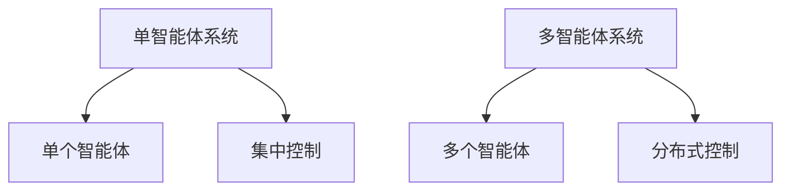
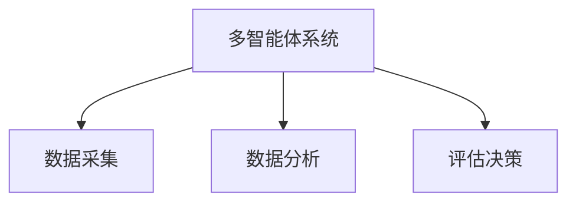
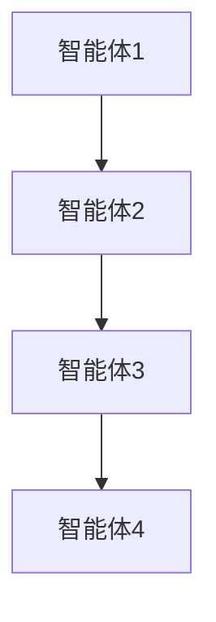
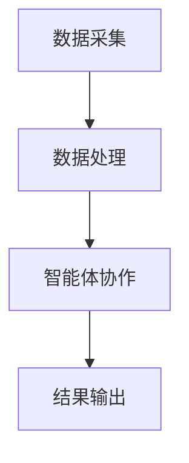
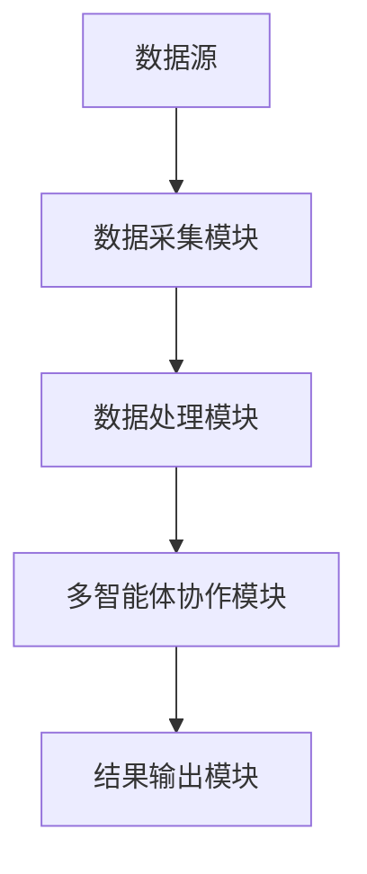
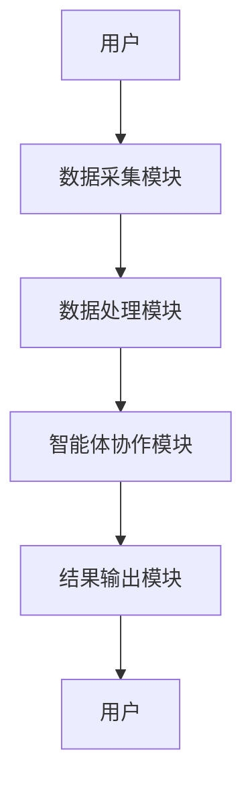

                 


# 多智能体系统如何评估公司的护城河

> 关键词：多智能体系统，公司护城河，护城河评估，系统评估，多智能体协作

> 摘要：本文详细探讨了多智能体系统在评估公司护城河中的应用。通过分析多智能体系统的定义、核心概念、算法原理、系统架构、项目实战以及最佳实践，本文为读者提供了全面的视角，展示了如何利用多智能体系统来提升公司护城河的评估效率和准确性。文章结合理论与实践，提供了丰富的案例和代码示例，帮助读者更好地理解和应用这些技术。

---

# 第1章 多智能体系统与公司护城河概述

## 1.1 多智能体系统的基本概念

### 1.1.1 多智能体系统的定义

多智能体系统（Multi-Agent System, MAS）是由多个智能体组成的分布式系统，这些智能体通过协作完成共同目标。每个智能体都是一个独立的实体，具有感知环境、决策和行动的能力。

### 1.1.2 多智能体系统的核心特点

| 特性 | 描述 |
|------|------|
| 分布性 | 智能体独立运行，不依赖中心节点 |
| 协作性 | 智能体之间通过通信协作完成任务 |
| 反应性 | 能够实时感知环境并做出反应 |

### 1.1.3 多智能体系统与传统单智能体系统的区别



## 1.2 公司护城河的定义与分类

### 1.2.1 什么是公司护城河

公司护城河是指公司在市场上形成的竞争优势，使其难以被竞争对手超越。这些优势可能来自技术、品牌、成本、网络效应等。

### 1.2.2 护城河的分类与特征

| 类型 | 描述 | 特征 |
|------|------|------|
| 技术型 | 基于技术优势 | 高研发投入，技术壁垒 |
| 品牌型 | 基于品牌影响力 | 强品牌认知，客户忠诚度 |
| 成本型 | 基于成本优势 | 高效生产，低边际成本 |
| 网络型 | 基于网络效应 | 用户越多，价值越高 |

### 1.2.3 护城河的构建与维护

构建护城河需要企业持续创新和优化，而维护护城河则需要关注市场变化和竞争对手的动态。

## 1.3 多智能体系统在护城河评估中的作用

### 1.3.1 多智能体系统如何提升护城河评估的效率

多智能体系统能够并行处理大量数据，显著提高评估效率。

### 1.3.2 多智能体系统在护城河评估中的优势

| 优势 | 描述 |
|------|------|
| 分布式计算 | 提高计算效率 |
| 协作性 | 增强评估的全面性 |
| 实时性 | 支持实时数据分析 |

### 1.3.3 多智能体系统与护城河评估的结合场景



## 1.4 本章小结

本章介绍了多智能体系统的基本概念及其在护城河评估中的作用，为后续章节奠定了基础。

---

# 第2章 多智能体系统的核心概念与原理

## 2.1 多智能体系统的核心概念

### 2.1.1 多智能体系统的组成要素

| 组成要素 | 描述 |
|------|------|
| 智能体 | 独立的决策单元 |
| 通信机制 | 智能体之间的交互方式 |
| 协作规则 | 智能体协作的规则 |

### 2.1.2 多智能体系统的通信机制



### 2.1.3 多智能体系统的协作规则

协作规则定义了智能体之间的合作方式，例如任务分配和资源共享。

## 2.2 多智能体系统的原理分析

### 2.2.1 多智能体系统的决策机制

智能体通过感知环境和内部状态做出决策。

### 2.2.2 多智能体系统的任务分配

任务分配算法确保每个智能体承担适当的任务。

### 2.2.3 多智能体系统的状态更新

状态更新机制保证智能体之间的信息同步。

## 2.3 多智能体系统的数学模型

### 2.3.1 多智能体系统的状态表示

每个智能体的状态可以用向量表示。

### 2.3.2 多智能体系统的动作空间

智能体的动作空间定义了可能的行动。

### 2.3.3 多智能体系统的奖励机制

奖励机制用于评估智能体的行为。

## 2.4 本章小结

本章详细分析了多智能体系统的核心概念和原理，为后续章节提供了理论基础。

---

# 第3章 多智能体系统与护城河评估的核心联系

## 3.1 多智能体系统在护城河评估中的应用

### 3.1.1 多智能体系统如何识别护城河的关键要素

通过分析市场数据和竞争对手信息，识别护城河的关键要素。

### 3.1.2 多智能体系统如何量化护城河的价值

利用多智能体协作，量化护城河的经济价值。

### 3.1.3 多智能体系统如何预测护城河的可持续性

预测护城河的生命周期和可能的风险。

## 3.2 多智能体系统与护城河评估的结合模型

### 3.2.1 模型的输入与输出

输入：市场数据、竞争对手信息；输出：护城河评估结果。

### 3.2.2 模型的训练与优化

通过机器学习算法优化模型性能。

### 3.2.3 模型的验证与评估

验证模型的准确性和可靠性。

## 3.3 多智能体系统与护城河评估的对比分析

### 3.3.1 多智能体系统与传统评估方法的对比

多智能体系统在效率和准确性上更具优势。

### 3.3.2 多智能体系统的优势与局限性

优势：高效、准确；局限性：复杂性较高。

### 3.3.3 多智能体系统在护城河评估中的适用场景

适用于大规模、复杂的市场环境。

## 3.4 本章小结

本章探讨了多智能体系统在护城河评估中的应用及其优势。

---

# 第4章 多智能体系统评估护城河的算法原理

## 4.1 多智能体系统评估护城河的算法概述

### 4.1.1 算法的基本原理

通过智能体协作，评估护城河的关键指标。

### 4.1.2 算法的输入与输出

输入：公司数据；输出：护城河评估结果。

### 4.1.3 算法的实现步骤

1. 数据采集
2. 数据处理
3. 智能体协作
4. 结果输出

## 4.2 多智能体系统评估护城河的算法实现

### 4.2.1 算法的代码实现

```python
def evaluate_h Competitive Advantage:
    # 数据处理
    data = preprocess_data()
    # 智能体协作
    agents = initialize_agents()
    results = []
    for agent in agents:
        result = agent.decide(data)
        results.append(result)
    # 输出结果
    return aggregate(results)
```

### 4.2.2 算法的流程图分析



### 4.2.3 算法的数学模型

$$ \text{评估结果} = \sum_{i=1}^{n} \text{智能体}_i(\text{输入}) $$

## 4.3 算法的优化与改进

### 4.3.1 算法的优化策略

引入强化学习算法，提高评估精度。

### 4.3.2 算法的改进方法

增加智能体之间的通信频率，提高协作效率。

### 4.3.3 算法的性能评估

评估算法的计算效率和准确率。

## 4.4 本章小结

本章详细介绍了多智能体系统评估护城河的算法原理和实现方法。

---

# 第5章 多智能体系统评估护城河的系统分析与架构设计

## 5.1 系统分析

### 5.1.1 问题场景介绍

评估公司护城河的复杂性要求多智能体系统的支持。

### 5.1.2 系统功能设计

| 功能模块 | 描述 |
|------|------|
| 数据采集 | 获取市场数据 |
| 数据处理 | 清洗和转换数据 |
| 智能体协作 | 多智能体协同评估 |
| 结果输出 | 输出评估报告 |

### 5.1.3 系统架构设计



## 5.2 系统架构设计

### 5.2.1 系统功能设计

设计系统功能模块，确保功能完整性和可扩展性。

### 5.2.2 系统架构图


### 5.2.3 系统接口设计

定义系统接口，确保各模块之间的通信顺畅。

## 5.3 系统交互设计

### 5.3.1 系统交互流程图



## 5.4 本章小结

本章分析了系统的功能和架构设计，确保系统的高效运行。

---

# 第6章 多智能体系统评估护城河的项目实战

## 6.1 环境安装

### 6.1.1 系统环境要求

安装Python、机器学习库等。

### 6.1.2 环境配置步骤

1. 安装Python
2. 安装必要的库（如NumPy、TensorFlow）
3. 下载数据集

## 6.2 系统核心实现

### 6.2.1 核心代码实现

```python
class Agent:
    def __init__(self, id):
        self.id = id
    def decide(self, data):
        # 具体决策逻辑
        return result
```

### 6.2.2 代码应用解读

解释代码的功能和实现逻辑。

## 6.3 实际案例分析

### 6.3.1 案例背景介绍

选择一个公司，分析其护城河。

### 6.3.2 案例分析与解读

使用多智能体系统评估该公司的护城河。

## 6.4 本章小结

本章通过实际案例展示了多智能体系统在护城河评估中的应用。

---

# 第7章 多智能体系统评估护城河的最佳实践

## 7.1 小结

总结全文，强调多智能体系统的优势。

## 7.2 注意事项

### 7.2.1 系统设计中的注意事项

确保系统的可扩展性和可维护性。

### 7.2.2 算法实现中的注意事项

注意算法的效率和准确性。

## 7.3 拓展阅读

推荐相关书籍和论文，供读者深入学习。

---

# 附录

## 附录A: 多智能体系统相关术语解释

解释文中涉及的专业术语。

## 附录B: 代码实现细节

详细说明代码实现的细节和注意事项。

---

# 结语

多智能体系统为公司护城河的评估提供了新的思路和方法，未来随着技术的发展，其应用将更加广泛和深入。

--- 

# END

