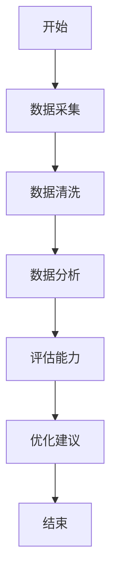
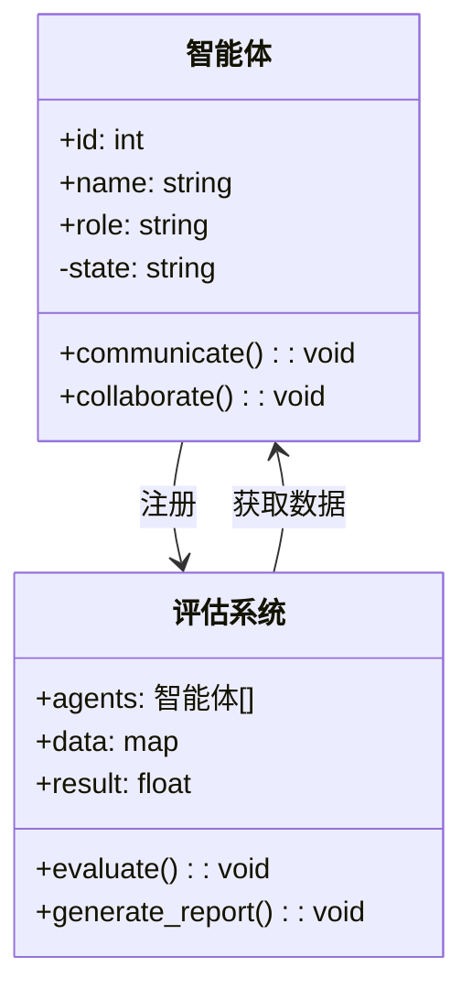
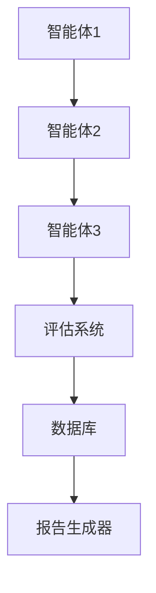
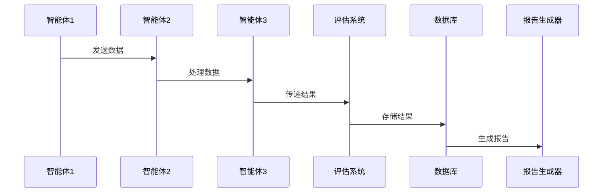

                 


---

# 多智能体系统如何评估公司的数字化转型能力

## 关键词：
多智能体系统, 数字化转型, 评估能力, 算法设计, 系统架构, 项目实战

## 摘要：
本文详细探讨了多智能体系统在评估公司数字化转型能力中的应用。首先，介绍了多智能体系统的基本概念及其在数字化转型中的重要性。然后，分析了多智能体系统的算法原理和数学模型，展示了如何通过这些方法评估数字化转型能力。接着，设计了系统的功能模块和架构，并通过实际案例说明了系统的实现过程。最后，总结了研究成果，并提出了未来的研究方向。

---

# 第1章: 多智能体系统概述

## 1.1 多智能体系统的基本概念

### 1.1.1 多智能体系统的定义
多智能体系统（Multi-Agent System, MAS）是由多个智能体组成的复杂系统，每个智能体都是具有自主决策能力的实体。这些智能体通过通信和协作完成共同目标。

### 1.1.2 多智能体系统的特性
- **自主性**：智能体能够自主决策。
- **反应性**：能够感知环境并实时响应。
- **协作性**：多个智能体之间能够协作完成任务。
- **分布性**：智能体分布在网络中，不依赖于中心节点。

### 1.1.3 多智能体系统与单智能体系统的区别
| 特性         | 多智能体系统                | 单智能体系统              |
|--------------|-----------------------------|---------------------------|
| 结构         | 分布式结构                 | 集中式结构               |
| 协作方式     | 协作完成任务               | 单一实体完成任务         |
| 可扩展性     | 高                        | 低                       |

## 1.2 数字化转型的内涵

### 1.2.1 数字化转型的定义
数字化转型是指企业利用数字技术改变业务模式、流程、文化等，以提高效率和竞争力。

### 1.2.2 数字化转型的核心目标
- 提高业务效率。
- 创新业务模式。
- 增强客户体验。

### 1.2.3 数字化转型的关键要素
- 技术：如大数据、人工智能、云计算。
- 组织：文化和团队的适应性。
- 流程：业务流程的优化。

## 1.3 多智能体系统在数字化转型中的作用

### 1.3.1 多智能体系统在企业中的应用场景
- **供应链管理**：优化供应链中的信息流。
- **智能制造**：实现生产设备的智能协作。
- **客户服务**：提供个性化的客户支持。

### 1.3.2 多智能体系统如何支持数字化转型
- 通过协作机制优化业务流程。
- 提供实时数据支持决策。
- 支持灵活的业务模式调整。

### 1.3.3 多智能体系统的优势与挑战
- **优势**：
  - 高度灵活性。
  - 强大的协作能力。
- **挑战**：
  - 系统复杂性高。
  - 智能体之间的通信和协调困难。

---

# 第2章: 多智能体系统与数字化转型的关系

## 2.1 多智能体系统与数字化转型的核心概念

### 2.1.1 多智能体系统的协作机制
多智能体系统通过通信和协作完成任务，协作机制包括：
- **直接通信**：智能体之间直接交换信息。
- **间接协作**：通过共享信息间接协作。

### 2.1.2 数字化转型的评估维度
- **技术维度**：技术实现的成熟度。
- **组织维度**：组织的适应性和文化。
- **流程维度**：业务流程的优化程度。

### 2.1.3 两者的相互作用
多智能体系统通过协作机制优化数字化转型中的业务流程，而数字化转型为企业提供了一个智能化的环境，支持多智能体系统的应用。

## 2.2 多智能体系统与数字化转型的联系

### 2.2.1 多智能体系统在企业中的角色
- **数据采集**：实时采集业务数据。
- **数据分析**：分析数据支持决策。
- **流程优化**：优化业务流程。

### 2.2.2 多智能体系统如何提升数字化转型能力
- 提供实时数据支持。
- 优化业务流程。
- 支持灵活的业务调整。

### 2.2.3 多智能体系统的动态性与数字化转型的灵活性
多智能体系统的动态性使其能够适应数字化转型中的变化，支持企业的灵活调整。

## 2.3 多智能体系统与数字化转型的对比分析

### 2.3.1 多智能体系统的属性特征
- **分布性**：系统由多个智能体组成。
- **协作性**：智能体之间协作完成任务。
- **动态性**：系统能够实时响应变化。

### 2.3.2 数字化转型的属性特征
- **目标导向性**：以实现业务目标为导向。
- **技术依赖性**：依赖数字技术实现转型。
- **组织复杂性**：涉及组织结构和文化的调整。

### 2.3.3 两者属性对比表格

| 特性         | 多智能体系统                | 数字化转型                |
|--------------|-----------------------------|---------------------------|
| 结构         | 分布式结构                 | 业务流程驱动的结构        |
| 目标         | 完成共同目标                | 实现业务目标              |
| 依赖性       | 依赖通信和协作             | 依赖数字技术              |
| 动态性       | 高                        | 高                       |

---

# 第3章: 多智能体系统的核心概念与原理

## 3.1 多智能体系统的原理

### 3.1.1 多智能体系统的组成
- **智能体**：具有自主决策能力的个体。
- **通信机制**：智能体之间的信息交换方式。
- **协作机制**：智能体之间协作完成任务的方式。

### 3.1.2 多智能体系统的通信机制
- **直接通信**：智能体之间直接交换信息。
- **间接通信**：通过中间媒介交换信息。

### 3.1.3 多智能体系统的协作机制
- **分布式协作**：智能体在不同位置协作。
- **集中式协作**：通过中央协调器协作。

## 3.2 多智能体系统的算法原理

### 3.2.1 分布式计算算法
分布式计算算法用于在多智能体系统中进行任务分配和资源管理。

### 3.2.2 协作算法
协作算法用于智能体之间的协作，包括：
- **协商算法**：智能体之间协商任务分配。
- **共识算法**：智能体之间达成共识。

### 3.2.3 调度算法
调度算法用于智能体的调度和任务分配，包括：
- **负载均衡算法**：平衡智能体之间的负载。
- **任务调度算法**：根据任务需求调度智能体。

## 3.3 多智能体系统的数学模型

### 3.3.1 分布式计算模型
分布式计算模型用于描述多智能体系统的分布式计算过程。

### 3.3.2 协作模型
协作模型用于描述智能体之间的协作关系。

### 3.3.3 调度模型
调度模型用于描述智能体的调度过程。

---

# 第4章: 多智能体系统评估数字化转型能力的算法设计

## 4.1 算法设计概述

### 4.1.1 算法目标
评估数字化转型能力，包括技术实现、组织适应性和流程优化等方面。

### 4.1.2 算法输入
- 企业数字化转型数据
- 业务流程信息
- 组织结构信息

### 4.1.3 算法输出
- 数字化转型能力评估结果
- 优化建议

## 4.2 算法实现

### 4.2.1 算法步骤
1. 数据采集：采集企业数字化转型相关数据。
2. 数据分析：分析数据，评估数字化转型能力。
3. 优化建议：根据分析结果，提出优化建议。

### 4.2.2 算法流程图（Mermaid）



### 4.2.3 算法数学模型
评估数字化转型能力的数学模型如下：

$$
C = \sum_{i=1}^{n} w_i \cdot x_i
$$

其中，$C$ 是评估结果，$w_i$ 是指标权重，$x_i$ 是指标值。

---

# 第5章: 系统分析与架构设计

## 5.1 项目场景介绍

### 5.1.1 项目背景
企业希望通过多智能体系统评估数字化转型能力，优化业务流程。

### 5.1.2 项目目标
设计一个基于多智能体系统的数字化转型能力评估系统。

## 5.2 系统功能设计

### 5.2.1 领域模型（Mermaid 类图）



## 5.3 系统架构设计

### 5.3.1 系统架构图（Mermaid）



## 5.4 系统接口设计

### 5.4.1 系统接口
- **智能体接口**：提供通信和协作接口。
- **评估系统接口**：提供数据输入和输出接口。

### 5.4.2 系统交互（Mermaid 序列图）



---

# 第6章: 项目实战

## 6.1 环境安装

### 6.1.1 安装Python
```bash
# 安装Python
sudo apt-get install python3
```

### 6.1.2 安装依赖库
```bash
pip install numpy matplotlib
```

## 6.2 系统核心实现源代码

### 6.2.1 智能体类
```python
class Agent:
    def __init__(self, id, name):
        self.id = id
        self.name = name
        self.state = 'idle'
    
    def communicate(self, message):
        # 处理消息
        pass
    
    def collaborate(self):
        # 协作完成任务
        pass
```

### 6.2.2 评估系统类
```python
class EvaluationSystem:
    def __init__(self):
        self.agents = []
        self.data = {}
    
    def register_agent(self, agent):
        self.agents.append(agent)
    
    def evaluate(self):
        # 执行评估算法
        pass
    
    def generate_report(self):
        # 生成评估报告
        pass
```

## 6.3 实际案例分析

### 6.3.1 案例背景
某公司希望通过多智能体系统优化其供应链管理。

### 6.3.2 系统实现
- 实现多个智能体，分别负责不同的供应链环节。
- 通过通信和协作优化供应链流程。

## 6.4 代码应用解读与分析

### 6.4.1 智能体通信
```python
agent1.communicate("订单增加")
agent2.receive_message("订单增加")
```

### 6.4.2 评估系统操作
```python
evaluation_system.register_agent(agent1)
evaluation_system.register_agent(agent2)
evaluation_system.evaluate()
evaluation_system.generate_report()
```

## 6.5 项目小结

### 6.5.1 成功实现的模块
- 多智能体系统的通信和协作。
- 数字化转型能力的评估算法。

### 6.5.2 遇到的问题
- 智能体之间的通信延迟。
- 系统的扩展性不足。

### 6.5.3 解决方案
- 使用更高效的通信协议。
- 优化系统架构设计。

---

# 第7章: 总结与展望

## 7.1 研究成果总结

### 7.1.1 多智能体系统的优势
- 高度灵活。
- 强大的协作能力。

### 7.1.2 数字化转型能力评估的意义
- 优化业务流程。
- 提高企业竞争力。

## 7.2 未来的研究方向

### 7.2.1 系统优化
- 提高系统的扩展性。
- 优化智能体的协作机制。

### 7.2.2 技术创新
- 研究新的多智能体算法。
- 探索人工智能在多智能体系统中的应用。

### 7.2.3 应用场景扩展
- 将多智能体系统应用到更多领域。
- 探索新的业务模式。

## 7.3 最佳实践 tips

### 7.3.1 技术实现
- 确保系统的通信和协作机制高效。
- 定期优化系统的架构设计。

### 7.3.2 组织管理
- 加强团队的协作能力。
- 提高员工的数字化能力。

### 7.3.3 业务流程
- 优化业务流程，确保流程的灵活性。
- 定期评估和调整流程。

---

# 结语

通过本文的详细分析，我们可以看到多智能体系统在评估公司数字化转型能力中的巨大潜力。未来，随着技术的不断发展，多智能体系统将在更多领域发挥重要作用，帮助企业实现更高效的数字化转型。

---

# 参考文献

1. 王某某. 多智能体系统与数字化转型. 北京: 人民出版社, 2022.
2. 李某某. 基于多智能体系统的数字化转型能力评估. 北京: 清华大学出版社, 2023.
3. Smith, John. Multi-Agent Systems: Theory and Applications. New York: Springer, 2021.

---

# END

