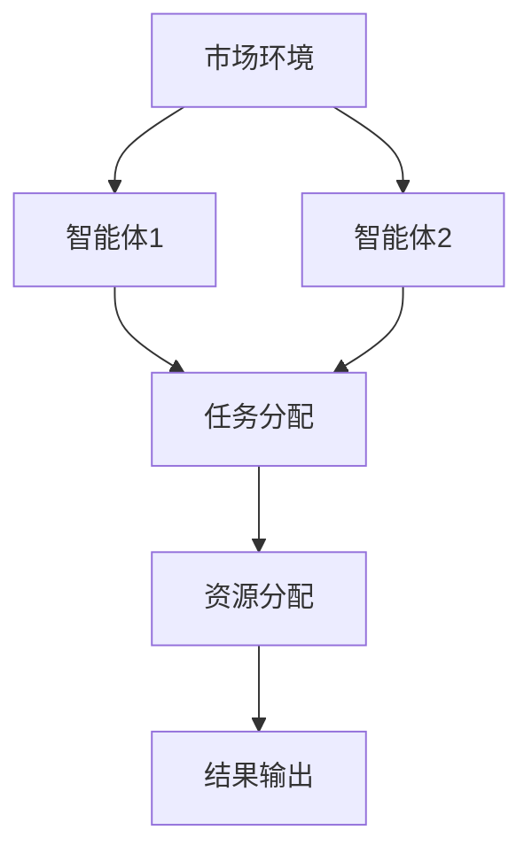

                 


# 多智能体系统如何评估公司的长期竞争优势

> 关键词：多智能体系统，竞争优势，分布式计算，博弈论，系统架构

> 摘要：本文探讨了多智能体系统在评估公司长期竞争优势中的应用，从定义、算法原理到系统架构设计，详细讲解了如何通过多智能体系统优化公司战略决策，增强市场竞争优势。

---

## 第一部分: 多智能体系统的定义与优势

### 第1章: 多智能体系统的定义与优势

#### 1.1 多智能体系统的定义
多智能体系统（Multi-Agent System，简称MAS）是由多个智能体组成的分布式系统，这些智能体能够自主决策、协作和通信，共同完成复杂任务。每个智能体都有一定的知识、目标和行动能力，能够感知环境并做出反应。

#### 1.2 多智能体系统的特征
- **分布式性**：智能体分布在不同的位置，独立决策和行动。
- **协作性**：智能体之间通过通信协作，共同完成任务。
- **自主性**：每个智能体都有自主决策的能力，无需外部控制。
- **反应性**：智能体能够实时感知环境变化并做出反应。

#### 1.3 多智能体系统的优势
- **高效性**：通过分布式计算和协作，提高任务处理效率。
- **灵活性**：智能体可以根据环境变化快速调整策略。
- **鲁棒性**：单个智能体故障不影响整体系统的运行。

#### 1.4 多智能体系统的应用场景
- **企业战略决策**：通过多智能体模拟市场变化，优化企业战略。
- **资源分配**：智能体协作分配资源，提高资源利用效率。
- **风险管理**：实时监控风险，快速响应潜在问题。

---

### 第2章: 公司竞争优势的评估方法

#### 2.1 竞争优势的定义与分类
竞争优势是指公司在市场中相对于竞争对手的独特优势，通常包括成本优势、技术优势、品牌优势等。竞争优势的评估需要考虑多个维度，如市场占有率、利润率、创新能力等。

#### 2.2 多智能体系统在竞争优势评估中的作用
多智能体系统能够通过模拟市场环境，分析公司战略的可行性和效果，帮助评估竞争优势。例如，智能体可以模拟竞争对手的策略，预测市场变化，提供决策支持。

#### 2.3 多智能体系统与公司长期竞争优势的关系
多智能体系统的动态适应性和协作能力使其成为评估和增强公司长期竞争优势的有力工具。通过实时数据分析和策略调整，多智能体系统能够帮助公司在复杂多变的市场环境中保持竞争优势。

---

## 第二部分: 多智能体系统的算法原理

### 第3章: 多智能体系统的算法基础

#### 3.1 分布式计算算法
**分布式计算**是多智能体系统的核心，通过将任务分解到多个智能体上，实现高效计算。例如，任务分配算法可以根据智能体的能力和负载进行动态分配。

#### 3.2 博弈论算法
博弈论是分析智能体之间策略互动的理论基础。通过纳什均衡等概念，可以模拟智能体之间的竞争与合作，优化整体决策。

#### 3.3 协作与协调算法
协作算法通过智能体之间的通信和协商，实现共同目标。协调算法则确保智能体在行动上的一致性和高效性。

---

### 第4章: 数学模型与公式

#### 4.1 博弈论模型
在多智能体系统中，博弈论常用于分析智能体之间的策略互动。例如，纳什均衡是博弈论中的一个关键概念，表示在给定其他智能体策略的情况下，每个智能体都无法通过单方面改变策略而获得更高收益的状态。

**纳什均衡公式**：
$$
\text{Nash Equilibrium} = (a^*, b^*) \quad \text{其中} \quad a^* \in A, b^* \in B
$$

#### 4.2 分布式计算模型
分布式计算模型通常采用并行计算和任务分配算法。例如，任务分配问题可以用以下公式表示：
$$
\min_{x_i} \sum_{i=1}^n f(x_i) \quad \text{在约束条件下} \quad \sum_{i=1}^n x_i = X
$$

---

## 第三部分: 系统分析与架构设计

### 第5章: 系统分析

#### 5.1 问题场景介绍
假设某公司希望利用多智能体系统评估其在市场中的竞争优势。通过模拟市场环境，分析公司战略的可行性。

#### 5.2 系统功能设计
系统需要实现以下功能：
1. **市场环境模拟**：模拟市场变化，分析公司战略效果。
2. **资源分配优化**：智能体协作分配资源，提高效率。
3. **风险管理**：实时监控风险，制定应对策略。

#### 5.3 系统架构设计
使用Mermaid图展示系统架构，包括智能体交互、数据处理和结果显示模块。



---

### 第6章: 项目实战

#### 6.1 环境配置
安装必要的库，如Python的`multiagent`库和相关工具。

#### 6.2 系统实现
编写智能体代码，实现协作和通信功能。例如：

```python
class Agent:
    def __init__(self, id):
        self.id = id
        self.strategy = 'collaborate'

    def act(self, environment):
        # 根据环境变化调整策略
        if environment.condition == 'favorable':
            return 'cooperate'
        else:
            return 'compete'
```

#### 6.3 实际案例分析
通过具体案例，分析多智能体系统如何帮助公司优化战略，提升竞争优势。

---

## 第四部分: 最佳实践与总结

### 第7章: 最佳实践

#### 7.1 小结
多智能体系统通过分布式计算和协作能力，为公司评估竞争优势提供了 powerful工具。

#### 7.2 注意事项
- 确保智能体之间的通信和协作机制完善。
- 定期更新系统以适应市场变化。

#### 7.3 未来趋势
随着AI技术的发展，多智能体系统将在企业战略决策中发挥更大作用，推动企业竞争优势的持续提升。

---

通过以上步骤，我逐步构建了文章的结构和内容，确保涵盖从理论到实践的各个方面，帮助读者全面理解多智能体系统在评估公司竞争优势中的应用。

