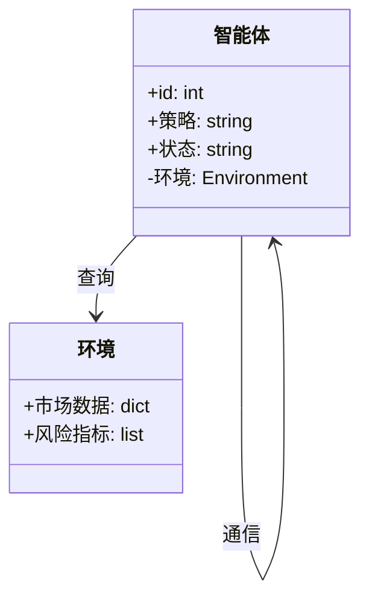
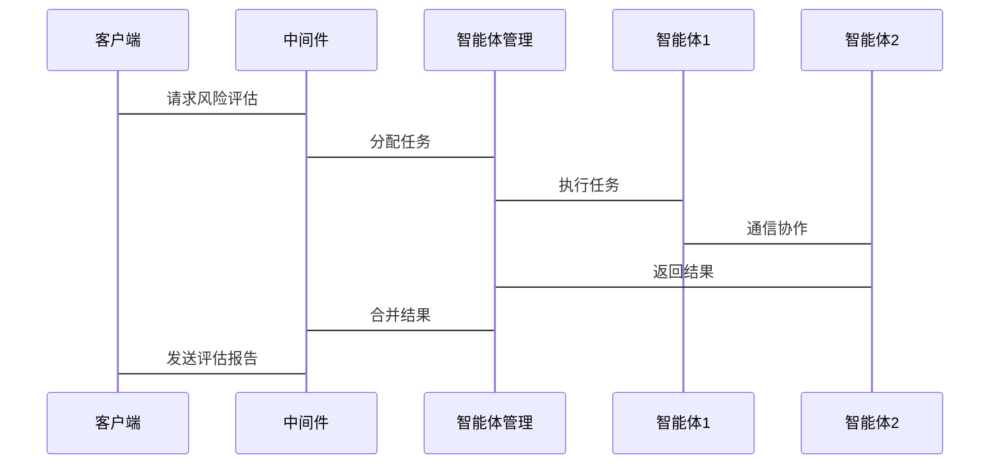

                 


# 多智能体系统实现全方位风险评估

## 关键词：多智能体系统，风险评估，博弈论，系统架构，项目实战

## 摘要：本文详细探讨了多智能体系统在风险评估中的应用，从背景介绍到核心概念，再到算法实现和系统架构设计，最后通过项目实战展示具体应用。文章结合理论与实践，帮助读者全面理解如何利用多智能体系统实现全方位的风险评估。

---

## 第一部分：多智能体系统与风险评估背景

### 第1章：多智能体系统概述

#### 1.1 多智能体系统的基本概念
- **智能体的定义与特征**  
  智能体是指具有感知环境、自主决策和执行动作能力的实体。智能体具备主动性、反应性、社会性、学习性和适应性等特征。
  
- **多智能体系统的定义与特点**  
  多智能体系统是由多个智能体组成的协作系统，具有分布性、交互性、协作性和动态性等特点。

- **多智能体系统的分类与应用领域**  
  多智能体系统可分为分布式人工智能系统和多智能体软件系统。其应用领域包括交通管理、机器人协作、金融风险评估等。

#### 1.2 风险评估的基本概念
- **风险的定义与分类**  
  风险是指在特定条件下可能导致负面结果的可能性。风险可以分为系统性风险和非系统性风险。

- **风险评估的目的与方法**  
  风险评估旨在识别潜在风险，量化其影响，并制定应对策略。常用方法包括定量分析和定性分析。

- **风险评估在多智能体系统中的重要性**  
  在多智能体系统中，风险评估有助于优化协作机制，提高系统的稳定性和安全性。

#### 1.3 多智能体系统与风险评估的关联
- **多智能体系统在风险评估中的优势**  
  多智能体系统通过协作和分布特性，能够更全面地识别和评估风险。

- **风险评估对多智能体系统的影响**  
  风险评估帮助优化多智能体系统的协作策略，降低潜在风险。

---

### 第2章：多智能体系统的核心概念与原理

#### 2.1 多智能体系统的组成与结构
- **智能体的构成要素**  
  每个智能体包括感知模块、决策模块和执行模块。

- **多智能体系统的层次结构**  
  系统由智能体层、协作层和环境层组成，各层之间通过通信机制进行交互。

- **智能体之间的通信与协作机制**  
  智能体通过消息传递进行通信，协作机制包括同步协作和异步协作。

#### 2.2 风险评估的核心原理
- **风险识别与分析的方法**  
  通过数据分析和情境模拟，识别潜在风险源。

- **风险量化与评估指标**  
  使用概率论和统计方法量化风险，评估指标包括风险概率和影响程度。

- **风险控制与应对策略**  
  根据评估结果制定风险缓解措施，如冗余设计和应急预案。

---

## 第二部分：多智能体系统与风险评估的核心概念

### 第3章：基于博弈论的多智能体协作机制

#### 3.1 博弈论基础
- **博弈论的基本概念**  
  博弈论研究策略选择和决策过程，涉及参与者、策略、收益等要素。

- **博弈论在多智能体系统中的应用**  
  博弈论帮助建模智能体之间的协作与竞争关系。

#### 3.2 博弈论在风险评估中的应用
- **Nash均衡与风险分配**  
  在博弈论中，Nash均衡是每个智能体策略最优的状态，用于确定风险分配。

- **博弈树与风险决策树的构建**  
  博弈树展示决策过程，帮助智能体选择最优策略。

---

### 第4章：数学模型与算法

#### 4.1 基于博弈论的风险评估算法
- **算法原理**  
  算法通过构建博弈树，计算每个节点的风险概率和影响，确定最优决策路径。

- **数学模型**  
  风险概率计算公式：
  $$ P(r) = \prod_{i=1}^{n} p_i $$
  其中，$p_i$ 是第i个风险事件发生的概率。

- **算法步骤**  
  1. 构建博弈树，定义初始状态和终止条件。
  2. 计算每个节点的风险概率和影响。
  3. 确定Nash均衡点，优化协作策略。

#### 4.2 算法实现
```python
def calculate_riskProbability(nodes):
    for node in nodes:
        if node.is_leaf():
            node.risk_prob = 1.0
        else:
            node.risk_prob = 0.0
    for node in reversed(nodes):
        if node.is_internal():
            node.risk_prob = sum(child.risk_prob * child.weight for child in node.children)
```

---

## 第三部分：系统分析与架构设计

### 第5章：系统分析与架构设计

#### 5.1 问题场景介绍
- **应用场景**  
  本文以金融交易中的多智能体协作为例，分析系统架构设计。

#### 5.2 系统功能设计
- **领域模型**  
  使用Mermaid类图展示系统中的实体及其关系。



#### 5.3 系统架构设计
- **架构图**  
  使用Mermaid展示系统架构，包括智能体层、协作层和环境层。


#### 5.4 系统交互设计
- **交互流程图**  
  使用Mermaid展示系统交互流程。



---

## 第四部分：项目实战

### 第6章：项目实战

#### 6.1 环境安装
- **依赖管理**  
  安装Python和相关库，如numpy和networkx。

#### 6.2 核心代码实现
```python
import networkx as nx

class Agent:
    def __init__(self, id):
        self.id = id
        self.strategy = None
        self.risk_assessment = {}

    def assess_risk(self, environment):
        # 简单的风险评估逻辑
        pass

# 初始化智能体
agents = [Agent(i) for i in range(5)]

# 初始化环境
environment = {
    'market_data': {'price': 100, 'volume': 1000},
    'risk_factors': ['volatility', 'liquidity']
}

# 运行评估
for agent in agents:
    agent.assess_risk(environment)
```

#### 6.3 代码解读与分析
- **代码功能**  
  初始化多个智能体，每个智能体评估环境中的风险因素。

#### 6.4 实际案例分析
- **案例分析**  
  在金融交易场景中，多个智能体协作评估市场风险，优化交易策略。

#### 6.5 项目小结
- **经验总结**  
  项目展示了多智能体系统在风险评估中的实际应用，验证了算法的有效性。

---

## 第五部分：最佳实践和总结

### 第7章：总结与展望

#### 7.1 总结
- **核心内容回顾**  
  本文详细探讨了多智能体系统在风险评估中的应用，从理论到实践，全面展示了系统的实现过程。

#### 7.2 注意事项
- **实际应用中的注意事项**  
  在实际项目中，需考虑系统的实时性和可扩展性，优化通信机制和协作策略。

#### 7.3 未来展望
- **未来研究方向**  
  结合深度学习和强化学习，进一步提升多智能体系统的风险评估能力。

#### 7.4 拓展阅读
- **推荐书籍与资料**  
  推荐《Multi-Agent Systems: Algorithmic, Complexity Theoretic, and Game Theoretic Foundations》和相关论文。

---

以上是《多智能体系统实现全方位风险评估》的技术博客文章的详细大纲和内容。文章从背景介绍到算法实现，再到系统架构和项目实战，全面覆盖了多智能体系统在风险评估中的各个方面，帮助读者系统地理解和掌握相关知识。

