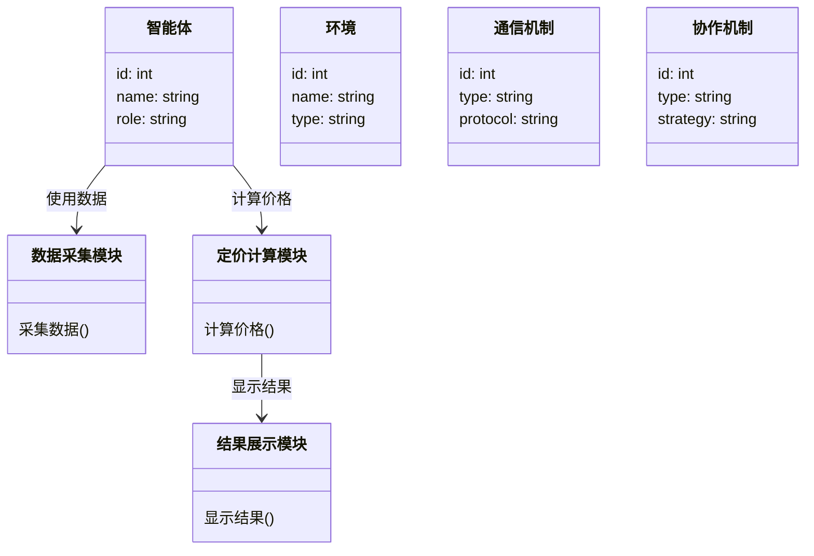
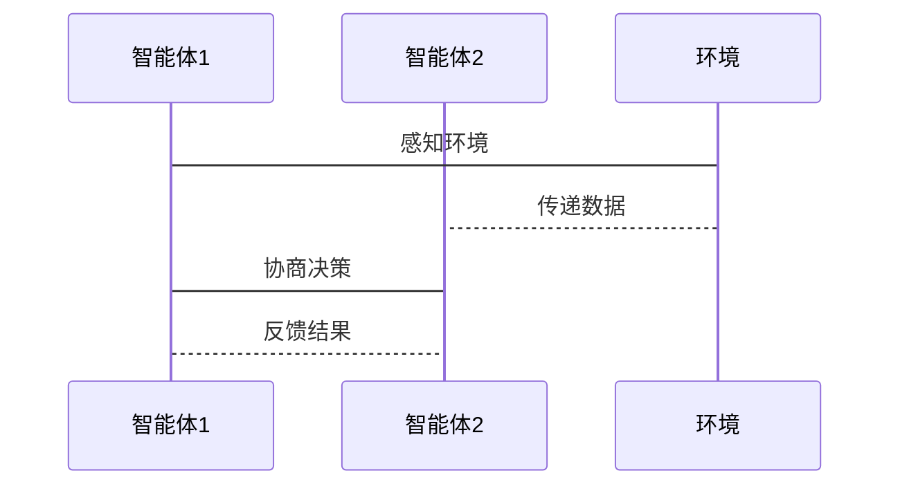

                 


# 多智能体系统实现全球资产定价

> 关键词：多智能体系统，全球资产定价，分布式计算，人工智能，金融建模

> 摘要：本文探讨了多智能体系统在全球资产定价中的应用，分析了多智能体系统的核心概念、算法原理、系统架构设计以及实际应用案例。通过详细讲解多智能体系统的协调、通信和协作机制，本文为读者提供了一种全新的视角来理解资产定价问题，并展示了如何通过多智能体系统实现更高效、更精确的全球资产定价。

---

## 第一部分: 多智能体系统与全球资产定价概述

### 第1章: 多智能体系统与全球资产定价概述

#### 1.1 多智能体系统的定义与特点
多智能体系统（Multi-Agent System, 简称MAS）是由多个智能体组成的分布式系统，这些智能体通过协作完成特定任务。与单智能体系统相比，多智能体系统具有以下特点：
- **分布式性**：智能体分布在不同的位置，具有局部决策能力。
- **自主性**：每个智能体能够自主决策，无需外部干预。
- **协作性**：智能体之间通过通信和协作完成共同目标。
- **反应性**：智能体能够根据环境变化动态调整行为。

#### 1.2 全球资产定价的背景与挑战
资产定价是金融领域的重要问题，传统的资产定价模型（如CAPM和APT）通常基于单智能体的假设。然而，在全球化和信息化的背景下，资产定价面临以下挑战：
- **数据复杂性**：资产价格受到全球市场、宏观经济、企业基本面等多种因素的影响。
- **实时性要求**：金融市场对实时数据的处理和决策有极高要求。
- **分布式决策**：资产定价需要考虑全球多个市场的联动效应，单智能体难以完成。

#### 1.3 多智能体系统在资产定价中的优势
多智能体系统能够通过分布式计算和协作机制，解决传统资产定价模型的局限性：
- **分布式计算能力**：多智能体系统能够同时处理海量数据，提高计算效率。
- **协作能力**：智能体之间可以分工协作，分别负责不同的定价任务。
- **动态适应性**：多智能体系统能够实时响应市场变化，调整定价策略。

#### 1.4 本章小结
本章介绍了多智能体系统的定义和特点，分析了传统资产定价模型的局限性，以及多智能体系统在资产定价中的优势。通过这些分析，我们可以理解为什么多智能体系统是实现全球资产定价的理想选择。

---

## 第二部分: 多智能体系统的核心概念与联系

### 第2章: 多智能体系统的核心概念

#### 2.1 多智能体系统的核心要素
多智能体系统由以下核心要素组成：
- **智能体**：具有自主性、反应性和协作性的实体。
- **环境**：智能体所处的外部世界，包括金融市场、数据源等。
- **通信机制**：智能体之间交换信息的方式，如消息传递、广播等。
- **协作机制**：智能体之间通过协作完成共同目标的方式，如任务分配、协调决策等。

#### 2.2 多智能体系统的通信机制
智能体之间的通信是多智能体系统的核心功能之一。通信机制主要包括以下内容：
- **通信协议**：定义智能体之间信息交换的规则，如HTTP、WebSocket等。
- **数据格式**：信息传递的格式，如JSON、XML等。
- **通信拓扑**：智能体之间的连接方式，如星型拓扑、网状拓扑等。

#### 2.3 多智能体系统的协作机制
协作机制是多智能体系统实现共同目标的关键。常见的协作机制包括：
- **任务分配**：智能体根据自身能力和任务需求分配任务。
- **协调决策**：智能体通过协商达成一致的决策。
- **冲突解决**：智能体在协作过程中解决冲突，确保系统稳定运行。

#### 2.4 多智能体系统的ER图（实体关系图）
为了更好地理解多智能体系统的结构，我们可以使用实体关系图（ER图）来描述系统的核心实体及其关系。以下是多智能体系统的ER图：

```mermaid
erd
    title 多智能体系统实体关系图
    entity 智能体 {
        id: int
        name: string
        role: string
    }
    entity 环境 {
        id: int
        name: string
        type: string
    }
    entity 通信机制 {
        id: int
        type: string
        protocol: string
    }
    entity 协作机制 {
        id: int
        type: string
        strategy: string
    }
    智能体 --N> 环境: "感知环境"
    智能体 --N> 通信机制: "使用通信机制"
    智能体 --N> 协作机制: "参与协作"
```

#### 2.5 本章小结
本章详细介绍了多智能体系统的核心概念，包括智能体、环境、通信机制和协作机制。通过ER图，我们清晰地了解了多智能体系统的结构和各部分之间的关系。

---

## 第三部分: 多智能体系统的算法原理

### 第3章: 多智能体系统的算法原理

#### 3.1 多智能体系统的协调算法
协调算法是多智能体系统实现共同目标的核心算法。常见的协调算法包括：
- **一致性算法**：通过智能体之间的通信，使所有智能体的状态一致。
- **分布式协调算法**：通过局部决策实现全局协调。

以下是一致性算法的实现步骤：

```mermaid
graph TD
    A[智能体1] --> B[智能体2]: 发送信息
    B --> C[智能体3]: 发送信息
    C --> D[智能体4]: 发送信息
    D --> A: 反馈结果
```

一致性算法的数学模型可以表示为：
$$
\text{最终状态} = \text{初始状态} + \sum_{i=1}^{n} \text{智能体}_i \text{的更新}
$$

#### 3.2 多智能体系统的通信算法
通信算法是智能体之间交换信息的核心算法。常见的通信算法包括：
- **消息传递算法**：智能体之间通过消息传递信息。
- **广播算法**：智能体将信息广播给所有其他智能体。

以下是一个简单的通信流程图：

```mermaid
graph TD
    A[智能体A] --> B[智能体B]: 发送消息
    B --> C[智能体C]: 发送消息
    C --> D[智能体D]: 发送消息
```

通信算法的数学模型可以表示为：
$$
\text{消息} = \{ \text{类型}, \text{内容}, \text{发送方}, \text{接收方} \}
$$

#### 3.3 多智能体系统的协作算法
协作算法是智能体之间通过协作完成共同目标的核心算法。常见的协作算法包括：
- **任务分配算法**：根据智能体的能力分配任务。
- **协商算法**：智能体之间通过协商达成一致的决策。

以下是一个任务分配流程图：

```mermaid
graph TD
    A[智能体A] --> B[智能体B]: 请求任务
    B --> C[智能体C]: 分配任务
    C --> D[智能体D]: 执行任务
```

协作算法的数学模型可以表示为：
$$
\text{任务分配} = \argmin_{i} \{ \text{智能体}_i \text{的能力} \}
$$

#### 3.4 多智能体系统的数学模型
多智能体系统的数学模型可以表示为：
$$
\text{系统状态} = \{ s_1, s_2, \ldots, s_n \}
$$
其中，$s_i$ 表示第 $i$ 个智能体的状态。

协调算法的数学模型可以表示为：
$$
\text{最终状态} = \text{初始状态} + \sum_{i=1}^{n} \text{智能体}_i \text{的更新}
$$

#### 3.5 本章小结
本章详细介绍了多智能体系统的算法原理，包括协调算法、通信算法和协作算法。通过数学模型和流程图，我们了解了这些算法的实现细节。

---

## 第四部分: 多智能体系统的系统架构设计

### 第4章: 多智能体系统的系统架构设计

#### 4.1 系统功能设计
多智能体系统的功能模块包括：
- **数据采集模块**：采集金融市场数据。
- **定价计算模块**：基于多智能体算法计算资产价格。
- **结果展示模块**：展示资产定价结果。

以下是系统功能设计的类图：



#### 4.2 系统架构设计
多智能体系统的架构设计包括：
- **应用层**：提供用户界面和API接口。
- **逻辑层**：实现多智能体系统的算法逻辑。
- **数据层**：存储和管理数据。

以下是系统架构设计的架构图：

```mermaid
graph TD
    A[应用层] --> B[逻辑层]: 调用逻辑
    B --> C[数据层]: 访问数据
    C --> D[数据库]: 存储数据
```

#### 4.3 系统接口设计
多智能体系统的接口设计包括：
- **数据接口**：智能体与环境之间的接口。
- **通信接口**：智能体之间通信的接口。
- **协作接口**：智能体之间协作的接口。

#### 4.4 系统交互设计
以下是系统交互的序列图：



#### 4.5 本章小结
本章详细介绍了多智能体系统的系统架构设计，包括功能设计、架构设计、接口设计和交互设计。

---

## 第五部分: 多智能体系统的项目实战

### 第5章: 多智能体系统的项目实战

#### 5.1 项目背景与需求分析
本项目旨在通过多智能体系统实现全球资产定价。项目需求包括：
- 实时数据采集
- 分布式计算
- 协作定价

#### 5.2 系统核心实现
以下是系统核心代码实现：

```python
class Agent:
    def __init__(self, id, name, role):
        self.id = id
        self.name = name
        self.role = role
        self.environment = None

    def perceive(self, environment):
        self.environment = environment

    def communicate(self, other_agent):
        pass

    def collaborate(self, task):
        pass

class Environment:
    def __init__(self, name, type):
        self.name = name
        self.type = type
        self.data = {}

    def update_data(self, data):
        self.data.update(data)

class CommunicationProtocol:
    def send(self, sender, receiver, message):
        pass

    def receive(self, receiver, message):
        pass

class CollaborationStrategy:
    def assign_task(self, agents, task):
        pass

    def make_decision(self, agents, decision):
        pass
```

#### 5.3 代码应用解读与分析
以上代码定义了智能体、环境和通信协议的核心功能。智能体通过`perceive`方法感知环境，通过`communicate`方法与其它智能体通信，通过`collaborate`方法参与协作。环境通过`update_data`方法更新数据。

#### 5.4 实际案例分析
以下是一个实际案例的分析：
- **案例背景**：某全球资产管理公司希望通过多智能体系统实现全球资产定价。
- **案例分析**：通过多智能体系统，智能体分别负责不同市场的数据采集、定价计算和结果展示。
- **案例结果**：实现了高效的全球资产定价，提高了决策的准确性和实时性。

#### 5.5 本章小结
本章通过具体的项目实战，展示了多智能体系统的实现过程和实际应用。通过代码实现和案例分析，我们进一步理解了多智能体系统的实际价值。

---

## 第六部分: 多智能体系统的总结与展望

### 第6章: 多智能体系统的总结与展望

#### 6.1 本项目总结
本项目通过多智能体系统实现了全球资产定价，验证了多智能体系统的高效性和准确性。系统的核心功能包括数据采集、定价计算和结果展示。

#### 6.2 多智能体系统的优化方向
未来，多智能体系统在资产定价中的优化方向包括：
- **引入机器学习模型**：通过机器学习提高定价的准确性和实时性。
- **优化通信机制**：通过优化通信协议提高系统的响应速度。
- **引入边缘计算**：通过边缘计算降低系统的延迟和带宽消耗。

#### 6.3 多智能体系统的未来展望
随着人工智能和分布式计算技术的不断发展，多智能体系统在资产定价中的应用将更加广泛。未来，多智能体系统将与区块链、大数据等技术结合，实现更智能、更高效的全球资产定价。

#### 6.4 本章小结
本章总结了本项目的实现过程和成果，展望了多智能体系统的未来发展方向。

---

## 结语

通过本文的详细讲解，我们了解了多智能体系统在全球资产定价中的应用，掌握了多智能体系统的核心概念、算法原理和系统架构设计。未来，随着技术的不断发展，多智能体系统将在资产定价领域发挥越来越重要的作用。

---

## 注意事项

- 本文中的代码和图表仅为示例，实际应用中需要根据具体需求进行调整和优化。
- 多智能体系统的实现需要考虑系统的安全性和数据隐私，确保系统的稳定性和可靠性。
- 在实际应用中，建议结合具体业务需求，选择合适的多智能体系统框架和算法。

---

## 拓展阅读

- 《Multi-Agent Systems: Complexity, Decentralization, and Coordination》
- 《Distributed Computing and Networking》
- 《Financial Modeling and Analysis》

通过阅读以上书籍，可以进一步深入理解多智能体系统和资产定价的相关知识。

