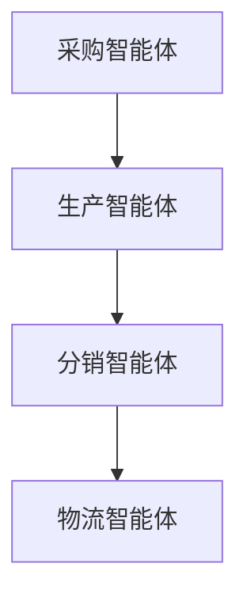
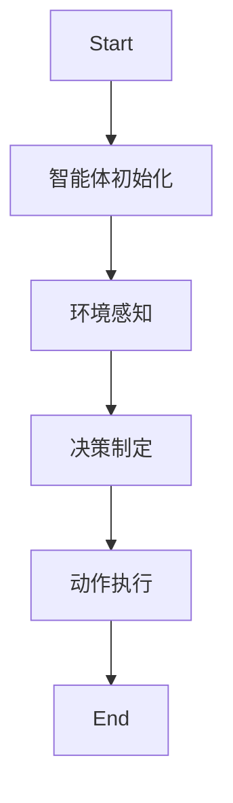
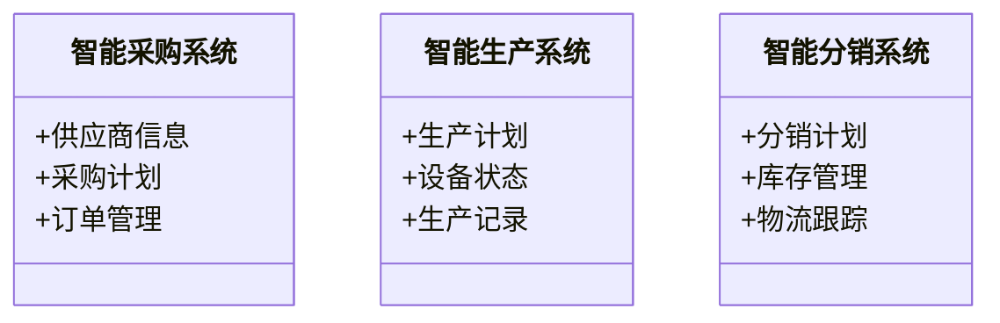

                 


# 多智能体系统实现智能化产业链分析

## 关键词
多智能体系统, 智能化产业链, 分布式计算, 博弈论模型, 产业链智能化

## 摘要
本文旨在探讨多智能体系统在实现智能化产业链中的应用与价值。通过分析多智能体系统的概念、算法原理、系统设计及实际案例，本文揭示了多智能体系统如何通过分布式计算和协作机制提升产业链的智能化水平。文章内容涵盖背景介绍、核心概念、算法实现、系统架构、项目实战及最佳实践，为读者提供全面且深入的分析。

---

# 第一部分: 多智能体系统与智能化产业链概述

## 第1章: 多智能体系统的基本概念

### 1.1 多智能体系统的基本概念
#### 1.1.1 什么是多智能体系统
多智能体系统（Multi-Agent System, 简称 MAS）是由多个智能体（Agent）组成的分布式系统，这些智能体能够通过感知环境、自主决策和协作完成复杂任务。智能体可以是软件程序、机器人或其他具备计算能力的实体。

#### 1.1.2 多智能体系统的特征
- **自主性**：智能体能够自主决策和行动。
- **反应性**：智能体能够实时感知环境变化并做出反应。
- **协作性**：多个智能体之间可以协同工作，共同完成目标。
- **分布性**：智能体分布在不同的位置，通过通信和协作完成任务。

#### 1.1.3 多智能体系统与单智能体系统的区别
| 特性 | 单智能体系统 | 多智能体系统 |
|------|--------------|--------------|
| 独立性 | 高           | 中           |
| 协作性 | 低           | 高           |
| 复杂性 | 低           | 高           |

### 1.2 智能化产业链的定义与特点
#### 1.2.1 产业链的基本概念
产业链是指从原材料采购、生产加工、分销到最终用户的完整价值链。传统产业链通常依赖人工操作和集中式管理，效率低下且灵活性差。

#### 1.2.2 智能化产业链的核心要素
- **数据驱动**：通过大数据分析优化生产流程。
- **智能化决策**：利用人工智能技术做出最优决策。
- **自动化执行**：通过自动化系统实现生产过程的无人化或少人化。

#### 1.2.3 智能化产业链的优势与挑战
优势：
- 提高效率：通过智能化技术优化生产流程。
- 降低成本：减少人工干预，降低运营成本。
- 提高灵活性：快速适应市场变化。

挑战：
- 数据孤岛：不同环节之间数据难以共享。
- 系统复杂性：多智能体系统的协调与管理难度大。
- 安全性问题：数据泄露和系统被攻击的风险增加。

---

## 第2章: 多智能体系统在产业链中的应用背景

### 2.1 产业链智能化的必要性
#### 2.1.1 传统产业链的局限性
传统产业链依赖人工操作，效率低下且难以适应快速变化的市场需求。例如，供应链管理中，原材料短缺可能导致生产延误，而信息传递不及时会加剧问题。

#### 2.1.2 智能化产业链的迫切需求
随着市场竞争的加剧和客户需求的多样化，企业需要更高效、灵活的生产方式。智能化产业链能够通过数据驱动和自动化技术满足这些需求。

#### 2.1.3 多智能体系统在产业链中的角色
多智能体系统在产业链中扮演着关键角色，例如作为供应链管理中的智能体，实时监控库存并优化物流。

### 2.2 多智能体系统与产业链智能化的关系
#### 2.2.1 多智能体系统如何推动产业链智能化
通过分布式计算和协作机制，多智能体系统能够实时优化生产流程，提高效率。

#### 2.2.2 产业链智能化对多智能体系统的需求
智能化产业链需要多智能体系统具备高实时性、强协作性和高安全性。

#### 2.2.3 多智能体系统在产业链不同环节的应用
| 环节 | 应用 |
|------|------|
| 采购 | 智能采购系统 |
| 生产 | 智能生产设备 |
| 分销 | 智能分销系统 |

---

## 第3章: 多智能体系统的核心概念与联系

### 3.1 多智能体系统的实体关系图


### 3.2 多智能体系统的算法流程图


### 3.3 多智能体系统的数学模型
#### 3.3.1 智能体行为模型
$$ B = f(s, a) $$
其中，$s$ 表示状态，$a$ 表示动作，$B$ 表示行为结果。

#### 3.3.2 多智能体协作模型
$$ C = \sum_{i=1}^{n} w_i \cdot a_i $$
其中，$w_i$ 表示智能体 $i$ 的权重，$a_i$ 表示智能体 $i$ 的动作。

---

## 第4章: 多智能体系统的算法原理

### 4.1 分布式计算与多智能体协作
#### 4.1.1 分布式计算的基本原理
分布式计算通过将任务分配给多个计算节点，利用每个节点的计算能力完成任务。

#### 4.1.2 多智能体协作的算法实现
- **通信协议**：智能体之间通过通信协议传递信息。
- **协调机制**：通过协调机制确保智能体之间的协作。

#### 4.1.3 分布式计算在多智能体中的应用
```python
import threading

class Agent:
    def __init__(self, id):
        self.id = id
        self.state = "idle"

    def run(self):
        while True:
            if self.state == "idle":
                self.request_task()
            elif self.state == "busy":
                self.execute_task()
            # 更多状态和方法

# 创建多个智能体并启动
agents = [Agent(i) for i in range(5)]
for agent in agents:
    threading.Thread(target=agent.run).start()
```

---

## 第5章: 系统分析与架构设计方案

### 5.1 问题场景介绍
假设我们有一个汽车制造厂，需要通过多智能体系统优化供应链管理。

### 5.2 系统功能设计
#### 5.2.1 领域模型


### 5.3 系统架构设计


### 5.4 系统接口设计
- **采购接口**：与供应商系统对接。
- **生产接口**：与生产设备对接。
- **分销接口**：与分销渠道对接。

---

## 第6章: 项目实战

### 6.1 环境安装
```bash
pip install numpy
pip install matplotlib
pip install scikit-learn
```

### 6.2 系统核心实现
```python
import numpy as np
from sklearn.cluster import KMeans

class ProductionAgent:
    def __init__(self, data):
        self.data = data
        self.model = KMeans(n_clusters=3)

    def train(self):
        self.model.fit(self.data)

    def predict(self, new_data):
        return self.model.predict(new_data)
```

### 6.3 实际案例分析
以汽车制造厂为例，通过多智能体系统优化生产计划。

---

## 第7章: 总结与展望

### 7.1 最佳实践 tips
- 确保数据安全。
- 选择合适的通信协议。
- 定期维护和优化系统。

### 7.2 小结
多智能体系统在实现智能化产业链中具有重要作用，通过分布式计算和协作机制，能够显著提高生产效率和灵活性。

### 7.3 注意事项
- 数据隐私问题。
- 系统复杂性带来的维护难度。

### 7.4 拓展阅读
- 《多智能体系统的理论与应用》。
- 《人工智能在工业4.0中的应用》。

---

通过以上分析，我们可以看到多智能体系统在实现智能化产业链中的巨大潜力。未来，随着技术的进步，多智能体系统将在更多领域发挥重要作用。

