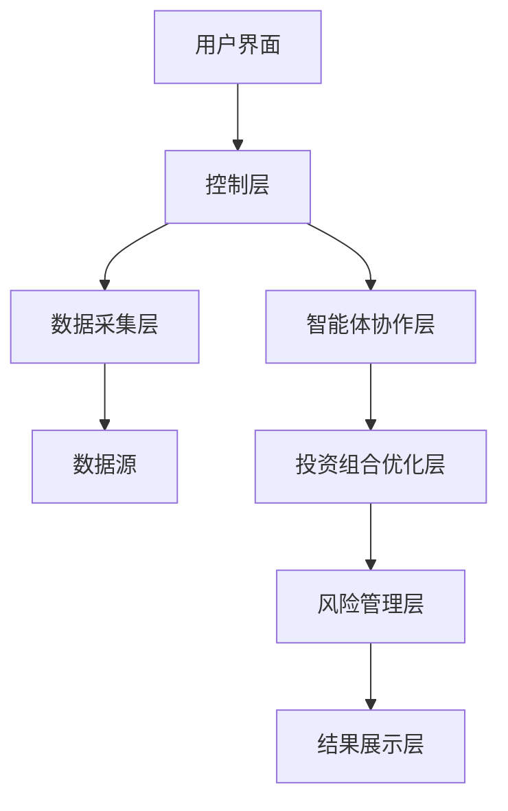
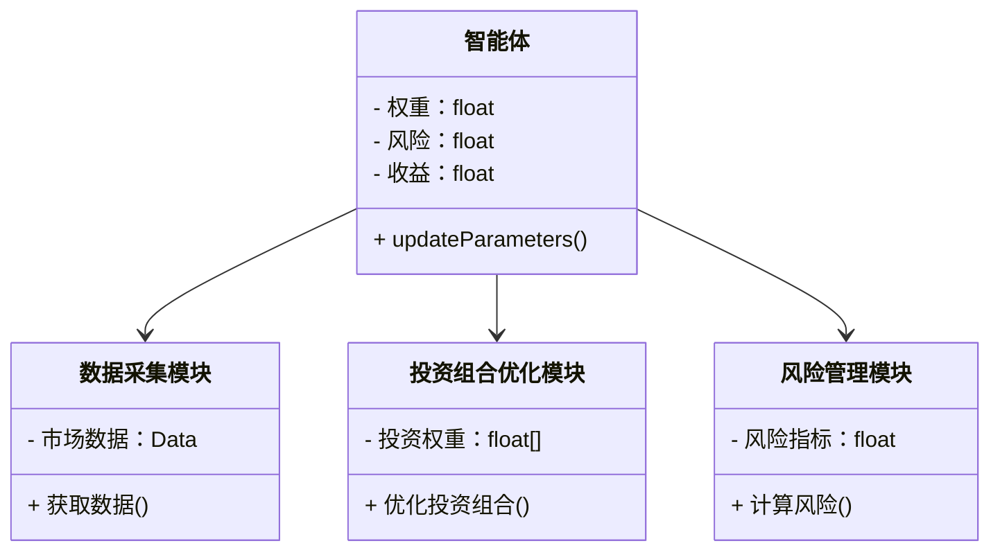

                 


# 多智能体系统实现智能化全球资产配置

> 关键词：多智能体系统, 全球资产配置, 投资组合优化, 分布式优化, 金融市场

> 摘要：本文详细探讨了多智能体系统在全球资产配置中的应用，从基本概念、系统架构、算法原理到实际案例，全面分析了多智能体系统如何实现智能化的全球资产配置。通过详细的技术分析和案例解读，本文展示了如何利用多智能体系统的分布式优化和协作机制，解决全球资产配置中的复杂问题，优化投资组合，降低风险。

---

# 第1章: 多智能体系统与全球资产配置背景

## 1.1 多智能体系统的定义与特点

### 1.1.1 多智能体系统的定义

多智能体系统（Multi-Agent System, MAS）是由多个智能体（Agent）组成的系统，这些智能体能够通过环境感知、自主决策和协作交互来完成复杂的任务。多智能体系统的核心在于智能体之间的协作与通信，通过分布式计算和分布式决策，实现系统整体目标的优化。

$$
\text{多智能体系统} = \{\text{智能体} | \text{智能体之间协作}\}
$$

### 1.1.2 多智能体系统的核心特点

1. **分布式性**：智能体独立决策，通过通信协作完成任务。
2. **协作性**：智能体之间通过信息共享和协同行动，实现全局优化。
3. **自主性**：智能体能够自主感知环境并做出决策。
4. **动态性**：系统环境和任务需求动态变化，智能体需实时响应。

### 1.1.3 多智能体系统与单智能体系统的区别

| 特性                | 单智能体系统          | 多智能体系统          |
|---------------------|----------------------|----------------------|
| 决策中心化          | 单一决策中心          | 分布式决策，多个智能体协作 |
| 信息共享            | 信息集中于一个中心    | 智能体之间信息共享    |
| 处理复杂性          | 适合简单任务          | 适合复杂任务，需要协作完成 |

---

## 1.2 全球资产配置的定义与挑战

### 1.2.1 全球资产配置的定义

全球资产配置是指将资金分配到全球不同市场、资产类别和投资工具中，以实现风险分散和收益最大化。投资者通过全球资产配置，可以在不同地区、行业和资产类别中分散投资风险，同时抓住全球市场的投资机会。

### 1.2.2 全球资产配置的核心挑战

1. **市场波动性**：全球市场波动性大，资产价格受多种因素影响。
2. **风险分散**：需要在不同市场和资产类别之间找到最佳平衡。
3. **信息处理**：海量数据的实时处理和分析需求。
4. **动态调整**：市场环境变化快，需要实时优化配置。

### 1.2.3 全球资产配置的现状与发展趋势

随着全球化进程的加快，投资者越来越依赖多智能体系统来处理复杂的资产配置问题。多智能体系统通过分布式计算和协作机制，能够高效处理海量数据，实时优化投资组合，成为全球资产配置的重要工具。

---

# 第2章: 多智能体系统在金融领域的应用

## 2.1 多智能体系统在金融中的作用

### 2.1.1 金融市场的复杂性与多智能体系统的优势

金融市场是一个高度动态和复杂的环境，涉及众多参与者（如投资者、机构、政府等）。多智能体系统能够模拟这些参与者的行为，通过协作和通信优化投资决策。

### 2.1.2 多智能体系统在金融决策中的应用

1. **投资组合优化**：通过智能体协作，优化投资组合的收益与风险比。
2. **风险管理**：实时监控市场风险，动态调整投资策略。
3. **市场预测**：利用智能体的协作和数据共享，提高市场预测的准确性。

---

## 2.2 全球资产配置中的多智能体系统

### 2.2.1 多智能体系统在全球资产配置中的应用场景

1. **资产类别分配**：智能体分别负责不同资产类别的优化，如股票、债券、商品等。
2. **地区配置**：智能体协作分析不同地区的市场环境，动态调整配置比例。
3. **实时优化**：根据市场变化，实时调整投资组合。

### 2.2.2 多智能体系统如何优化投资组合

通过多智能体系统的协作，每个智能体专注于特定任务（如风险评估、收益预测），最终通过通信和协作，形成最优的资产配置方案。

---

# 第3章: 多智能体系统与全球资产配置的核心概念

## 3.1 多智能体系统的通信机制

### 3.1.1 智能体之间的通信方式

1. **直接通信**：智能体之间直接交换信息。
2. **间接通信**：通过中间媒介（如共享数据库）进行信息交换。

### 3.1.2 通信协议的设计与实现

通信协议需要确保智能体之间的信息高效传递，同时保证数据的安全性和一致性。以下是通信协议的关键要素：

1. **消息格式**：定义消息的结构和内容。
2. **消息传输**：定义消息的传输方式和传输路径。
3. **消息处理**：定义消息的接收、解析和响应方式。

---

## 3.2 多智能体系统的协作机制

### 3.2.1 协作任务分配

协作任务分配是多智能体系统的核心问题之一。通过任务分配算法，确保每个智能体负责最适合自己的任务，提高系统整体效率。

### 3.2.2 协作过程中的冲突解决

在协作过程中，可能会出现资源竞争和任务冲突。智能体需要通过协商和仲裁机制，解决冲突，确保协作顺利进行。

---

## 3.3 全球资产配置的数学模型

### 3.3.1 投资组合优化的数学模型

投资组合优化的目标是在风险可控的前提下，最大化收益。经典的优化模型包括：

$$
\min_{w} w^T \Sigma w \\
\text{subject to } \mathbf{1}^T w = 1
$$

其中，$w$ 是投资权重向量，$\Sigma$ 是协方差矩阵。

### 3.3.2 风险管理的数学模型

风险管理的核心是衡量和控制投资组合的风险。常用的风险指标包括：

1. **方差**：衡量资产收益的波动性。
2. **VaR（在险价值）**：衡量投资组合在一定置信水平下的潜在损失。

---

# 第4章: 多智能体系统实现智能化全球资产配置的算法原理

## 4.1 分布式优化算法

### 4.1.1 分布式优化算法的定义

分布式优化算法是一种在分布式系统中进行优化的算法，适用于多智能体系统。每个智能体只掌握局部信息，通过通信和协作，最终达到全局优化。

### 4.1.2 分布式优化算法的实现步骤

1. **初始化**：每个智能体初始化自己的参数。
2. **通信**：智能体之间交换信息。
3. **更新**：根据接收到的信息，更新自己的参数。
4. **收敛检查**：检查是否达到收敛条件，若未达到，重复步骤 2-4。

### 4.1.3 分布式优化算法的数学模型

以下是一个简单的分布式优化算法的数学模型：

$$
\theta^{(k+1)} = \theta^{(k)} + \alpha \sum_{i=1}^{n} (x_i - \theta^{(k)})
$$

其中，$\theta^{(k)}$ 表示第 $k$ 次迭代的参数，$\alpha$ 是学习率，$x_i$ 是智能体 $i$ 的局部数据。

---

## 4.2 联合学习算法

### 4.2.1 联合学习算法的定义

联合学习是一种分布式机器学习算法，适用于多智能体系统中的模型训练。智能体在保持本地数据隐私的前提下，通过协作优化全局模型。

### 4.2.2 联合学习算法的实现步骤

1. **初始化**：每个智能体初始化自己的模型参数。
2. **通信**：智能体之间交换模型参数。
3. **更新**：每个智能体根据接收到的参数，更新自己的模型。
4. **收敛检查**：检查是否达到收敛条件，若未达到，重复步骤 2-4。

### 4.2.3 联合学习算法的数学模型

以下是联合学习算法的一个简单数学模型：

$$
\theta^{(k+1)} = \frac{1}{n} \sum_{i=1}^{n} \theta_i^{(k)}
$$

其中，$\theta_i^{(k)}$ 表示智能体 $i$ 的第 $k$ 次迭代的参数，$n$ 是智能体的数量。

---

# 第5章: 系统架构与设计

## 5.1 系统架构设计

### 5.1.1 系统功能模块划分

1. **数据采集模块**：负责采集全球市场的实时数据。
2. **智能体协作模块**：负责智能体之间的通信和协作。
3. **投资组合优化模块**：负责根据智能体的协作结果，优化投资组合。
4. **风险管理模块**：负责实时监控和管理投资组合的风险。

### 5.1.2 系统架构的层次结构

以下是系统架构的层次结构图：



---

## 5.2 系统功能设计

### 5.2.1 全球资产配置的领域模型

以下是全球资产配置的领域模型图：



---

# 第6章: 项目实战与案例分析

## 6.1 项目环境安装与配置

### 6.1.1 开发环境的选择

推荐使用 Python 和相关库（如 NumPy、Pandas、Scikit-learn）进行开发。

### 6.1.2 开发工具的安装与配置

安装 Python 和以下库：

```bash
pip install numpy pandas scikit-learn matplotlib
```

---

## 6.2 系统核心实现

### 6.2.1 多智能体系统的通信模块实现

以下是通信模块的实现代码：

```python
import socket

class Agent:
    def __init__(self, id, host, port):
        self.id = id
        self.host = host
        self.port = port
        self.socket = socket.socket(socket.AF_INET, socket.SOCK_STREAM)
        self.socket.connect((host, port))
    
    def send(self, message):
        self.socket.send(message)
    
    def receive(self):
        return self.socket.recv(1024)
```

### 6.2.2 全球资产配置算法的实现

以下是投资组合优化的实现代码：

```python
import numpy as np

def optimize_portfolio(weights, covariance_matrix):
    # 计算投资组合的方差
    portfolio_variance = weights.T.dot(covariance_matrix).dot(weights)
    return portfolio_variance
```

---

## 6.3 案例分析与实际应用

### 6.3.1 实际案例的背景与需求

假设我们有一个由三个智能体组成的多智能体系统，分别负责股票、债券和商品的投资组合优化。

### 6.3.2 系统在案例中的具体应用

通过多智能体系统的协作，智能体分别优化各自负责的资产类别，然后将结果汇总，形成一个全局最优的投资组合。

---

# 第7章: 总结与展望

## 7.1 系统总结

### 7.1.1 系统的主要功能与特点

1. **多智能体协作**：通过智能体之间的协作，实现投资组合的全局优化。
2. **分布式计算**：利用分布式计算，提高系统的计算效率和实时性。
3. **风险管理**：通过实时监控和管理，降低投资组合的风险。

### 7.1.2 系统实现的关键技术与创新点

1. **分布式优化算法**：通过分布式优化算法，实现全局优化。
2. **智能体协作机制**：通过智能体之间的协作，提高系统的灵活性和适应性。

### 7.1.3 系统的实际应用价值

多智能体系统在全球资产配置中的应用，能够帮助投资者在复杂的金融市场中实现更高效的投资决策。

---

## 7.2 未来展望

### 7.2.1 多智能体系统的发展趋势

随着人工智能和分布式计算技术的不断发展，多智能体系统在金融领域的应用将更加广泛。

### 7.2.2 全球资产配置领域的技术进步

未来，随着大数据和人工智能技术的进一步发展，全球资产配置的优化将更加精准和高效。

### 7.2.3 未来可能的研究方向与挑战

1. **智能体协作机制的优化**：如何进一步提高智能体协作的效率和效果。
2. **风险管理的创新**：如何利用新技术，进一步提高风险管理的准确性和实时性。

---

## 7.3 最佳实践与注意事项

### 7.3.1 项目开发中的注意事项

1. **数据的实时性**：确保数据采集的实时性，避免因数据延迟导致的决策错误。
2. **系统的安全性**：确保系统的通信安全，防止数据泄露和攻击。

### 7.3.2 系统维护与优化的建议

1. **定期更新算法**：根据市场变化，定期更新优化算法，保持系统的适应性。
2. **监控系统性能**：实时监控系统性能，及时发现和解决潜在问题。

### 7.3.3 未来研究的建议与方向

1. **智能体协作机制的研究**：进一步研究智能体协作机制，提高协作效率。
2. **风险管理技术的研究**：研究新的风险管理技术，进一步提高系统的风险管理能力。

---

# 小结

通过本文的详细分析，我们可以看到，多智能体系统在全球资产配置中的应用，能够有效解决传统方法的局限性，实现更高效的投资决策。未来，随着技术的进一步发展，多智能体系统在全球资产配置中的应用将更加广泛和深入，为投资者带来更大的收益和更安全的投资环境。

