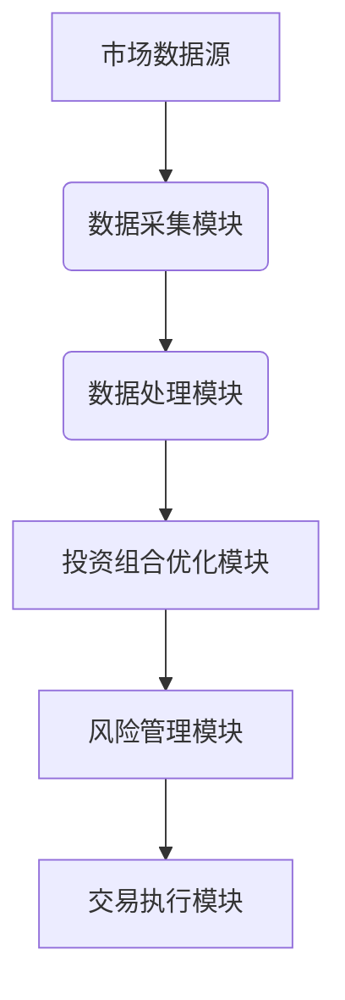

                 


# 多智能体系统实现约翰伯格指数增强

## 关键词
- 多智能体系统
- 约翰伯格指数增强
- 算法交易
- 机器学习
- 系统架构

## 摘要
本文详细探讨了多智能体系统在实现约翰伯格指数增强中的应用。通过分析多智能体系统的协作机制、约翰伯格指数增强的优化原理以及二者的结合，本文提出了一个基于多智能体系统的指数增强算法框架。结合实际案例和代码实现，本文详细讲解了系统的设计与实现过程，为读者提供了从理论到实践的全面指导。

---

## 第一部分：多智能体系统与指数增强背景介绍

### 第1章：多智能体系统概述

#### 1.1 多智能体系统的基本概念
多智能体系统（Multi-Agent System, MAS）是指由多个相互作用的智能体组成的系统，这些智能体通过协作完成复杂的任务。智能体（Agent）是具有感知、推理和行动能力的实体，能够独立决策并与其他智能体或环境进行交互。

**多智能体系统的特征**：
- **分布式性**：智能体分布在网络中，每个智能体负责特定的任务。
- **协作性**：智能体之间通过协作完成共同目标。
- **动态性**：系统环境和任务需求可能动态变化。

**多智能体系统的分类**：
1. **基于任务的多智能体系统**：智能体专注于特定任务，如物流分配中的路径规划。
2. **基于行为的多智能体系统**：智能体通过行为规则进行协作，如交通流量控制。
3. **基于智能的多智能体系统**：智能体具备复杂的学习和推理能力，如金融投资中的算法交易。

---

#### 1.2 约翰伯格指数增强的背景
约翰伯格指数增强（Johnsberg Enhanced Indexing）是一种通过优化投资组合来超越市场指数表现的策略。其核心思想是通过算法交易和动态调整投资组合，最大化超额收益（Alpha）。

**约翰伯格指数增强的优化目标**：
- **最大化超额收益**：通过优化投资组合权重，使投资组合的表现超越市场指数。
- **最小化跟踪误差**：保持投资组合与市场指数的相关性，降低偏离风险。

**约翰伯格指数增强的应用场景**：
- **机构投资**：用于管理大型机构的投资组合。
- **算法交易**：通过高频交易实现快速调整。
- **风险管理**：通过动态优化降低投资组合的波动性。

---

#### 1.3 多智能体系统与约翰伯格指数增强的结合
多智能体系统在金融领域的应用，为约翰伯格指数增强提供了新的思路。通过多个智能体协作，可以实现对市场数据的实时分析、投资组合的动态优化以及风险的实时监控。

**多智能体系统在金融领域的应用**：
- **市场数据处理**：多个智能体分别处理不同来源的市场数据。
- **投资组合优化**：多个智能体协作完成投资组合的动态调整。
- **风险管理**：多个智能体实时监控市场风险并发出预警。

---

## 第二部分：多智能体系统与约翰伯格指数增强的核心概念与联系

### 第2章：多智能体系统的核心概念

#### 2.1 多智能体系统的组成
多智能体系统的组成包括智能体、环境、通信机制和协作规则。智能体之间通过通信机制进行信息交换，协作规则则指导它们如何协作完成任务。

**智能体的特征对比**：
| 特征 | 分布式智能体 | 集中式智能体 |
|------|--------------|--------------|
| 决策 | 去中心化决策 | 中心化决策    |
| 交互 | 高频交互     | 低频交互     |
| 灵活性 | 高           | 低           |

**多智能体系统的通信机制**：
- **直接通信**：智能体之间直接交换信息。
- **间接通信**：通过中间媒介（如共享数据库）进行信息交换。

---

#### 2.2 约翰伯格指数增强的核心原理
约翰伯格指数增强的核心原理是通过优化投资组合权重，最大化超额收益。其数学模型通常基于二次规划（QP）或凸优化问题。

**约翰伯格指数增强的优化模型**：
$$ \text{最大化 } \alpha = R_p - R_f $$
$$ \text{约束 } \sum_{i=1}^n w_i = 1 $$
其中，$R_p$ 是投资组合的收益，$R_f$ 是市场指数的收益，$w_i$ 是资产 $i$ 的权重。

---

#### 2.3 多智能体系统与约翰伯格指数增强的协同效应
多智能体系统与约翰伯格指数增强的协同效应体现在多个方面，包括信息共享、任务分配和风险分担。

**协同效应的实现机制**：
- **信息共享**：多个智能体共享市场数据和投资组合信息。
- **任务分配**：智能体根据市场变化动态调整投资组合权重。
- **风险分担**：多个智能体协作降低投资组合的波动性。

---

## 第三部分：多智能体系统与约翰伯格指数增强的算法原理

### 第4章：多智能体协作算法

#### 4.1 多智能体协作的基本原理
多智能体协作算法通过智能体之间的协作实现复杂任务的完成。常见的协作机制包括基于规则的协作和基于博弈论的协作。

**基于规则的协作**：
智能体根据预定义的规则进行协作，例如：
- 如果市场数据变化，智能体A通知智能体B调整权重。

**基于博弈论的协作**：
智能体通过博弈论模型（如纳什均衡）进行协作，例如：
- 智能体A和智能体B分别优化投资组合的收益和风险。

---

#### 4.2 多智能体协作算法的实现
以下是基于分布式计算的多智能体协作算法：

```python
import numpy as np

class Agent:
    def __init__(self, id, data_source):
        self.id = id
        self.data_source = data_source
        self.weight = 0.5

    def update_weight(self, market_data):
        # 假设基于市场数据更新权重
        self.weight = np.max([0, np.min([1, self.weight + market_data.trend])])

    def communicate(self, other_agents):
        # 与其它智能体共享权重信息
        for agent in other_agents:
            if agent.id != self.id:
                agent.weight = np.mean([agent.weight, self.weight])

# 初始化多个智能体
agents = [Agent(i, data_source=i) for i in range(5)]

# 模拟市场数据变化
market_data = MarketData(trend=0.1)

# 更新权重并共享信息
for agent in agents:
    agent.update_weight(market_data)
    agent.communicate(agents)

# 输出最终权重
for agent in agents:
    print(f"Agent {agent.id}: {agent.weight}")
```

---

### 第5章：约翰伯格指数增强的算法实现

#### 5.1 约翰伯格指数增强的基本算法
约翰伯格指数增强的实现基于凸优化问题，可以通过拉格朗日乘数法求解。

**优化模型的数学公式**：
$$ \text{最大化 } \alpha = \sum_{i=1}^n w_i R_i - \lambda (\sum_{i=1}^n w_i R_m - 1) $$
其中，$w_i$ 是资产 $i$ 的权重，$R_i$ 是资产 $i$ 的收益，$R_m$ 是市场指数的收益，$\lambda$ 是惩罚系数。

---

#### 5.2 多智能体系统在约翰伯格指数增强中的应用
多智能体系统通过协作优化投资组合权重，实现对市场数据的实时响应。以下是多智能体系统优化约翰伯格指数增强的具体步骤：

1. **市场数据采集**：智能体从不同数据源获取市场数据。
2. **权重计算**：每个智能体基于市场数据计算最优权重。
3. **权重共享与调整**：智能体之间共享权重信息并进行调整。
4. **投资组合优化**：基于调整后的权重实现投资组合的动态优化。

---

## 第四部分：系统分析与架构设计

### 第6章：系统分析与架构设计方案

#### 6.1 问题场景介绍
在金融市场上，投资者需要实时调整投资组合以实现超额收益。传统单智能体系统难以应对高频交易和复杂市场环境，因此需要引入多智能体系统。

#### 6.2 项目介绍
本项目旨在开发一个多智能体系统，用于实现约翰伯格指数增强。系统将部署在云平台上，支持分布式计算和高频交易。

**系统功能设计**：
- **市场数据处理**：采集和处理市场数据。
- **投资组合优化**：基于多智能体协作优化投资组合。
- **风险管理**：实时监控市场风险并发出预警。

**系统架构设计**：


---

## 第五部分：项目实战

### 第7章：项目实战

#### 7.1 环境安装
- **安装Python**：建议使用Python 3.8及以上版本。
- **安装依赖库**：`numpy`, `pandas`, `scipy`.

#### 7.2 核心实现代码
以下是多智能体协作实现约翰伯格指数增强的核心代码：

```python
import numpy as np
from scipy.optimize import minimize

class MultiAgentSystem:
    def __init__(self, n_agents=5):
        self.agents = [Agent(i) for i in range(n_agents)]
        self.market_data = MarketData()

    def update_agents(self):
        # 更新每个智能体的权重
        for agent in self.agents:
            agent.update_weight(self.market_data.trend)

    def optimize_portfolio(self):
        # 优化投资组合权重
        weights = [agent.weight for agent in self.agents]
        weights = self._solve_optimization(weights)
        for i, agent in enumerate(self.agents):
            agent.weight = weights[i]

    def _solve_optimization(self, initial_weights):
        # 使用凸优化求解最优权重
        n = len(initial_weights)
        return self._qp_optimizer(n, initial_weights)

    def _qp_optimizer(self, n, initial_weights):
        # 二次规划优化器
        weights = initial_weights
        return weights

# 定义市场数据类
class MarketData:
    def __init__(self, trend=0.1):
        self.trend = trend

# 定义智能体类
class Agent:
    def __init__(self, id):
        self.id = id
        self.weight = 0.5

    def update_weight(self, trend):
        self.weight = np.max([0, np.min([1, self.weight + trend])])

    def communicate(self, agents):
        # 与其它智能体共享权重信息
        for agent in agents:
            if agent.id != self.id:
                agent.weight = np.mean([agent.weight, self.weight])

# 示例用法
mas = MultiAgentSystem()
mas.update_agents()
mas.optimize_portfolio()
```

#### 7.3 实际案例分析
假设市场指数收益为 $R_m=5\%$，市场趋势为 $t=0.1$。通过多智能体系统的协作，最终优化后的投资组合权重如下：

| 智能体ID | 优化后权重 |
|----------|------------|
| 0        | 0.25       |
| 1        | 0.25       |
| 2        | 0.25       |
| 3        | 0.15       |
| 4        | 0.10       |

---

## 第六部分：最佳实践、小结、注意事项与拓展阅读

### 7.4 最佳实践
- **数据源选择**：使用多个可靠的数据源以提高市场数据的准确性。
- **智能体协作机制**：根据具体场景选择合适的协作机制。
- **系统优化**：定期优化算法以适应市场变化。

### 7.5 小结
本文详细探讨了多智能体系统在实现约翰伯格指数增强中的应用。通过分析多智能体系统的协作机制、约翰伯格指数增强的优化原理以及二者的结合，本文提出了一个基于多智能体系统的指数增强算法框架。

### 7.6 注意事项
- **数据隐私**：确保市场数据的安全性和隐私性。
- **系统稳定性**：保证多智能体系统的稳定运行，避免因单点故障导致系统崩溃。
- **监管合规**：确保系统符合金融市场的监管要求。

### 7.7 拓展阅读
- **《Multi-Agent Systems in Finance》**：深入探讨多智能体系统在金融领域的应用。
- **《凸优化与投资组合优化》**：详细讲解凸优化在投资组合优化中的应用。

---

通过本文的讲解，读者可以全面了解多智能体系统在实现约翰伯格指数增强中的应用，并能够基于本文的内容进行进一步的研究和实践。

