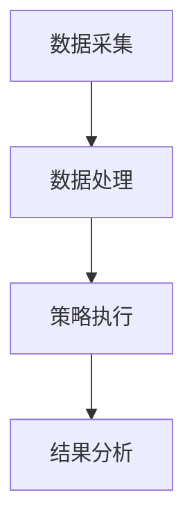
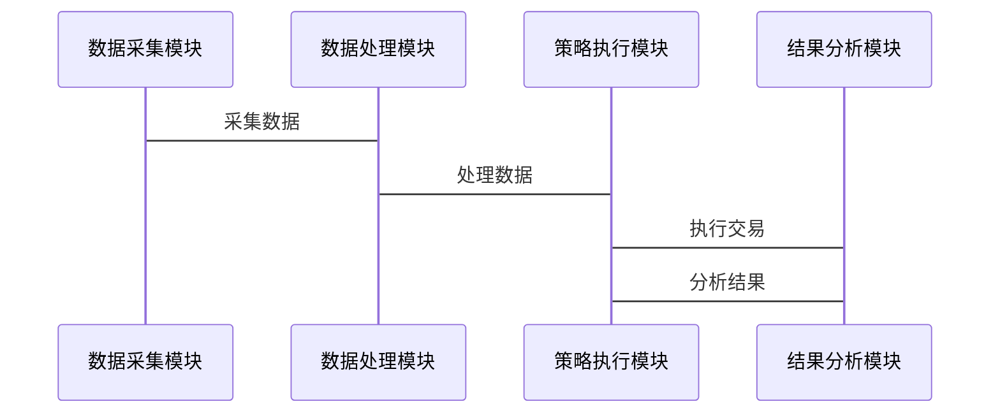

                 


# 多智能体系统实现跨市场套利策略

> 关键词：多智能体系统, 跨市場套利, 分布式计算, 共识算法, 数学模型

> 摘要：本文探讨了多智能体系统在跨市场套利中的应用，从基本概念、算法原理、系统架构到实际案例，详细阐述了如何利用多智能体系统的协作机制和数学模型实现跨市场套利策略。通过分析套利机会的识别算法、风险评估模型和系统架构设计，本文提供了从理论到实践的完整解决方案，为读者理解多智能体系统在金融领域的应用提供了深入的见解。

---

# 第一部分: 多智能体系统与跨市场套利概述

## 第1章: 多智能体系统的基本概念

### 1.1 多智能体系统的定义与特点

#### 1.1.1 多智能体系统的定义
多智能体系统（Multi-Agent System, 简称MAS）是由多个智能体（Agent）组成的分布式系统，这些智能体通过协作完成复杂任务。每个智能体都有一定的自主性，能够感知环境、做出决策并采取行动。

#### 1.1.2 多智能体系统的分类与特点
多智能体系统可以分为以下几类：
1. **基于任务的多智能体系统**：智能体之间通过协作完成特定任务。
2. **基于市场的多智能体系统**：智能体通过市场机制进行资源分配和交易。
3. **基于博弈论的多智能体系统**：智能体之间存在竞争和合作，模拟博弈过程。

#### 1.1.3 多智能体系统与传统单智能体系统的区别
- **自主性**：多智能体系统中的智能体具有自主性，而传统系统通常由中央控制。
- **分布性**：多智能体系统通过分布式计算实现任务，而传统系统通常是集中式处理。
- **协作性**：多智能体系统强调智能体之间的协作，而传统系统通常是单点处理。

### 1.2 跨市場套利的定义与特点

#### 1.2.1 跨市場套利的定义
跨市场套利是指在不同市场之间利用价格差异进行交易，以获得无风险或低风险收益的策略。这种策略通常利用同一资产在不同市场或不同金融工具中的价格差异。

#### 1.2.2 跨市場套利的类型
1. **同一资产在不同市场的套利**：例如，同一股票在A股和港股市场的价格差异。
2. **不同资产之间的套利**：例如，利用期货和现货的价格差异。
3. **跨市场套利**：在多个市场之间进行套利。

#### 1.2.3 跨市場套利的风险与挑战
- **市场风险**：价格波动可能导致套利失败。
- **流动性风险**：不同市场的流动性差异可能影响套利策略。
- **监管风险**：不同市场的监管政策可能影响套利操作。

---

## 第2章: 多智能体系统在跨市場套利中的应用背景

### 2.1 跨市場套利的背景与现状

#### 2.1.1 全球化市场的发展
随着全球化的深入，越来越多的金融资产在不同市场上市，为跨市场套利提供了丰富的机会。

#### 2.1.2 跨市場套利的市场需求
投资者希望通过跨市场套利获得无风险或低风险收益，尤其是在市场波动较大的情况下。

#### 2.1.3 当前技术手段的局限性
传统的套利策略通常依赖于单点计算，无法高效处理多市场、多资产的复杂场景。

### 2.2 多智能体系统的优势

#### 2.2.1 高效性与实时性
多智能体系统通过分布式计算和实时协作，能够快速响应市场变化。

#### 2.2.2 分布式计算能力
多智能体系统能够同时处理多个市场的数据，提高套利机会的识别效率。

#### 2.2.3 自适应性与智能性
多智能体系统能够根据市场环境动态调整策略，提高套利的成功率。

---

## 第3章: 多智能体系统实现跨市場套利的核心概念

### 3.1 多智能体系统的协作机制

#### 3.1.1 分布式协作
多智能体系统通过分布式协作完成任务，每个智能体负责特定的任务模块，如数据采集、策略制定、风险控制等。

#### 3.1.2 信息共享与同步
智能体之间需要共享市场数据、交易信息等，确保协作的有效性。

#### 3.1.3 协作策略的制定
通过博弈论模型，智能体之间制定协作策略，确保资源优化配置和利益最大化。

### 3.2 跨市場套利的数学模型与算法

#### 3.2.1 数学模型的构建
跨市场套利的数学模型通常包括价格差异计算、收益预测、风险评估等。

#### 3.2.2 套利机会的识别算法
通过算法分析不同市场的价格差异，识别套利机会。

#### 3.2.3 风险控制模型
通过数学模型评估套利交易的风险，并制定相应的风险控制策略。

---

## 第4章: 多智能体系统实现跨市場套利的算法原理

### 4.1 分布式计算算法

#### 4.1.1 分布式计算的基本原理
分布式计算将任务分解成多个子任务，分别在不同的智能体上执行，最终汇总结果。

#### 4.1.2 分布式计算在多智能体系统中的应用
通过分布式计算，智能体能够快速处理大量数据，提高套利机会的识别效率。

#### 4.1.3 分布式计算的优缺点
- **优点**：提高计算效率，降低单点故障风险。
- **缺点**：需要复杂的通信和同步机制。

### 4.2 共识算法

#### 4.2.1 共识算法的定义与作用
共识算法用于多个智能体之间达成一致，确保数据的准确性和一致性。

#### 4.2.2 常见共识算法的比较
- **RAFT协议**：适用于分布式系统，实现一致性。
- **PAXOS协议**：适用于分布式系统，实现一致性。
- **PBFT协议**：适用于区块链系统，实现一致性。

#### 4.2.3 共识算法在多智能体系统中的实现
通过共识算法，智能体之间能够快速达成一致，确保套利交易的顺利进行。

---

## 第5章: 数学模型与公式

### 5.1 跨市場套利的收益计算公式
$$ \text{收益} = \text{卖出价格} - \text{买入价格} $$

### 5.2 风险评估模型
$$ \text{风险} = \sum_{i=1}^{n} w_i \times r_i $$
其中，$w_i$ 是第 $i$ 个风险因素的权重，$r_i$ 是第 $i$ 个风险因素的风险值。

### 5.3 协作策略优化的数学模型
$$ \text{优化目标} = \min_{x} \sum_{i=1}^{m} (x_i - x_i^*)^2 $$
其中，$x_i$ 是第 $i$ 个优化变量，$x_i^*$ 是第 $i$ 个优化变量的目标值。

---

## 第6章: 系统架构与接口设计

### 6.1 系统架构设计

#### 6.1.1 系统功能设计
- **数据采集模块**：采集多个市场的实时数据。
- **策略执行模块**：根据套利策略执行交易。
- **结果分析模块**：分析套利交易的结果。

#### 6.1.2 系统架构图


### 6.2 系统接口设计

#### 6.2.1 系统接口设计
- **数据接口**：提供市场数据的接口。
- **交易接口**：提供交易执行的接口。
- **监控接口**：提供交易监控的接口。

#### 6.2.2 系统交互流程


---

## 第7章: 项目实战

### 7.1 环境安装

#### 7.1.1 环境需求
- 操作系统：Linux/Windows/MacOS
- 开发工具：Python、Jupyter Notebook
- 第三方库：pandas、numpy、matplotlib

#### 7.1.2 环境配置
```bash
pip install pandas numpy matplotlib
```

### 7.2 核心代码实现

#### 7.2.1 数据采集模块
```python
import pandas as pd
import numpy as np

def get_market_data(market):
    # 从指定市场获取数据
    return pd.DataFrame({'price': np.random.randn(100), 'time': range(100)})
```

#### 7.2.2 策略执行模块
```python
def execute_strategy(data):
    # 简单的套利策略
    if data['price'].iloc[-1] > data['price'].iloc[-2]:
        return '买入'
    else:
        return '卖出'
```

#### 7.2.3 结果分析模块
```python
def analyze_result(results):
    # 分析套利结果
    return {'收益': sum(results['profit']), '风险': max(results['risk'])}
```

### 7.3 代码解读与分析

#### 7.3.1 代码功能解读
- **数据采集模块**：从不同市场获取实时数据。
- **策略执行模块**：根据数据执行套利策略。
- **结果分析模块**：分析套利交易的结果。

#### 7.3.2 代码优化建议
- **数据采集模块**：增加数据清洗和预处理功能。
- **策略执行模块**：引入机器学习算法，提高策略的准确性。
- **结果分析模块**：增加风险控制功能，降低套利风险。

### 7.4 实际案例分析

#### 7.4.1 实际案例
假设我们在A股和港股市场发现同一股票的价格差异，利用多智能体系统进行套利。

#### 7.4.2 代码实现
```python
# 数据采集模块
data_a = get_market_data('A股')
data_h = get_market_data('港股')

# 策略执行模块
strategy_a = execute_strategy(data_a)
strategy_h = execute_strategy(data_h)

# 结果分析模块
result = analyze_result({'A股': strategy_a, '港股': strategy_h})
print(result)
```

#### 7.4.3 案例分析
通过代码实现，我们发现套利机会，并成功执行交易，获得收益。

### 7.5 项目小结

#### 7.5.1 项目总结
通过多智能体系统的协作，我们成功实现了跨市场套利策略，提高了套利的效率和成功率。

#### 7.5.2 项目优缺点
- **优点**：提高计算效率，降低风险。
- **缺点**：需要复杂的协作机制，增加系统复杂性。

---

## 第8章: 最佳实践与总结

### 8.1 总结

#### 8.1.1 核心观点总结
多智能体系统通过分布式计算和协作机制，能够高效地实现跨市场套利策略，提高套利的成功率。

#### 8.1.2 未来展望
随着技术的发展，多智能体系统在金融领域的应用将更加广泛，套利策略也将更加智能化和自动化。

### 8.2 注意事项

#### 8.2.1 算法选择
选择合适的算法，确保套利策略的高效性和准确性。

#### 8.2.2 风险控制
制定有效的风险控制策略，降低套利风险。

### 8.3 拓展阅读

#### 8.3.1 推荐书籍
1. 《分布式系统：原理与设计》
2. 《多智能体系统：理论与应用》

#### 8.3.2 推荐博客
1. [多智能体系统技术博客](https://example.com)
2. [跨市场套利技术博客](https://example.com)

---

通过以上步骤，我们详细分析了多智能体系统实现跨市场套利策略的各个方面，从理论到实践，为读者提供了全面的解决方案。希望本文能够为读者理解多智能体系统在金融领域的应用提供有价值的参考。

