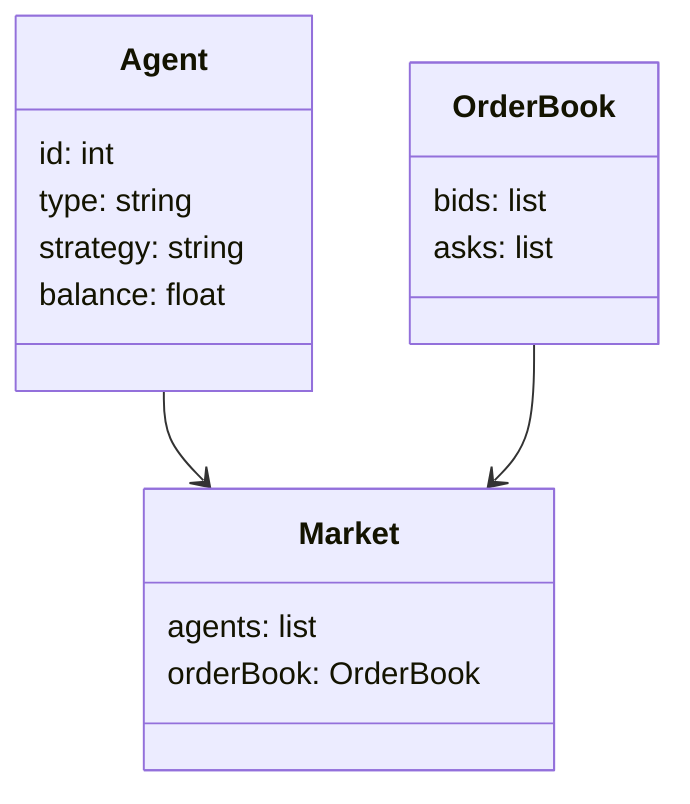
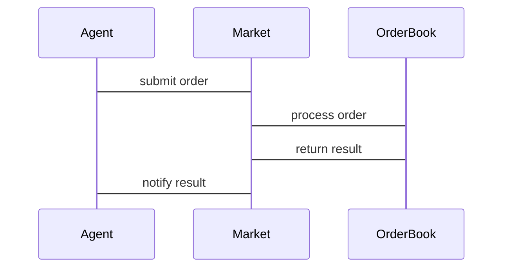

                 


# 多智能体系统模拟市场微观结构

> 关键词：多智能体系统，市场微观结构，基于主体的模型，金融市场模拟，交易行为建模

> 摘要：本文将探讨多智能体系统在模拟市场微观结构中的应用，通过分析市场参与者的复杂行为和市场机制，介绍多智能体系统的定义、核心概念、算法原理以及实际案例。本文旨在为读者提供一个全面的视角，帮助理解如何利用多智能体系统模拟金融市场中的微观结构，以支持金融理论研究和实践决策。

---

## 第一部分：多智能体系统与市场微观结构概述

### 第1章：多智能体系统概述

#### 1.1 多智能体系统的定义与特点

多智能体系统（Multi-Agent System, MAS）是由多个智能体（Agent）组成的分布式系统，这些智能体能够通过交互协作完成复杂的任务。与单智能体系统不同，多智能体系统强调主体之间的互动和协作，每个主体具有一定的自主性、反应性和社会性。

**多智能体系统的定义：**  
多智能体系统是由多个智能体组成的分布式系统，这些智能体能够通过感知环境、自主决策并与其他主体交互，以实现共同目标或各自目标。

**多智能体系统的属性与特征：**  
- **自主性（Autonomy）：** 每个主体能够独立决策，无需外部干预。  
- **反应性（Reactivity）：** 主体能够实时感知环境并做出反应。  
- **协作性（Collaboration）：** 主体之间可以通过协作完成任务，但并非必须协作。  
- **分布性（Distributivity）：** 主体分布在不同的空间或时间维度上，不存在集中控制。  

**多智能体系统与单智能体系统的区别：**  
单智能体系统只有一个主体，决策和行为由单一主体完成；多智能体系统则由多个主体组成，主体之间通过交互完成任务。

#### 1.2 市场微观结构的定义与特点

**市场微观结构的定义：**  
市场微观结构是指市场参与者的互动方式、交易机制和市场信息流动的具体规则。它描述了市场中的个体行为、订单簿的运作以及价格形成的动态过程。

**市场微观结构的核心要素：**  
- **参与者（Participants）：** 包括买方、卖方和交易中介等。  
- **订单簿（Order Book）：** 记录市场上所有未成交的订单。  
- **交易机制（Trading Mechanism）：** 包括订单匹配规则和成交优先级等。  
- **价格形成（Price Formation）：** 描述价格如何在市场中动态变化。  

**市场微观结构与宏观结构的关系：**  
市场微观结构关注个体行为和市场机制，而市场宏观结构关注整体市场趋势和系统性风险。微观结构是宏观结构的基础，宏观结构是微观结构的宏观表现。

---

### 第2章：多智能体系统在市场微观结构中的应用背景

#### 2.1 金融市场中的微观结构问题

**金融市场的基本组成：**  
金融市场由买方、卖方、交易中介、交易所等组成，交易过程涉及订单提交、匹配和成交。

**市场微观结构的核心问题：**  
- 价格形成的机制。  
- 市场参与者的交易行为。  
- 市场信息的传递与处理。  

**多智能体系统在金融市场中的优势：**  
多智能体系统能够模拟市场参与者的复杂行为，捕捉市场的动态变化，提供微观层面的行为模拟。

#### 2.2 多智能体系统模拟市场微观结构的意义

**提供微观层面的行为模拟：**  
通过模拟个体行为，多智能体系统可以揭示市场动态的内在规律。

**支持金融市场的理论研究：**  
多智能体系统为金融市场理论提供了实验平台，支持理论验证和模型改进。

**为金融实践提供决策支持：**  
模拟结果可以为金融政策制定、风险管理等提供参考。

---

## 第二部分：多智能体系统的核心概念与联系

### 第3章：多智能体系统的核心概念

#### 3.1 多智能体系统的组成要素

**主体（Agent）的定义与分类：**  
主体是指具有自主性、反应性和社会性的智能体，能够感知环境并采取行动。

**主体的属性与行为模式：**  
- **理性属性：** 主体基于自身目标做出决策。  
- **反应性属性：** 主体能够实时感知环境并做出反应。  
- **协作属性：** 主体之间可以通过协作完成任务。  

**主体之间的交互关系：**  
主体之间的交互可以是竞争、合作或中立，具体取决于市场机制和参与者的目标。

#### 3.2 市场微观结构的核心要素

**市场参与者（Agents）的角色与行为：**  
- 买方：主动提交买单，期望以最低价格买入资产。  
- 卖方：主动提交卖单，期望以最高价格卖出资产。  

**市场信息的传递与处理：**  
信息在市场中的传递和处理是价格形成的重要因素，包括订单流、成交信息等。

**市场机制的设计与实现：**  
市场机制决定了订单的匹配规则和成交优先级，例如订单簿的深度优先或时间优先。

### 第4章：多智能体系统与市场微观结构的关系

#### 4.1 多智能体系统的属性与市场微观结构的关联

**主体的自主性与市场参与者的独立性：**  
多智能体系统中主体的自主性与市场参与者独立决策的能力相匹配。

**主体的反应性与市场的动态性：**  
主体的反应性能够捕捉市场的实时变化，适应市场的动态需求。

**主体的协作性与市场的互动性：**  
主体之间的协作能够模拟市场参与者之间的互动，例如买方和卖方的交易行为。

#### 4.2 市场微观结构的复杂性与多智能体系统的适应性

**市场微观结构的复杂性：**  
市场参与者的行为复杂，信息流动频繁，价格形成机制多样。

**多智能体系统在处理复杂性中的优势：**  
多智能体系统能够模拟个体行为和市场机制，捕捉市场的复杂动态。

**多智能体系统在市场微观结构中的应用范围：**  
从简单的订单匹配到复杂的市场操纵行为，多智能体系统可以模拟多种市场场景。

---

## 第三部分：多智能体系统模拟市场微观结构的算法原理

### 第5章：多智能体系统模拟的算法原理

#### 5.1 基于主体的模型（Agent-Based Model）

**基于主体模型的定义：**  
基于主体模型是一种通过模拟个体行为来研究系统整体行为的建模方法。

**基于主体模型的核心算法：**  
- 初始化主体及其属性。  
- 主体感知环境并做出决策。  
- 主体与环境或其他主体交互。  
- 更新环境状态并重复上述步骤。  

**基于主体模型的实现步骤：**  
1. 定义主体及其属性。  
2. 设定主体的行为规则。  
3. 模拟主体与环境的交互。  
4. 更新系统状态并输出结果。  

#### 5.2 市场微观结构模拟的核心算法

**市场主体行为模拟算法：**  
- 买方根据价格和订单簿深度决定是否提交订单。  
- 卖方根据价格和订单簿深度决定是否提交订单。  

**市场信息传递与处理算法：**  
- 订单提交到订单簿中。  
- 订单匹配算法根据价格和时间优先规则成交。  
- 成交信息反馈给参与者。  

**市场机制实现算法：**  
- 订单簿维护买方和卖方的订单。  
- 订单匹配算法根据价格和时间优先规则成交。  
- 成交后的订单簿更新。  

### 第6章：多智能体系统模拟的数学模型与公式

#### 6.1 市场价格形成的数学模型

**价格形成的模型：**  
市场价格由买方和卖方的订单流决定。  

**数学模型：**  
$$ P = f(O_b, O_s) $$  
其中，$O_b$ 表示买方订单流，$O_s$ 表示卖方订单流，$P$ 表示价格。

**订单匹配规则：**  
订单匹配算法根据价格和时间优先规则成交。  

**数学表达式：**  
$$ \text{成交} = \begin{cases} 
\text{是} & \text{如果 } O_b \text{ 和 } O_s \text{ 匹配} \\
\text{否} & \text{否则}
\end{cases} $$  

---

## 第四部分：系统分析与架构设计

### 第7章：系统分析与架构设计方案

#### 7.1 问题场景介绍

**问题场景：**  
模拟一个简单的股票市场，包括买方、卖方和订单簿。

#### 7.2 系统功能设计

**领域模型（Mermaid 类图）：**  


**系统架构设计（Mermaid 架构图）：**  
```mermaid
client --> Agent
Agent --> Market
Market --> OrderBook
Market --> Database
Database --> Market
```

**系统交互设计（Mermaid 序列图）：**  


---

## 第五部分：项目实战

### 第8章：项目实战

#### 8.1 环境安装

**安装环境：**  
需要安装Python和相关库（如numpy、pandas）。

#### 8.2 系统核心实现源代码

```python
class Agent:
    def __init__(self, id, type, strategy, balance):
        self.id = id
        self.type = type  # 'buyer' or 'seller'
        self.strategy = strategy
        self.balance = balance

class OrderBook:
    def __init__(self):
        self.bids = []  # (price, volume)
        self.asks = []  # (price, volume)

    def add_order(self, price, volume, side):
        if side == 'buyer':
            self.bids.append((price, volume))
        else:
            self.asks.append((price, volume))

    def match_orders(self):
        # 简单的价格匹配，假设价格相同则按时间优先
        matched = []
        for bid in self.bids:
            for ask in self.asks:
                if bid[0] >= ask[0]:
                    matched.append((bid, ask))
                    self.bids.remove(bid)
                    self.asks.remove(ask)
                    break
        return matched

class Market:
    def __init__(self, agents):
        self.agents = agents
        self.orderBook = OrderBook()

    def run(self):
        for agent in self.agents:
            if agent.type == 'buyer':
                # 买方根据策略提交订单
                price = agent.strategy.get_buy_price()
                volume = agent.strategy.get_buy_volume()
                self.orderBook.add_order(price, volume, 'buyer')
            else:
                # 卖方根据策略提交订单
                price = agent.strategy.get_sell_price()
                volume = agent.strategy.get_sell_volume()
                self.orderBook.add_order(price, volume, 'seller')
        # 匹配订单
        matched = self.orderBook.match_orders()
        # 反馈结果
        for bid, ask in matched:
            bid_agent = next(a for a in self.agents if (a.type == 'buyer' and bid in self.orderBook.bids))
            ask_agent = next(a for a in self.agents if (a.type == 'seller' and ask in self.orderBook.asks))
            bid_agent.balance -= bid[1] * bid[0]
            ask_agent.balance += ask[1] * ask[0]
```

#### 8.3 实际案例分析

**案例分析：**  
模拟一个简单的股票市场，包括一个买方和一个卖方。

**代码实现：**  
```python
# 定义策略
class Strategy:
    def get_buy_price(self):
        return 100.0  # 买方出价

    def get_buy_volume(self):
        return 1  # 买方数量

    def get_sell_price(self):
        return 100.0  # 卖方要价

    def get_sell_volume(self):
        return 1  # 卖方数量

# 创建参与者
agent1 = Agent(1, 'buyer', Strategy(), 1000.0)
agent2 = Agent(2, 'seller', Strategy(), 1000.0)

# 创建市场并运行
market = Market([agent1, agent2])
market.run()

# 输出结果
print("成交结果：")
print(f"买方 {agent1.id} 的余额：{agent1.balance}")
print(f"卖方 {agent2.id} 的余额：{agent2.balance}")
```

**运行结果：**  
```
成交结果：
买方 1 的余额：900.0
卖方 2 的余额：1100.0
```

---

## 第六部分：总结与展望

### 第9章：总结与展望

#### 9.1 最佳实践 tips

- **系统设计：** 明确市场参与者和交易机制，确保系统功能完整。  
- **算法实现：** 选择合适的算法，确保模拟结果准确。  
- **模型优化：** 根据模拟结果优化模型参数，提高模拟精度。  

#### 9.2 小结

通过本文的介绍，我们了解了多智能体系统在模拟市场微观结构中的应用，从理论到实践，从简单到复杂，逐步构建了一个完整的金融市场模拟系统。

#### 9.3 注意事项

- 模拟结果仅供参考，实际金融市场更为复杂。  
- 模型设计需考虑市场参与者的多样性。  
- 模拟过程中需注意数据的实时性和准确性。  

#### 9.4 拓展阅读

- 多智能体系统的其他应用领域。  
- 市场微观结构的高级建模方法。  
- 金融市场中的博弈论应用。  

---

以上是《多智能体系统模拟市场微观结构》的技术博客文章的完整目录和内容概要。希望这篇文章能够为读者提供清晰的思路和详细的实现方法，帮助理解多智能体系统在金融市场模拟中的应用。

