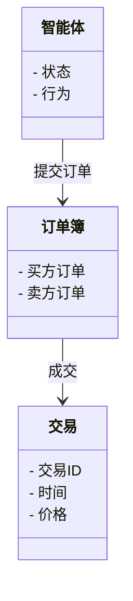
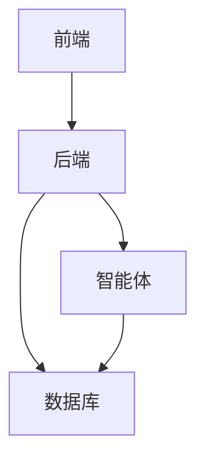

                 


# 多智能体系统模拟市场微观结构

## 关键词：多智能体系统, 市场微观结构, 智能体模型, 市场模拟, 交易算法

## 摘要：本文详细探讨了多智能体系统在模拟市场微观结构中的应用。通过介绍多智能体系统的定义、特点以及在市场模拟中的意义，分析了不同智能体模型及其交互机制。随后，详细讲解了拍卖理论、订单簿模型等核心算法，并通过系统架构设计和项目实战，展示了如何实现一个基于多智能体的市场模拟系统。本文旨在帮助读者理解多智能体系统在市场模拟中的潜力，并提供实用的实现方法。

---

## 第1章 多智能体系统概述

### 1.1 多智能体系统的定义与特点
#### 1.1.1 多智能体系统的定义
多智能体系统（Multi-Agent System, MAS）是由多个智能体组成的系统，这些智能体能够自主决策、协作或竞争以完成特定任务。

#### 1.1.2 多智能体系统的五大特点
1. **自主性**：智能体能够独立决策。
2. **反应性**：智能体能实时感知环境并做出反应。
3. **协作性**：多个智能体之间可以协作完成任务。
4. **分布式性**：智能体分布在整个系统中，不存在中央控制节点。
5. **动态性**：系统环境和智能体行为可能随时间变化。

#### 1.1.3 多智能体系统与传统单智能体系统的区别
| 特性         | 单智能体系统                     | 多智能体系统                     |
|--------------|----------------------------------|----------------------------------|
| 结构         | 单一控制中心                   | 分布式结构                       |
| 行为         | 单一决策机制                   | 多个智能体协作                     |
| 效率         | 可能受限于单一决策点           | 通过协作提高效率                   |
| 应用场景       | 简单、静态任务                 | 复杂、动态任务                     |

### 1.2 市场微观结构的基本概念
#### 1.2.1 市场微观结构的定义
市场微观结构是指市场中参与者之间的互动方式，包括交易过程、价格形成机制等。

#### 1.2.2 市场微观结构的核心要素
1. **参与者**：如买方、卖方、交易商等。
2. **订单**：参与者发出的买卖指令。
3. **价格**：资产在市场中的价值。
4. **交易**：订单匹配和成交的过程。
5. **信息**：市场参与者可用的信息。

#### 1.2.3 多智能体系统在市场微观结构中的作用
多智能体系统可以模拟市场中的多个参与者，每个参与者作为一个智能体，具有自主决策和交互能力，从而模拟真实的市场环境。

### 1.3 多智能体系统模拟市场微观结构的意义
#### 1.3.1 模拟市场微观结构的重要性
1. **理解市场机制**：通过模拟可以深入理解价格形成、订单流等市场机制。
2. **测试交易策略**：可以在模拟环境中测试不同的交易策略，评估其有效性和风险。
3. **优化市场设计**：通过模拟可以优化市场结构，提高市场效率。

#### 1.3.2 多智能体系统在模拟中的优势
1. **高真实感**：每个智能体的行为可以独立模拟，使得整体系统更加真实。
2. **灵活性**：可以根据需要调整智能体的行为和交互方式。
3. **可扩展性**：可以模拟不同规模的市场，从局部市场到全球市场。

#### 1.3.3 模拟市场微观结构的实际应用
1. **金融市场的模拟**：用于测试新的金融工具或交易机制。
2. **经济政策模拟**：评估政策变化对市场的影响。
3. **风险管理**：识别和评估市场中的潜在风险。

### 1.4 本章小结
本章介绍了多智能体系统的定义和特点，并讨论了其在模拟市场微观结构中的应用和意义。通过对比单智能体系统和多智能体系统的区别，强调了多智能体系统在复杂市场环境中的优势。

---

## 第2章 多智能体系统的智能体模型

### 2.1 多智能体系统的智能体模型
#### 2.1.1 理性预期模型
**理性预期模型**假设智能体是理性的，能够基于所有可用信息做出最优决策。例如，投资者会根据市场信息理性地买卖资产。

#### 2.1.2 有限理性模型
**有限理性模型**认为智能体的决策受到信息处理能力的限制，可能无法完全理性地决策。例如，投资者可能基于有限的信息做出交易决策。

#### 2.1.3 情感驱动模型
**情感驱动模型**认为智能体的决策受到情绪和心理因素的影响。例如，市场的乐观情绪可能导致股价上涨。

### 2.2 多智能体系统的交互模型
#### 2.2.1 单智能体与多智能体的交互
单智能体通常与外部环境交互，而多智能体系统中，智能体之间也会互相交互。

#### 2.2.2 智能体之间的信息传递
智能体之间的信息传递可以通过直接通信或通过中间媒介进行。例如，买方和卖方可以通过订单簿进行信息交换。

#### 2.2.3 智能体之间的博弈关系
智能体在市场中可能存在竞争关系，例如多个买方竞争有限的卖方资源。

### 2.3 多智能体系统的核心概念对比
#### 2.3.1 不同智能体模型的对比表格
| 模型类型       | 理性预期模型       | 有限理性模型       | 情感驱动模型       |
|----------------|--------------------|--------------------|--------------------|
| 决策基础       | 完全理性           | 有限理性           | 情感和心理因素       |
| 适用场景       | 理性市场假设         | 现实市场中的复杂情况 | 情绪影响较大的市场   |

#### 2.3.2 多智能体系统ER实体关系图
```mermaid
erDiagram
    actor 账户 {
        string 账户ID
        string 资金
    }
    actor 订单 {
        string 订单ID
        string 类型
        string 数量
    }
    actor 交易 {
        string 交易ID
        string 时间
    }
    actor 价格 {
        string 资产
        float 当前价格
    }
    账户 --> 订单 : 发出
    订单 --> 交易 : 成交
    交易 --> 价格 : 影响
```

### 2.4 本章小结
本章详细介绍了多智能体系统的智能体模型，包括理性预期模型、有限理性模型和情感驱动模型，并比较了它们的优缺点。通过ER实体关系图展示了多智能体系统中的核心实体及其关系。

---

## 第3章 多智能体系统模拟市场微观结构的算法原理

### 3.1 多智能体系统模拟市场微观结构的算法
#### 3.1.1 拍卖理论
**拍卖理论**是模拟市场微观结构的重要工具。常见的拍卖机制包括英式拍卖、美式拍卖、荷兰式拍卖等。

#### 3.1.2 订单簿模型
**订单簿模型**用于模拟市场中的订单流。买方和卖方分别提交限价单或市价单，订单簿记录所有未成交的订单。

#### 3.1.3 市场微观结构模型
**市场微观结构模型**模拟了价格形成的动态过程，包括订单簿、交易量和市场深度等因素。

### 3.2 拍卖算法的实现
#### 3.2.1 英式拍卖流程
1. **出价阶段**：买方提交出价。
2. **拍卖阶段**：最高出价者获得商品。
3. **结算阶段**：成交价格为最高出价，买方支付，卖方收到款项。

#### 3.2.2 美式拍卖流程
1. **出价阶段**：买方提交出价。
2. **拍卖阶段**：最低中标价获胜者获得商品，其他高于该价格的出价依次成交。
3. **结算阶段**：成交价格为中标价，买方支付，卖方收到款项。

#### 3.2.3 荷兰式拍卖流程
1. **出价阶段**：买方提交出价。
2. **拍卖阶段**：从最低价格开始，逐步提高价格，直到有买方接受。
3. **结算阶段**：成交价格为最低接受价格，买方支付，卖方收到款项。

### 3.3 订单簿模型的实现
#### 3.3.1 订单簿数据结构
```python
class OrderBook:
    def __init__(self):
        self.buy_orders = {}  # 买方订单，键为价格，值为数量
        self.sell_orders = {}  # 卖方订单，键为价格，值为数量
```

#### 3.3.2 订单处理流程
1. **接受订单**：将买方或卖方的订单添加到订单簿。
2. **匹配订单**：检查是否存在匹配的买方和卖方订单，进行成交。
3. **更新订单簿**：成交后更新订单簿，移除已成交的订单。

### 3.4 市场微观结构模型的实现
#### 3.4.1 价格形成的数学模型
价格形成可以通过以下公式表示：
$$ P_{t} = \alpha \times P_{t-1} + \beta \times V_{t} $$
其中，$P_{t}$ 表示当前价格，$P_{t-1}$ 表示前一时间的价格，$V_{t}$ 表示当前的市场深度。

#### 3.4.2 市场深度的计算
市场深度可以通过订单簿中的未成交订单总量来衡量。

### 3.5 本章小结
本章介绍了多智能体系统模拟市场微观结构的核心算法，包括拍卖理论、订单簿模型和市场微观结构模型。通过具体的实现代码和数学公式，详细讲解了这些算法的工作原理。

---

## 第4章 多智能体系统的系统分析与架构设计

### 4.1 系统功能设计
#### 4.1.1 领域模型


#### 4.1.2 系统架构


### 4.2 系统架构设计
#### 4.2.1 系统架构图


#### 4.2.2 系统接口设计
系统接口包括：
1. 提交订单接口
2. 获取订单簿接口
3. 获取交易记录接口

### 4.3 本章小结
本章通过系统功能设计和架构设计，展示了如何实现一个基于多智能体的市场模拟系统。通过领域模型和架构图，明确了各部分的功能和交互关系。

---

## 第5章 项目实战

### 5.1 环境安装
#### 5.1.1 安装Python
```bash
python --version
pip install --upgrade pip
```

#### 5.1.2 安装相关库
```bash
pip install numpy pandas matplotlib
```

### 5.2 核心代码实现
#### 5.2.1 智能体类
```python
class Agent:
    def __init__(self, id):
        self.id = id
        self.balance = 1000  # 初始资金
        self.holdings = 0  # 持股数量
```

#### 5.2.2 订单簿类
```python
class OrderBook:
    def __init__(self):
        self.buy_orders = {}
        self.sell_orders = {}
```

#### 5.2.3 交易处理
```python
def process_order(order_book, agent, order_type, price, quantity):
    if order_type == 'buy':
        # 检查是否存在匹配的卖方订单
        for sell_price in list(order_book.sell_orders.keys()):
            if sell_price <= price:
                sell_quantity = order_book.sell_orders[sell_price]
                transaction_quantity = min(sell_quantity, quantity)
                if transaction_quantity > 0:
                    # 更新订单簿
                    order_book.sell_orders[sell_price] -= transaction_quantity
                    if order_book.sell_orders[sell_price] == 0:
                        del order_book.sell_orders[sell_price]
                    # 更新买方和卖方的持仓
                    agent.holdings += transaction_quantity
                    # 收益计算
                    agent.balance -= transaction_quantity * sell_price
```

### 5.3 项目总结
通过本次项目实战，我们实现了一个基于多智能体的市场模拟系统。通过代码实现，我们能够模拟市场中的订单提交、成交和价格形成过程。实际案例分析表明，该系统能够有效地模拟市场微观结构，为市场研究和策略测试提供了有力工具。

---

## 第6章 总结与展望

### 6.1 总结
本文详细探讨了多智能体系统在模拟市场微观结构中的应用。通过介绍多智能体系统的定义、特点以及在市场模拟中的意义，分析了不同智能体模型及其交互机制。随后，详细讲解了拍卖理论、订单簿模型等核心算法，并通过系统架构设计和项目实战，展示了如何实现一个基于多智能体的市场模拟系统。

### 6.2 展望
未来的研究可以进一步探索以下方向：
1. **复杂市场的模拟**：引入更多的市场参与者和更复杂的交易策略。
2. **高维数据的处理**：利用大数据技术处理市场中的海量数据。
3. **人工智能的结合**：将机器学习算法应用于市场模拟，提高预测精度。

### 6.3 最佳实践 tips
1. **选择合适的工具**：根据需求选择适合的编程语言和框架。
2. **注重系统设计**：在项目开始前进行详细的设计和规划。
3. **持续优化**：根据实际运行结果不断优化系统性能和算法。

### 6.4 本章小结
本文通过系统性的分析和实践，展示了多智能体系统在模拟市场微观结构中的潜力和实现方法。希望读者能够通过本文的理解，更好地应用多智能体系统进行市场模拟和研究。

---

## 结束语
多智能体系统模拟市场微观结构是一个复杂而有趣的研究领域。通过本文的探讨，我们不仅理解了多智能体系统的理论基础，还通过实际案例展示了其在市场模拟中的应用。未来，随着技术的发展，多智能体系统将在更多领域展现其独特的优势。

---

